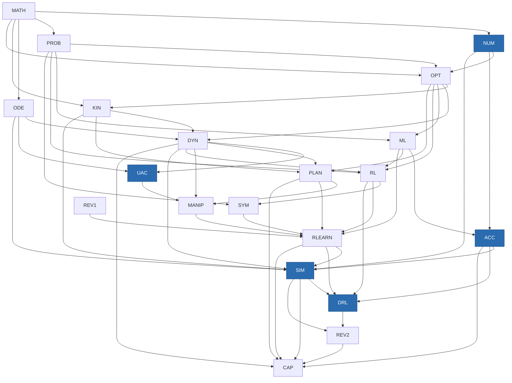

# Robotics & ML Workbook — Phase 5 Augmentation Plan

**Revision 3.7 — 2026-08-16**
**Stable path:** `docs/plans/PHASE5_AUGMENTATION_PLAN.md`
**Baseline commit:** `dd2e8717f82dfcb77aff4b8c89aba258997f87fe` (Phase 4)
**Status:** **Gate A APPROVED by the owner on 2026-08-14 at revision 2.1** (independent review validated the isolated committed baseline, the labelled worktree comparison, the 69-module/308-concept inventory, the reporter's status semantics and non-zero failure exit, and the semantic-queue treatment of readiness/Anki counts). **Gate A is closed — do not reopen or repeat it.** **Gate B: NOT STARTED and NOT APPROVED. Group A: NOT APPROVED and NOT STARTED.** A source-selection *proposal* exists at `docs/plans/GATE_B_SOURCE_SELECTION.md`. **Proposal revisions 1–4 were each independently reviewed and each FAILED.** **Proposal revision 5 was superseded before review.** **Proposal revision 6 FAILED the independent structural audit of plan revision 3.5**, recorded at `docs/review/planning/PLAN_3_5_STRUCTURAL_AUDIT.md` (SHA-256 `3f3cd468e56ddedb69a29cd0e6d92ab81b7364a8ca63f686a400cc76f1d31a4e`, verdict **STRUCTURAL FAIL**). **Proposal revision 7 FAILED the independent structural audit of plan revision 3.6**, recorded at `docs/review/planning/PLAN_3_6_STRUCTURAL_AUDIT.md` (SHA-256 `a42cb26edc93219a0c82c8e5abc84878cb7ded0530528a2d7c518bd84d694b89`, verdict **STRUCTURAL FAIL**), on findings C1-02, C2-03 and C4-03. **Proposal revision 8 accompanies this plan revision: it is current, corrected, NOT reviewed and NOT approved.** The earlier audit of plan revision 3.3 stands as historical evidence at `docs/review/planning/PLAN_3_3_STRUCTURAL_AUDIT.md` (SHA-256 `6c6d0164ec296740db2c377259f08afcf1d41d3ffb2d816a229b3ef051b64b7c`). **Revision 3.7 is NOT reviewed, NOT approved, and NOT ready for approval.** **Correction C2-01 is RESOLVED** — `docs/review/modules/KIN-02.md`'s Phase-5 reconciliation was re-pinned under the owner's narrow authorization, so **no review-lane blocker remains**; that record now pins the superseded revision 3.6 and is the review lane's to re-pin, which is a pin-staleness item and not a reopening of C2-01. **A fresh independent structural review of plan revision 3.7 / proposal revision 8 is now the required next action and may be requested. No approval may be requested until that review passes**, and none has been requested. **No revision of this plan or proposal has ever passed an independent review.** Proposal complete is not corpus approved. Gates C–G not started. **`docs/plans/GATE_A_BASELINE.md` is approved Gate A evidence at SHA-256 `470046a5fa4036794c37434295cea67385e985ca9871c06413b964dddc1a45a4` and is not edited by this or any later plan revision; current Gate B status lives here, in §9.6, §13, §16 and in the handoff only.**
**Benchmark corpus:** approved 2026-08-14. **Gate-B production corpus: NOT approved** (§9.0-pre, §9.7).
**Machine-readable count inputs:** `docs/plans/phase5-planning-ledger.json`, checked by `scripts/validate/phase5_plan_consistency.py`. Every total in this document is recomputed from that ledger; none is hand-edited.
**Review artifacts referenced (read-only, review-owned):** `docs/review/REVIEW_PROTOCOL.md`, `EXTERNAL_BENCHMARK_PROPOSAL.md`, `CURRICULUM_COVERAGE.md`, `REVIEW_INDEX.md`, `blocks/{MATH,OPT}.md`, `modules/{MATH-00…MATH-05, OPT-01…OPT-06, KIN-02, RLEARN-02}.md`

| Revision | Date | Change |
|---|---|---|
| 1.0 | 2026-08-14 | Initial plan (69→101 modules) |
| 1.1 | 2026-08-14 | RTX 5090 remote GPU; relaxed account constraint |
| 2.0 | 2026-08-14 | Calibration-review reconciliation (§17); relevance-scoped completeness rule (§9.0b); repair-vs-deepen register; sequencing fixes (ACC-05→SIM-06, UAC-06→MANIP-05, PLAN-EXAM); internal count corrections |
| 2.1 | 2026-08-14 | Gate A correction pass: isolated committed-baseline evidence separated from worktree measurements; concept/depth inventory completed (308 concepts, 69 modules) and renamed; reporter made honest (OK/REPRO/QUEUE/FAIL, non-zero exit, declared writes); COV-G03/G04 demoted to review queues; KIN02-06 re-routed after verifying KIN-01 lacks the material; KIN02-08, RLN02-04b/c dispositions owned; F8 acceptance criteria added; benchmark corpus approval recorded (§9.0-pre); residual revision-1 text removed |
| 2.2 | 2026-08-14 | Gate A APPROVED at rev 2.1. Applied the two remaining P3 editorial corrections in the §1 new-block table: UAC 6→5 modules, SIM 5→6 modules. No other change; Gate A not reopened |
| **3.7** | **2026-08-16** | **Correction pass answering the independent STRUCTURAL FAIL on revision 3.6 / proposal revision 7** (`docs/review/planning/PLAN_3_6_STRUCTURAL_AUDIT.md`, `a42cb26edc93…`). That audit **confirmed** every one of revision 3.6's five answers — C1-01, C2-01, C2-02, C4-02 and C9-04 all passed their direct re-checks — and passed C3, STR-01, STR-02, the totals, the gate and prerequisite order and Gate-A invariance. It failed three **fresh** findings, all answered here. **C1-02 (HIGH, fixed):** the status validator ended every passing run by printing "no review or approval request authorized" — the state revision 3.6 said it had withdrawn "everywhere" — and that string was hard-coded. Worse, it was not merely cosmetic: the six status regions were checked against **assertion labels written into the ledger's region list**, so the booleans under `currentGateBStatus.facts` were never read by anything, and an isolated fixture flipping `independentReviewRequiredAndAuthorized` from `true` to `false` left six regions asserting the opposite and still exited 0. Each region now declares the **facts** it must speak to; the required wording is looked up as `factAssertions[fact][current-value-of-fact]`, so a ledger-only fact mutation re-points every region at the opposite assertion and fails, an unmapped fact value fails rather than passing unchecked, and the success line is **rendered from the facts**. **C2-03 (MEDIUM, fixed):** §5.1 said "The +142.0 h decomposes exactly as" and then listed **five** components, omitting `f8KeyedRecall` at 0.0 h — the component §5.3a insists is "a real ledger component … not omitted". The ledger and the recomputation were already correct; the human-facing table was not, and a zero-valued row is precisely the omission a sum check can never catch. The table now lists **all six**, and the validator requires its rows to be the same multiset as the six derived components with a 0.0 h row that names keyed recall. **C4-03 (MEDIUM, fixed):** proposal §7 O5/O6 scheduled `CONDITIONAL` blocker resolution "at acquisition", which §9.9 makes impossible while the blocker stands — the source is ineligible for acquisition **until** the blocker resolves. Every conditional-source resolution statement in the proposal — §2.6's `C10` and `E9a/E9b` activation conditions, §3.3's `E9a/E9b` locator note, the §5 draft's `lerobot-docs`, `deits-tedrake-iris`, `marcucci-gcs` and `sutton-barto-2e` fields, and §7 O5/O6 — now names §9.9.1's **Gate-D evaluation-only fetch/read**, and §9.9.1 states the rule explicitly. **New context check:** a structural audit sitting on disk against the **current** candidate can no longer coexist with continuity documents that call that candidate unreviewed; the audited revisions are parsed from each report's own title line, and the handoff must pin the latest audit's hash. That is the defect that let `PLAN_3_6_STRUCTURAL_AUDIT.md` exist while the plan, the proposal and the handoff all still said plan 3.6 / proposal 7 were unreviewed and awaiting a fresh review — six regions in perfect agreement with each other and with the ledger, and all six wrong. **Totals unchanged: 105 / 20 / 368.0 h / 142.0 h added.** **C5–C8 remain deferred**; no external source verification was performed, and nothing was fetched, acquired or installed |
| **3.6** | **2026-08-15** | *(Received an independent **STRUCTURAL FAIL** with proposal revision 7 — `docs/review/planning/PLAN_3_6_STRUCTURAL_AUDIT.md`, `a42cb26edc93…`, on findings C1-02, C2-03 and C4-03. Superseded by revision 3.7. NOT approved.)* **Correction pass answering the independent STRUCTURAL FAIL on revision 3.5 / proposal revision 6** (`docs/review/planning/PLAN_3_5_STRUCTURAL_AUDIT.md`, `3f3cd468e56d…`). That audit passed C3, STR-01, STR-02, totals, gate order and Gate-A invariance, and failed C1, C2, C4 and C9. All five blocking findings are answered here. **C1-01 (HIGH, fixed):** the proposal's live numbering note still read "**proposal revision** number (currently **5**)" while its header declared revision 6 — two current statements in one document disagreeing. The status validator missed it because its revision-token regex required a digit immediately after "proposal revision"; it now also parses the detached `number (currently N)` form and classifies it as a **current** claim, so the contradiction fails the check. **C2-01 (HIGH, RESOLVED):** `docs/review/modules/KIN-02.md`'s Phase-5 reconciliation still pinned plan 2.2 and still assigned keyed recall to F0. Under the owner's narrow authorization, **lines 141–156 only** are re-pinned to this revision and corrected: F0 teaches/corrects quaternion content and replaces the wrong sigmoid-analogy prompt with a correct quaternion prompt; **F8 keys that prompt and owns every added keyed-recall item**; KIN02-09 is an **F0** addition of the missing `DYN-EXAM` remediation mapping, **persistence-checked only at F8**. No finding, verdict or evidence in that record was touched. **The 0.0 scheduled-learner-hour policy for F8 recall is unchanged.** **C2-02 (MEDIUM, fixed):** §1 claimed the validator checked the six-component `addedHours` enumeration; it recomputed from five and never read `f8KeyedRecall`, `addedHoursComponents` or `published.f8KeyedRecallHours`. The validator now derives **all six** components, requires them to sum to `addedHours`, and cross-checks `f8KeyedRecall.deltaHours`, `published.f8KeyedRecallHours`, `addedHoursComponents.f8KeyedRecallHours`, `addedHoursComponents.total` and `hourEstimationMethod.keyedRecallHourPolicy.scheduledLearnerHours` against one another. Totals are unchanged at **105 / 20 / 368.0 h / 142.0 h added**. **C4-02 (HIGH, fixed):** proposal §7 O1 still said approving A1/A4 "**approves citation**, not copying", contradicting §9.8 and §9.9; it now records only the **consultation/citation-only classification and future eligibility**. §9.9's claim that a `CONDITIONAL` source "cannot be scored honestly" is **withdrawn** — all nine conditional candidates *are* scored; the blocker prevents approval, citation and use, never scoring. **C9-04 (HIGH, fixed):** the validator parsed each scored row's decision cell only to confirm it named one status, then compared roll-up lists against the ledger — so moving A1's scored-row decision `SELECT`→`OPTIONAL` exited 0. It now records each row's status **by source ID** and compares it against both the §2.6b bucket and `gateBProposal.statusMembership`. **Status transition:** with C2-01 resolved, the "no review authorized" state is withdrawn everywhere; **a fresh independent structural review is now required and may be requested, and approval may not be requested until it passes.** **C5–C8 remain deferred**; no external source verification was performed |
| **3.5** | **2026-08-15** | *(Received an independent **STRUCTURAL FAIL** with proposal revision 6 — `docs/review/planning/PLAN_3_5_STRUCTURAL_AUDIT.md`, `3f3cd468e56d…`. Superseded by revision 3.6. NOT approved.)* **Pre-review correction pass. Supersedes revision 3.4 / proposal revision 5, which were superseded *before review* — a pre-review inspection found three remaining defects, so neither was ever independently reviewed and neither was approved.** **C1 (current-status regression, fixed):** revision 3.4's header was corrected but two *current normative* sections were not — §13's Gate B block still read "a proposal exists at proposal revision 4 … revision 4 has not yet been reviewed", and §16 still read "revision 4 is unreviewed". Both named a **failed** revision as the current unreviewed one. Every current-status statement in the plan, the proposal, the ledger, the validator and the handoff now derives from one recorded fact set: **proposal revisions 1–4 failed; proposal revision 5 was a partial, unreviewed correction pass; proposal revision 6 is current, partial and unreviewed; C2-01 is blocked; Gate B and Group A are unapproved and unstarted; no independent review or approval request is authorized.** The validator no longer relies on a stale-phrase list for this: it **derives** the status tuple from six locations and compares them (§C1 check below). **C4 (taxonomy contradiction, fixed):** §9.9's status table asked "Acquirable?" and answered **"Yes, on approval"** for `SELECT` and "Yes … once opted in" for `OPTIONAL`, contradicting §9.8's binding statement that Gate-B approval **moves no bytes and authorizes no acquisition**. The table is rewritten around three separate questions — **Gate-B evaluation status**, **future eligibility for Gate-D acquisition**, and **future eligibility for Gate-C citation and authoring** — and **no status column now answers "acquirable at Gate B" affirmatively for any status**. **C9 (scored-source/roll-up mismatch, fixed):** proposal §2's matrices held **38** scored rows while §2.6b rolled up **39** "total scored sources", because **MuJoCo Menagerie sat in the `CONDITIONAL` roll-up with no scored matrix row**. Menagerie has a `sources.json` v2 draft entry, a recorded role, and named modules, so the honest fix is to **score it** rather than to drop it: it is now **D3**, scored **25/33** against the same eleven criteria, still `CONDITIONAL` on its per-model licences. `phase5_plan_consistency.py` now requires the scored-ID set and the roll-up ID union to be **equal**, each roll-up ID to have **exactly one** scored row, each scored row to appear in **exactly one** status, and the printed total to equal both cardinalities. **C2-01 remains BLOCKED** and unchanged. **C5–C8 remain deferred**; no external source verification was performed at this revision |
| **3.4** | **2026-08-15** | *(Superseded by revision 3.5 before any independent review; see that row. NOT reviewed, NOT approved.)* **Partial correction pass responding to the independent STRUCTURAL FAIL on revision 3.3 / proposal revision 4** (`docs/review/planning/PLAN_3_3_STRUCTURAL_AUDIT.md`, `6c6d0164ec29…`). **C4 (CRITICAL, fixed):** every clause granting Gate-B or Group-A approval the authority to **acquire, fetch, pin, populate `sources.json`, migrate the manifest, or ingest** is removed. §9.8's permitted column is now evaluation-and-planning only; §9.10's "beyond the approved Group-A entries" exception — which affirmatively authorized populating Group-A manifest rows — is deleted. Ingestion and migration are **Gate D** throughout. **C2 (hours, fixed):** the unsupported "sized separately in F8" claim is replaced by an explicit, ledger-backed policy — **keyed-recall production adds 0.0 scheduled learner study hours** (§1, §5.3a), enumerated as a real ledger component `f8KeyedRecall` so the 142.0 h decomposition is complete rather than silently exhaustive. Totals are unchanged at **105 / 20 / 368.0 h**. **C2-01 remains BLOCKED**: `docs/review/modules/KIN-02.md` is review-owned and still assigns keyed recall to F0. **STR-01 (fixed):** `OPT-05B` no longer carries a false KKT-repair dependency; §4.6b and the F0b rationale now state `OPT-04B` ← repaired `OPT-03` KKT + `NUM-03`, and `OPT-05B` ← `OPT-05`, `PROB-02`, `NUM-01`. The safe **F0 → F1 → F0b** order is unchanged. **STR-02 (fixed):** the notation migration set is re-derived from the baseline modules themselves — **5 existing modules, not 4**: `DYN-04` **and** `DYN-06` for `R_u`/`Q_x`, `OPT-05` **and** `ODE-01` for `L_∇`, `SYM-02` for the substitution rename. `DYN-04`'s existing LQR `Q`/`R` use and `ODE-01`'s quotation of `OPT-05`'s `L` were both omitted through revision 3.3. The `σ` rename target is flagged as **unresolved at Gate C** because `σ` already carries six distinct meanings in the baseline. **C9 (fixed):** `phase5_plan_consistency.py` rebuilt to be genuinely derivational — frontmatter-based assessment IDs, plan-parsed planned IDs, semantic batch checking, coverage unit identity/uniqueness/membership, and score/status **membership-set** comparison; the dead `seen`/`decision` logic is removed. All six demonstrated false negatives now fail |
| **3.3** | **2026-08-15** | **Independent-review corrections to revision 3.2, which was reviewed and FAILED.** *(Subsequently received an independent STRUCTURAL FAIL — see revision 3.4.)* Nine mandatory corrections applied. **Revision/status prose corrected throughout** and every historical statement explicitly scoped to the revision it describes (§Status, §1, §5.1, §9.4, §9.6, Gate B, Gate E, §14, Appendix B). **F0/F8 ownership restored**: keyed recall removed from the F0 compact-addition *sizing definition* (§1 "How these figures are produced") and from the F0 `KIN-02` rows (§17.2 KIN02-01, KIN02-08); all recall is **F8**; the F8 `DYN-EXAM` row is now a **persistence check** on F0's mapping fix and adds no new F8 remediation. **Gate E P1 depends only on a disposable scratch fixture** — the "blocked on a paused prototype" risk row is removed, and every pilot artifact is deleted or quarantined, never committed (§13 Gate E, §14.2). **Authoring removed from the Gate-B-permitted column of §9.8** — no exposition, no statement of conditions in the workbook's own words, until Gate C. **`sources.json` v2 draft replaced with complete executable entries** (proposal §5): full 64-hex PDF hashes, all retained v1 fields, every selected and conditional source including E9a/E9b/E10, and `cost`/`requiresAccount`/`conditional`/`license`/`citationUnits`/`modules` on every entry. **Coverage matrix materialized** (proposal §6): one row per promised unit with all four columns; documentation total corrected **41 → 56**; A1/A2/A3 row counts corrected; all **38** Tedrake units instantiated individually. **Score/status contract and conditional taxonomy repaired** (§9.9): a three-state lifecycle (`SELECT` / `OPTIONAL` / `CONDITIONAL`) replaces the conflation of optionality with blocking; **MuJoCo Playground's Apache-2.0 licence and role are known**, so C7 is `OPTIONAL`, not `CONDITIONAL`; C11 likewise; **evaluation-only fetching is defined and tightly bounded** (§9.9.1). Source-row details corrected, including CleanRL's actual `sac_continuous_action.py` filename. **New exam and cheat-sheet IDs enumerated** in the ledger; `phase5_plan_consistency.py` extended to check semantic (module-level) prerequisite order, the exact §5.1 table, proposal schema and coverage completeness, score/status consistency, and stale equivalents across all three documents |
| **3.2** | **2026-08-15** | **Independent-review corrections to revision 3.1, which was reviewed and FAILED.** Stale contradictions removed (the §5.1 claim that 348.5 is the current main-route subtotal; NUM "2 modules"; PLAN/MANIP folding into `DYN-EXAM`; the hosted-service account rationale; the unconditional CPU-default lab claim; Gate B's dependency pinned to a specific superseded revision). **F0 narrowed** (§4.0.1a): every keyed-recall addition, `PLAN-EXAM` creation, the `RLEARN-EXAM` SYM extension, retake alignment and rebalancing move to **F8**; F0 retains error correction, prerequisite/foundation stabilization, and only the missing `DYN-EXAM` KIN remediation entry. **`RotationViz` and `GridWorldRL` confirmed paused** (§4.7a) and removed from every gate, budget check and pilot; P1 uses a disposable WebGL fixture. **§9.2 scoring contract repaired** — availability independent of account status, account-free a separate non-gate preference, role fit defined for a coherent primary role or role set. **`CONDITIONAL` defined as not approved and not citable** until its named blocker resolves (§9.9). Ledger sizing no longer folds keyed recall into F0 compact additions. `phase5_plan_consistency.py` extended to check every published inventory, ID uniqueness/ordering, committed per-block baseline equality, cross-document revision/hash pins, and Gate A immutability |
| **3.1** | **2026-08-15** | **Owner-review corrections to revision 3.0, which was reviewed and NOT approved.** Gate-F execution order repaired to **F0 → F1 (incl. `NUM-03`) → F0b (`OPT-04B`/`OPT-05B`) → F2…F8**, removing revision 3.0's self-contradiction about the `NUM-03` prerequisite; **Gate E pilots redefined as disposable infrastructure-only spikes** that author no teaching content, resolving pilots that assessed or authored curriculum before F0 and before `NUM-01`/`ACC-01` exist; **F0/F8 boundary made consistent** (acceptance criterion A6 no longer imports F8 rebalancing work); `M03-07` k-form convention note and the corrected `M02B-04` → `NUM-03` destination explicitly owned; the Newton-decrement and multiplier-sensitivity boxes **reclassified as optional references**, moving 1.0 h from main route to optional (main 348.5 → **347.5**, optional 19.5 → **20.5**, total unchanged); `docs/plans/GATE_A_BASELINE.md` reverted to its approved content (`470046a5…`); stale language corrected (blanket "nothing was created", "three renames" listing four, the hosted-compute rejection rationale, the colliding `0005` decision ID, "nothing blocks Gate A, B, or C"); source-approval boundary sharpened to acquisition/pinning/citation only, with **consultation/citation-only status for sources lacking a reuse licence**; the RTX 5090 recorded as a **project-validation dependency but never a learner prerequisite** |
| **3.0** | **2026-08-15** | **MATH/OPT review reconciliation (decisions 0006 and 0007).** Plan thesis corrected (§1); **foundation-stabilization lane F0 added (§4.0)** covering every approved MATH/OPT repair and compact addition; **`NUM-03`, `OPT-04B`, `OPT-05B` added** (§4.1, §4.6b, §6); MATH/OPT whole-block keyed recall, exam rebalancing, cheat-sheet repair, and 13 required static figures owned (§5.3, §10.1); **every count recomputed from a machine-readable ledger** rather than hand-edited, which corrected three block-hour errors and the headline total inherited from revision 2.2 (§5.1); Gate B scope extended to the foundation source needs (§9.7); **later-review amendment mechanism added (§18)** so approved PROB and later block reviews can amend this plan without reopening Gate A or restarting Gate B |

*(Working title. The project is renamed from "Toussaint Workbook" per §16.4 — the curriculum now spans Toussaint, Tedrake, and a tooling/paper corpus, so the name goes corpus-neutral while attribution is restructured, not reduced. Repo renamed `toussaint-workbook` → `workbook`; site base path `/workbook/`.)*

> **Standing rule for this document (§17.1).** Planned content is **never** evidence of current coverage. A module is `CURRENTLY_PARTIAL` until repaired, regardless of what a future module or lab will add. Where this plan touches a module the review found defective, it must state separately what is **repaired in place** and what is **deepened elsewhere**.

**Status: planning only.** No curriculum, lesson, exercise, solution, cheat sheet, exam, package, interactive, or runtime file was edited, created, deleted, or deployed to produce this. **Planning-owned artifacts created by this plan's own revisions, enumerated so no blanket "nothing was created" claim survives anywhere:** revision 3.0 created `docs/plans/phase5-planning-ledger.json` and `scripts/validate/phase5_plan_consistency.py`; revision 3.1 created `docs/plans/GATE_B_SOURCE_SELECTION.md`. Revisions 3.2 through 3.7 created no new file and modified only those three plus this document and `docs/agent/CURRENT_HANDOFF.md`. Appendix B's "no file was created" sentence describes **only** the revision-1.0 verification pass and is scoped there explicitly. Repository claims below were re-verified by direct inspection on 2026-08-14 and re-derived mechanically on 2026-08-15; external source claims were verified by fetching official pages, with access dates recorded. Where I could not verify something, I say so explicitly rather than asserting it.

---

## 1. Executive recommendation

**Curriculum shape — corrected at revision 3.0.** Revision 2.2 asserted that the workbook's defect "is not missing theory." **That claim is now withdrawn.** The evidence supports a narrower and less comfortable conclusion:

1. **The implementation gap is real and remains the largest single defect.** 361 exercises exist; **zero** are executable (one is typed `code` and falls through to a textarea + rubric). Nothing about the two block reviews weakens this.
2. **The two foundation blocks that have now been fully reviewed also carry material theory debt.** Decisions 0006 and 0007 approve findings of factual and notation errors, missing theorem conditions and constraint qualifications, wrong prerequisite metadata and cross-module routes, overstated source-coverage claims, unqualified convergence and stability statements, and errors propagated into cheat sheets and milestone exams. In MATH and OPT the defect is **not only** missing implementation — it is correctness, qualification, routing, assessment, and relevance-scoped completeness debt in the foundations that everything downstream stands on.

**This verdict is scoped to MATH and OPT and is not generalized.** PROB, ODE, KIN, DYN, PLAN, MANIP, ML, RL, SYM, RLEARN, and CAP have **not** been block-reviewed. Two consecutive foundation blocks showing the same pattern is a strong signal and is why the plan is being revised now rather than after every review (decision 0007, "Wider-curriculum consequence"), but a signal is not a census. No unreviewed block is described anywhere in this plan as defective on the strength of the MATH/OPT findings, and §18 is the mechanism by which later approved reviews — beginning with PROB — amend this plan on their own evidence.

**Consequence for the shape of the work.** The augmentation is therefore **two lanes, not one**:

- **Lane 1 — foundation stabilization (§4.0, Gate F0).** Repair the approved MATH/OPT defects and land the approved compact in-module additions *before* any downstream Phase 5 authoring relies on those foundations. Mandatory; not enrichment; re-reviewed on completion.
- **Lane 2 — the applied augmentation.** A **vertical lab spine threaded through the existing 69 modules**, plus **five new blocks** that introduce genuinely new conceptual layers the Toussaint corpus does not contain, plus **seven new modules inside existing blocks** where the subject belongs to a block that already exists (PLAN-05/06, MANIP-03/04, CAP-02, and the approved `OPT-04B`/`OPT-05B`), plus **two relocated for sequencing** (MANIP-05, SIM-06 — §17.4), plus the approved `NUM-03` in the new NUM block.

Lane 1 gates Lane 2 wherever Lane 2 consumes a MATH or OPT result. It does not gate work that consumes neither.

Five new blocks, in canonical route position:

| New block | Position | Why a *block* and not modules |
|---|---|---|
| **NUM** — Numerical & Computational Practice | after MATH | New toolchain (venv/notebooks/seeds/asserts) that every later lab depends on; **3 modules** with a real internal sequence — `NUM-01` reproducibility, `NUM-02` vectorization, `NUM-03` stable solves and conditioning (decision 0006) |
| **UAC** — Underactuated & Nonlinear Control | after DYN | Distinct conceptual layer (underactuation, phase space, Lyapunov synthesis, transcription) with a distinct source corpus (Tedrake) and **5 modules** |
| **ACC** — Accelerated & Parallel Computing | after ML | Distinct execution-model layer; directly serves the user's parallel-sampling / polytope work; now spans three real backends (CPU / Apple MPS / remote CUDA) |
| **SIM** — Simulation & Robot Environments | after RLEARN | Distinct toolchain (MuJoCo/Gymnasium; Drake narrowly scoped per §16.2) requiring a **6-module** sequence |
| **DRL** — Deep RL & Learned Policies (Implementation) | after SIM | Empirical methodology is a distinct layer from RL's derivations and RLEARN's survey; 8 modules |

The NUM block is **3 modules**: `NUM-01`, `NUM-02`, and the approved `NUM-03` (stable solves, conditioning, numerical rank, QR, Cholesky — decision 0006, incorporated at plan revision 3.0).

**Seven in-block additions** (decision rule 2): **PLAN-05/PLAN-06** (convex decomposition/IRIS; Graphs of Convex Sets), **MANIP-03/04** (contact dynamics & complementarity; force/impedance control), **CAP-02** (executable research bridge), and — new at revision 3.0 from decision 0007 — **OPT-04B** (differentiable optimization via the Implicit Function Theorem) and **OPT-05B** (derivative-free optimization). Plus **MANIP-05** and **SIM-06**, which are new-block modules relocated for sequencing (§17.4), lab/visualization attachments to **15** existing modules (decision rule 1), and a **repair pass** on current content (§4.0, §17.2).

Net: **+36 modules, +142.0 h**, giving **105 modules** across **20 blocks** and **368.0 h**, of which **347.5 h is main route and 20.5 h is optional**. No existing module ID is renumbered; no existing URL changes.

*Corrected at revision 3.1:* the optional total is **20.5 h**, not 19.5 h — the 19.5 h of Tier-3 modules plus the **1.0 h of approved optional reference boxes** in `OPT-01` and `OPT-03`, which revision 3.0 wrongly counted as main route (§4.0.2).

> **How these figures are produced.** Every count and hour figure in this document is recomputed by `scripts/validate/phase5_plan_consistency.py` from `docs/plans/phase5-planning-ledger.json`, which re-derives the 69-module / 226.0 h baseline directly from module frontmatter and then applies the recorded deltas. Recomputing rather than hand-editing found four arithmetic errors in revision 2.2, all recorded in the ledger's `correctedRevision22Arithmetic` block: its §5.1 table understated DYN by 0.5 h, PLAN by 1.0 h and MANIP by 0.5 h, so its published **~348.5 h total was wrong; the correct figure at revision-2.2 scope was 350.5 h**. **`348.5` names no current figure, and has named none since revision 3.1.** Revision 3.0 briefly reused it as its main-route subtotal, colliding confusingly with revision 2.2's incorrect total; after the two optional reference boxes were reclassified (§4.0.2) the main route is **347.5 h**, so any occurrence of `348.5` outside this paragraph and §5.1's matching correction note is a superseded revision-2.2 value. Revision 2.2's §10.2 lab figure of "~31" was likewise an undercount of its own 32-row table.
>
> **Hours are learner study hours, not authoring effort**, and are sizing signals rather than budgets (§16.1). Method: baseline hours are read from `estimatedHours` frontmatter and never hand-entered; a correction that replaces an incorrect statement with a correct one adds **0.0 h**; an approved compact in-module addition is sized at **0.5 h** per concept block (**definition + qualification + one worked instance**) and 1.0 h where a decision approves two such blocks or a new worked example with an exercise; **keyed recall is not part of this sizing** — all keyed-recall work is **F8**, not F0 (§4.0.1a), and **is sized at 0.0 scheduled learner study hours** under the explicit policy in §5.3a *(the prose here said "+ one keyed recall item" through revision 3.2, contradicting the ledger; revision 3.3 removed it but replaced it with an unsupported "sized separately in that batch" claim that no ledger field backed — audit finding C2-02. Revision 3.4 states the actual policy and enumerates it in the ledger as `f8KeyedRecall`)*; each new module is sized by analogy to the nearest existing module of the same tier, route role, and artifact type, with the analogy recorded per module in the ledger.

**Two workstreams beyond the applied augmentation:**

- **Foundation stabilization (§4.0), added at revision 3.0.** Decisions 0006 and 0007 approve mandatory repairs across all 8 MATH and all 6 OPT modules, plus compact in-module additions, plus propagation into exercises, solutions, the MATH and OPT cheat sheets, `MATH-EXAM`, `OPT-EXAM`, and downstream references. This is **+9.0 h of added learner time and an unbounded amount of correction work that adds no hours at all** — the corrections are the point, not the hours. It runs at **Gate F0, before any new authoring**, and is re-reviewed on completion.
- **Calibration repairs (§17), added at revision 2.0.** The three sampled calibration modules. `MATH-02B`'s repair is now absorbed into the foundation lane above to avoid double counting; `KIN-02` (+0.5 h) and `RLEARN-02` (+1.0 h) remain separately tracked in §17.2.

**Runtime architecture.** One Astro site; each artifact declares a **runtime** (`browser` / `cpu-python` / `separate-sim`) and, orthogonally, a **device** (`cpu` / `mps-optional` / `cuda-optional` / `cuda-required`). Heavy work lives in a `labs/` Jupyter tree launched by one command, behind a **generalised local service** that is the existing `sympy_server.py` extended — reusing its already-proven graceful-degradation pattern. The **RTX 5090 box is reached by a single SSH command that tunnels JupyterLab in and the workbench out**, so a remote lab is indistinguishable from a local one at the URL level and *no* deep-link, progress, or site code changes for remote execution (§11.10). Static notes deploy to GitHub Pages at **`julialopezgomez.github.io/workbook/`**, which requires renaming the repo to `workbook` (§16.4). Rejected: a second lab UI (duplicates navigation, breaks course coherence), Pyodide/WASM as the primary Python runtime (cannot run MuJoCo or PyTorch training; splitting labs across two Python runtimes doubles authoring cost), and free hosted compute — **rejected on capability and dependency grounds, not on an account rule.** §2.10 relaxed "no external account" to "free resources only; an account is acceptable if genuinely better", so needing a free account is no longer disqualifying by itself; the rejection stands because the available RTX 5090 is faster, persistent and unmetered, and a hosted runtime would make the course depend on a third party's continued free tier (§11.1 option 5). *(Corrected at revision 3.3: this sentence read "any hosted service (all require an account)" through revision 3.2, contradicting both §2.10 and §11.1.)*

**Source strategy.** A second audit gate with the same rigor as `AUDIT_REPORT.md`, but with a manifest schema generalised beyond "PDF + page range" to handle URLs, chapter anchors, package versions, git SHAs, and access dates. Tedrake's two texts are the primary new *theory* corpus; MuJoCo/Gymnasium/Drake/PyTorch docs are *API* sources; CleanRL is the *reference-implementation* source; original papers (PPO/SAC/DQN/DAgger/AlphaZero/Diffusion Policy) are *citation* sources; LeRobot is a *case-study/dataset* source. **Revision 3.0 adds a fifth need the earlier revisions did not have: authoritative references for the approved foundation repairs and the three new foundation modules** — numerical linear algebra for `NUM-03`, differentiable optimization for `OPT-04B`, derivative-free optimization for `OPT-05B`, convex problem-class recognition for the `OPT-04` bridge, and a citable authority for each mandatory theorem-condition repair. The proposal is `docs/plans/GATE_B_SOURCE_SELECTION.md` (§9.7). Approval required before authoring.

**Why this preserves workbook integrity.** Every addition lands at a resolved curricular coordinate with declared prerequisites; the linear route is regenerated from a validated topological sort rather than the current `localeCompare` on IDs (which today produces a **real, verified prerequisite violation** — see §2); and the notation registry becomes machine-checked before a single Tedrake symbol enters the corpus.

---

## 2. Verified baseline

Method: direct file inspection, a Python pass over all 69 module frontmatters and all 361 question/solution JSON records, inspection of the committed `dist/` build, and `git status`/`git diff`. No build or check command was run (that would write files).

### 2.1 Complete and working

| Claim | Verified value |
|---|---|
| Modules | **69** across **15** blocks (MATH 8, OPT 6, PROB 6, ODE 3, KIN 3, DYN 7, PLAN 4, MANIP 2, ML 7, RL 7, SYM 4, REV1 1, RLEARN 9, REV2 1, CAP 1) |
| Estimated hours | **226.0** exactly (sum of `estimatedHours`) |
| Exercises | **361** questions, **361** solutions, **361** `<ExerciseCard>` references — **three-way match, zero orphans, zero duplicate IDs, every exercise has exactly 3 hints** |
| Cheat sheets | **14** (13 per-block + `neural-networks-backprop` from the pilot) |
| Milestones | **8** (MATH, OPT, PROB, DYN, ML, RL, RLEARN + `CUMULATIVE-FINAL`) |
| Source citations | every `sourceId` in module frontmatter and exercise `sourceRef` resolves against `manifest.json` — **except one** (see 2.5) |
| Manifest coverage | all 13 manifest sources are actually cited somewhere; none orphaned |
| Prerequisite graph | **no cycles**, **no dangling** `prerequisites` or `nextModules` targets |
| Build output | `dist/` contains **100** `index.html` pages |
| Views | concept, notation, source, curriculum, search (Pagefind), print, Anki all present and routed |
| Progress | IndexedDB store with `recordAttempt` / `getAttempts` / versioned `exportProgress`/`importProgress` |

### 2.2 Present but partial

- **Answer types.** In use: `short-text` 148, `numeric` 107, `derivation` 92, `proof` 9, `symbolic` 4, `code` **1**. Check modes: `rubric` 250, `deterministic` 107, `symbolic` 4. So **69% of exercises are self-graded rubric**, and the entire executable dimension is one exercise that has no runner.
- **`mcq` / `multi-select`** exist in the schema and `options` is a valid field, but `ExerciseCard.astro` never renders `q.options` and has no branch for either type. They are **schema-only**.
- **`code`** has no grading or rendering path; it falls into the `textarea` + rubric default (`ExerciseCard.astro:52-56`).
- **Solution lock is cosmetic.** `ExerciseCard.astro:40` writes the full solution into `data-full-solution`, and line 94 renders it into a `<details>`. Splitting `solutions/` into its own collection achieves nothing at runtime — the text ships in the HTML of every lesson page.
- **Navigation ignores the graph.** `src/pages/course/[block]/[id].astro:9-10` and `print.astro:7-10` sort by `BLOCK_ORDER` index then `a.data.id.localeCompare(b.data.id)`. `prerequisites` is displayed (`ModuleLayout.astro:52-55`) but never drives order; `nextModules` is loaded and used nowhere for routing.
- **Roadmap is a grouped list.** `curriculum.astro` groups by block and sorts by `localeCompare` — not a dependency graph, as `ARCHITECTURE.md:137` itself concedes.
- **Progress has no mastery workflow.** `ModuleProgress.status` supports `'mastered'` but nothing ever sets it; `timeSpentMinutes` is written as `0` and never incremented; there is no prerequisite-aware recommendation anywhere.
- **Notation index is thin.** 208 entries / 202 distinct symbols across 69 modules; **5 modules declare none** (PLAN-04, REV1-01, REV2-01, RLEARN-06, RLEARN-08).
- **`reviewCardIds`** populated on only 39 of 361 exercises.

### 2.3 Specified but absent

- **`labs/`** — specified in `CLAUDE.md:29` and `ARCHITECTURE.md:29`. **Does not exist.**
- **`scripts/validate/`** — specified in `CLAUDE.md:34`. **Does not exist.** There is no automated validation suite of any kind; the README documents ad-hoc `grep` one-liners instead.
- **Structured external-source manifest** — `externalSources` is free text `{citation, note}` with no ID, URL, version, or access date.
- **Component set from `ARCHITECTURE.md:17-20`** — `GradingPanel`, `ReviewWithClaude`, `ProgressBar`, `Roadmap`, `PrevNext`, and the per-type exercise components were never built as separate components; the functionality is inlined into `ExerciseCard`/`ModuleLayout` (this is fine, but the doc still describes the unbuilt shape).

### 2.4 Prototype / uncommitted (user-owned — do not discard)

`git status`: `M PROJECT_STATE.md`, `M data/curriculum/ARCHITECTURE.md`, `M data/curriculum/CURRICULUM.md`, `M package.json`, `M package-lock.json`, `M src/content/course/KIN/KIN-01.mdx`, `?? src/components/interactive/`.

- `three@^0.185.1` + `@types/three@^0.185.4` added to `package.json`.
- `RotationViz.astro` (195 lines) — three.js Rodrigues'/exponential-map visualizer, computing `R(w)` from the module's own formula and cross-checking against three.js every frame. **Wired into `KIN-01.mdx`** after the Rodrigues section.
- `GridWorldRL.astro` (222 lines) — client-side 5×5 Q-learning trainer, α/ε/γ sliders, value heatmap + greedy arrows, `<details>` panel showing the real training code. **Not wired into any lesson.**
- The three modified planning docs already contain Phase-5 framing text.

**Assessment: both are pilot assets, not throwaways** — they independently validated the two design decisions that matter most (compute the taught formula live rather than wrap a black box; show the code that actually runs). **Both are nevertheless PAUSED by the owner and this plan schedules no work on either (§4.7a).** What they would need *if reactivated* is recorded there, not scheduled here.

**Bundle evidence (from committed `dist/`):** `RotationViz…js` = **548,557 bytes** (536 KiB) uncompressed — the largest asset on the site by 2×. `BaseLayout…js` (KaTeX auto-render) = 261,105 bytes and ships on **every** page. `ExerciseCard…js` = 3,432 bytes. Total `dist/` = 24 MB.

### 2.5 Verified defects (new findings, not in the prompt's list)

1. **Prerequisite violation in the live linear route.** `OPT-06` declares `prerequisites: ["OPT-05", "PROB-01", "PROB-05"]`, but block order puts OPT **before** PROB. Under the implemented ordering, a learner following prev/next reaches OPT-06 two blocks before its prerequisites. This is the **only** such violation in the graph, it was flagged in `CURRICULUM.md:83` as a production-sequencing note, and it was never fixed in the route. **Fix costs nothing:** no PROB module depends on any OPT module (verified), so swapping the block order to `MATH → PROB → OPT → …` removes the violation with zero content edits and zero URL changes.
2. **Notation collisions — 6 symbols carry conflicting meanings:**

   | Symbol | Meaning A | Meaning B |
   |---|---|---|
   | `$\theta$` | KIN-02: rotation angle | SYM-02: a substitution `{x/John}` |
   | `$L$` | ML-03: scalar loss | OPT-05: Lipschitz constant of `∇f` |
   | `$\alpha$` | OPT-01: step size | RL-03: learning rate |
   | `$\phi(x)$` | ML-02: feature map | OPT-02: feature/residual vector |
   | `$k(x,x')$` | ML-05: kernel | OPT-06: GP covariance function |
   | `$c(s,a)$` | RL-05: visit count | **SYM-03: "a symbolic state as a conjunction of ground literals"** |

   The last one is an outright **authoring bug**: `SYM-03.mdx:20` pairs the symbol `$c(s,a)$` with a meaning that describes a symbolic state. It should almost certainly be `$s$`. Nothing catches this today.
3. **Unmanifested source ID.** `julia-report` appears as a `sourceRef.sourceId` on 3 exercises but is not in `manifest.json` — the structured-citation system already has a hole before any external source is added.
4. **Print page misstates its own contents.** `print.astro:26-27` tells the reader "**exercises aren't included**." The committed `dist/print/index.html` contains **367** exercise-card/solution markers. `<Content />` renders the MDX including every `<ExerciseCard>`, and full solutions come with it. The printable "book" therefore ships every answer key inline.

### 2.6 Documentation drift

| Location | Says | Reality |
|---|---|---|
| `CLAUDE.md:3` | repo is **private**; figures embedded contingent on privacy; "do not make public again" | contradicted by `README.md:8` ("this repository is public") and by the user's decision in this prompt |
| `docs/decisions/0003-public-repo.md:21-22` | reversal to private is the current state | superseded by this prompt |
| `CLAUDE.md:22` | "Only `ML/ML-03.mdx` exists so far (pilot)" | 69 modules exist |
| `CLAUDE.md:29,34` | `labs/` and `scripts/validate/` described as project structure | neither directory exists |
| `CURRICULUM.md:7,20` | "13 blocks, ~63 modules" | 15 blocks, 69 modules |
| `CURRICULUM.md:37` | "~69 modules, ~163–197 estimated study hours" | 226.0 h |
| `ARCHITECTURE.md:133` | "13 total" cheat sheets | 14 files |
| `ARCHITECTURE.md:3` | "No code is written yet" | whole site built |
| `CLAUDE.md:9` | "no hosted deployment … ever" | to be reconciled with the GitHub Pages evaluation in §11 |

### 2.7 Astro/Zod deprecation hints — CONFIRMED at Gate A (revision 1.x was wrong)

Revision 1.x of this plan reported that it "could not reproduce" the prompt's claim of Astro/Zod deprecation hints. **That was my error, and Gate A corrects it.** `npx astro check` reports:

```
Result (29 files): 0 errors, 0 warnings, 103 hints
```

**All 103 are `ts(6385): 'z' is deprecated`**, every one of them in `src/content.config.ts`. The prompt was right and I was wrong.

The mistake is worth recording because it is a reusable lesson about evidence: I checked whether the *Zod methods* the file calls (`z.object`, `z.string`, …) were marked `@deprecated` in `node_modules/zod`, found they were not, and concluded the claim was unreproducible. But the deprecation is not on the methods — it is on **the `z` symbol re-exported from `astro:content`**. Astro 7 exposes `astro:schema` as the current home (confirmed at `node_modules/astro/dist/core/create-vite.js:228`), and importing `z` from `astro:content` is the deprecated path. Every downstream `z.*` call inherits the hint, which is why one bad import line produces 103 hints.

**Correct disposition:** a genuine finding with a **one-line fix** (`import { z } from 'astro:schema'`), scheduled at Gate D per §14.2. Reproduced mechanically as check `D-08`.

**Process note:** grepping a dependency's type definitions is weak evidence for "the tool does not warn." Running the tool is strong evidence. Gate A runs the tool.

### 2.8 Host environment — primary machine (measured)

Measured directly on this machine:

- **Apple M4 Pro**, 14 CPU cores, **20-core Apple GPU (Metal 4)**, 24 GB unified memory, macOS **26.5.1** (Tahoe).
- `.venv`: Python **3.14.2**, torch **2.13.0**, numpy 2.5.2, sympy 1.14.0, PyMuPDF, Flask.
- `torch.backends.mps.is_available()` → **True**. `torch.cuda.is_available()` → **False**.
- Warmed matmul benchmark (20 reps, synchronized), CPU vs MPS:

  | n | CPU | MPS | speedup |
  |---|---|---|---|
  | 512 | 0.16 ms | 0.29 ms | **0.55×** |
  | 2048 | 5.46 ms | 2.64 ms | 2.07× |
  | 4096 | 48.16 ms | 20.93 ms | 2.30× |
  | 8192 | 374.93 ms | 177.87 ms | 2.11× |

**Consequences for the primary machine.** (a) The realistic on-device MPS speedup is **~2×**, and the GPU is **slower** below n≈1024 — so vectorization, not device choice, is the first-order lesson. (b) Nothing NVIDIA-only runs here. (c) The 0.55×/2.3× table becomes an actual exercise (ACC-02).

### 2.9 Host environment — secondary machine (RTX 5090, remote; **stated by the user, not measured by me**)

The user has access to a second machine with an **NVIDIA RTX 5090** (Blackwell, compute capability **sm_120**), reachable remotely, ideally over SSH. This removes the single biggest constraint in the previous version of this plan. I have not benchmarked it and make no performance claims about it; the requirements below were verified from official/primary sources on 2026-08-14, and actual capability must be confirmed by measurement at Gate D.

| Requirement | Verified fact | Implication |
|---|---|---|
| PyTorch on sm_120 | **PyTorch ≥ 2.7.0 with CUDA 12.8 wheels** was the first stable release with native sm_120 support | The primary venv already has **torch 2.13.0**, well past the threshold; the remote box needs the `cu128` (or later) wheel index, not the default |
| CUDA toolkit | RTX 50-series requires **CUDA 12.8+** | Driver/toolkit version is a Gate-D checklist item |
| **MuJoCo Warp (MJWarp)** | Joint **NVIDIA + Google DeepMind** project, NVIDIA-hardware-only, documented at `mujoco.readthedocs.io/en/latest/mjwarp/`. Presented in MuJoCo's own docs as the more mature path for contact-heavy parallel simulation, resolving MJX-JAX's mesh/contact bottlenecks | **Now runnable.** Was previously excluded outright |
| MJWarp install | Repo `google-deepmind/mujoco_warp`; the searches did **not** confirm a plain `pip install mujoco-warp` on PyPI — current guidance is source/uv install or via MuJoCo Playground | **Install path is a Gate-B verification item**, not an assumption |
| MJX-JAX on CUDA | Documented support for NVIDIA GPUs; the Apple-Silicon path stays unverified | The JAX module (ACC-06) now has a backend that certainly works |
| **Triton** | `pip install triton`, **CPython 3.10–3.14 wheels**, kernels authored **in Python**, not C++/CUDA C | Makes "advanced GPU concepts without C++" genuinely teachable (new ACC-06). Exact compute-capability support to be confirmed from the repo's compatibility table at Gate B |
| MuJoCo Playground | `google-deepmind/mujoco_playground` — GPU-accelerated robot learning + sim-to-real | New candidate source for **SIM-06** |

**Consequences for the curriculum.** (a) ACC-02 becomes a genuine **three-backend** comparison — CPU (14-core M4 Pro) vs Apple MPS vs CUDA — on identical code. That is a far better teaching artifact than the two-backend version and it is now the block's anchor lab. (b) **Parallel simulation is promoted from optional survey to a main-route module with a real, runnable MJWarp/MJX lab** (now SIM-06, relocated per §17.4). (c) A new Tier-3 module **ACC-06** teaches GPU kernel-level reasoning through Triton, satisfying "optional advanced CUDA concepts without requiring C/C++ in the core route" — you write Python. (d) ACC-04's batched polytope/sampling work gains a large-VRAM regime the M4 Pro cannot reach, which is exactly the scale your planner research operates at. (e) **The main route still never requires CUDA.** Exactly two artifacts are `cuda-required`: ACC-06's Triton lab (Tier 3 module) and SIM-06's MJWarp/MJX *extension* (an optional half of a main-route module whose required half is CPU-only). The course therefore remains completable end to end on the laptop alone, with the 5090 as pure upside.

### 2.10 Cost/account constraint, as relaxed by the user

The user has relaxed "no external account" to: **free resources only; an account (e.g. Google/Colab) is acceptable if genuinely better, but should be avoided when unnecessary.**

**Ruling: Colab is not needed and is not adopted as a lab runtime.** A free Colab tier offers a time-limited, preemptible T4-class GPU with session caps and no persistent filesystem; the RTX 5090 is faster, unmetered, persistent, and already available. Adopting Colab would mean authoring every GPU lab twice (local paths vs Drive mounts) for a strictly worse machine. It stays documented in one place only — an appendix note in ACC-01 offering it as a **tertiary fallback** if the 5090 box is unreachable and the learner is away from both machines.

The relaxation *is* used in one place: the source rubric's "no account" criterion drops from a **hard gate** to a strong preference (§9.2), which matters only for Hugging Face — ungated public LeRobot datasets remain the default, but a free HF account for a gated public dataset is no longer disqualifying. **No paid tier, subscription, or API key is used anywhere.**

---

## 3. Current-depth and overlap matrix

Depth scale: **0** absent · **1** mentioned · **2** explained conceptually · **3** mathematically derived · **4** practised by written exercise · **5** implemented in executable code · **6** used in simulation · **7** applied in an integrated robotics task.

### 3.1 Areas where the gap is 4 → 5/6 (implementation, not theory)

| Area | Existing module(s) | Now | Target | Missing kind | Duplication risk |
|---|---|---|---|---|---|
| Numerical integration (Euler/RK4) | ODE-03 | 4 | 6 | executable lab + browser viz | **Low** — derivation stays, lab measures error/energy drift |
| Linear-system stability, phase behaviour | ODE-02 | 4 | 5 | browser phase-portrait viz | Low |
| Rotations / Rodrigues | KIN-01 | 4 | 5 | a paused prototype exists (`RotationViz`, §4.7a) — **not scheduled**; the 4→5 gap stays open until reactivation | None |
| Quaternions, SLERP | KIN-02 | 4 | 5 | browser viz (double cover, slerp vs lerp) | Low |
| FK/IK/Jacobian, singularities | KIN-03 | 4 | 6 | browser viz + sim lab | Low |
| Equations of motion | DYN-01 | 3–4 | 6 | SymPy-derive → MuJoCo cross-check lab | Low |
| PD/PID | DYN-02 | 4 | 5 | browser damping-regime viz (figure already exists) | **Medium** — figure covers static case; viz must add the interactive sweep only |
| LQR / optimal control | DYN-04, DYN-06 | 4 | 6 | CPU lab: solve ARE, roll out, compare to trajopt | Low |
| Trajectory optimization | DYN-04, PLAN-04 | 3–4 | 6 | **transcription is genuinely missing** (see 3.3) | Medium — resolved by scoping DYN-04 to formulation, UAC-04 to transcription |
| MPC | DYN-07 | 3 | 6 | receding-horizon lab with disturbance + constraint studies | Low |
| C-space / feasibility | PLAN-01 | 3 | 5 | browser C-space↔workspace viz | Low |
| PRM / RRT | PLAN-02 | 4 | 5 | browser growth viz + CPU lab | Low |
| Force closure / friction cones | MANIP-01 | 3 | 5 | browser wrench/cone viz | Low |
| Value iteration, Bellman backup | RL-01/02 | 3–4 | 5 | browser backup animator | Low |
| TD / Q-learning | RL-03 | 3–4 | 5 | a paused prototype exists (`GridWorldRL`, unwired, §4.7a); F2 closes this gap **with or without it** | None |
| MCTS/UCT | RL-06 | 3–4 | 5 | browser tree-growth viz | Low |
| Policy gradient | RL-04 | 3 | 5 | moves to DRL-03 | **High** — DRL must not re-derive the theorem; cross-ref RL-04 |
| Behaviour cloning, DAgger | RLEARN-02 | 2–3 | 6 | moves to DRL-07 | **High** — same rule |
| Offline RL, sim2real | RLEARN-03/04 | 2 | 5–6 | domain-randomization lab in SIM-05 | Medium |
| Dynamics learning | RLEARN-01 | 2–3 | 5 | residual-dynamics lab (SIM-02) | Low |
| TAMP / LGP | RLEARN-07 | 3 | 4 | stays theory; connects to PLAN-06 | Low |
| Convex decomposition, IRIS, GCS | CAP-01 | **1–2 (named only)** | 5–6 | **new modules PLAN-05/06** | Low |
| Diffusion Policy | RLEARN-02 | 1–2 | 5 | DRL-08 | Medium |

### 3.2 Areas that are genuinely absent (0–1)

| Area | Now | Where it goes |
|---|---|---|
| Reproducible numerics: seeds, float pitfalls, assert harness | 0 | NUM-01 |
| Vectorization/batching as a skill | 0 | NUM-02 → ACC-01 |
| Device/execution model, tensors, transfers, sync | 0 | ACC-02 |
| Profiling, bottleneck identification | 0 | ACC-03 |
| Parallel sampling, batched feasibility/polytope tests | 0 | ACC-04 |
| Vectorized envs, parallel rollout collection | 0 | SIM-06, SIM-03 |
| Massively-parallel GPU physics (MJX / MJWarp) | 0 | SIM-06 optional extension (CUDA) |
| JAX (and whether it's worth it) | 0 | ACC-05 (Tier 3) |
| Kernel-level reasoning: occupancy, coalescing, arithmetic intensity | 0 | ACC-06 (Tier 3, Triton in Python) |
| Cross-device numerical non-reproducibility | 0 | ACC-02 + the §11.9 policy |
| Simulator concepts: timestep, solver, actuators, sensors | 0 | SIM-01 |
| Gymnasium API conventions, reward/termination design | 0 | SIM-03 |
| Building/modifying a robot model (MJCF/URDF) | 0 | SIM-02 |
| Evaluation methodology: seeds, variance, learning curves | 0 | DRL-02 |
| Underactuation as a formal concept | 0 | UAC-01 |
| Phase portraits, nullclines, limit cycles | 0–1 | UAC-02, MANIP-05 |
| Lyapunov **synthesis** & region of attraction | 2 (DYN-06 has analysis + 2 examples) | UAC-03 |
| Trajectory-optimization **transcription** (shooting vs collocation) | 0 | UAC-04 |
| Hybrid systems, contact as complementarity | 1 (compass gait, informal) | MANIP-03 |
| Force / impedance control | 0 | MANIP-04 |
| Feedback motion planning / funnels | 0 | UAC-05 (Tier 3) |

**Added at revision 3.0 from the approved MATH and OPT block reviews.** These are not "implementation gaps" — they are declared-source ranges the reviews found taught nowhere in the workbook, which is a different and more serious finding than depth 4 → 5.

| Area | Now | Declared-source range | Where it goes |
|---|---|---|---|
| Stable solves, conditioning, numerical rank, QR, Cholesky | **0** | `lecture-maths` §3.8 | **NUM-03** |
| Implicit Function Theorem; differentiating root/argmin/KKT systems | **0** | `lecture-optimization` pp44–48 | **OPT-04B** |
| Derivative-free optimization; evaluation budgets; CMA-ES | **0** | `lecture-optimization` pp77–88 | **OPT-05B** |
| LP relaxations, bounds/rounding/branch-and-bound; QP/SOCP/SDP recognition | **0–1** | `lecture-optimization`, convex sections | **OPT-04** compact bridge (§4.0.2) |
| Phase-I / feasible start; primal-dual KKT systems | **0** | `lecture-optimization` pp49–55 | compact boxes in **OPT-04**/**OPT-04B**; the rest stays reference depth |
| Affine spaces and equality-constraint geometry; mixed input/output basis transforms | **0–1** | `lecture-maths`, vector-space sections | **MATH-03** (§4.0.2) |
| Eckart–Young / best rank-`k` approximation | **0** | `lecture-maths`, SVD sections — **already assessed by `MATH-EXAM`** | **MATH-04** (§4.0.2) |
| Woodbury and matrix identities 2.5 | **0** | `lecture-maths` §2.5 — **already used by `ML-05`** | **MATH-02B** (§4.0.2) |
| Factored programs and ADMM | 0 | `lecture-optimization` pp89–102 | **optional / deferred**, recorded — promoted only on a concrete distributed or multi-robot dependency |
| Optimization–RL connection | 0 in OPT | `lecture-optimization` pp103–109 | **routed to RL/RLEARN**, not duplicated in OPT |

### 3.3 Tedrake overlap — explicit resolution

This is the part that most risks a parallel, conflicting curriculum. Decision for **every** chapter of both texts:

**Underactuated Robotics** (Spring 2024 edition, © Russ Tedrake; verified 2026-08-14):

| Ch | Title | Existing coverage | Decision |
|---|---|---|---|
| 1 | Fully- vs underactuated | **absent** | **ADD** → UAC-01 |
| 2 | Simple pendulum | ODE-01/02, DYN-01 | **REUSE as running example**; do not re-derive EOM |
| 3 | Acrobot, cart-pole, quadrotor | absent | **ADD** → UAC-02 |
| 4–5 | Walking / legged | MANIP-02 (compass gait, conceptual) | **OPTIONAL** → MANIP-05 (§17.4); MANIP-02 gains a cross-ref, not a rewrite |
| 6 | Stochasticity | PROB, RL-01 | **SKIP**, cross-ref |
| 7 | Dynamic programming | RL-01/02 (with contraction proof), DYN-04 | **SKIP theory.** Only the *continuous-state value iteration on a grid* lab is new → DRL-01 |
| 8 | LQR | DYN-04, DYN-06 | **SKIP theory**; add lab to DYN-04 |
| 9 | Lyapunov analysis | DYN-06 (definitions + energy & LQR examples) | **EXTEND** → UAC-03 adds ROA, Lyapunov *synthesis*, and the V-as-value-function unification |
| 10 | Trajectory optimization | DYN-04 (discrete-time formulation), PLAN-04 | **EXTEND** → UAC-04 adds transcription (direct shooting vs direct collocation), constraint handling, warm starts. DYN-04 is explicitly re-scoped to "formulation," UAC-04 to "how you actually solve it" |
| 11 | Policy search | RL-04, RLEARN-03 | **SKIP theory** → DRL implements |
| 12 | Sampling-based motion planning | PLAN-02 | **SKIP** |
| 13 | Robust & stochastic control | absent | **Tier 4 reference stub** |
| 14 | Feedback motion planning | absent | **OPTIONAL** → UAC-05 |
| 15 | Output feedback | absent | **Tier 4 reference stub** |
| 16 | Limit cycles | absent | **OPTIONAL** → MANIP-05 (relocated from UAC-06, §17.4) |
| 17 | Planning & control through contact | MANIP-01 (static force closure only) | **ADD, main route** → MANIP-03 |
| 18 | System identification | RLEARN-01 | **SKIP**, cross-ref |
| 19 | State estimation | existing Tier-4 SLAM branch | **stays Tier 4** |
| 20 | Model-free policy search | RL-04 | **SKIP** |
| 21 | Imitation learning | RLEARN-02 | **SKIP theory** → DRL-07 implements |
| App. A–E | Drake, multibody, optimization | OPT block; Drake absent | Drake appendix → **SIM-04** setup material only |

**Robotic Manipulation** (Fall 2025 edition, © Russ Tedrake 2020-2025; verified 2026-08-14):

| Ch | Existing | Decision |
|---|---|---|
| 1–2 Intro / "let's get you a robot" | absent | → SIM-01/SIM-04 setup |
| 3 Basic pick and place | KIN-03 | **REUSE KIN-03 math**; add the pick-and-place *task* to SIM-05 |
| 4 Geometric pose estimation | absent | **Tier 4** (perception, out of research scope) |
| 5 Bin picking | absent | **OPTIONAL** grasp-sampling lab in SIM-05 |
| 6 Motion planning | PLAN-01..04 | **overlap resolved**: Tedrake's IRIS/GCS content is the source for **PLAN-05/06**; classical PRM/RRT stays Toussaint-sourced |
| 7 Mobile manipulation | absent | **SKIP** |
| 8 Manipulator control | DYN-03 (operational space) | **EXTEND** → MANIP-04 (force/impedance/hybrid control) |
| 9–10 Perception / deep perception | absent | **Tier 4 stub** |
| 11 Reinforcement learning | RL, RLEARN, DRL | **SKIP**, cross-ref |
| 12 Soft robots & tactile | absent | **SKIP** |

**Anti-duplication rule to be enforced by validator:** a new module may not declare a `concepts[]` entry already declared by an existing module unless it also declares `deepens: [moduleId]`, which renders as an explicit "this extends X, it does not repeat it" banner.

---

## 4. Proposed additions matrix

Runtime legend: **B** browser · **C** CPU Python · **G** GPU-optional · **S** separate simulator process.
Route: **M** main · **O** optional/advanced.

**`G` means "an optional alternate configuration on either accelerator"** — Apple MPS on the laptop, or CUDA on the remote RTX 5090 — never a requirement. Every `G` lab has a CPU path that is the graded one. §4.3 uses a finer device notation because the ACC block is *about* the distinction; everywhere else `G` suffices.

### 4.0 Foundation-stabilization lane (new at revision 3.0)

**Authority:** decisions `0006-math-review-approved.md` and `0007-opt-review-approved.md`, and the approved block records `docs/review/blocks/MATH.md` and `docs/review/blocks/OPT.md`. Those records are review-owned; this plan owns their *scheduling*, never their content.

**Why it is a distinct lane.** Everything in §4.1–§4.7 assumes the MATH and OPT blocks are correct. They are not: both are `CURRENTLY_PARTIAL`, and the approved findings include mathematics that downstream modules consume directly — PSD/second-order conditions that `OPT-01`–`OPT-04` build on, the covariance/metric argument that `OPT-01` recalls, Gauss–Newton rank and conditioning conditions that `UAC-04` and `PLAN-05` inherit, and KKT necessity conditions that `OPT-04B`, `UAC-04`, `PLAN-06`, and `CAP-02` all stand on. Authoring `UAC-04` against an unqualified KKT statement would propagate the defect into a new module instead of containing it. **This lane therefore runs before, not alongside, the downstream work that consumes it.**

**Standing rule (extends §17.1).** A verified error, a missing theorem condition, a false coverage claim, or an untaught-but-depended-upon concept is a **repair**. A repair is never discharged by a plan to teach the topic better somewhere else later. Where a finding is genuinely better owned elsewhere, the current module still gets an explicit, visible pointer so the omission is not silent (§9.0b condition 6).

#### 4.0.1 Scope — what F0 owns

| # | Work item | Scope | Source of requirement |
|---|---|---|---|
| **F0-a** | **Factual and notation corrections** | All 8 MATH modules and all 6 OPT modules. MATH: PSD/PD and second-order conditions, vector-space axiom list, dual-space linearity, covariance/contravariance table, covariance denominator, pseudoinverse zero modes, symmetric-indefinite SVD/eigen relation, power-method qualifications, spline continuity, RBF width/variance, matrix/covector notation. OPT: metric-direction normalization, descent signs, damping/trust-region limits, Wolfe terminology, Levenberg–Marquardt naming, barrier-gradient sign, adaptive-method framing, Bayesian-optimization min/max convention | 0006 §"Approved mandatory repairs" 1–2; 0007 §"Approved mandatory repairs" 1–6 |
| **F0-b** | **Theorem conditions and source qualifications** | Hessian mixed-partial regularity; strictly-convex-quadratic condition for one-step Newton; Gauss–Newton rank/damping/conditioning; BFGS curvature condition `yᵀs > 0`; linear vs nonlinear CG and exact-arithmetic conditions; **a constraint qualification for KKT necessity**; stationarity vs Lagrangian minimization and saddle/duality conditions; convex-QP requires `Q` PSD not PD; SQP uses the Hessian of the Lagrangian plus globalization; log-barrier domain/limit/smoothness; SGD unbiasedness/variance/step-size/problem-class assumptions; Nesterov `O(1/k²)` tied to the accelerated method; GP prior-mean, kernel-smoothness, jitter and UCB1 bounded/sub-Gaussian assumptions; concise **source-correction notes** wherever the workbook departs from an apparent source error | 0006 §3; 0007 §1–8 |
| **F0-c** | **Prerequisite, readiness, and route repairs** | `MATH-03` and `MATH-05` prerequisite metadata and readiness widgets; `MATH-05` links that should point to `MATH-04`; `MATH-02B`'s PSD/PD route to `MATH-03B`; `MATH-02`'s eigendecomposition links; `OPT-05`/`OPT-06` probability readiness; future modules narrated as prior knowledge; `MATH-02`'s forward route to the `NUM-01` executable gradient check; `OPT-02`'s bridge to `NUM-03` | 0006 §2; 0007 §7, §9 |
| **F0-d** | **Propagation** | Every correction above is propagated into the block's exercises, solutions, the MATH and OPT **cheat sheets**, `MATH-EXAM`, `OPT-EXAM`, and every downstream reference. The OPT cheat sheet specifically: KKT as an unconditional characterization, `JᵀJ` without rank/damping context, inverse-based Newton/GP formulas, objective-Hessian-only SQP, the overbroad SGD bound, and a decision tree recommending CMA-ES as though `OPT-06` taught it | 0006 §4; 0007 §7, §10 |
| **F0-e** | **Approved compact in-module additions** | Enumerated in §4.0.2. **+9.0 h** | 0006 §"Approved relevance-scoped additions"; 0007 §"Approved relevance-scoped additions" |
| **F0-f** | **Coverage-claim correction** | Correct the source-manifest interpretation so a "full optimization course" or "full note" claim is made only where every material section is taught, explicitly routed, or given a recorded scope disposition (§9.0b) | 0007 §8 |

#### 4.0.1a What F0 explicitly does NOT contain (narrowed at revision 3.2)

Revision 3.1 imported §§17.2–17.3 into F0 wholesale. That was wrong: it swept assessment-design and retrieval work into a lane whose purpose is to make the foundations *correct* so downstream authoring can begin. **F0 is error correction, prerequisite/foundation stabilization, and one missing-mapping fix. Nothing else.**

| Item | **Batch** | Why not F0 |
|---|---|---|
| **Every keyed-recall addition, anywhere** — MATH, OPT, `KIN-02`, `RLEARN-02`, `MATH-02B` | **F8** | Recall design is pedagogy on content that is by then correct. It blocks no downstream authoring. This includes `KIN02-08`'s and `M02B-06`'s added recall items, and — **made explicit at revision 3.3** — `KIN02-01`'s recall for `q ~ −q`. F0 fixes the *wrong* prompt in `KIN02-08`; **keying it, and every added recall item, is F8** (§17.2) |
| **`PLAN-EXAM` creation** (covers PLAN-01…06, MANIP-01…05) | **F8** | A new assessment covering modules that do not yet exist. It cannot be built at F0 and nothing downstream needs it |
| **`RLEARN-EXAM` extension to SYM-01…04** | **F8** | New assessment coverage, not an error correction |
| **Retake-target alignment** (`OPT-EXAM` Part 1 and any other misaligned retake) | **F8** | Assessment design |
| **Exam rebalancing** — `OPT-EXAM`'s new `OPT-06` coverage, BFGS/CG, NFL/Adam, GP/acquisition items; `MATH-EXAM` Parts 1/3/4 coverage claims | **F8** | Design, and it must follow `OPT-04B`/`OPT-05B` scope being final |
| **The 13 required static figures** | **F8** | Visual production |
| **Exercise-balance reporting against 60/30/10** | **F8** | Reported, not enforced |

**The single assessment item F0 does retain** is the **missing `DYN-EXAM` KIN remediation entry** (`KIN02-09`): `DYN-EXAM.coversModules` already claims KIN-01/02/03 while its `remediationMap` has no KIN entry at all. That is a **missing mapping in an existing exam that already claims the coverage** — a correction, not new assessment design, and it costs 0.0 h.

**Everything else F0 retains** is: F0-a factual and notation corrections; F0-b theorem conditions and source qualifications; F0-c prerequisite, readiness and route repairs; F0-d propagation of *those corrections* into exercises, solutions, cheat sheets and exams; F0-e the approved compact **foundation** additions; F0-f the coverage-claim correction.

**Also explicitly not in this lane:** anything touching a paused prototype (§4.7a).

---

#### 4.0.2 Approved compact additions and their owners (repair-in-place vs deepen-elsewhere)

| Module | Compact addition (approved) | Δh | Ownership ruling |
|---|---|---:|---|
| `MATH-00` | Taylor polynomial vs series vs analyticity; qualitative remainder/local-error boundary | +0.5 | **Repair in place.** The module already teaches Taylor construction; the validity boundary is the missing qualification, not a new topic |
| `MATH-01` | Compact core-notation table (declaration/scope, set builder, maps, `min`/`argmin`, `inf`/`sup`, fixed arguments) | +0.5 | **Repair in place.** Reused by every later block; no other module can own it |
| `MATH-02` | Forward route to the `NUM-01` executable gradient check; float-scale/tolerance forward qualification | +0.5 | **Deepen elsewhere → `NUM-01`**, with the pointer added here so the omission is not silent |
| `MATH-02B` | Identities 2.5 including Woodbury; shape table; **`M02B-04` solve-don't-invert pointer** | +1.0 | **Repair in place — routing is unavailable** for identities 2.5: `ML-05.mdx:47` already uses Woodbury and attributes the ridge form to `MATH-02B`, so §9.0b condition 2 fails. **`M02B-04` (destination corrected at revision 3.1): deepen elsewhere → `NUM-03`, not `NUM-01`/`NUM-02`.** Solve-don't-invert, conditioning and stable factorization are `NUM-03`'s subject; `NUM-01` is reproducibility and `NUM-02` is vectorization, and neither teaches it. `MATH-02B` keeps a one-sentence pointer so the omission is not silent |
| `MATH-03` | Affine spaces/subspaces and equality-constraint geometry; mixed input/output basis transforms with one worked example and exercise; **`M03-07` — a `k`-form terminology/convention note** | +1.0 | **Repair in place.** Mixed-basis transforms are a promised objective; affine geometry supports constraints, configuration spaces, and the owner's polytope research. **`M03-07` (P2, added at revision 3.1):** the module uses "`k`-form" for arbitrary multilinear maps, whereas many external texts reserve it for *alternating* covariant tensors (`MATH-03.mdx:96-124`). Disposition: **keep Toussaint's terminology and add a one-sentence convention note**, so later differential-geometry reading is not confusing. Costs 0.0 h; it rides inside this row's existing budget |
| `MATH-03B` | General full-rank projection `B(BᵀB)⁻¹Bᵀ` and its least-squares bridge | +0.5 | **Repair in place.** Connects metrics and orthogonality to estimation; `NUM-03` then implements it stably |
| `MATH-04` | Eckart–Young best rank-`k` approximation with Frobenius/spectral error and a truncation example | +0.5 | **Repair in place — already assessed.** `MATH-EXAM` Part 3 tests it before it is taught (§5.3) |
| `MATH-05` | Coordinate-transformation/invariance derivation with one numeric rescaling example | +0.5 | **Repair in place.** It is the argument the module's own title promises. **`MATH-05` remains the conceptual/covariance owner; `OPT-01` recalls and applies it and must not repeat the derivation** |
| `OPT-01` | Newton-decrement stopping reference box | +0.5 **(optional)** | **Optional reference box** — decision 0007 lists it under "optional reference box", so from revision 3.1 onward its 0.5 h is counted as **optional, not main route**. The removal of the duplicated `MATH-05` derivation is a separate mandatory repair costing 0.0 h |
| `OPT-02` | Implementation bridge to `NUM-03` for stable least-squares solves | +0.5 | **Deepen elsewhere → `NUM-03`.** OPT keeps the mathematical conditions; NUM owns the numerics (0007 §"Numerical integration") |
| `OPT-03` | Multiplier sensitivity / shadow-price reference box | +0.5 **(optional)** | **Optional reference box.** Makes multipliers operationally meaningful without a proof-heavy detour. Counted as **optional** from revision 3.1 onward |
| `OPT-04` | LP relaxation, lower bounds, rounding and branch-and-bound intuition; DCP-style composition with QP/SOCP/SDP recognition; compact Phase-I/feasible-start context | +1.5 | **Repair in place.** Direct prerequisite for `PLAN-05`/`PLAN-06` and the owner's convex-decomposition work |
| `OPT-05` | Route to `OPT-05B` and a corrected scope statement for the module title | +0.5 | **Deepen elsewhere → `OPT-05B`.** The module is titled "Stochastic & Blackbox Optimization" and does not teach black-box methods; the title claim is repaired here, the content lands in `OPT-05B` |
| `OPT-06` | Explicit min/max convention table for acquisition functions | +0.5 | **Repair in place.** The block mixes minimization with a maximization-form UCB rule |
| | **Total** | **+9.0** | of which **1.0 h is optional** (the two reference boxes above) and 8.0 h is main route |

**Owner choice recorded, not assumed.** The two optional reference boxes total **1.0 h**. Revision 3.0 wrongly counted them as main route. They are now optional, which moves the split to **347.5 h main / 20.5 h optional** with the 368.0 h total unchanged. **If you would rather omit both boxes entirely, say so and the total drops to 367.0 h** — but decision 0007 approved them, so the default is to keep them as optional references.

**Scope dispositions confirmed at this revision:** ADMM and the source's factored-programs section remain **optional/deferred** — promoted only if a concrete distributed or multi-robot dependency later emerges (0007). The source's **reinforcement-learning overlap is routed to RL/RLEARN**, never duplicated inside OPT. Small externally observed details may still be omitted under §9.0b provided the disposition is explicit.

#### 4.0.3 Gate placement, dependencies, outputs, acceptance, re-review

**Gate placement:** **F0**, the first batch of Gate F, before `F1` and before every other authoring batch (§13).

**Dependencies.**

| F0 needs | Why |
|---|---|
| **Gate B approval** of the foundation source subset | F0-b repairs state theorem conditions that must be attributable to an authoritative source, not asserted. This is the single hardest dependency in the lane and the reason §9.7 separates the foundation source subset from the applied corpus |
| **Gate C** notation registry | Several repairs are notation repairs; making them twice (once now, once at the §8 rename batch) is waste |
| **Gate D** validators | The link, prerequisite/readiness, coverage-claim, and cheat-sheet-identity checks in §15 are what make F0 verifiable rather than asserted |

**What F0 does *not* need:** the lab runtime, the GPU path, MuJoCo, or any new block. F0 is prose, mathematics, exercises, cheat sheets, and exams in existing modules.

**Outputs.** Repaired `MATH-00`…`MATH-05` and `OPT-01`…`OPT-06`; repaired `math` and `opt` cheat sheets; corrected `MATH-EXAM` and `OPT-EXAM`; updated prerequisite/readiness metadata; source-correction notes; recorded scope dispositions for every omitted source section; and an updated `docs/review/CURRICULUM_COVERAGE.md` **written by the review lane, not by the implementer**.

**Acceptance criteria.** Every one is checkable by script or by a one-line count. "Improved the foundations" is not an acceptance criterion.

| # | Criterion |
|---|---|
| A1 | Every P1 finding in `docs/review/blocks/MATH.md` and `docs/review/blocks/OPT.md` has a commit that names its finding ID, or a recorded owner decision to defer it. No P1 finding is silently unaddressed |
| A2 | Every mandatory statement in decisions 0006 §"Approved mandatory repairs" and 0007 §"Approved mandatory repairs" 1–8 is traceable to a specific repaired line |
| A3 | Every theorem or algorithm statement repaired under F0-b carries its conditions **and** a source locator from the Gate-B-approved foundation subset |
| A4 | The link validator reports zero wrong cross-module routes in MATH/OPT; the readiness validator reports every declared prerequisite named in its module's readiness section (queue semantics per §15 — reported, then cleared by judgment, not by ratio) |
| A5 | The cheat-sheet identity validator confirms each module's claimed identities appear on its linked cheat sheet, including `MATH-02B` identities 2.3, 2.4 and **2.5 incl. Woodbury**, and the Gauss–Newton form |
| A6 | **Error correction only.** `MATH-EXAM` and `OPT-EXAM` contain no question that repeats a statement corrected under F0-a/F0-b, and no question that assesses material before it is taught in the canonical route. *(Corrected at revision 3.1: revision 3.0 also required retake-target alignment and new `OPT-06` coverage here. Both are **F8**, are listed in §5.3 as F8, and are deliberately **not** F0 exit criteria — F0 must not be held open for rebalancing work.)* |
| A7 | No module frontmatter or source note in MATH/OPT claims "full note", "full course", "complete", or "included directly" unless every material source section is `covered` or explicitly `routed` (§9.0b, COV-G02) |
| A8 | `npx astro check` clean; zero `katex-error` occurrences in `dist`; the three-way question/solution/`ExerciseCard` match holds at its new count |

**Re-review requirement (mandatory).** F0 completion does **not** close the MATH or OPT review. On completion, the independent review lane re-runs the affected parts of `REVIEW_PROTOCOL.md` against the repaired modules and issues a re-review record. Only the owner, on that record, may move MATH or OPT from `CURRENTLY_PARTIAL`. **No agent may mark a reviewed block complete on the strength of having done the repairs itself** — that is precisely the failure mode the review lane exists to catch. Until the re-review is approved, every downstream module that consumes a repaired result cites it as provisional.

---

### 4.1 New block NUM — Numerical & Computational Practice (after MATH)

| ID | Concept/tool | Learning purpose | Action | Prereqs | Route | Artifact | Runtime | Sources | Hrs | Rationale |
|---|---|---|---|---|---|---|---|---|---|---|
| NUM-01 | Lab environment, seeds, float pitfalls, assert-based self-checks | Make every later lab reproducible and self-verifying | add module (new block) | MATH-02 | M | Lab 00 "hello workbook" | C | NumPy docs; newly authored | 2 | Nothing downstream works without it; also the on-ramp for the whole lab spine |
| NUM-02 | Vectorization & batching on CPU | Replace loops with array ops; the skill that later makes GPU work possible | add module | NUM-01, MATH-03 | M | Lab: batched Jacobian & batched collision test | C | NumPy/PyTorch docs | 3 | Directly serves parallel sampling; measurable speedup with no GPU |
| **NUM-03** | **Stable solves, conditioning, numerical rank, QR, Cholesky** | Turn MATH-04's exact linear algebra into arithmetic that survives finite precision | **add module (decision 0006)** | NUM-01, MATH-04 | M | Lab: solve-don't-invert, condition-number sweep, rank decisions under noise | C | numerical-linear-algebra source, Gate B §9.7 | 3 | **The block review found source §3.8 not covered anywhere.** Consumed by `OPT-02` (least squares), `OPT-04B` (KKT systems), `OPT-06` (GP jitter), `PLAN-05` (polytope solves), and `MATH-03B`'s projection |

*`NUM-03` is placed after `NUM-01` (lab harness) and `MATH-04` (SVD/eigen), not inside `MATH-04`: decision 0006 explicitly rules against overloading an already dense SVD page, and the material is an implementation skill rather than matrix calculus. NUM is 3 modules, 8 h.*

### 4.2 New block UAC — Underactuated & Nonlinear Control (after DYN)

| ID | Concept | Purpose | Action | Prereqs | Route | Artifact | Runtime | Sources | Hrs | Rationale |
|---|---|---|---|---|---|---|---|---|---|---|
| UAC-01 | Fully- vs underactuated systems | Formal criterion; why control gets hard | add module (new block) | DYN-01, DYN-03 | M | — | — | Underactuated ch.1–2 | 2.5 | Concept absent from Toussaint corpus; gates everything else here |
| UAC-02 | Phase portraits, nullclines, fixed points, linearization revisited | Reason about nonlinear dynamics geometrically | add module | UAC-01, ODE-02 | M | **PhasePortrait** viz + pendulum/cart-pole lab | B + C | Underactuated ch.2–3; Strogatz (generic) | 3.5 | ODE-02 gives eigenvalue classification but no geometric picture; user's weakest area |
| UAC-03 | Lyapunov synthesis & region of attraction | Certify stability, not just analyse it | modify-adjacent: **new module extending DYN-06** | DYN-06, UAC-02 | M | ROA sublevel-set viz | B | Underactuated ch.9 | 3.5 | DYN-06 has analysis + 2 worked examples; synthesis/ROA absent |
| UAC-04 | Trajectory-optimization transcription: shooting vs collocation | Turn DYN-04's formulation into a solvable NLP | add module | DYN-04, OPT-04, NUM-02 | M | Lab: cart-pole swing-up, both transcriptions | C | Underactuated ch.10 | 4 | The single biggest theory→practice gap for the user's research |
| UAC-05 | Feedback motion planning / funnels | Robustness of a plan, not just its existence | add module | UAC-03, UAC-04 | **O** | ROA-funnel viz | B | Underactuated ch.14 | 3 | Valuable but must not gate the main route |

*Limit cycles / passive walking was **UAC-06** in revision 1.x. It declared `MANIP-02` as a prerequisite while UAC precedes MANIP in the route — a forward prerequisite. **Relocated to MANIP-05** (§4.6), where the compass gait it reuses actually lives. UAC is 5 modules, 16.5 h.*

### 4.3 New block ACC — Accelerated & Parallel Computing (after ML)

Device legend: **cpu** · **mps?** MPS-optional · **cuda?** CUDA-optional (remote 5090) · **cuda!** CUDA-required (Tier 3 only).

| ID | Concept | Purpose | Action | Prereqs | Route | Artifact | Device | Sources | Hrs | Rationale |
|---|---|---|---|---|---|---|---|---|---|---|
| ACC-01 | Execution models: CPU cores, SIMD, GPU threads, memory hierarchy — intuitively | Build a mental model before touching a device | add module (new block) | NUM-02, ML-01 | M | — | cpu | PyTorch docs; CUDA & Metal programming-model overviews | 2.5 | Two very different GPUs, no model of either; concept before API |
| ACC-02 | Tensors, devices, transfers, memory, synchronization — and when GPU is **slower** | Measure rather than assume | add module | ACC-01 | M | **Lab: the three-backend crossover table — CPU vs MPS vs CUDA on identical code** | cpu + mps? + cuda? | PyTorch MPS + CUDA-semantics docs | 3.5 | Anchor lab of the block; §2.8's measured MPS column is the reference, the CUDA column is the learner's to produce |
| ACC-03 | Profiling & bottleneck identification | Find the real cost before optimizing | add module | ACC-02 | M | Lab: profile a slow rollout loop, fix it, re-measure | cpu + mps? + cuda? | `torch.profiler`, cProfile, Nsight Systems docs | 3 | Prevents cargo-cult acceleration; Nsight only on the remote box |
| ACC-04 | Parallel sampling & batched geometric feasibility | **The user's own research workload** | add module | ACC-02, PLAN-05 | M | Lab: batched polytope membership + batched collision + rejection sampling; loop → CPU-vectorized → MPS → **large-batch CUDA** | cpu + mps? + cuda? | newly authored; Drake/NumPy docs | 4 | Highest research relevance in the augmentation; the 5090 adds a batch regime the laptop cannot reach |
| ACC-05 | JAX: what it buys, what it costs | Decide, with evidence, whether to adopt it | add module | ACC-03 | **O** | Lab: same kernel in torch and JAX; MJX rollout on CUDA | cpu + cuda? | JAX docs; MJX docs | 2.5 | Now a decision made against a backend that certainly works, not a hypothetical |
| **ACC-06** | **GPU kernels without C++: Triton, occupancy, memory coalescing, `torch.compile`** | See one level below the framework, in Python | **add module (new)** | ACC-03 | **O** | Lab: write a fused elementwise kernel and a reduction in Triton; compare vs eager and `torch.compile` | **cuda!** | Triton docs; `torch.compile` docs; CUDA programming guide (concept role) | 3 | The 5090 makes "advanced CUDA concepts without C/C++" real — kernels are written in **Python**. Tier 3, and one of only two `cuda-required` artifacts in the curriculum |

*Parallel simulation & vectorized rollouts was **ACC-05** in revision 1.x. It declared `SIM-03` as a prerequisite while ACC precedes SIM in the route — a forward prerequisite, and the one the reviewer flagged. **Relocated to SIM-06** (§4.4), where environments to vectorize actually exist. JAX and Triton renumber to ACC-05/06 (no published IDs are affected — none of these exist yet). ACC is 6 modules, 18.5 h.*

### 4.4 New block SIM — Simulation & Robot Environments (after RLEARN)

| ID | Concept | Purpose | Action | Prereqs | Route | Artifact | Runtime | Sources | Hrs | Rationale |
|---|---|---|---|---|---|---|---|---|---|---|
| SIM-01 | What a simulator actually does: timestep, integrator, solver, contact model | Connect ODE-03/DYN-01 to a real engine | add module (new block) | ODE-03, DYN-01, NUM-01 | M | Lab: integrate a pendulum by hand vs MuJoCo; energy drift vs timestep | C + S | MuJoCo docs (Overview, Computation) | 3.5 | Prevents treating the simulator as a black box |
| SIM-02 | Robot models: MJCF/URDF, bodies, joints, actuators, sensors | Modify a robot, not just import one | add module | SIM-01, KIN-03 | M | Lab: build a 2-link arm MJCF from scratch, verify FK against KIN-03 | C + S | MuJoCo XML reference; MuJoCo Menagerie | 3.5 | Ties directly back to already-derived kinematics |
| SIM-03 | Gymnasium conventions: state/obs/action, reward, termination vs truncation, wrappers, seeding | The interface every later algorithm assumes | add module | SIM-02, RLEARN-03 | M | Lab: wrap the arm as a Gymnasium env; seed/determinism test | C + S | Gymnasium docs v1.3 | 3 | Reward/termination design is where most RL bugs originate |
| SIM-04 | Classical controllers in simulation | Verify DYN's controllers before any learning | add module | SIM-03, DYN-03, DYN-07 | M | Lab: PD → operational-space → MPC on the same sim arm | C + S | MuJoCo docs | 3.5 | Enforces "classical before learned". **MuJoCo-only** — the MuJoCo-vs-Drake question is written up as decision criteria, not installed as a second toolchain (§16.2) |
| SIM-05 | Manipulation tasks, domain randomization, sim-to-real limits | Make RLEARN-04's concepts measurable | add module | SIM-04, MANIP-03 | M | Lab: pick-and-place + randomization sweep, measure transfer proxy | C + S | Robotic Manipulation ch.3, 5; MuJoCo docs | 3.5 | Turns RLEARN-04 from depth 2 to depth 6 |
| **SIM-06** | **Vectorized & parallel simulation** *(relocated from ACC-05)* | Where simulation throughput actually comes from | add module | **SIM-03, ACC-03** | M | Lab: `SyncVectorEnv` vs `AsyncVectorEnv` scaling curve (CPU) **+ MJWarp/MJX massively-parallel rollouts (CUDA)** | C + S, cuda? | Gymnasium vector docs; MuJoCo MJX + MJWarp docs; MuJoCo Playground | 3.5 | **Sequencing fix (§17.4):** vectorizing environments requires environments. Both prerequisites now precede it (ACC at route position 12, SIM at 17). CPU half required, MJWarp half optional |

### 4.5 New block DRL — Deep RL & Learned Policies, Implementation (after SIM)

| ID | Concept | Purpose | Action | Prereqs | Route | Artifact | Runtime | Sources | Hrs | Rationale |
|---|---|---|---|---|---|---|---|---|---|---|
| DRL-01 | Tabular Q-learning, from browser toy to real code | Bridge the taught update rule to a script you can debug | add module (new block) | RL-03, SIM-03, NUM-01 | M | CPU lab, plus whatever RL-03 visualization F2 produced | C (+ B if available) | RL-03; Sutton & Barto ch.6 | 2.5 | **Does not depend on the paused `GridWorldRL` prototype (§4.7a)**; the CPU lab is the required artifact |
| DRL-02 | Evaluation methodology: seeds, variance, learning curves, confidence, failure diagnosis | Learn to *read* an RL result before producing one | add module | DRL-01 | M | Lab: 10-seed sweep, CI bands, deliberately broken run to diagnose | C | Agarwal et al. (rliable); CleanRL benchmark docs | 3 | Placed second on purpose — methodology before more algorithms |
| DRL-03 | From tabular to function approximation: DQN | Why neural value functions need replay + targets | add module | DRL-02, ML-04, RL-04 | M | Lab: DQN on CartPole, ablate replay/target net | C + G | Mnih et al. 2015; CleanRL `dqn.py` | 3.5 | Ablation is the lesson, not the score |
| DRL-04 | Policy gradient, implemented (REINFORCE → baselines) | Turn RL-04's theorem into gradients you can inspect | add module | DRL-03, RL-04 | M | Lab: verify the estimator against finite differences | C | RL-04 (no re-derivation); Sutton & Barto ch.13 | 3 | Explicitly forbidden from re-deriving the theorem |
| DRL-05 | Actor-critic and PPO | The inspectable on-policy workhorse | add module | DRL-04 | M | Lab: PPO from scratch, clip-ratio ablation | C + G | Schulman et al. 2017; CleanRL `ppo.py` | 4.5 | PPO chosen over TRPO for inspectability |
| DRL-06 | SAC for continuous control | The realistic robotics algorithm | add module | DRL-05, SIM-04 | M | Lab: SAC on the sim arm; from-scratch vs SB3 comparison | C + G | Haarnoja et al. 2018; SB3 docs | 4.5 | The explicit "from scratch for understanding" vs "library for scale" module |
| DRL-07 | Behaviour cloning, covariate shift, DAgger — implemented | Show compounding error empirically | add module | DRL-02, RLEARN-02, SIM-04 | M | Lab: expert → BC → measure drift → DAgger | C + G | Ross et al. 2011; RLEARN-02; LeRobot docs | 4 | RLEARN-02 states the theorem; here you *see* it |
| DRL-08 | Diffusion Policy & modern imitation stacks | Meet current practice at implementation depth | add module | DRL-07, ML-04, PROB-05 | **O** | Lab: small Diffusion Policy on a LeRobot dataset (no account for public datasets) | C + G | Chi et al. 2023; LeRobot docs | 4 | Optional because it is the heaviest lab; genuinely current |

### 4.6 In-block additions

| ID | Concept | Purpose | Action | Prereqs | Route | Artifact | Runtime | Sources | Hrs | Rationale |
|---|---|---|---|---|---|---|---|---|---|---|
| PLAN-05 | Convex decomposition of C_free: polytopes, H/V-rep, IRIS | Make CAP-01's "named-only" machinery real | **add module in PLAN** | PLAN-01, OPT-04, NUM-02 | M | **PolytopeViz** (2D region growing) + CPU lab | B + C | Robotic Manipulation ch.6; Deits & Tedrake IRIS; user's report §5.1 | 4 | Directly the user's research; currently depth ~1 |
| PLAN-06 | Graphs of Convex Sets: shortest paths, MIQP vs convex relaxation | The other half of the user's own pipeline | **add module in PLAN** | PLAN-05, OPT-04 | M | GCS path viz + Drake lab | B + C | Marcucci et al. GCS; Drake docs; user's report | 3.5 | CAP-01 references GCS with no module behind it |
| MANIP-03 | Contact dynamics: complementarity, hybrid systems, impacts | Move MANIP from static grasps to real contact | **add module in MANIP** | MANIP-01, DYN-01, UAC-01 | M | Contact-mode viz | B | Underactuated ch.17; Robotic Manipulation | 4 | The user's literature is contact-rich manipulation |
| MANIP-04 | Force, impedance & hybrid position/force control | The control layer manipulation actually uses | **add module in MANIP** | MANIP-03, DYN-03 | M | Impedance-response viz | B | Robotic Manipulation ch.8 | 3.5 | DYN-03 stops at operational space |
| **MANIP-05** | **Limit cycles, Poincaré maps & passive walking** *(relocated from UAC-06)* | Periodic behaviour as a stability object | **add module in MANIP** | **MANIP-02, UAC-02** | **O** | Poincaré-map lab | C | Underactuated ch.4, 16 | 2.5 | **Sequencing fix (§17.4):** it reuses MANIP-02's compass gait, so it belongs after MANIP-02, not before it. Both prerequisites now precede it (UAC at 8, MANIP at 10) |
| CAP-02 | Research bridge II: implement the pipeline | Prove transfer by building, not narrating | **add module in CAP** | CAP-01, PLAN-06, ACC-04, SIM-05 | M | Capstone lab: convex decomposition → GCS/MIQP → batched sampling → sim execution | C + G + S | user's report; PLAN-05/06; ACC-04 | 4 | Closes the loop the whole augmentation exists for |

### 4.6b In-block additions approved by decision 0007 (new at revision 3.0)

| ID | Concept | Purpose | Action | Prereqs | Route | Artifact | Runtime | Sources | Hrs | Rationale |
|---|---|---|---|---|---|---|---|---|---|---|
| **OPT-04B** | **Differentiable optimization: the Implicit Function Theorem; differentiating through root, argmin and KKT systems** | Get gradients *through* a solver, not just from one | **add module in OPT** | OPT-03, OPT-04, NUM-03 | M | Small CPU lab: differentiate a solved QP, verify against finite differences, then break it at an active-set change | C | differentiable-optimization source, Gate B §9.7 | 3.5 | Source pp44–48 **not covered anywhere**. Directly supports differentiable MPC, optimization layers, system identification, and modern robot learning. Must state IFT conditions and the singular/active-set-change failure modes, not just the formula |
| **OPT-05B** | **Derivative-free optimization: random/multistart baselines, CMA-ES intuition, Nelder–Mead or pattern search, evaluation-budget diagnostics** | Optimize when you have no gradient and a hard evaluation budget | **add module in OPT** | OPT-05, PROB-02, NUM-01 | M | CPU lab: fixed evaluation budget across three method families on the same objective | C | derivative-free-optimization source, Gate B §9.7 | 3 | Source pp77–88 **not covered**, while `OPT-05`'s own title promises black-box methods and the OPT cheat sheet's decision tree already recommends CMA-ES. Complements `OPT-06` for expensive/noisy objectives |

**Scope guards, binding.** `OPT-04B` covers IFT conditions, differentiating a root/KKT system, one small CPU exercise, and failure modes — it is not a general implicit-layers survey. `OPT-05B` teaches three method families at intuition depth plus the budget lab; **it does not inventory every evolutionary heuristic in the source** (0007 §"Relevance-scoped additions"). Both are CPU-first main-route Tier 1. **Their F0 dependencies are different, and revision 3.3 wrongly stated them as identical** *(corrected at revision 3.4, audit finding STR-01: the text read "Both depend on F0 having repaired `OPT-03`'s KKT necessity conditions first", which is false for `OPT-05B`)*:

| Module | Depends on F0 for | Declared prerequisites |
|---|---|---|
| **`OPT-04B`** | **Yes — `OPT-03`'s repaired KKT necessity conditions, including the constraint qualification.** Differentiating a KKT system taught without a constraint qualification would build the defect into a new module | `OPT-03`, `OPT-04`, `NUM-03` |
| **`OPT-05B`** | **Not the KKT repair.** It is derivative-free optimization and touches no KKT system, no multiplier, and no constraint qualification. It depends on F0 only for `OPT-05`'s corrected **title/scope claim** (§4.0.2) — the repair that stops `OPT-05` promising black-box methods it does not teach | `OPT-05`, `PROB-02`, `NUM-01` |

Both nevertheless sit in **F0b after F1**, because `OPT-04B` requires `NUM-03` from F1 and the two modules are authored as one foundation batch.

*OPT is 8 modules, 39.0 h at revision 3.0 (28.5 h baseline + 4.0 h of F0 additions + 6.5 h of new modules).*

### 4.7 Modify-in-place (decision rule 1 — no new module, no ID churn)

| Module | Addition | Runtime | Δhrs |
|---|---|---|---|
| KIN-01 | **Nothing scheduled.** The `RotationViz` lazy-load refactor is contingent on reactivation (§4.7a) | — | 0 |
| KIN-02 | QuaternionViz: SLERP vs component lerp, double cover, `q` vs `−q` | B | +0.5 |
| KIN-03 | IK/Jacobian playground: 3R arm, manipulability ellipsoid, singularity | B | +0.5 |
| ODE-02 | PhasePortrait viz (shared with UAC-02) | B | +0.5 |
| ODE-03 | IntegratorLab: Euler vs RK4 error/energy vs Δt | B + C | +1 |
| DYN-02 | Damping-regime slider (extends existing static figure) | B | +0.5 |
| DYN-04 | LQR/trajopt CPU lab | C | +1 |
| DYN-07 | MPC receding-horizon lab | C | +1 |
| PLAN-01 | C-space ↔ workspace viz for a 2-link arm | B | +0.5 |
| PLAN-02 | PRM/RRT growth viz + CPU lab | B + C | +1 |
| MANIP-01 | Friction-cone / grasp-wrench viz | B | +0.5 |
| RL-02 | Value-iteration backup animator | B | +0.5 |
| RL-03 | Value/policy-learning visualization. **Reuses the paused `GridWorldRL` only if reactivated (§4.7a); otherwise authored fresh in F2** | B | +0.5 |
| RL-06 | MCTS tree-growth viz | B | +0.5 |
| ML-03 | Make the by-hand↔PyTorch cross-check an executable lab | C | +1 |

Subtotal modify-in-place: **+9.5 h**, zero new IDs.

### 4.7a Paused prototypes — `RotationViz` and `GridWorldRL` (new at revision 3.2)

**Both prototypes are paused by the owner and are out of scope for this plan.** No batch, gate, pilot, budget check, or acceptance criterion in this document may depend on either, and none does after revision 3.2.

| Prototype | Status | What this plan schedules |
|---|---|---|
| `RotationViz` (`src/components/interactive/`, wired into the uncommitted `KIN-01.mdx`) | **PAUSED** | **Nothing.** The `KIN-01` row in §4.7 stays at **+0 h** and its "refactor to lazy load" is **not scheduled**. Gate D's performance-budget work and Gate E's P1 use a **disposable WebGL fixture** instead |
| `GridWorldRL` (`src/components/interactive/`, not wired into any lesson) | **PAUSED** | **Nothing at Gate D or E.** The `RL-03` row in §4.7 (+0.5 h, "wire GridWorldRL") is **contingent on reactivation** and sits in **F2**, not in any earlier gate. If the prototype is not reactivated, F2 authors the RL-03 visualization from scratch or drops it |

**Reactivation is an explicit owner decision, recorded as such.** Until one exists:

- no gate deliverable, acceptance criterion, or pilot names either component;
- the uncommitted worktree files that contain them are **user-owned** and are not staged, edited, discarded, or committed by any agent;
- the `three` / `@types/three` package additions in the uncommitted `package.json` are likewise untouched, and **this plan does not assume three.js is a dependency**.

If the owner reactivates either prototype, it enters through the §18 amendment mechanism like any other scope change: classified, dependency-evaluated, counted, and re-pinned.

**Explicitly excluded:** *browser interactives* for Block MATH. The user has stated its pen-and-paper exercises are sufficient, and no MATH concept meets the "concrete learning benefit" bar that prose plus the existing figures do not already meet.

**Corrected at revision 3.0 — this exclusion never covered static figures.** Decision 0006 makes **five static intuition figures mandatory for MATH** and decision 0007 makes five mandatory for OPT (§10.1). Static figures are the acceptance baseline; interactives remain optional and subject to a later value/runtime/bundle check. The two are not interchangeable in either direction: an interactive may not be used to close a figure requirement (§17.1), and the standing no-interactives preference for MATH does not excuse the figures. If any MATH interactive is ever built, decision 0006 requires **one reusable metric explorer shared by `MATH-03B` and `MATH-05`**, not two bespoke tools.

---

## 5. Augmented block architecture

### 5.1 Revised block summary

Every figure below is emitted by `scripts/validate/phase5_plan_consistency.py --verbose` from the ledger. Baseline columns are re-derived from module frontmatter at every run.

| # | Block | Status | Modules | Baseline h | Δh | Hours | Route |
|---|---|---|---:|---:|---:|---:|---|
| 1 | MATH | **F0 foundation repair + additions (§4.0)** | 8 | 32.5 | +5.0 | 37.5 | M |
| 2 | **NUM** | **NEW** (+`NUM-03`, decision 0006) | 3 | — | +8.0 | 8.0 | M |
| 3 | PROB | **moved earlier** (content unchanged; **not yet reviewed**) | 6 | 18.0 | 0 | 18.0 | M |
| 4 | OPT | **F0 foundation repair + additions + `OPT-04B`/`OPT-05B`** | 8 | 28.5 | +10.5 | 39.0 | M |
| 5 | ODE | expanded (in-place) | 3 | 11.5 | +1.5 | 13.0 | M |
| 6 | KIN | **repaired (§17.2)** + expanded in place | 3 | 8.0 | +1.5 | 9.5 | M |
| 7 | DYN | expanded (in-place) | 7 | 27.0 | +2.5 | 29.5 | M |
| 8 | **UAC** | **NEW** | 5 | — | +16.5 | 16.5 | 4 M + 1 O |
| 9 | PLAN | **expanded (+2 modules)** | 6 | 12.0 | +9.0 | 21.0 | M |
| 10 | MANIP | **expanded (+3 modules)** | 5 | 5.5 | +10.5 | 16.0 | 4 M + 1 O |
| 11 | ML | expanded (in-place) | 7 | 23.0 | +1.0 | 24.0 | 6 M + 1 O |
| 12 | **ACC** | **NEW** | 6 | — | +18.5 | 18.5 | 4 M + 2 O |
| 13 | RL | expanded (in-place) | 7 | 20.5 | +1.5 | 22.0 | M |
| 14 | SYM | unchanged | 4 | 8.5 | 0 | 8.5 | M |
| 15 | REV1 | **rescoped** | 1 | 1.5 | +0.5 | 2.0 | M |
| 16 | RLEARN | **repaired (§17.2)** | 9 | 25.5 | +1.0 | 26.5 | 8 M + 1 O |
| 17 | **SIM** | **NEW** | 6 | — | +20.5 | 20.5 | M |
| 18 | **DRL** | **NEW** | 8 | — | +29.0 | 29.0 | 7 M + 1 O |
| 19 | REV2 | **rescoped** | 1 | 1.0 | +1.0 | 2.0 | M |
| 20 | CAP | **expanded (+1 module)** | 2 | 3.0 | +4.0 | 7.0 | M |
| | **Total** | | **105** | **226.0** | **+142.0** | **368.0** | **347.5 M / 20.5 O** |

**Arithmetic, recomputed not transcribed.** Modules: 8+3+6+8+3+3+7+5+6+5+7+6+7+4+1+9+6+8+1+2 = **105** = 69 existing + 36 new, across **20** blocks. The +142.0 h decomposes exactly as:

| Component | Hours | Where |
|---|---:|---|
| New modules (36) | 120.5 | §4.1–§4.6b, §6 |
| Foundation stabilization — approved MATH/OPT compact additions | 9.0 | §4.0.2 |
| In-place lab/viz attachments to 15 existing modules | 9.5 | §4.7 |
| Calibration repairs outside MATH/OPT (`KIN-02` +0.5, `RLEARN-02` +1.0) | 1.5 | §17.2 |
| REV1/REV2 rescope | 1.5 | §5.3 |
| F8 keyed recall (`f8KeyedRecall`) — **0.0 scheduled learner study hours by binding policy**, listed because it is a real component of the decomposition, not because it moves the sum | 0.0 | §5.3a |
| **Total added** | **142.0** | |

**Six components, and the sixth is 0.0 h.** *(Corrected at revision 3.7, audit finding C2-03: through revision 3.6 this table claimed the total decomposed "exactly" and then listed **five** rows, dropping `f8KeyedRecall` — the one component §5.3a insists is "a real ledger component … not omitted". The ledger, `addedHoursComponents` and the validator's recomputation all already carried six; only this table did not, and a zero-valued row is exactly the omission an arithmetic check cannot catch, because leaving it out changes no sum.)* `phase5_plan_consistency.py` now parses this table and requires its component rows to be the **same multiset** of hour figures as the six components it derives from the ledger, with a 0.0 h row that names keyed recall and a Total row equal to `published.addedHours` — so the enumeration cannot silently shrink back to five.

`MATH-02B`'s +1.0 h calibration repair is counted **once**, inside the foundation lane, not again in §17.2. The mandatory corrections in F0-a…F0-d add **0.0 h** by the stated method — a corrected sentence takes no longer to read than a wrong one — which is why the foundation lane looks small in hours and is not small in work.

Optional has two components, unchanged since revision 3.1:

- **Tier-3 modules:** UAC-05 (3) + MANIP-05 (2.5) + ACC-05 (2.5) + ACC-06 (3) + DRL-08 (4) + existing ML-07 (2.5) + RLEARN-08 (2) = **19.5 h**.
- **Optional reference boxes inside main-route modules:** `OPT-01` Newton decrement (0.5) + `OPT-03` multiplier sensitivity (0.5) = **1.0 h**. Decision 0007 classifies both as optional references; revision 3.0 wrongly counted them as main route.

Optional total **20.5 h**; main route = 368.0 − 20.5 = **347.5 h**. All three modules added at revision 3.0 are Tier 1 main route. Tier 2 is main route, per `CURRICULUM.md`'s own tier definition; only Tier 3 is optional. Tier-4 reference branches are not modules and are not counted.

> **Corrections to revision 2.2's own arithmetic, made by recomputation.** Its §5.1 table gave DYN 29 h (the three in-place additions sum to +2.5, not +2.0), PLAN 20 h (omitting +1.5 h of `PLAN-01`/`PLAN-02` additions), and MANIP 15.5 h (omitting the +0.5 h `MANIP-01` addition). Its total of "~348.5 h" was therefore 2.0 h short of its own scope, whose correct value was **350.5 h**. Revision 3.0's 368.0 h is built from the deltas, not from that figure. **`348.5` names no current figure.** Revision 3.0 briefly reused it as a main-route subtotal; after the two optional reference boxes were reclassified (§4.0.2) the main route is **347.5 h**. Any occurrence of `348.5` in this document other than in a stated correction is a superseded revision-2.2 value.

Unchanged blocks: PROB (content), SYM. **Foundation-repaired: MATH, OPT** (§4.0 — approved block reviews). Calibration-repaired: KIN, RLEARN, and `MATH-02B` within MATH (§17.2). Expanded in place: ODE, KIN, DYN, ML, RL. Expanded with new modules: OPT, PLAN, MANIP, CAP. New blocks: NUM, UAC, ACC, SIM, DRL. Optional pathways: UAC-05, MANIP-05, ACC-05/06, DRL-08, plus the existing Tier-3/4 branches (SLAM, CSP, LM-reasoning, ML-07, RLEARN-08) unchanged. **Parallel simulation (formerly ACC-05, now SIM-06) is on the main route**; its CPU vector-env portion is the required part, so this does not put CUDA on the main route.

**No block in this table is described as defective on evidence it does not have.** MATH and OPT carry a foundation-repair status because they were reviewed and the owner approved the findings. PROB, ODE, KIN, DYN, PLAN, MANIP, ML, RL, SYM, RLEARN, and CAP are **not yet reviewed**; their entries describe planned additions only, and §18 governs what happens when their reviews land.

Added: **+36 modules, +142.0 h**.

### 5.2 ID and naming scheme

- Block IDs stay 3–6 uppercase letters, unique, never reused. New: `NUM`, `UAC`, `ACC`, `SIM`, `DRL`.
- Module IDs stay `{BLOCK}-{NN}`, zero-padded, **assigned in intended sequence order and never renumbered**. In-block insertions follow the existing precedents: append (`PLAN-05`, `MANIP-03`, `CAP-02`, `NUM-03`) or use the `00`/`B` suffix pattern (`MATH-00`, `MATH-02B`) when a module must precede or split an existing one. `OPT-04B` and `OPT-05B` use the `B` pattern deliberately: each sits immediately after the module whose gap it fills and whose numbering must not shift.
- Lab IDs: `LAB-{BLOCK}-{NN}` (e.g. `LAB-SIM-03`), one lab directory each, stable and independent of module renaming.
- Interactive component IDs: `VIZ-{Name}`, one Astro component each under `src/components/interactive/`.
- Exercise IDs keep the existing `{module-id}-ex{N}-{slug}` / `new-{topic}-{N}` convention. New executable exercises: `{module-id}-lab{N}-{slug}`.
- **No existing ID or URL changes.** The PROB↔OPT swap changes only route order, not `/course/{block}/{id}` paths.

### 5.3 Assessment implications

- **New milestone exams: 5** — `PLAN-EXAM` (see below), `UAC-EXAM`, `SIM-EXAM` (covers NUM + SIM), `DRL-EXAM`, `ACC-EXAM`. **8 existing + 5 new = 13 total.** `ACC-EXAM` must be answerable from CPU/MPS evidence alone; any CUDA-derived question is a bonus item, never a scored requirement. **PLAN and MANIP are covered by the new `PLAN-EXAM`, placed after MANIP (§17.3) — they do *not* fold into `DYN-EXAM`.** Revision 1.x proposed that folding and §17.3 overruled it, because `DYN-EXAM` sits at route position 7 while PLAN and MANIP sit at 9 and 10, so folding would assess material two blocks before it is taught. NUM — including `NUM-03` — folds into `SIM-EXAM`.
- **New cheat sheets: 5** (num, uac, acc, sim, drl). **14 existing + 5 new = 19 total.**

**Existing-exam corrections owned at revision 3.0 (decisions 0006, 0007).** These are corrections to current assessments, not new exams. Error repairs land at **F0-d**; rebalancing and new coverage land at **F8**, after `OPT-04B`/`OPT-05B` scope is final.

| Exam | Approved correction | Batch |
|---|---|---|
| `MATH-EXAM` | Part 3 assesses best low-rank approximation **before it is taught** — resolved by the approved `MATH-04` Eckart–Young addition (§4.0.2), so the exam becomes valid rather than being cut | F0-d |
| `MATH-EXAM` | Part 1 attributes the vector/covector distinction to `MATH-03B` instead of `MATH-03`, and omits `MATH-03` from remediation | F0-d |
| `MATH-EXAM` | The claim that every question combines at least two modules is **false for Part 3**; substantive coverage underrepresents `MATH-01`, `MATH-03` coordinate transforms, and `MATH-03B` projection/PD skills; Part 4 should route metric/PD prerequisites | F8 |
| `OPT-EXAM` | Frontmatter claims `OPT-01`–`OPT-06` but **no main question assesses `OPT-06`** | F8 |
| `OPT-EXAM` | Part 1 repeats the **incorrect objective-Hessian-only SQP formulation**; Part 3 assesses an underqualified convergence theorem | F0-d |
| `OPT-EXAM` | Part 1's retake switches from Newton/SQP to Gauss–Newton, changing the learning target and remediation ownership instead of measuring the same thing | F8 |
| `OPT-EXAM` | BFGS/CG, optimizer-choice/NFL/Adam, GP/acquisition and several constrained-method objectives are unassessed; rebalance after `OPT-04B`/`OPT-05B` | F8 |
| `MATH`/`OPT` cheat sheets | Repair every statement that repeats a module error (§4.0.1 F0-d); route CMA-ES in the OPT decision tree to `OPT-05B` rather than implying `OPT-06` teaches it | F0-d |

**Whole-block keyed recall for MATH and OPT (F8).** Decisions 0006 and 0007 approve a small keyed recall layer across **all 8 MATH and all 6 OPT modules**, covering definitions, shapes, assumptions, formula selection, and failure conditions. Today MATH declares `reviewCardIds` on 12/44 exercises and OPT on 10/34, and the 30 MATH and 26 OPT end-of-module retrieval prompts are **unkeyed — an unanswered prompt does not count as recall practice** under the approved protocol. Binding constraints: existing derivation and numeric exercises are **retained** unless a later implementation review finds a concrete redundancy; false or underqualified prompts are repaired; and **no mechanical card-per-exercise or card-per-prerequisite ratio is imposed** — volume is the owner's call, and §15 treats the count as a queue rather than a gate.
- **Milestone-placement fix (§17.3).** `CURRICULUM.md:296` states that PLAN/MANIP/SYM material is "folded into the DYN and RLEARN milestones." **Verified at Gate A: it never was** — `DYN-EXAM.coversModules` lists only ODE/KIN/DYN, and `RLEARN-EXAM` lists only RLEARN-*. PLAN, MANIP, and SYM therefore have **no milestone assessment today**. Folding the new PLAN/MANIP modules into `DYN-EXAM` — as revision 1.x proposed — would be worse than the status quo: DYN sits at route position 7 and PLAN/MANIP at 9/10, so it would assess material before it is taught. **Resolution:** a new `PLAN-EXAM` placed after MANIP covering PLAN + MANIP (old and new), and `RLEARN-EXAM.coversModules` extended to include SYM, which does precede it. This closes a pre-existing gap rather than creating a sequencing bug.
- **REV1 rescoped** to also review NUM/UAC/ACC (+0.5 h). **REV2 rescoped** to review SIM/DRL alongside RLEARN (+1 h).
- **Cumulative Final** gains 3 questions spanning the applied blocks (one lab-result interpretation, one debugging-diagnosis, one "which runtime and why").
- **New assessment type: `lab` exercises** — graded by an assert harness in the notebook, with the pass/fail receipt recorded to progress (§11).

---

### 5.3a Keyed-recall hour policy — binding (new at revision 3.4)

**The defect this section fixes.** Revision 3.2 moved all keyed-recall production from F0 to F8 (§4.0.1a) and revision 3.3 said it would be "sized separately in that batch". **No such sizing ever existed.** The ledger's five delta components — new modules 120.5 + foundation additions 9.0 + in-place additions 9.5 + calibration repairs 1.5 + rescopes 1.5 — sum to **exactly 142.0 h**, the entire published `addedHours`, leaving no residual for a separately sized recall component. The claim was unauditable, and the audit recorded it as finding C2-02.

**The policy, chosen explicitly rather than left implicit:**

> **Keyed-recall production adds 0.0 scheduled learner study hours.** It is enumerated as a real ledger component, `f8KeyedRecall`, whose value is `0.0` — not omitted, not implied by the totals summing without it.

**Why 0.0 is the defensible figure under this plan's own definition of an hour** (§1, "How these figures are produced"):

1. **Hours size content a learner studies, not work an author performs.** The plan states this directly and applies it consistently: a correction that replaces a wrong statement with a right one adds **0.0 h** despite being real work. Keying an existing retrieval prompt, or adding a recall item on material the module already teaches, is the same shape — **substantial authoring effort, no new subject matter.**
2. **The material is already budgeted.** Every MATH/OPT/`KIN-02`/`RLEARN-02`/`MATH-02B` recall item tests a concept whose teaching hours are already counted in that module's `estimatedHours` or in an F0-e compact addition. Counting recall hours on top would **double-count the same content**.
3. **Retrieval practice is a rehearsal mechanism inside the existing envelope.** The 30 MATH and 26 OPT end-of-module prompts already exist and already sit inside the modules' hours; F8 makes them *answered and keyed* rather than adding a new study session. Volume stays the owner's call and §15 treats the card count as a **queue, not a gate** — a quantity with no fixed target cannot carry a defensible hour figure.

**Consequences, stated so nothing silently shifts:**

- **Totals are unchanged: 105 modules, 20 blocks, 368.0 h, 347.5 main / 20.5 optional.** This policy makes an existing decomposition honest; it does not re-open arithmetic.
- The ledger's `addedHours` decomposition enumerates **six** components, the sixth being `f8KeyedRecall` at 0.0 h, so the sum is complete by construction rather than exhaustive by coincidence. `phase5_plan_consistency.py` **derives all six and checks the enumeration, not just the sum** — it recomputes each component from the ledger's own module lists, requires the six to sum to `published.addedHours`, and cross-checks `f8KeyedRecall.deltaHours`, `published.f8KeyedRecallHours`, `addedHoursComponents.f8KeyedRecallHours`, `addedHoursComponents.total` and `hourEstimationMethod.keyedRecallHourPolicy.scheduledLearnerHours` against one another, so no F8 figure can drift alone. *(Corrected at revision 3.6, audit finding C2-02: through revision 3.5 this sentence claimed an enforcement that did not exist — the validator recomputed from five components and never read the F8 fields at all, so raising the F8 component to 2.0 h passed silently.)* **§5.1's own decomposition table now lists all six as well** *(corrected at revision 3.7, audit finding C2-03: the ledger and the validator carried six from revision 3.6, but the plan's principal arithmetic table went on printing five rows under the words "decomposes exactly as", so the document contradicted this section about the one component this section exists to make visible)*.
- **This is an hour-accounting policy only. It changes no ownership.** F8 still owns every keyed-recall addition and all keying (§4.0.1a); F0 still owns none.
- If the owner later decides recall warrants scheduled hours, that is a §18 amendment with a recount — **not a silent edit to this figure.**

---

## 6. Detailed proposed module sequence

Only new or materially changed modules are specified. Existing modules keep their current objectives unless listed in §4.7.

### NUM-01 — Reproducible Numerics & the Lab Kit
Tier 1, main. **Prereqs:** MATH-02. **Objectives:** run a workbook lab end-to-end; explain and apply global seeding across `random`/NumPy/PyTorch; identify float-comparison and accumulation pitfalls; write an assert-based self-check that fails informatively. **Concepts added:** determinism, seeding, tolerance-based comparison, catastrophic cancellation, the lab harness contract. **Reuses:** MATH-02's finite-difference gradient check (Algorithm 1) as the first lab, rather than inventing a new example. **Lab:** LAB-NUM-01 (CPU, <1 min). **Sources:** NumPy/PyTorch docs (API role); newly authored. **Assessment:** 4 exercises, 2 executable. **2 h.**

### NUM-02 — Vectorization & Batching
Tier 1, main. **Prereqs:** NUM-01, MATH-03. **Objectives:** convert an explicit loop to a broadcast array expression; reason about shapes and memory layout; batch a Jacobian evaluation and a point-in-halfspace test; measure the speedup. **Reuses:** MATH-02B's Gauss-Newton IK and MATH-02's Jacobian rather than new math. **Lab:** LAB-NUM-02 (CPU, ~3 min) — loop vs batched, must show ≥10× on the batched feasibility test. **Sources:** NumPy broadcasting docs; PyTorch tensor docs. **3 h.**

### NUM-03 — Stable Solves, Conditioning & Numerical Rank *(new at revision 3.0 — decision 0006)*
Tier 1, main. **Prereqs:** NUM-01, MATH-04. **Objectives:** solve `Ax = b` by factorization rather than by forming `A⁻¹`, and state why; define and measure a condition number and predict the digits it costs; decide **numerical** rank from a singular-value spectrum with a stated threshold rather than an exact-zero test; use QR for least squares and Cholesky for SPD systems, and say when each is and is not applicable; recognise the failure signature of an ill-conditioned solve in someone else's code. **Reuses:** `MATH-04`'s SVD and `MATH-03B`'s projection — this module implements them stably and does **not** re-derive them; `NUM-01`'s assert harness is the checking mechanism. **Lab:** LAB-NUM-03 (CPU, ~4 min) — solve-don't-invert timing and accuracy comparison, a condition-number sweep on a deliberately near-singular system, and a rank decision under added noise. **Sources:** the numerical-linear-algebra source selected at Gate B (§9.7); NumPy/SciPy `linalg` docs (API role). **Consumed by:** `OPT-02` (least-squares solves), `OPT-04B` (KKT linear systems), `OPT-06` (GP jitter and stable posterior solves), `PLAN-05` (polytope solves), `MATH-03B` (projection, implemented). **Assessment:** 4 exercises, 2 executable. **3 h.**

**Why here and not in `MATH-04`.** Decision 0006 rules explicitly against overloading the already dense SVD page, and the review recorded source §3.8 as *not covered anywhere*. The material is an implementation skill, so it belongs in NUM alongside reproducibility (`NUM-01`) and vectorization (`NUM-02`). `MATH-04` keeps the mathematics and gains a forward pointer; the omission is therefore routed, not silent (§9.0b condition 6).

### OPT-04B — Differentiable Optimization: the IFT, and Differentiating Through Solvers *(new at revision 3.0 — decision 0007)*
Tier 1, main, block **OPT**, CPU-first. **Prereqs:** OPT-03, OPT-04, NUM-03. **Objectives:** state the Implicit Function Theorem **with its conditions**, and identify which condition each application relies on; differentiate the solution of a root system `F(x, θ) = 0` with respect to `θ`; do the same for an `argmin` and for a KKT system, obtaining the derivative from the KKT linear system rather than by unrolling the solver; verify a computed derivative against finite differences; and **diagnose the two failure modes that matter in practice** — a singular Jacobian/Hessian block, and a derivative that is undefined or discontinuous where the active set changes. **Reuses:** `OPT-03`'s KKT conditions **as repaired at F0, including the constraint qualification** — the module recalls them and does not re-derive them; `NUM-03`'s stable-solve machinery for the KKT system; `MATH-02`'s Jacobian/Hessian shapes. **Lab:** LAB-OPT-04B (CPU, ~5 min) — differentiate a small solved QP with respect to a problem parameter, verify against finite differences to a stated tolerance, then move the parameter across an active-set boundary and show the verification fail. **The failure half of the lab is the point of the module**, not an appendix. **Compact context box:** Phase-I / feasible-start and the primal-dual KKT system, where it explains practical solver initialization. **Sources:** the differentiable-optimization source selected at Gate B (§9.7); Toussaint `lecture-optimization` pp44–48 as the declared-source range now covered. **Scope guard:** not a survey of implicit layers, declarative networks, or differentiable simulators — those are named as forward references only. **3.5 h.**

**Downstream relevance:** differentiable MPC, optimization-as-a-layer, system identification, and bilevel formulations that appear in current robot learning. `CAP-02` and `UAC-04` both stand on KKT systems; this module is where differentiating one is actually taught.

### OPT-05B — Derivative-Free Optimization Under an Evaluation Budget *(new at revision 3.0 — decision 0007)*
Tier 1, main, block **OPT**, CPU-first. **Prereqs:** OPT-05, PROB-02, NUM-01. **Objectives:** state when derivative-free optimization is the right tool and when reaching for it is an error (a gradient exists and is being wasted); establish **random search and multistart as the baselines every other method must beat**; explain CMA-ES at intuition depth — a sampled population, a fitted covariance, and an adapted step size — without deriving its update algebra; describe Nelder–Mead **or** pattern search and state where it breaks (noise, higher dimension, discontinuity); and read an evaluation-budget diagnostic: budget spent versus best-so-far, and the variance across restarts that tells you whether a result is real. **Reuses:** `PROB-02`'s sampling, `OPT-05`'s stochastic framing, `OPT-06`'s expensive-objective setting — the two modules are complements and each cross-references the other. **Lab:** LAB-OPT-05B (CPU, ~5 min) — one objective, one fixed evaluation budget, three method families, seeded and repeated, reporting best-so-far curves with across-seed spread. **Sources:** the derivative-free-optimization source selected at Gate B (§9.7); Toussaint `lecture-optimization` pp77–88 as the declared-source range now covered. **Scope guard, binding:** three method families at intuition depth. **It does not inventory every evolutionary heuristic in the source**, and no genetic-algorithm zoo is authored here. **3 h.**

**Why this is a repair as much as an addition.** `OPT-05` is titled "Stochastic & **Blackbox** Optimization" and teaches no black-box method, and the OPT cheat sheet's decision tree already recommends CMA-ES as if the block taught it. F0 repairs the title claim and the cheat sheet; this module supplies the content the claim promised.

### UAC-01 — Fully-Actuated vs Underactuated Systems
Tier 1, main. **Prereqs:** DYN-01, DYN-03. **Objectives:** state the formal actuation criterion in terms of the control-input matrix's rank; classify the pendulum, acrobot, cart-pole, quadrotor and a fixed-base arm; explain why DYN-03's inverse-dynamics/feedback-linearization stack **fails** for underactuated systems. **Reuses:** DYN-01's `M(q)q̈ + F(q,q̇) = u`, DYN-03's control stack — no re-derivation. **Sources:** Underactuated ch.1–2 (primary). **No lab.** **2.5 h.**

### UAC-02 — Phase Portraits & Nonlinear Geometry
Tier 1, main. **Prereqs:** UAC-01, ODE-02. **Objectives:** sketch and interpret a 2D phase portrait; find fixed points and nullclines; connect ODE-02's eigenvalue classification to local portrait structure; explain what linearization does and does not tell you. **Lab/viz:** VIZ-PhasePortrait (browser, also embedded in ODE-02) + LAB-UAC-02 (CPU, ~2 min: damped/undamped/driven pendulum). **Sources:** Underactuated ch.2–3 (primary); Strogatz (generic, as ODE block already does). **3.5 h.**

### UAC-03 — Lyapunov Synthesis & Regions of Attraction
Tier 1, main. **Prereqs:** DYN-06, UAC-02. **Objectives:** distinguish Lyapunov *analysis* (DYN-06) from *synthesis*; construct a candidate V and certify a sublevel-set ROA; explain the value-function/Lyapunov-function correspondence explicitly (Tedrake's unification of DYN-04's V and DYN-06's V). **Reuses:** DYN-06's LQR-value-function example as the bridge. **Viz:** ROA sublevel-set overlay on VIZ-PhasePortrait. **Sources:** Underactuated ch.9 (primary); DYN-06 (cross-reference). **Notation:** the first place where `V` deliberately means two things at once — gets a NotationBridge box. **3.5 h.**

### UAC-04 — Trajectory-Optimization Transcription
Tier 1, main. **Prereqs:** DYN-04, OPT-04, NUM-02. **Objectives:** transcribe a continuous optimal-control problem to an NLP by direct shooting and by direct collocation; state their conditioning/sparsity trade-offs; impose path and terminal constraints; diagnose a failed solve (bad initial guess, infeasible constraints, wrong scaling). **Reuses:** DYN-04's cost formulation and OPT-04's SQP/log-barrier machinery — DYN-04 is re-scoped in prose to "the problem," this module to "the solve." **Lab:** LAB-UAC-04 (CPU, ~8 min) — cart-pole swing-up, both transcriptions, SciPy SLSQP/IPOPT-free path, with a warm-start study. **Sources:** Underactuated ch.10 (primary); OPT-04 (cross-ref). **4 h.**

### UAC-05 — Feedback Motion Planning (optional)
Tier 3. **Prereqs:** UAC-03, UAC-04. **Objectives:** explain why an open-loop trajectory is not a plan; describe funnels/LQR-trees at a conceptual + 1D-verifiable level. **Viz:** funnel composition. **Sources:** Underactuated ch.14. **3 h.**

### MANIP-05 — Limit Cycles & Passive Walking (optional) *(was UAC-06; relocated per §17.4)*
Tier 3, block **MANIP**. **Prereqs:** MANIP-02, UAC-02 — both now precede it. **Objectives:** define a limit cycle and a Poincaré map; numerically find and test the stability of the compass gait's limit cycle. **Reuses:** MANIP-02's compass-gait model directly. **Lab:** LAB-MANIP-05 (CPU, ~5 min). **Sources:** Underactuated ch.4, 16. **2.5 h.**

### ACC-01 — Execution Models: CPU, SIMD, GPU
Tier 2, main. **Device:** cpu. **Prereqs:** NUM-02, ML-01. **Objectives:** describe cores/threads/warps and the memory hierarchy at an intuitive level; predict, *before measuring*, which of five workloads will benefit from a GPU; state Amdahl's law; describe how a unified-memory GPU (Apple) and a discrete-VRAM GPU (NVIDIA) differ in what "moving data" even means. **No lab** (concept first, deliberately). **Appendix note:** the one place Colab is mentioned, as a tertiary fallback, with an explicit statement that it is slower and more constrained than the available 5090 and is not used by any lab. **Sources:** PyTorch docs; Metal + CUDA programming-model overviews (concept role). **2.5 h.**

### ACC-02 — Tensors, Devices & the Cost of Moving Data
Tier 2, main. **Device:** cpu + mps? + cuda?. **Prereqs:** ACC-01. **Objectives:** move tensors between devices and account for the cost; explain asynchronous execution and why honest timing requires synchronization and warm-up; **produce the three-backend crossover table from identical code**; explain *why* the crossover point differs between a unified-memory 20-core Apple GPU and a discrete 5090; state when GPU use is counterproductive. **Lab:** LAB-ACC-02 — CPU column required (~2 min), MPS column optional (~2 min), CUDA column optional-remote (~2 min). §2.8's measured CPU/MPS numbers are the reference answer for the laptop; the CUDA column is the learner's own contribution and is *recorded into the module* as a lasting artifact. Learners with only a CPU still pass. **Sources:** PyTorch MPS + CUDA-semantics docs. **3.5 h.**

### ACC-03 — Profiling & Finding the Real Bottleneck
Tier 2, main. **Device:** cpu + mps? + cuda?. **Prereqs:** ACC-02. **Objectives:** profile a Python/PyTorch workload; distinguish Python overhead, memory traffic, and compute; identify a synchronization stall; apply one fix and re-measure. **Lab:** LAB-ACC-03 (~5 min) — a deliberately slow rollout loop to be diagnosed and fixed with `torch.profiler` and cProfile on any backend; an optional remote extension inspects the same workload under Nsight Systems, which exists only on the NVIDIA box. **Sources:** `torch.profiler`, cProfile, Nsight Systems docs. **3 h.**

### ACC-04 — Parallel Sampling & Batched Feasibility
Tier 2, main. **Device:** cpu + mps? + cuda?. **Prereqs:** ACC-02, PLAN-05. **Objectives:** implement batched point-in-polytope tests (H-representation) as a single `A @ X.T ≤ b` product; implement batched rejection sampling with vectorized acceptance masks; batch a collision/feasibility check across configurations; measure loop → CPU-vectorized → MPS → **large-batch CUDA** and explain each transition; identify where the memory wall appears on each device and compute the batch size at which 32 GB of VRAM is exhausted. **Reuses:** PLAN-05's polytope representation; NUM-02's batching. **Lab:** LAB-ACC-04 — CPU/MPS scale (~10 min) required; a **large-batch remote scale** optional extension pushes to batch sizes the laptop cannot hold, which is the regime the user's planner actually works in. **Sources:** newly authored; Drake/NumPy docs. **Highest research relevance in the augmentation.** **4 h.**

### SIM-06 — Vectorized & Parallel Simulation *(was ACC-05; relocated per §17.4)*
Tier 2, **main route**, block **SIM**. **Device:** cpu + cuda?. **Prereqs:** SIM-03, ACC-03 — both now precede it. **Objectives:** explain how vectorized environments amortize Python overhead; measure the CPU scaling curve and locate its saturation point; explain what massively-parallel GPU physics does differently from N copies of a CPU simulator; state MJX-JAX's documented limitations (joint types, ≲200-vertex convex meshes, <32-vertex convex-convex, ~10× slower than native CPU for a single scene) and why MJWarp exists to address the contact-heavy cases. **Lab:** LAB-SIM-06 — **required part** is the CPU `SyncVectorEnv` vs `AsyncVectorEnv` scaling curve (~8 min); **optional remote extension** runs MJWarp and/or MJX on the 5090 for thousands of parallel environments and compares throughput per wall-second against the CPU curve. **Sources:** Gymnasium vector-env docs; MuJoCo MJX + MJWarp docs; MuJoCo Playground. **3.5 h.**

### ACC-05 — JAX: A Decision Module (optional)
Tier 3. **Device:** cpu + cuda?. **Prereqs:** ACC-03. **Objectives:** explain `jit`/`vmap`/`grad` and functional purity; implement one kernel in both PyTorch and JAX; run an MJX rollout on CUDA; state the concrete conditions under which adopting JAX is worth it for this user's work. **Expected verdict, now evidence-based rather than hypothetical:** adopt JAX only if MJX/Playground becomes the simulation backend or a JAX-native research codebase must be read — otherwise `vmap`-style batching is already available through the PyTorch idioms taught in ACC-04. **Lab:** LAB-ACC-05 (~5 min). **Sources:** JAX docs; MJX docs. **2.5 h.**

### ACC-06 — GPU Kernels Without C++ (optional)
Tier 3. **Device:** **cuda-required**. **Prereqs:** ACC-03. **Objectives:** explain occupancy, memory coalescing, and arithmetic intensity as the three things that determine kernel speed; write a fused elementwise kernel and a reduction **in Python using Triton**; compare against eager PyTorch and `torch.compile`; state when writing a kernel is and is not worth it (expected honest answer for this user: almost never — but knowing what the compiler is doing changes how you write the framework-level code). **Reuses:** ACC-03's profiling workflow to measure the kernels. **Lab:** LAB-ACC-06 (~10 min, remote only). **Sources:** Triton docs (Python-authored kernels, CPython 3.10–3.14 wheels); `torch.compile` docs; CUDA programming guide (concept role only — **no C or C++ is written anywhere in this module or the curriculum**). **Explicitly Tier 3:** nothing on the main route depends on it, and a learner without NVIDIA access skips it with no downstream consequence. **3 h.**

### PLAN-05 — Convex Decomposition of C_free
Tier 1, main. **Prereqs:** PLAN-01, OPT-04, NUM-02. **Objectives:** define a polytope in H- and V-representation and convert conceptually; state the IRIS alternation (separating hyperplanes ↔ maximum-volume inscribed ellipsoid) and why each step is convex; explain what a decomposition buys a planner versus sampling; relate to PLAN-01's `X_fea`. **Reuses:** PLAN-01's `X`/`X_fea` formalism and OPT-04's convexity/SDP-adjacent framing; CAP-01's pipeline description becomes a forward reference rather than the only treatment. **Viz:** VIZ-Polytope (browser, 2D region growth). **Lab:** LAB-PLAN-05 (CPU, ~6 min). **Sources:** Robotic Manipulation ch.6 (primary); Deits & Tedrake IRIS paper (primary); user's Year-1 report §5.1 (cross-ref). **4 h.**

### PLAN-06 — Graphs of Convex Sets
Tier 1, main. **Prereqs:** PLAN-05, OPT-04. **Objectives:** formulate shortest-path-in-GCS; explain the MIQP formulation and its convex relaxation, including the big-M region-membership constraint already introduced in CAP-01; compare against sampling-based planning on completeness/optimality. **Reuses:** CAP-01's big-M derivation (now retro-linked as the applied instance of this module). **Lab:** LAB-PLAN-06 (CPU, ~8 min) — Drake GCS on a 2D maze, with a pure-SciPy fallback if Drake is unavailable. **Sources:** Marcucci et al. GCS (primary); Drake docs (API); Robotic Manipulation ch.6. **3.5 h.**

### MANIP-03 — Contact Dynamics & Hybrid Systems
Tier 1, main. **Prereqs:** MANIP-01, DYN-01, UAC-01. **Objectives:** write contact as a complementarity condition; define a hybrid system with guards and reset maps; derive a rigid-impact reset map; explain why contact makes gradients and optimization hard. **Reuses:** MANIP-01's friction cone (now shown as a convex cone constraint), MANIP-02's impact assumptions (now formalized). **Viz:** contact-mode enumeration for a 2D block. **Sources:** Underactuated ch.17 (primary); Robotic Manipulation (supplementary). **4 h.**

### MANIP-04 — Force & Impedance Control
Tier 1, main. **Prereqs:** MANIP-03, DYN-03. **Objectives:** derive impedance control as a desired mass–spring–damper at the end effector; distinguish impedance from admittance; formulate hybrid position/force control with the constraint-selection matrix; connect gain choice back to DYN-02's damping ratio. **Reuses:** DYN-03's operational-space control (impedance is presented as its natural extension, not a new derivation) and DYN-02's damping analysis. **Viz:** impedance step-response with stiffness/damping sliders. **Sources:** Robotic Manipulation ch.8 (primary). **3.5 h.**

### SIM-01 — What a Simulator Actually Computes
Tier 1, main. **Prereqs:** ODE-03, DYN-01, NUM-01. **Objectives:** map MuJoCo's pipeline onto DYN-01's `M(q)q̈ + F = u`; explain `qpos`/`qvel`/`ctrl` and why `dim(qpos) ≠ dim(qvel)` when quaternions are present; choose a timestep and justify it from ODE-03's stability analysis; measure energy drift. **Lab:** LAB-SIM-01 (CPU + sim, ~5 min). **Sources:** MuJoCo docs — Overview, Computation (primary/API). **Notation:** the `qpos`/`q` mismatch gets a NotationBridge box. **3.5 h.**

### SIM-02 — Building a Robot Model
Tier 1, main. **Prereqs:** SIM-01, KIN-03. **Objectives:** author an MJCF for a 2-link arm from scratch; add actuators and sensors; **verify simulated FK against your own KIN-03 implementation to tolerance**; explain URDF↔MJCF differences. **Lab:** LAB-SIM-02 (CPU + sim, ~6 min) — the FK cross-check is the assert. **Sources:** MuJoCo XML reference (API); MuJoCo Menagerie (reference models). **3.5 h.**

### SIM-03 — Environment Design: Gymnasium Conventions
Tier 1, main. **Prereqs:** SIM-02, RLEARN-03. **Objectives:** implement `reset`/`step`/spaces correctly; distinguish termination from truncation and explain why conflating them biases bootstrapping; design an observation and reward for the arm; verify seeding reproducibility. **Reuses:** RLEARN-03's reward-engineering discussion (concept) — this module supplies the executable form. **Lab:** LAB-SIM-03 (CPU + sim, ~5 min) with a determinism assert. **Sources:** Gymnasium docs v1.3 (API, primary). **3 h.**

### SIM-04 — Classical Control in Simulation
Tier 1, main. **Prereqs:** SIM-03, DYN-03, DYN-07. **Objectives:** implement PD, operational-space, and MPC controllers against the same simulated arm; measure tracking error against the analytical predictions from DYN-02/03/07; state the explicit criteria for choosing a simulator for a given task (contact-rich RL vs optimization-based planning) as a **written decision framework, without installing a second toolchain**. **Reuses:** DYN-02/03/07 derivations verbatim — the module's contribution is that they now run. **Lab:** LAB-SIM-04 (CPU + sim, MuJoCo only, ~10 min). **Sources:** MuJoCo docs (primary); Drake docs (cross-reference only, no install). **3.5 h.**

### SIM-05 — Manipulation Tasks & Domain Randomization
Tier 1, main. **Prereqs:** SIM-04, MANIP-03. **Objectives:** implement a scripted pick-and-place; sample antipodal grasp candidates and score them with MANIP-01's metric; run a randomization sweep over mass/friction and quantify controller brittleness; state honestly what a sim-only transfer proxy does and does not tell you. **Reuses:** MANIP-01's wrench metric, RLEARN-04's sim2real concepts. **Lab:** LAB-SIM-05 (CPU + sim, ~12 min). **Sources:** Robotic Manipulation ch.3, 5; MuJoCo docs. **3.5 h.**

### DRL-01 … DRL-08
Specified in §4.5. Common properties: every module states its **from-scratch vs library** posture explicitly (DRL-01/02/03/04/05/07 from scratch; DRL-06 from scratch **then** compared against Stable-Baselines3; DRL-08 uses LeRobot components), every lab reports a learning curve with ≥3 seeds, every lab has a **CPU-only default configuration** sized for 5–15 min, and none re-derives theory owned by RL-01..07 or RLEARN-02..05.

**Revised for the remote 5090:** each DRL lab now ships **two configurations rather than one** — a `small` CPU/MPS config that is the graded path, and a `full` CUDA config (more seeds, more environments, longer horizons, larger networks) that produces publication-shaped learning curves. This matters most for DRL-02, whose entire lesson is variance across seeds: on CPU that means 3 seeds, on the 5090 it means 10+, which is the difference between illustrating the concept and actually seeing it. **DRL-08 (Diffusion Policy) stays Tier 3**, but the reason changes: it is no longer compute-limited, only authoring-cost-limited, so it becomes the strongest candidate for promotion to main route if the user wants one addition beyond this plan.

### CAP-02 — Research Bridge II: The Pipeline, Executed
Tier 1, main. **Prereqs:** CAP-01, PLAN-06, ACC-04, SIM-05. **Objectives:** implement, at reduced scale, the pipeline CAP-01 describes — decompose a 2D/3D C_free into convex regions, plan through the GCS/MIQP formulation, sample candidate configurations in parallel, and execute the resulting path in simulation; report timings per stage against CAP-01's reported results table and account for the differences. **Lab:** LAB-CAP-02 (CPU + GPU-optional + sim, ~15 min). **Assessment:** rubric-graded write-up plus asserted stage outputs. **4 h.**

**Authored against the report only, never the planner codebase (§16.3).** The user's planner is unfinished and expected to be superseded, so this module teaches the *pipeline shape* — convex decomposition → discrete/continuous split → parallel sampling → execution — and treats every implementation-specific choice as "this version chose X, the trade-off is Y," never as the settled answer. The module closes with a short **"when your planner v2 exists"** note listing exactly what would need revisiting, so a future update is a scoped edit rather than a rewrite (the same pattern DYN-07 used when the report was unavailable).

---

## 7. Prerequisite graph and route policy

### 7.1 Block-level dependency graph



### 7.2 Canonical linear order

```
MATH → NUM → PROB → OPT → ODE → KIN → DYN → UAC → PLAN → MANIP
     → ML → ACC → RL → SYM → REV1 → RLEARN → SIM → DRL → REV2 → CAP
```

**Verified:** under this order, running the same forward-prerequisite check that today reports `OPT-06 → PROB-01` and `OPT-06 → PROB-05` as violations, the existing 69 modules produce **zero violations**. The fix requires no content edits — only that PROB precedes OPT in `BLOCK_ORDER`, and no PROB module depends on any OPT module (verified).

**New at revision 3.0 — the `NUM → OPT` edge.** `OPT-04B` declares `NUM-03` as a prerequisite and `OPT-05B` declares `NUM-01`, so NUM must precede OPT. It already does: NUM sits at route position 2 and OPT at 4, so this adds a graph edge and changes no ordering. `scripts/validate/phase5_plan_consistency.py` re-checks this mechanically — it asserts that no new module declares a prerequisite from a block that comes later in `canonicalBlockOrder`, and that no main-route module depends on an optional-tier one. Both currently pass across all 36 new modules. This is a **block-level** check on proposed modules; the full 105-module module-level graph is validated at Gate C, when the graph validator itself exists (§17.4).

Within a block, module order is a topological sort of the intra-block prerequisite edges, tie-broken by declared `sequence` (a new optional integer field) and then by ID — so `MATH-02 → MATH-02B → MATH-03` remains correct without relying on `localeCompare` accidentally agreeing.

### 7.3 Optional-branch entry/exit

| Branch | Entry after | Exit back to | Never a prerequisite for |
|---|---|---|---|
| UAC-05 | UAC-04 | PLAN | anything on the main route |
| MANIP-05 | MANIP-04 | ML | anything on the main route |
| ACC-05 (JAX), ACC-06 (Triton) | ACC-04 | RL | anything on the main route |
| DRL-08 | DRL-07 | REV2 | REV2, CAP |
| Existing Tier 3/4 (ML-07, RLEARN-08, SLAM, CSP, LM-reasoning) | unchanged | unchanged | unchanged |

Rule: **an optional module may never appear in any main-route module's `prerequisites`.** This becomes a validator check (see §15).

**Second rule, added for the remote GPU: no main-route module or exam may be `cuda-required`.** **SIM-06** is on the main route, but only its CPU vector-env half is required; its MJWarp/MJX half is an optional extension. The only `cuda-required` artifacts in the entire curriculum are ACC-06's Triton lab (Tier 3) and SIM-06's MJWarp extension (the optional half of a main-route module). This keeps the whole course completable on the laptop, with the 5090 as pure upside. Also a validator check.

### 7.4 Reference-mode navigation rules

Entering at any module shows: (a) the **transitive** prerequisite closure, collapsed to the minimal set the learner has not marked complete; (b) a "minimum viable path here" — the topologically sorted subsequence of unmet prerequisites, with its total estimated hours; (c) each unmet prerequisite tagged as *hard* (derivation depends on it) or *soft* (only referenced), a new per-edge field `strength: "hard" | "soft"`, defaulting to `hard`. Today the closure is not computed at all — only the direct list is printed as plain text (`ModuleLayout.astro:52-55`).

### 7.5 Migration plan (navigation generated from the graph)

1. Add `data/curriculum/route.json`: `{ blockOrder: [...], overrides: { moduleId: sequence } }` — the **only** hand-maintained ordering input.
2. Add `src/lib/curriculum/graph.ts`: builds the DAG from content-collection `prerequisites`, runs Kahn's algorithm seeded by `route.json`, exports `canonicalRoute()`, `prereqClosure(id)`, `unmetPath(id, completed)`, `validate()`.
3. Repoint `course/[block]/[id].astro`, `print.astro`, `curriculum.astro`, and the exam remediation links at `canonicalRoute()`. Delete every `localeCompare` ordering call.
4. Make `nextModules` **derived, not authored** — computed as the graph's immediate successors, with the authored field retained only as an optional "suggested next" override, validated for consistency. (Today 8 modules have empty `nextModules` and it is used for nothing.)
5. Replace `curriculum.astro`'s grouped list with a real block-level graph (Mermaid rendered at build time — the site already has zero-JS precedent for this) plus the existing filterable module list beneath it.
6. `blocks.ts` becomes generated from `route.json` + block metadata, ending the `CURRICULUM.md`↔`blocks.ts` duplication.

### 7.6 Graph validation requirements

Fail the build on: missing prerequisite node; cycle; forward prerequisite under the canonical route; unreachable module (not in any route and not declared `tier: 4`); `nextModules` inconsistent with graph successors; an optional-tier module appearing as a main-route prerequisite; a block in `route.json` with no modules or a block with modules not in `route.json`; a `deepens` target that does not exist.

---

## 8. Notation-integration plan

### 8.1 Governance model

A canonical registry at `data/curriculum/notation.json`:

```jsonc
{
  "symbols": [{
    "key": "R-rotation",                  // stable ID, not the glyph
    "latex": "R",
    "canonicalMeaning": "rotation matrix in SO(3)",
    "scope": { "kind": "block", "blocks": ["KIN","DYN","PLAN","MANIP","SIM"] },
    "aliases": [
      { "source": "tedrake-underactuated", "latex": "R", "meaning": "LQR input-cost matrix", "resolution": "scoped-rename" }
    ],
    "conflictsWith": ["R-reward", "R-lqr-input-cost"]
  }]
}
```

Each module's `notation[]` entries gain an optional `key`. A symbol used with a meaning not matching its registry entry, and without a `key` binding it to a different registered symbol, fails validation.

### 8.2 Principal expected conflicts and rulings

| Symbol | Toussaint / existing | Tedrake | Sutton & Barto | MuJoCo / Drake | Ruling |
|---|---|---|---|---|---|
| `x` | optimization variable (OPT); state (DYN) | state `x = [q; q̇]` | — | — | **Adopt Tedrake's `x` = state globally in DYN/UAC/SIM.** OPT keeps `x` = decision variable, scoped to block OPT with a NotationBridge box at UAC-04 where an optimization variable *is* a trajectory |
| `q` | configuration | configuration | — | `qpos` (≠ dim `qvel`) | Canonical `q` = configuration. **SIM-01 gets a mandatory bridge box** on `qpos`/`qvel` dimension mismatch with quaternion joints — the single most common MuJoCo bug |
| `u` | control (DYN) | control input | — | `ctrl` | No conflict; map `u ↔ ctrl` in SIM-01 |
| `a` | action (RL) | — | action | `ctrl` | Keep `a` in RL/DRL, `u` in DYN/UAC/SIM; **DRL-01 gets a bridge box** stating `a ≡ u` for continuous control |
| `R` | rotation matrix (KIN); reward `R(s,a)` (RL); **LQR input cost (`DYN-04`, `DYN-06`)** | LQR input-cost matrix | reward | — | **Three-way collision, highest priority.** Ruling: `R` = rotation matrix everywhere in KIN/DYN/PLAN/MANIP/SIM; reward stays `r`/`R(s,a)` in RL/DRL only; LQR input cost is **renamed `R_u`** in **`DYN-04` and `DYN-06`** (existing) plus UAC/SIM-04 (new), with a bridge box noting Tedrake writes `R`. *(Corrected at revision 3.4, audit finding STR-02: through revision 3.3 this row named only `DYN-06`, silently omitting **`DYN-04:76,88,120`**, which uses `R` as the LQR input-cost matrix in the HJB/Riccati derivation.)* |
| `Q` | Q-function (RL); LQR state cost (**`DYN-04`, `DYN-06`**) | LQR state cost | action-value | — | **Renamed `Q_x`** for LQR state cost in **`DYN-04:76,88` and `DYN-06:123,125`**; `Q(s,a)` reserved for the action-value function. *(Corrected at revision 3.4: through revision 3.3 this row named no existing module at all, so the migration was unschedulable.)* **`OPT-04`'s QP cost matrix `Q` is a third, unrelated meaning** — scoped to OPT, not renamed, and not part of this migration |
| `V` | value function (RL/DYN-04) | Lyapunov function **and** cost-to-go | value function | — | **Deliberate unification, not a collision** — UAC-03's central teaching point. One bridge box explaining that Tedrake means this identification literally |
| `J` | Jacobian (KIN-03, MATH-02) | cost functional | — | — | `J` = Jacobian (established, 3 blocks). Cost functional is **`L`/`ℓ` running, `J_c` total**, bridge box in UAC-04 |
| `L` | scalar loss (`ML-03:31`); Lipschitz constant (`OPT-05:24,91,93`); **Lipschitz constant quoted in `ODE-01:118`** | Lagrangian | — | — | **Existing collision (§2.5).** Ruling: `L` = loss (ML/DRL, `ML-03` unchanged); Lipschitz becomes **`L_∇`** in **`OPT-05` and `ODE-01`**; Lagrangian stays `\mathcal{L}` (already distinct in OPT-03). *(Corrected at revision 3.4, audit finding STR-02 extended: `ODE-01:118` quotes OPT-05's definition verbatim — "for some constant $L$" — so renaming `L` in `OPT-05` alone would leave `ODE-01` citing a symbol that no longer exists. It is a two-module rename.)* |
| `α` | step size (OPT-01); learning rate (RL-03) | — | step size | — | **Existing collision.** Unify as "step size / learning rate," one registry entry, both meanings acceptable; friction coefficient gets `μ` (already used in MANIP-01) |
| `θ` | rotation angle (KIN-02); substitution (`SYM-02:21`) | — | policy parameters | — | **Existing collision.** `θ` = rotation angle in KIN/UAC; policy/network parameters in ML/RL/DRL (established); SYM-02's substitution is renamed — a scoped, single-module change with a note. **The replacement symbol is NOT settled, and `σ` is a poor candidate** *(new finding at revision 3.4, from the STR-02 search)*: `σ` already carries **six distinct baseline meanings** — standard deviation (`PROB-05:25,48-50`), Laplace variance (`PROB-06:21`), singular value (`MATH-04:27`), sigmoid activation (`ML-03:29`), gradient-noise variance (`OPT-05:25`), GP posterior std (`OPT-06:88-117`) — and the Gate-B proposal additionally confines Hansen's CMA-ES step-size `σ` to `OPT-05B`. **Gate C must choose a genuinely free symbol for SYM-02's substitution and record the choice**; this plan no longer asserts `σ` |
| `φ` | feature map (ML-02); residual (OPT-02); TAMP constraint (RLEARN-07) | — | features | — | **Existing collision.** `φ` = feature map (ML); OPT-02's residual becomes `r`; RLEARN-07's TAMP constraint stays `φ` scoped to RLEARN with a bridge box |
| `γ` | discount (RL) | discount | discount | — | No conflict |
| `Σ` | covariance (PROB) | — | — | — | No conflict |
| `X`, `X_fea` | configuration space (PLAN-01) | `C`, `C_free` | — | — | Keep `X`/`X_fea` (established, matches user's own report). Bridge box in PLAN-05 for Tedrake's `C_free` |
| `c(s,a)` | **SYM-03 authoring bug** | — | — | — | **Fix**: SYM-03's entry should be `s`; RL-05's visit count keeps `c(s,a)` or becomes `N(s,a)` (matching RL-06's MCTS convention — recommended) |

### 8.3 Policy: retain vs translate

- **Translate to canonical** when the symbol is central and used across ≥2 blocks (`R`, `Q`, `V`, `J`, `x`, `q`, `u`).
- **Retain source notation locally, with a bridge box** when the learner will read the source directly (Tedrake's `R`/`Q` in LQR, MuJoCo's `qpos`/`ctrl`, Sutton's `s,a,r`) — translating these would leave the learner unable to read the source.
- **Never silently change an existing module's established notation.** Each rename requires an explicit, logged, user-visible change note, executed as a single reviewable batch at Gate C, not scattered through content production.

**The existing-module migration set, derived from the baseline rather than asserted** *(corrected at revision 3.4, audit finding STR-02)*. Revision 3.3 claimed "the **four** renames … touch 4 existing modules" without listing them; the number happened to be plausible and the **membership was wrong**. Searching the 69 baseline modules directly gives **five** existing modules:

| # | Existing module | Rename | Evidence in the baseline |
|---|---|---|---|
| 1 | **`DYN-04`** | `R` → `R_u`, `Q` → `Q_x` | `:76` `c(x,u)=x^\top Qx+u^\top Ru`; `:88` "cost weights $Q,R$"; `:120` `K=R^{-1}B^\top P`. **Omitted entirely through revision 3.3** |
| 2 | **`DYN-06`** | `R` → `R_u`, `Q` → `Q_x` | `:117` `u^*=-R^{-1}B^\top Px`; `:123` `x^\top[-Q-K^\top RK]x`; `:125` `Q\succeq0,R\succ0` |
| 3 | **`OPT-05`** | `L` → `L_∇` | `:24` declared `notation[]` entry `$L$` = "Lipschitz constant of $\nabla f$"; `:91,93` in the definition and theorem |
| 4 | **`ODE-01`** | `L` → `L_∇` | `:118` quotes OPT-05's definition including the symbol: "for some constant $L$". **Omitted through revision 3.3** |
| 5 | **`SYM-02`** | substitution `θ` → *(symbol unsettled, §8.2)* | `:21` declared `notation[]` entry `$\theta$` = "a substitution"; body `:61,71,87,95,102` |

**Deliberately not in the set, each checked and excluded:** `DYN-07` (uses only the Riccati solution `P`, no `Q`/`R` cost matrices); `REV1-01` and `RLEARN-00` (prose references to LQR and to the `Q`-function, no cost-matrix notation); `ML-03` (`L` = loss, the meaning that **keeps** `L`); `KIN-01` (`R ∈ SO(3)`, the meaning that **keeps** `R`); `OPT-04` (QP `Q`, a third scoped meaning, not renamed).

**Two renames therefore span two modules each** (`R_u`/`Q_x` across `DYN-04`+`DYN-06`; `L_∇` across `OPT-05`+`ODE-01`), which is why this is a cross-module migration batch and not a set of single-file edits.

### 8.4 Deliverables

`NotationBridge.astro` (a compact "in source X this symbol means Y" callout); the registry; a `/notation` page upgraded to show canonical entry + aliases + conflicts; and the validator described in §15.

---

## 9. Source-selection plan

### 9.0-pre Benchmark corpus: APPROVED 2026-08-14 (production corpus still pending)

The owner approved the **review benchmark corpus** (`docs/review/EXTERNAL_BENCHMARK_PROPOSAL.md`), explicitly including the three module-specific checks: **Ross, Gordon & Bagnell (2011)** for the DAgger/compound-error theorem, **Solà (2017)** for quaternion conventions and SLERP, and **The Matrix Cookbook** for matrix identities and numerical practice.

**What this unblocks — exactly three items, no more:**

| Item | Was blocked on | Now |
|---|---|---|
| RLN02-02 | theorem wording | **Unblocked.** State Ross et al.'s assumptions and the surrogate-loss/task-cost relationship as the paper gives them |
| KIN02-03 | SLERP sign/branch handling | **Unblocked.** Solà supplies convention-explicit treatment; confidence rises from `high` to `verified` |
| M02B-04 | numerical-practice framing | **Unblocked** as an external finding. Note the Cookbook is a *formula reference, not a pedagogy model* (`EXTERNAL_BENCHMARK_PROPOSAL.md:16`), so it justifies the solve-don't-invert point but does not supply its teaching |

**What this does NOT unblock.** Gate B's **production corpus** (`sources.json` v2 — Tedrake as a *theory* source, MuJoCo/Gymnasium/Drake/PyTorch/Triton/LeRobot as *api* sources, CleanRL/SB3 as *implementation* sources, the PPO/SAC/DQN/Diffusion-Policy papers as *citation* sources) **remains unapproved and is a separate decision.** Benchmark approval is a completeness lens; it is not permission to author against a production source. The two corpora overlap only at Tedrake, and even there the roles differ (§9.0).

### 9.0 Two source roles, kept separate (normative)

The review corpus and the production corpus are **different objects with different jobs**, and conflating them would either bloat the curriculum or weaken the audit. Both exist; neither absorbs the other.

| | **Review benchmark corpus** | **Phase 5 production corpus** |
|---|---|---|
| Lives in | `docs/review/EXTERNAL_BENCHMARK_PROPOSAL.md` | `data/source-manifest/sources.json` (§9.3) |
| Owner | Review process | Implementation process |
| Size | **Deliberately small and canonical** | Larger; grows with implementation need |
| Job | Judge whether an important idea is **absent from both the workbook and its declared notes** | Supply theory, API, exercises, and case studies for authoring |
| Roles | Completeness lens only | `theory` / `implementation` / `api` / `exercises` / `case-study` |
| Approval | Owner approval (review Gate 3) | Owner approval (plan Gate B) |
| Constraint | A benchmark may **expose** a gap; it never dictates a module | An API source may be cited; it never becomes a completeness requirement |

**Binding consequence:** *no section of MuJoCo, Gymnasium, Drake, PyTorch, JAX, Triton, LeRobot, CleanRL, or SB3 documentation may generate a curriculum-completeness finding.* API documentation is a reference for authoring, never a syllabus. Only sources carrying a `theory` or `exercises` role — the Toussaint corpus, the Tedrake texts, and the owner-approved benchmark — participate in completeness judgments. The two corpora overlap (Tedrake appears in both); where they do, the role is recorded twice with different meanings, not merged.

### 9.0b Relevance-scoped completeness rule (adopted)

Replaces any implicit "cover every section" standard. **Completeness means no important silent omissions, not line-by-line reproduction.**

> Every source section **must be logged**. A logged section **may be omitted** when *all* of the following hold:
> 1. it is not needed for a declared objective;
> 2. it is not needed by a prerequisite or dependent module;
> 3. it is not needed for current robotics competence;
> 4. it is not needed for Julia's research;
> 5. omitting it creates **no misconception**; and
> 6. the omission is **explicitly recorded** as `routed` (named destination), `intentionally out of scope`, or `optional reference`.

Failing condition 6 is the actual defect the calibration review found three times over: KIN-02 omits integration and conversion while claiming "full note"; MATH-02B omits Identities 2.5 while promising them; RLEARN-02 omits DTW and the generative comparison without routing them. **None of those are wrong to omit — they are wrong to omit *silently*, and two of them are wrong to omit while claiming otherwise.**

Condition 5 is the one that cannot be waived for convenience. KIN-02's double cover fails it: omitting it is not a scope choice, because the lesson's own "rotations live on $S^3$" phrasing then teaches something false, and `PLAN-03:129` depends on it. Contrast KIN-02's random-rotation sampling, which passes all six and is correctly disposed as optional reference.

This rule governs both the Gate-B coverage matrix (§9.4) and every module's source note. Its output is a per-section disposition — `covered` / `routed → {module}` / `optional reference` / `intentionally out of scope` — never a bare percentage.

### 9.1 What I verified (fetched 2026-08-14)

| Candidate | Status verified | Notes |
|---|---|---|
| **Underactuated Robotics** (underactuated.mit.edu) | Live. **Spring 2024** working notes, © Russ Tedrake 2024. 21 chapters + appendices A–E (structure captured in §3.3). Explicit "how to cite" with BibTeX. **No Creative Commons or explicit reuse license on the prose**; the companion repo `RussTedrake/underactuated` is BSD-licensed (code). | Same posture as Toussaint's notes: publicly available, cite-and-attribute. Chapter-anchor citation is possible (`#section`) |
| **Robotic Manipulation** (manipulation.mit.edu) | Live. **Fall 2025** working notes, © Russ Tedrake 2020–2025. 12 chapters + appendices. PDF releases via GitHub, updated less often than HTML | **Actively maintained**, more current than Underactuated |
| **MuJoCo** (mujoco.readthedocs.io) | Live. Open-sourced May 2022, maintained by **Google DeepMind**. First-class Python bindings. GPU backends: **MJX (JAX)** and **MuJoCo Warp (NVIDIA Warp)** | **`mujoco` 3.11.0 is installable on this machine's Python 3.14** (verified via pip index) |
| **MJX** (mujoco.readthedocs.io/en/stable/mjx.html) | Live. Runs on "Nvidia and AMD GPUs, Apple Silicon, and Google Cloud TPUs." Documented limits: joint types FREE/BALL/SLIDE/HINGE only; convex meshes ≲200 vertices; convex-convex <32 vertices; **single-scene sim ~10× slower than native CPU MuJoCo**. MuJoCo Warp is presented as the more mature contact-heavy path | **Now usable via the remote 5090.** MJX-on-Apple-Silicon remains unverified and no lab depends on it |
| **MuJoCo Warp (MJWarp)** | Live. Joint **NVIDIA + Google DeepMind** project; NVIDIA-hardware-only; docs at `mujoco.readthedocs.io/en/latest/mjwarp/`; repo `google-deepmind/mujoco_warp`. Searches did **not** confirm a plain `pip install mujoco-warp` on PyPI — current guidance is source/uv install or via MuJoCo Playground | **Unblocked by the 5090.** Install path is a **Gate-B verification item**, deliberately not assumed |
| **MuJoCo Playground** (`google-deepmind/mujoco_playground`) | Live. DeepMind library for GPU-accelerated robot learning and sim-to-real | New candidate source for **SIM-06**; role and license to confirm at Gate B |
| **Triton** (triton-lang.org) | Live. `pip install triton`; **binary wheels for CPython 3.10–3.14**; kernels authored **in Python**, not C++/CUDA C | Makes ACC-06 possible without violating the no-C/C++ constraint. Exact compute-capability support to be read from the repo compatibility table at Gate B |
| **PyTorch on Blackwell/sm_120** | **PyTorch ≥ 2.7.0 with CUDA 12.8 wheels** was the first stable release with native sm_120 support; RTX 50-series requires CUDA 12.8+ | Local venv already has torch 2.13.0; the remote box must use the `cu128`+ wheel index. Gate-D checklist item |
| **Gymnasium** (gymnasium.farama.org) | Live, Farama Foundation, maintained fork of OpenAI Gym. Documents `Env`, `reset`/`step`, spaces, wrappers, **vector envs**, and 11 MuJoCo environments | **1.3.0 installable on Python 3.14** (verified) |
| **Drake** (drake.mit.edu) | Live. Supports **macOS Tahoe (26) arm64 with Python 3.13–3.14 via pip** — matches this host exactly (macOS 26.5.1, Python 3.14.2). Not tested with Anaconda | **Compatibility confirmed for this machine.** License not stated on the installation page; **must be confirmed at Gate B** |
| **Stable-Baselines3** (DLR-RM) | Live, actively maintained, docs at 2.9.2a0, PyTorch-based, plus RL-Zoo and SB3-Contrib | Suitable as the "trusted library" comparison target in DRL-06 |
| **CleanRL** (vwxyzjn/cleanrl) | Live, JMLR-published, single-file implementations (ppo/dqn/sac/td3/ddpg), benchmarked, migrated to Gymnasium | Suitable as the **reference-implementation reading** source for DRL-03/05/06 |
| **LeRobot** (huggingface.co/docs/lerobot) | Live. Standard `LeRobotDataset`; policies ACT, Diffusion, TDMPC, SmolVLA, π₀; datasets streamable from the Hub; explicitly supports "no hardware yet" workflows (train on Hub datasets, evaluate in sim against LIBERO/Meta-World) | **Public dataset download does not require an account**; re-confirm per dataset at Gate B. Under the relaxed constraint (§2.10) a free HF account for a gated public dataset is now acceptable, but ungated remains the default. The free Colab notebooks LeRobot offers are **not** adopted — the 5090 supersedes them |
| **Sutton & Barto 2nd ed.** | **Not verified** — `incompleteideas.net` failed to fetch (self-signed certificate). Search results consistently point to the official page hosting a full free PDF | **Flagged for verification at Gate B**, not asserted |

**Not researched, deliberately deferred to Gate B:** exact licenses for Drake and Gymnasium; the current PPO/SAC/DQN/DAgger/AlphaZero/Diffusion Policy paper versions and arXiv IDs; MuJoCo Menagerie model licenses (per-model, they differ); rliable; Modern Robotics (Lynch & Park) and Siciliano et al. availability. I have not invented maintenance or licensing facts for any of these.

### 9.2 Selection rubric (scored, threshold-gated)

Each candidate scored 0–3 on ten criteria; **any 0 on a Gate criterion is disqualifying**:

| # | Criterion | Gate? |
|---|---|---|
| 1 | **Availability**: reachable from an official/primary URL, with no paywall. **Independent of account status** — account cost is scored separately at 2b and is not part of this gate | **Yes** |
| 2 | **Cost**: free — no subscription, paid tier, or API key, ever | **Yes** |
| 2b | **Account-free**: usable without registering. **A separate, non-gate preference** (§2.10) — a free account is acceptable only where it unlocks something materially better, and must be recorded per source as `requiresAccount`. A source is never disqualified for needing a free account, and never gains availability credit for not needing one | No |
| 3 | **Citation granularity**: can cite a chapter/section/anchor/version, not just "the book" | **Yes** |
| 4 | **Maintenance**: updated within 18 months, or is a stable published paper | No |
| 5 | **Authority**: original author / official docs / original paper / maintained reference impl | No |
| 6 | **Notation compatibility**: conflicts mappable per §8 without breaking existing modules | No |
| 7 | **Exercise quality**: usable problems or verifiable examples | No |
| 8 | **Reproducibility**: pinned versions; examples actually run on this host | **Yes** for API/implementation roles |
| 9 | **Role fit**: has a **coherent primary role, or a small coherent role set**, drawn from theory / implementation / api / exercises / citation / case-study. Multiple roles are legitimate when they genuinely apply — MuJoCo is both `api` and `implementation`; Tedrake is both `theory` and `exercises`. What scores badly is a source with no clear primary role, or one recruited to a role it does not fit. *(Corrected at revision 3.2: the earlier single-role wording was wrong and contradicted §9.0's own statement that a source may carry two roles with different meanings.)* | No |
| 10 | **Provenance clarity**: attribution terms stated or inferable; adapted vs quoted distinguishable | **Yes** |

**Eleven criteria** — 1, 2, 2b, 3, 4, 5, 6, 7, 8, 9, 10 — scored 0–3 each, **33 points**.

**The score decides eligibility. The §9.9 taxonomy decides status. These are two steps, not one.** *(Repaired at revision 3.3. Through revision 3.2 this paragraph read "≥23 approved · 17–22 conditional · <17 rejected" **as if the band alone set the status**, which contradicted the proposal's own matrix: ten sources scored 26–28 — comfortably inside the "approved" band — and were nonetheless labelled `CONDITIONAL` or `OPTIONAL`. The band was never the whole contract; it is now stated as what it actually is.)*

**Step 1 — eligibility, from the score:**

| Band | Meaning |
|---|---|
| **≥23/33 with no gate-criterion 0** | **Eligible.** The source is good enough to be used at some role |
| **17–22** | **Eligible only at a narrowed role**, which must be named explicitly |
| **<17** | **Rejected**, with a written reason |
| **Any gate criterion = 0** | **Disqualified regardless of total** |

**Step 2 — status, from §9.9.** Every eligible source is then assigned exactly one of `SELECT`, `OPTIONAL`, or `CONDITIONAL` by the discriminating test in §9.9: `CONDITIONAL` **only** where a fact §9.2 requires is genuinely unknown; `OPTIONAL` where everything is known but the source duplicates a role or serves an artifact the owner has not committed to; `SELECT` otherwise. **A high score does not make a source approved, and optionality never makes one conditional.**

Every source that requires an account carries an explicit `requiresAccount: true` field in `sources.json` and a visible note on `/sources`, so the cost of that choice stays legible rather than accumulating silently.

### 9.3 Manifest schema changes

**This schema is a specification, and its migration is Gate-D work — writing it is not part of Gate B** (§9.8, §14.1). `manifest.json` becomes `sources.json` with a discriminated union on `kind` (the existing 13 PDF entries migrate unchanged into `kind: "pdf"`, keeping their `source_id`s and hashes):

```jsonc
{
  "schemaVersion": 2,
  "sources": [
    { "sourceId": "tedrake-underactuated", "kind": "web-book",
      "title": "Underactuated Robotics: Algorithms for Walking, Running, Swimming, Flying, and Manipulation",
      "authors": ["Russ Tedrake"], "publisher": "MIT (course notes for 6.832)",
      "url": "https://underactuated.mit.edu/", "edition": "Spring 2024",
      "accessedAt": "2026-08-14", "copyright": "© Russ Tedrake, 2024",
      "licenseNote": "No explicit content license stated; citation requested. Companion code repo RussTedrake/underactuated is BSD.",
      "citationUnits": "chapter+section anchor",
      "roles": ["theory", "exercises"],
      "anchors": [{ "id": "ch9", "label": "Ch. 9 Lyapunov Analysis", "url": "https://underactuated.mit.edu/lyapunov.html" }] },

    { "sourceId": "mujoco-docs", "kind": "documentation",
      "url": "https://mujoco.readthedocs.io/en/stable/", "packageVersion": "3.11.0",
      "accessedAt": "2026-08-14", "maintainer": "Google DeepMind",
      "roles": ["api", "implementation"] },

    { "sourceId": "cleanrl", "kind": "reference-implementation",
      "url": "https://github.com/vwxyzjn/cleanrl", "gitRef": "TBD-at-gate-B",
      "accessedAt": "2026-08-14", "roles": ["implementation"],
      "usagePolicy": "read-and-compare; do not vendor code without an explicit per-file provenance tag" },

    { "sourceId": "julia-report", "kind": "personal-document",
      "title": "CDT-D2AIR Year-1 Final Scientific Report", "authors": ["Julia Lopez Gomez"],
      "roles": ["case-study"], "note": "fixes the currently-unmanifested sourceId found in 3 exercises" }
  ]
}
```

Content schema changes: `sources[].pages` becomes `sources[].locator` (a free string interpreted per `kind`: `"p14-16"` for PDFs, `"ch9 §9.3"` for web books, `"XMLreference#actuator"` for docs, `"ppo.py L120-160"` for implementations); add `sources[].accessedAt` for non-PDF kinds; `externalSources` free-text is **deprecated and migrated** into structured entries (this closes the `julia-report` hole).

### 9.4 Required coverage audit

A `SOURCE_COVERAGE.md` matrix produced before authoring, with one row per **source section** and columns: covering module(s) · disposition (included / merged / duplicate-of-existing / reference-only / excluded) · reason · notation conflicts introduced. Same shape as `AUDIT_REPORT.md` §5, which worked. Required for: both Tedrake texts (**38 source units — Underactuated's 21 chapters + appendices A–E, and Robotic Manipulation's 12 chapters**; *corrected at revision 3.3 from the "33 chapters" figure carried through revision 3.2, which silently dropped the five appendices*), the documentation set (**56 page rows** — enumerated per source in the proposal's §6.7, not approximated here), the paper set, and CleanRL per-file.

### 9.5 Attribution and provenance checks

- Every new module declares provenance per claim as today (`source-adapted` / `newly-authored` / `external-adapted`), with `external-adapted` split into `external-adapted-theory` and `external-adapted-code`.
- Any code derived from a reference implementation carries a header comment naming source, URL, git ref, and what was changed. **No silent vendoring.**
- The README's "Credit and source material" section gains a per-source table: source, author, URL, role, what was adapted, edition/access date. Toussaint stays first and most prominent.
- A `/sources` page upgrade rendering the same table from `sources.json`, so provenance is visible on the site, not just in the repo.

### 9.6 Approval deliverable (Gate B)

One document: candidate list with scores against §9.2, the coverage matrix skeleton, the proposed `sources.json` v2 with every new entry filled in and verified, the notation-conflict list each new source introduces, and a rejected-sources list with reasons. **No content authoring begins before the user approves it.**

**Status at revision 3.3:** that document exists at **`docs/plans/GATE_B_SOURCE_SELECTION.md`**, at **proposal revision 4**. Its own numbering is independent of this plan's (proposal §0). **Proposal revisions 1, 2 and 3 were each independently reviewed and each FAILED.** Revision 3 failed on an incomplete `sources.json` v2 draft (truncated hashes, dropped v1 fields, missing E9a/E9b/E10), a coverage matrix that was summarized rather than materialized, a documentation row total of 41 that should have been 56, and a score/status contract that conflated optionality with blocking. **Proposal revision 4 corrects those and is awaiting a fresh independent review that has not yet happened.** Proposal complete ≠ corpus approved, and **a corrected proposal is not a reviewed one**. No source has been ingested, no manifest entry has been created, and `data/source-manifest/manifest.json` still holds exactly its 13 original PDF entries.

**Current status of the Gate B proposal — authoritative, and current as of plan revision 3.7.** *(The paragraph above is a labelled snapshot of what was true at revision 3.3 and is preserved as history; it is not a current-status statement and must not be read as one.)* The proposal is at **proposal revision 8**. **Proposal revisions 1–4 were each independently reviewed and each FAILED.** **Proposal revision 5 was superseded before review.** **Proposal revision 6 FAILED the independent structural audit of plan revision 3.5.** **Proposal revision 7 FAILED the independent structural audit of plan revision 3.6**, on findings C1-02, C2-03 and C4-03. **Proposal revision 8 is the current, corrected pass: NOT reviewed, NOT approved, NOT ready for approval.** **Gate B is NOT STARTED and NOT APPROVED; Group A is NOT APPROVED and NOT STARTED.** Correction **C2-01 is RESOLVED**, so **no review-lane blocker remains: a fresh independent structural review is now required and may be requested, and no approval may be requested until it passes.** Proposal complete ≠ corpus approved, and **a corrected proposal is not a reviewed one**; seven revisions have now been reported complete and none has passed. No source has been acquired or ingested, no manifest entry has been created, and `data/source-manifest/manifest.json` still holds exactly its 13 original PDF entries.

**Binding from revision 3.1 onward:** every datum §9.2 and §9.6 need for an approval decision is **in the proposal**, not deferred to post-approval ingestion. A source whose licence, version, or locator could not be verified stays **`CONDITIONAL`, individually and with the specific unverified item named** — never bundled into a general caveat. **A source is not `CONDITIONAL` merely because the artifact it serves is optional** (§9.9).

### 9.7 Foundation source needs created by decisions 0006 and 0007 (new at revision 3.0)

Revision 2.2's Gate-B scope was built for the *applied* augmentation: Tedrake for theory, tool documentation for APIs, reference implementations, and papers. The approved MATH and OPT reviews create a **fifth source need that the earlier scope did not contain**, and Gate B must evaluate it against this revision rather than against revision 2.2.

| Need | Serves | Why an external source is required |
|---|---|---|
| **Numerical linear algebra** — conditioning, stability, QR, Cholesky, numerical rank | `NUM-03`; `OPT-02`/`OPT-06` implementation guidance | Toussaint source §3.8 is recorded by the review as not covered anywhere; the workbook cannot cite itself for material it does not teach |
| **Differentiable optimization** — the IFT, differentiating root/argmin/KKT systems, assumptions and failure modes | `OPT-04B` | Source pp44–48 not covered; the IFT's conditions must come from an authority, not from a plan |
| **Derivative-free optimization** — random/multistart baselines, CMA-ES, Nelder–Mead or pattern search, evaluation budgets | `OPT-05B` | Source pp77–88 not covered, while `OPT-05`'s title and the OPT cheat sheet already promise the material |
| **Convex problem-class recognition** — LP relaxation and bounds, DCP-style composition, QP/SOCP/SDP recognition, Phase-I context | the `OPT-04` bridge; `PLAN-05`/`PLAN-06` | Needed compactly and precisely; a general convex-analysis detour is explicitly out of scope |
| **Authoritative references for the mandatory theorem repairs** | every F0-b item | Acceptance criterion **A3** requires each repaired condition to carry a source locator. Without this subset, F0 cannot be accepted at all |

**Consequence for gate sequencing, stated plainly.** F0 is the first authoring batch and it depends on this source subset. If Gate B approval is partial, **the foundation subset is the part that must be approved first** — the applied corpus (MuJoCo, Gymnasium, LeRobot, the paper set) is not needed until F3 and later. §18's amendment mechanism can reopen Gate B for an affected subset without restarting it; §9.7 is the first place that capability is used.

**Unchanged and binding:** the review benchmark corpus (§9.0-pre) is evidence, never automatic production-corpus approval. Boyd–Vandenberghe is recorded by the OPT review as a suitable **optional external reference and benchmark** for convexity, duality, Newton/line-search assumptions, and problem-class recognition — it supplements self-contained teaching and never replaces it. §9.0's rule still holds: **no API documentation may generate a curriculum-completeness finding.**


### 9.8 What source approval permits — and what it does not (new at revision 3.1)

Approving a source at Gate B **settles a decision on paper. It moves no bytes and writes no file.** It is not permission to reproduce the source, not permission to write anything, and — **corrected at revision 3.4** — **not permission to acquire, fetch, pin, or ingest it either.**

> **Corrected at revision 3.4 (audit finding C4-01, CRITICAL).** Through revision 3.3 this section opened by defining approval as "permission to **acquire, pin, and record**", and its permitted column led with "**Fetch** the source and record it in `sources.json` v2". That granted Gate B source-ingestion authority, contradicting this same document's Gate-D-only migration rule (§9.9.1, §13 Gate B "Must not begin"), the proposal's own open-item row calling `manifest.json` → `sources.json` migration Gate-D work, and the governing no-ingestion boundary. **Acquisition, fetching, pinning and manifest population are implementation. They are Gate D.** Gate B produces and approves **evaluation and planning records only**.
>
> *Previously corrected at revision 3.3:* the permitted column also contained two authoring activities — "write newly authored exposition informed by it" and "state those conditions in the workbook's own words". Both are Gate C and both remain below.

| Permitted by source approval — **evaluation and planning records only** | **Not** permitted by source approval |
|---|---|
| Record a **scored evaluation** of the source against §9.2, and a disposition | **Acquire, fetch, or download the source into the repository — that is Gate D.** Approval decides *that* it will be used, never *puts it there* |
| Record its **role**, **locator**, **licence**, **reuse status**, **version/edition** and **access date** **as findings in the proposal** | **Pin acquired material, populate `sources.json`, or migrate `manifest.json`.** The §5 draft stays a draft: **unexecuted, and written to no file** |
| Record an exact locator (chapter/section/theorem/anchor/API page/line range) against a claim the workbook *already* makes | **Ingest, extract, or store source text.** No `raw-text/`, no `html-text/`, no cached payload |
| Record a **coverage disposition** for each source unit, and the **notation conflicts** it introduces, for Gate C's registry | **Author any lesson, exercise, solution, cheat sheet, exam, figure or lab — that is Gate C.** This includes F0 repair prose |
| Read the source, to determine the above | **Write newly authored exposition informed by the source.** Reading to decide role and locator is permitted; producing workbook text is not |
| Nothing further. **Every Gate-B output is a document, not a file the build consumes** | **State a theorem's conditions in the workbook's own words.** Verifying that the source contains the condition is Gate B evidence; writing it into a module is Gate C |
| | Copy its prose or figures into the workbook, or adapt a passage without the `source-adapted` / `external-adapted` provenance label |
| | Treat the citation as a substitute for teaching the material |

**Where acquisition actually happens.** Bounded, evaluation-only fetching or installing to resolve one named `CONDITIONAL` blocker is **Gate D**, in a disposable scratch environment, with nothing committed (§9.9.1). Full acquisition and the `sources.json` v2 migration are **Gate D** implementation work (§13, §14.1). **No approval recorded at Gate B advances either.**

**Reuse status is recorded per source, and most of this corpus is consultation-and-citation only.**

| Reuse status | Meaning | Sources |
|---|---|---|
| **Explicit open licence** | Reuse permitted on the licence's terms, with attribution | Axler (CC BY-NC); MuJoCo code (Apache-2.0) and MuJoCo docs (CC BY 4.0); Drake (BSD-3-Clause); Gymnasium (MIT); CleanRL, SB3 and other OSS-licensed repositories |
| **Publicly accessible, no reuse licence stated — CONSULTATION AND CITATION ONLY** | May be read and cited by locator. **Prose and figures may not be copied**, and adaptation must be genuine re-expression carrying a provenance label | Tedrake ×2; Toussaint's lecture notes; Martins & Ning; Boyd & Vandenberghe ×2; Driscoll & Braun |
| **All rights reserved** | Citation only; never required reading; no reuse of any kind | Mnih et al. 2015 (*Nature*, "Macmillan Publishers Limited. All rights reserved ©2015") |
| **Per-item licence** | Each item's own licence governs and must be recorded individually | MuJoCo Menagerie (**proposal `D3`**, scored at proposal revision 6) — **per-model `LICENSE` files**, never an aggregate claim |

The existing per-claim provenance tags (`source-adapted` / `newly-authored` / `external-adapted`, with `external-adapted` split into `-theory` and `-code`) remain the mechanism. **A `consultation/citation-only` source may never carry a `source-adapted` tag on copied prose or a reproduced figure.**

### 9.9 Source status taxonomy and lifecycle (new at revision 3.2; **taxonomy repaired at revision 3.3**)

**The defect this section now fixes.** Revision 3.2 defined exactly two outcomes — approved and `CONDITIONAL` — and then used `CONDITIONAL` for two unrelated things: *"we do not yet know something we must know"* (a genuine blocker) and *"this serves a Tier-3 artifact the owner may not want"* (mere optionality). Those are different states with different consequences, and merging them made `CONDITIONAL` both over- and under-restrictive. **Optionality is not a blocker.** A source whose licence, role, URL and locator are all known is fully evaluable at Gate B even if the artifact it would serve is optional; whether to build that artifact is a Gate C scope decision, not a source blocker.

**Three states, mutually exclusive. Every scored source carries exactly one.**

> **Rewritten at revision 3.5 (audit finding C4, second pass).** Through revision 3.4 this table asked **"Acquirable?"** and answered **"Yes, on approval"** for `SELECT` and **"Yes, if and when the owner opts in"** for `OPTIONAL`. That directly contradicted §9.8 as corrected at revision 3.4: **Gate-B approval settles a decision on paper, moves no bytes, and authorizes no acquisition of any source at any status.** Revision 3.4 fixed §9.8 and §9.10 and left this table asserting the opposite — the taxonomy said approval made a source acquirable while the authority section said it did not. **A status is not a permission.** The table below therefore answers three *different* questions and never conflates them:
>
> 1. **Gate-B evaluation status** — what this document has established about the source, and whether it is proposed for selection. This is the only question a Gate-B approval answers.
> 2. **Future eligibility for Gate-D acquisition** — whether the source would be *eligible to be considered* for acquisition, fetching, downloading, pinning, `sources.json` population, `manifest.json` migration or ingestion **when Gate D runs**. Eligibility is not authorization, and **nothing in this column is authorized by any Gate-B or Group-A approval**.
> 3. **Future eligibility for Gate-C citation and authoring** — whether the source would be *eligible to be considered* as a citation or authoring source **when Gate C runs**. Again: eligibility, never authorization.

| Status | **1. Gate-B evaluation status** | **2. Future eligibility for Gate-D acquisition** | **3. Future eligibility for Gate-C citation / authoring** | What resolves it |
|---|---|---|---|---|
| **`SELECT`** | Everything §9.2 needs is known and verified; **proposed** for selection at its named role, pending owner sign-off. Approval records the selection **and nothing else** | **Eligible for consideration at Gate D. Not acquired, not fetched, not pinned, not populated, not migrated, not ingested by any Gate-B or Group-A approval.** The acquisition decision itself is Gate D's (§9.8, §14.1) | **Eligible for consideration at Gate C**, at its approved role. **No workbook text may be authored and no `sourceId` reference written before Gate C** | — |
| **`OPTIONAL`** | **Fully evaluated and approvable. Nothing about the source is unknown.** Not proposed by default, because it duplicates a selected source's role or serves a Tier-3/optional artifact the owner has not committed to | **Not eligible until a Gate-C scope decision opts it in — and then still only *eligible*, with acquisition itself remaining Gate D.** Opting in authorizes nothing to be fetched | **Not eligible until the same Gate-C scope decision opts it in**, after which it is eligible at its named role on the same terms as `SELECT` | **A scope decision at Gate C**, not evidence-gathering. No blocker exists to resolve |
| **`CONDITIONAL`** | **NOT APPROVED. A specific, named fact required by §9.2 is unknown**, so the source cannot be *approved*, cited or used. **It is still scored**: eligibility comes from the eleven criteria and every conditional candidate carries a real scored row, which is why the blocker is recorded as a blocker rather than as a missing score *(corrected at revision 3.6, audit finding C4-02: this cell said the source "cannot be scored honestly", which the proposal's own nine scored conditional rows disprove)* | **Not eligible at all** while the blocker stands. The one exception is the bounded, evaluation-only, Gate-D fetch/install of §9.9.1, which resolves the blocker, commits nothing, and acquires nothing | **Not eligible at all** while the blocker stands. **NOT CITABLE** | **Evidence** — a licence text, a reachable URL, a working install, a pinned version — obtained under §9.9.1 and accepted by the owner |

> **Binding, and it applies to every row above without exception.** **No Gate-B approval, and no Group-A partial approval, authorizes acquisition, fetching, downloading, pinning, `sources.json` population, `manifest.json` migration, ingestion, citation in production content, or authoring.** Those are Gate-D (acquisition, ingestion, migration) and Gate-C (citation, authoring) actions, and each requires its own gate's approval on its own terms (§9.8, §9.10, §13). Columns 2 and 3 above record **future eligibility to be considered**, which is a statement about what a later gate *may* weigh — never a permission that a Gate-B decision confers.
>
> **`CONDITIONAL` additionally = not approved and NOT CITABLE.** Every conditional source carries **exactly one named blocker**, an explicit **activation condition**, and a stated **consequence if never resolved**. Until that blocker is resolved *and the owner accepts the resolution*, the source may not appear in a `sourceId` reference and may not be relied on by any module, lab, or repair. **No content may be authored that would need it.** *(Through revision 3.4 this sentence read "not acquirable, not pinnable", which by implication conceded that `SELECT` and `OPTIONAL` sources were acquirable at Gate B. None is: acquirability is not a property any Gate-B status grants.)*

**The discriminating test, applied to every row.** Ask: *is there a fact about this source that Gate B needs and does not have?* If yes → `CONDITIONAL`. If no → `SELECT` or `OPTIONAL`, decided by role duplication and route tier. "The owner might not want the module" is never a `CONDITIONAL` blocker; it is what `OPTIONAL` is for. *(Applied at revision 3.3: **MuJoCo Playground's licence is Apache-2.0 and its role is a `SIM-06` reference — both known** — so it is `OPTIONAL`, not `CONDITIONAL`, and revision 3.2's "licence and role unconfirmed" blocker was false. **JAX/MJX** likewise carried "no blocker beyond `ACC-05` being Tier 3", which by this test is not a blocker at all: it is `OPTIONAL`.)*

Consequences that follow, and are binding:

1. **A conditional source cannot be a load-bearing dependency.** If a module's objective cannot be met without a conditional source, that module cannot be scheduled until the source is approved. This is why the `SIM-06` MJWarp extension and `ACC-06` (Triton) are Tier 3 or optional extensions, and why the Drake-dependent labs carry a NumPy/SciPy fallback.
2. **Resolution is per source, not global.** Resolving one blocker approves one source. It never promotes the others.
3. **Resolution is recorded, not assumed.** The resolving evidence is written into the Gate B proposal or its successor decision record before the status changes.
4. **A conditional source's blocker may not be "resolved" by proceeding anyway.** If a blocker cannot be cleared, the correct outcomes are: substitute an approved source, drop the dependent artifact, or escalate to the owner. Not: cite it and note the risk.
5. **A status may only move `CONDITIONAL` → `OPTIONAL`/`SELECT` on recorded evidence, never by re-classification.** Relabelling a blocked source as optional to get it past the gate is the failure mode this taxonomy exists to prevent.

#### 9.9.1 Evaluation-only fetching and installing — tightly bounded (new at revision 3.3)

Some blockers cannot be resolved by reading a web page: "does this install?" and "does this kernel compile on sm_120?" are answered only by running something. Revision 3.2 left this unresolved, which meant a blocker could sit open forever or be cleared by assertion. **Neither is acceptable, so the narrow permission is defined here rather than improvised later.**

**What is permitted, and only this:**

| Bound | Rule |
|---|---|
| **Purpose** | To resolve **one named `CONDITIONAL` blocker**, and nothing else. The blocker must already be written in the proposal before any fetch |
| **Gate** | **Gate D only.** No evaluation fetch or install happens at Gate B, Gate C, or during F0. Gate B is a paper exercise |
| **Location** | A **disposable scratch environment** outside the repository — never the project `.venv`, never `data/source-manifest/`, never a content collection |
| **Artifacts** | **Nothing is committed.** No manifest entry, no `sources.json` row, no `raw-text/`, no `html-text/`, no lockfile change. The only output is a written finding: it installed, or it did not |
| **Content** | **No teaching content may be authored from what is learned**, and no module may cite the source, until the owner accepts the resolution and the status changes |
| **Cost** | Bounded by the plan's existing drop criteria — §16.2's half-day ceiling for Drake, and equivalent per-source ceilings recorded with each blocker. **Exceeding the ceiling resolves the blocker as "unresolved" and triggers the `ifUnresolved` consequence.** It does not authorize more time |
| **Termination** | Every blocker has a stated `ifUnresolved` outcome, so **no blocker can remain open indefinitely** |

**A `CONDITIONAL` blocker is therefore never resolved "at acquisition", and no document in this plan's family may say that it is.** *(New at revision 3.7, audit finding C4-03.)* §9.9 makes a conditional source **ineligible for acquisition while its blocker stands**; acquisition becomes possible only *because* the blocker was resolved and the owner accepted the resolution. Scheduling the resolution "at acquisition" therefore puts the cure after the condition it is a precondition for, and collapses the exact distinction this section exists to hold open. **The one permitted resolving action is the bounded Gate-D evaluation-only fetch/read/install defined above**, and it is what every activation condition, resolution ceiling and open-item resolution cell for a conditional source must name. *(Through proposal revision 7, §7 O5 and O6 and their siblings in §2.6, §3.3 and the §5 draft said "at acquisition"; `phase5_plan_consistency.py` now sweeps every conditional row in all three places and fails on that phrasing.)* "At acquisition" remains correct — and unchanged — for a **non-blocked** `SELECT` or `OPTIONAL` field that a later Gate D will simply fill, such as a `gitRef` or an arXiv version suffix.

**Evaluation-only fetching is not acquisition, and neither is approval.** *(Sharpened at revision 3.4, audit finding C4-01.)* Three distinct things must not be run together: **(1)** the owner accepting a resolved blocker, which changes a source's **status in the proposal** and nothing else; **(2)** a Gate-D evaluation install, which proves a blocker is clearable and produces a written finding, committing nothing; and **(3)** **acquisition** — fetching the payload, pinning it into `sources.json`, migrating the manifest — which is **Gate-D implementation work that no Gate-B approval authorizes**. A successful evaluation install does not approve a source; an owner approval does not acquire one.

### 9.10 Partial approval — what a Group-A-first approval would and would not do (new at revision 3.2)

The foundation subset (§9.7) can be approved before the applied corpus, because F0 depends only on it. **That partial approval is narrow, and its boundaries are stated here so they cannot be widened by implication.**

> **Corrected at revision 3.4 (audit finding C4-01).** Through revision 3.3 the right-hand column prohibited a populated `sources.json` only **"beyond the approved Group-A entries"**. That phrasing affirmatively authorized populating the Group-A entries, turning a planning approval into a partial ingestion licence. **The exception is deleted. A Group-A approval populates nothing at all.**

| A Group-A partial approval **would** authorize | It would **not** authorize |
|---|---|
| Selection of the Group-A sources at their **approved roles**, recorded **in the proposal** | Any source outside Group A — the applied corpus (Tedrake, tool documentation, reference implementations, papers) stays unapproved |
| Recording their **locators** — chapter, section, theorem, assumption, equation, version, access date — **as proposal findings** | **Acquisition, fetching, extraction or ingestion of any source, Group A included.** **No populated `sources.json` — not one entry, not even a Group-A entry.** No `raw-text/`, no `html-text/`, no manifest change. Acquisition and migration are **Gate D** (§9.8) |
| Recording their **provenance and reuse status** (§9.8) | **Any authoring at all** — no lesson, exercise, solution, cheat sheet, exam, figure or lab, including F0 repairs |
| Nothing else | **Gate C**, which owns the curriculum decision |
| | **Gate D** runtime, dependency, or platform work |
| | **Reactivating a paused prototype** (§4.7a) |
| | Any **`CONDITIONAL`** source (§9.9), inside Group A or outside it. **No Group-A source is `CONDITIONAL`** — that is why this subset can be approved first |
| | Any **`OPTIONAL`** source. `OPTIONAL` means fully evaluated and *not proposed by default* (§9.9); opting one in is a Gate C scope decision, not something a Group-A approval carries |

**Stated plainly: approving Group A lets the project decide *what it will cite and where*. It does not start the work.** F0 authoring still requires the owner to approve the reconciled plan, and Gate C still owns the curriculum. A partial approval that was read as "F0 may begin" would skip two gates.

---

## 10. Interactive and computational-tool catalog

### 10.1 Browser interactives (Tier B)

| ID | Module(s) | Learning question | Inputs → outputs | Assessed? | Budget (gz) | Loading | Fallback | Progress |
|---|---|---|---|---|---|---|---|---|
| VIZ-Rotation *(paused prototype, §4.7a — not scheduled)* | KIN-01 | Does Rodrigues' formula do what I think? | axis, angle → live `R`, cross-checked vs three.js | demo | **≤170 KB** (three.js) | **click-to-load** | static figure + matrix table | no |
| VIZ-Quaternion | KIN-02 | Why is SLERP not component-wise lerp, and what is double cover? | `q₀`,`q₁`,`t` → both paths, `q` vs `−q` | demo | ≤170 KB (shares three.js chunk) | click-to-load | static figure | no |
| VIZ-IK | KIN-03 | What does a singularity look like? | target pose, 3R arm → IK iterates, manipulability ellipsoid | **assessed** (1 numeric ex.) | ≤25 KB (canvas 2D) | on-visible | numeric table | **yes** |
| VIZ-PhasePortrait | ODE-02, UAC-02 | What does eigenvalue classification look like geometrically? | system params → vector field, nullclines, trajectories | **assessed** | ≤20 KB | on-visible | 4 static portraits | **yes** |
| VIZ-Integrator | ODE-03 | How wrong is Euler, and how fast does RK4 win? | Δt, method → error vs Δt log-log, energy drift | **assessed** | ≤18 KB | on-visible | precomputed table | **yes** |
| VIZ-Damping | DYN-02 | What do ζ<1, =1, >1 feel like? | `K_p`,`K_d` → step response | demo | ≤12 KB | on-visible | existing figure | no |
| VIZ-CSpace | PLAN-01 | Where does an obstacle go in C-space? | 2-link arm, obstacle → workspace + C-space panels | **assessed** | ≤22 KB | on-visible | static pair | **yes** |
| VIZ-SamplingPlanner | PLAN-02 | How do PRM and RRT actually explore? | seed, samples, step → animated growth, path | demo | ≤25 KB | click-to-load | existing figures | no |
| VIZ-Polytope | PLAN-05 | What does a convex decomposition of C_free look like? | obstacles, seed point → IRIS-style region growth, H-rep | **assessed** | ≤28 KB | on-visible | static sequence | **yes** |
| VIZ-GCS | PLAN-06 | Why is a path through convex sets a convex problem? | region graph, endpoints → path, relaxation vs MIQP | demo | ≤25 KB | click-to-load | static figure | no |
| VIZ-FrictionCone | MANIP-01 | When does a grasp resist a wrench? | contact points, μ → cone, wrench span, closure verdict | **assessed** | ≤18 KB | on-visible | existing figure | **yes** |
| VIZ-Impedance | MANIP-04 | What do stiffness and damping do at the end effector? | `K`,`D`, disturbance → response | demo | ≤12 KB | on-visible | static plot | no |
| VIZ-Backup | RL-02 | How does value propagate backwards? | grid, γ → per-sweep value field | demo | ≤15 KB | on-visible | value table | no |
| VIZ-GridWorldRL *(paused prototype, §4.7a — F2 authors this with or without it)* | RL-03 | Does the update rule I derived actually learn? | α, ε, γ, episodes → value heatmap, greedy policy, return curve | **assessed** (1 ex.) | ≤20 KB | on-visible | pseudocode + table | **yes** |
| VIZ-MCTS | RL-06 | How does UCT allocate its budget? | c, rollouts → tree growth, visit counts | demo | ≤20 KB | click-to-load | static tree | no |

15 interactives; **9 assessed**. Every one answers a question prose demonstrably fails at. None in MATH, per the user's standing preference.

#### 10.1b Required static figures (new at revision 3.0 — acceptance criteria, not enrichment)

Decisions 0006 and 0007 make **static figures the acceptance baseline** for the reviewed blocks, and §17.1's rule applies: **an interactive may never be used to close a figure requirement.** Thirteen figures are required.

| # | Block | Concept | Reuse |
|---:|---|---|---|
| 1 | MATH | Function, tangent, quadratic model, and the error between them (`MATH-00`) | — |
| 2 | MATH | Hessian contour classes and eigendirections (`MATH-02`) | — |
| 3 | MATH | Old and new bases with the geometric vector held invariant (`MATH-03`) | — |
| 4 | MATH | Euclidean circle versus metric ellipse | **shared by `MATH-03B` and `MATH-05`** |
| 5 | MATH | Unit circle to ellipse; rank collapse (`MATH-04`) | — |
| 6 | OPT | Poorly scaled contours with gradient, Newton, damped-Newton and accepted line-search steps (`OPT-01`) | — |
| 7 | OPT | Residual/factor sparsity plus conjugate directions on contours (`OPT-02`) | — |
| 8 | OPT | Feasible set, active-gradient cone and equality span, KKT force balance (`OPT-03`) | — |
| 9 | OPT | LP/polytope, central path, and the local SQP model | **shared by `OPT-04` and `OPT-04B`** |
| 10 | OPT | Noisy versus full-batch trajectories; GP posterior and acquisition geometry | **shared by `OPT-05` and `OPT-06`** |
| 11 | KIN | Double cover / arc (`KIN-02`, calibration finding KIN02-07) | — |
| 12 | RLEARN | Two-lane distribution-shift rollout (`RLEARN-02`, RLN02-07) | — |
| 13 | RLEARN | GAN / VAE / diffusion comparison (`RLEARN-02`, RLN02-07) | — |

Batch: **F8**, except where a figure is the only way to repair a false statement, which is F0. Every figure carries attribution. Optional browser interactives for these blocks — a quadratic condition-number explorer, a constrained central-path/KKT explorer, a stochastic-trajectory sampler, a 1-D Bayesian-optimization explorer, and the shared MATH metric explorer — **remain optional candidates only**, are built only after the corresponding static figure is accepted, and require a later value/runtime/bundle approval. `OPT-04B` and `OPT-05B` ship executable CPU exercises whether or not any interactive is ever approved.

### 10.2 Computational labs

| Lab | Module | Runtime | CPU target | Assessed | Determinism |
|---|---|---|---|---|---|
| LAB-NUM-01 | NUM-01 | C | <1 min | yes | seeded |
| LAB-NUM-02 | NUM-02 | C | ~3 min | yes | seeded |
| **LAB-NUM-03** | **NUM-03** | C | ~4 min | yes | deterministic (tolerance-based) |
| **LAB-OPT-04B** | **OPT-04B** | C | ~5 min | yes | deterministic; finite-difference cross-check |
| **LAB-OPT-05B** | **OPT-05B** | C | ~5 min | yes | seeded; across-seed band |
| LAB-ODE-03 | ODE-03 | C | ~2 min | yes | deterministic |
| LAB-DYN-04 | DYN-04 | C | ~5 min | yes | deterministic |
| LAB-DYN-07 | DYN-07 | C | ~6 min | yes | seeded |
| LAB-UAC-02 | UAC-02 | C | ~2 min | yes | deterministic |
| LAB-UAC-04 | UAC-04 | C | ~8 min | yes | seeded (warm starts) |
| LAB-MANIP-05 | MANIP-05 (opt) | C | ~5 min | yes | deterministic |
| LAB-PLAN-02 | PLAN-02 | C | ~4 min | yes | seeded |
| LAB-PLAN-05 | PLAN-05 | C | ~6 min | yes | seeded |
| LAB-PLAN-06 | PLAN-06 | C (Drake optional) | ~8 min | yes | deterministic |
| LAB-ML-03 | ML-03 | C | ~2 min | yes | seeded |
| LAB-ACC-02 | ACC-02 | C, mps?, **cuda?** | ~4 min | yes | timing-tolerant asserts |
| LAB-ACC-03 | ACC-03 | C, mps?, cuda? | ~5 min | yes | timing-tolerant |
| LAB-ACC-04 | ACC-04 | C, mps?, **cuda?** (large-batch) | ~10 min | yes | seeded |
| LAB-SIM-06 | SIM-06 | C required, **cuda?** MJWarp/MJX extension | ~8 min | yes | timing-tolerant |
| LAB-ACC-05 | ACC-05 (opt) | C, cuda? | ~5 min | yes | seeded |
| **LAB-ACC-06** | **ACC-06 (opt)** | **cuda-required, remote only** | ~10 min | yes | timing-tolerant; correctness asserted vs eager PyTorch |
| LAB-SIM-01…05 | SIM-01…05 | C + **S** | 5–12 min | yes | seeded; sim asserted to tolerance |
| LAB-DRL-01…08 | DRL-01…08 | C `small` / **cuda? `full`** | 5–15 min (`small`) | yes | ≥3 seeds (`small`), ≥10 (`full`); **outcome-band asserts, not exact-value** |
| LAB-CAP-02 | CAP-02 | C, cuda?, + S | ~15 min | yes | seeded per stage |

**35 labs**, enumerated in the ledger rather than estimated: 32 carried from revision 2.2 — whose "~31" undercounted its own table — plus `LAB-NUM-03`, `LAB-OPT-04B` and `LAB-OPT-05B`. The three new ones are **CPU-only, with no GPU path at all**, which is deliberate: they teach numerical and mathematical behaviour that a device change would only obscure.

**Stated precisely, because the unconditional version of this claim was false:** **34 of the 35 labs** have a CPU-only default configuration within the 5–15 min ceiling, and for those 34 **GPU is always an alternate configuration that changes wall time and scale, never correctness**. **`LAB-ACC-06` has no CPU path at all** — it is `cuda-required`, because its subject matter *is* CUDA kernel authoring. That is exactly why its module `ACC-06` is Tier 3 and why nothing on the main route may depend on it (§7.3). `LAB-SIM-06`'s MJWarp/MJX half is likewise CUDA-only, but its module is main-route because the *required* half — the CPU vector-env scaling curve — is CPU-only.

**Two-configuration contract.** Any lab with a GPU path declares `configs: { small: {...}, full: {...} }` in its metadata. `small` is the graded, CPU-runnable path with the 5–15 min ceiling. `full` is remote/CUDA, has no time ceiling, and produces the richer artifact (more seeds, bigger batches, more parallel envs). A lab may **never** put an assert in `full` that `small` does not also satisfy — otherwise grading would silently depend on hardware.

### 10.3 Cross-cutting rules

- **Demonstrative vs assessed** is declared per artifact. Assessed artifacts write an attempt record; demonstrative ones write nothing (avoids inflating progress with idle slider-dragging).
- **Accessibility**: every interactive exposes its state as a live-region-announced text/table view and is fully keyboard-operable; every visualization has a non-interactive static fallback that carries the same information; no meaning conveyed by colour alone; `prefers-reduced-motion` disables animation.
- **Testability**: each interactive exports a pure `compute()` module unit-tested headlessly (the rendering layer is not tested; the maths is). Each lab is CI-run headless with `--seed` and asserted.

---

## 11. Runtime architecture decision

### 11.1 Options compared

| Option | Learner cost | Capability | Maintenance | Verdict |
|---|---|---|---|---|
| **1. One Astro site + local Python lab service** | one `npm run study` | full: browser viz, CPU Python, MuJoCo, MPS | moderate | **RECOMMENDED** |
| 2. Notes site + separate lab UI | two UIs, two mental models | full | high (duplicate nav, duplicate progress) | Rejected — breaks the single-course property |
| 3. Static GH Pages notes + local heavy labs | one URL + one local command | full locally, notes anywhere | low | **ADOPTED as the deployment shape of Option 1** |
| 4. Browser-only Python (Pyodide/WASM) | zero install | NumPy/SciPy yes; **PyTorch training and MuJoCo no** | high (two Python runtimes to author against) | Rejected as primary; reconsider only if a later gate shows a specific need |
| 5. Free hosted compute | free account, typically preemptible and time-capped | full | external dependency | **Rejected — on capability and dependency grounds, not on the account rule.** §2.10 relaxed "no external account" to "free resources only; an account is acceptable if genuinely better", so requiring an account is no longer disqualifying by itself. The rejection stands because the available RTX 5090 is faster, persistent and unmetered, so adopting a preemptible time-capped tier would mean authoring every GPU lab twice for a worse machine, and because a hosted runtime would make the course depend on a third party's continued free tier. See §2.10 for the same ruling applied to Colab specifically |

### 11.2 Recommended architecture

```
                    ┌──────────── Astro static site ─────────────┐
                    │ /course/{block}/{id} /curriculum /print ... │
                    │  Tier B islands (≤28 KB gz; three.js chunk │
                    │   ≤170 KB, click-to-load)                  │
                    │  LabCard  ──►  http://localhost:8888/...   │
                    │  ExerciseCard ─fetch─► localhost:5055/...  │
                    └──────┬─────────────────────────┬───────────┘
                           │                         │
        ┌──────────────────▼──────────┐   ┌──────────▼──────────────────┐
        │ workbench  localhost:5055   │   │ JupyterLab  localhost:8888  │
        │  Flask; extends the         │   │  ┌───────────────────────┐  │
        │  existing sympy_server:     │   │  │ EITHER: local kernel  │  │
        │   /check-symbolic  (exists) │   │  │  M4 Pro, CPU + MPS    │  │
        │   /labs            (new)    │   │  │  MuJoCo, Drake        │  │
        │   /receipt         (new)    │   │  └───────────────────────┘  │
        │   /receipts        (new)    │   └──────────┬──────────────────┘
        └───────────▲─────────────────┘              │ same URL, either way
                    │                     ┌──────────▼──────────────────┐
                    │  receipts via       │ OR: SSH tunnel to the       │
                    │  reverse tunnel     │     RTX 5090 box            │
                    └─────────────────────┤  -L 8888  Jupyter in        │
                                          │  -R 5055  receipts out      │
                                          │  torch cu128, MJWarp, MJX,  │
                                          │  Triton, Nsight             │
                                          └─────────────────────────────┘
```

**The key property: the tunnel makes remote look like localhost.** Because JupyterLab is forwarded to `localhost:8888` either way, *every* deep link, LabCard, receipt POST, and progress record is byte-identical whether the kernel is the M4 Pro or the 5090. No site code, no lab metadata, and no URL changes for remote execution. The only thing that differs is which `ssh`/`npm` command started the session.

**Why the lab service is the *existing* SymPy server extended, not a new process:** the site already has a proven pattern for a localhost sidecar that degrades gracefully (`ExerciseCard.astro:138-151` catches the fetch failure and tells the learner exactly which command to run). Reusing it means one process, one port, one documented command, and a failure mode learners have already seen.

### 11.3 Startup workflow

**Learner, local (default):** `npm run study` → concurrently starts Astro preview (4321), workbench (5055), local JupyterLab (8888), opens the browser. Notes-only reading needs nothing beyond a browser if GitHub Pages is enabled.
**Learner, remote GPU:** `npm run study:gpu` → same as above but instead of a local Jupyter it runs one SSH command that syncs labs, starts Jupyter on the 5090, and opens both tunnels. The browser experience is identical.
**Developer:** `npm run dev` unchanged; `npm run validate` (new) runs the whole check suite; `npm run labs:test` runs every lab's `small` config headless with fixed seeds; `npm run labs:test:gpu` runs the `full` configs on the remote box.

### 11.4 Dependency & environment strategy

Three declared, additive layers, each with a pinned lockfile and a documented install command:

| Layer | Contents | Install | Required for |
|---|---|---|---|
| `core` (exists) | numpy, sympy, flask, pymupdf, torch | already installed | NUM, ODE, DYN, UAC, ML, ACC, DRL labs |
| `sim` | mujoco 3.11, gymnasium 1.3, imageio | `npm run setup:sim` | SIM, DRL-06/07, MANIP labs, CAP-02 |
| `planning` *(optional, droppable — §16.2)* | drake (pip, macOS arm64 + py3.14 — **verified compatible**) | `npm run setup:planning` | **only** PLAN-05/PLAN-06/CAP-02, and each of those has a NumPy/SciPy fallback |
| **`gpu` (remote box only)** | torch from the **cu128+** index, `core`+`sim` equivalents, jax[cuda], MJWarp, Triton, Nsight | `npm run setup:gpu` (runs over SSH on the 5090) | ACC-02/03/04 GPU columns, SIM-06 Warp extension, ACC-05, ACC-06, DRL `full` configs |

A learner who never opens a SIM lab never installs MuJoCo, and one who never leaves the laptop never installs the `gpu` layer. Every lab declares its layer **and its device requirement** in frontmatter; `LabCard` shows "requires the `sim` layer — not installed" or "requires CUDA — remote session not connected" with the exact command, instead of failing at import.

### 11.5 Deployed notes vs local labs

GitHub Pages serves **only** Tier B. Every lab renders as a `LabCard` showing runtime badge, dependency layer, estimated wall time, GPU-optional flag, the lab's learning question, and — when the workbench is unreachable — a "labs run locally; here is the one command" panel plus a link to the lab's rendered read-only notebook (nbconvert HTML, committed, so the *content* is public even where execution is not). **The notes never lie about being able to run something they cannot.**

**Mixed content is the hard constraint:** an `https://` GitHub Pages page **cannot** `fetch()` `http://localhost:5055`. Browsers do treat `http://localhost` as a potentially-trustworthy origin, and Chrome/Edge/Safari permit it in current versions, but this is not uniformly guaranteed and CORS headers are still required. **Ruling:** deep links are plain `<a href="http://localhost:8888/...">` navigations (never blocked), and only the *optional* enhancements (lab availability probe, receipt posting) use `fetch`, each wrapped in the existing graceful-degradation pattern. Symbolic grading and lab receipts therefore keep working perfectly on the local preview and degrade to "start the local server" messaging on the deployed site. The workbench sets `Access-Control-Allow-Origin` to the two known origins only.

### 11.6 Deep-link strategy

`http://localhost:8888/lab/{LAB-ID}?exercise={exerciseId}` → JupyterLab opens `labs/{LAB-ID}/lab.ipynb`; a `labkit` startup hook scrolls to the cell tagged with that exercise ID. Lab IDs are stable and independent of module IDs, so module reorganisation never breaks a lab link. Validator checks both directions (§15).

### 11.7 Progress/data flow

Labs stay the source of truth for their own results; the workbook stores receipts. On `labkit.submit(exercise_id, result)` the notebook POSTs `{exerciseId, moduleId, labId, config, passed, seed, wallTimeSec, device, host}` to `/receipt`; the workbench appends it to `~/.robotics-workbook/receipts.jsonl`; the site reads receipts via `/receipts` on load and merges them into the existing IndexedDB attempt store using the **existing** `AttemptRecord` shape with `checkResult.mode: 'lab'` added. If the workbench is down, IndexedDB simply has no lab attempts — no error, no blocked page. Export/import gains lab receipts under `schemaVersion: 2` with a v1→v2 migration (the importer already rejects unknown versions, so the migration must be written).

**Remote receipts.** A lab running on the 5090 POSTs to `localhost:5055` *on the remote box*, which the reverse tunnel (`-R 5055:localhost:5055`) forwards back to the laptop's workbench. **Progress is therefore always stored in one place — the laptop — regardless of where the compute happened.** The `device` and `host` fields record where it ran, so the module page can say "you completed this on CUDA at `full` scale" versus "on CPU at `small` scale," and the `config` field lets the mastery workflow distinguish the two without treating a skipped GPU extension as a failure. If the reverse tunnel is unavailable, `labkit` writes receipts to a local JSONL on the remote box and `npm run receipts:pull` rsyncs and merges them later — a lab result is never lost because a tunnel dropped.

### 11.8 Performance budgets (enforced in CI)

| Budget | Limit | Current |
|---|---|---|
| Per-page JS, no interactive | ≤ 40 KB gz | KaTeX auto-render bundle is 261 KB **raw** on every page — **must be measured gzipped at Gate D and, if over, switched to build-time-only KaTeX for JSON-sourced math** |
| Per-page JS with a Tier-B island | ≤ 70 KB gz | — |
| three.js pages, before user gesture | ≤ 70 KB gz | **548 KB raw today** — violates; fix by click-to-load |
| three.js chunk, after gesture | ≤ 170 KB gz, shared across KIN-01/02 | — |
| Largest Contentful Paint, mid-tier laptop | ≤ 1.5 s | — |
| `dist/` total | ≤ 60 MB | 24 MB |

**Loading rule (normative):** an interactive may auto-initialize on visibility **only** if its total JS ≤ 30 KB gz and it has no WebGL context. Everything else renders a static fallback with an explicit "Load interactive" button. Any three.js component is imported dynamically inside the click handler and shared as one chunk. **This rule is written for the pattern, not for `RotationViz` specifically** — that prototype is paused (§4.7a), and the rule is validated on a disposable fixture until the owner reactivates it.

### 11.9 Reproducibility & seeding policy

Every lab: a single `SEED` constant at the top, `labkit.seed_everything(SEED)` seeding `random`/NumPy/PyTorch/env; device and library versions printed in the first cell and included in the receipt; asserts are **tolerance- or band-based**, never exact-float or exact-stochastic; any lab whose result legitimately varies across runs states its acceptable band and the number of seeds it was calibrated on.

**Cross-device policy (new, and non-negotiable).** Identical seeds do **not** produce bit-identical results across CPU, MPS, and CUDA — different BLAS kernels, different reduction orders, different fused ops. Rather than pretend otherwise:
- Deterministic labs assert to a **stated numerical tolerance** (default `rtol=1e-5`, `atol=1e-7` for float32 pipelines), never to exact equality, and every tolerance is justified in a comment.
- Stochastic labs assert **outcome bands across seeds**, and their bands are calibrated on CPU — the strictest, most reproducible backend — so a GPU run can never fail an assert a CPU run would pass.
- `labkit.seed_everything` optionally enables `torch.use_deterministic_algorithms(True)`; labs that need it declare `deterministic_ops: true` and accept the slowdown.
- **The fact that the numbers differ across devices is itself taught**, in ACC-02, as a first-class lesson rather than an inconvenience — it is exactly the kind of thing that silently invalidates a research result.

### 11.10 Remote-GPU execution (RTX 5090)

**Recommended: SSH port-forwarding with a remote Jupyter kernel.** One command, no new site code, no new UI, and it degrades to "just use the laptop" cleanly.

```bash
# what `npm run study:gpu` wraps — $GPU_HOST is a host ALIAS from the
# user's own ~/.ssh/config, which already declares ProxyJump to the
# university gateway. No hostname, IP, user, or key path is encoded here.
ssh -o ExitOnForwardFailure=yes \
    -o ServerAliveInterval=30 -o ServerAliveCountMax=6 \
    -L 8888:localhost:8888 \
    -R 5055:localhost:5055 \
    "$GPU_HOST" 'tmux new-session -A -s workbook ~/labs/start-jupyter.sh'
```

`-L` brings JupyterLab to the laptop's `localhost:8888`; `-R` sends receipts back to the laptop's workbench. Configuration lives in one file, `~/.robotics-workbook/remote.json` (`{hostAlias, labsPath, pythonEnv}`), which is **gitignored** — no host names, IPs, users, keys, or paths enter the repository.

**Verified against the user's actual setup (§16.5):** the GPU machine sits on a university network and is reached through the university SSH gateway; the user's `~/.ssh/config` already defines a host alias with `ProxyJump` to that gateway, and off-site access goes through the university VPN first. This is the easy case — **OpenSSH establishes `-L`/`-R` forwards on the final hop and handles the jump transparently**, so the command above needs no jump-specific handling at all. Three details earn their place:

- **`ExitOnForwardFailure=yes`** — without it, a port collision leaves you with a session whose receipt tunnel silently isn't there, i.e. labs that appear to run but record nothing. Fail loudly instead.
- **`ServerAliveInterval`/`CountMax`** — VPN links drop idle connections; this keeps a long training run's session alive.
- **`tmux new-session -A`** — attach-or-create. A dropped VPN, a closed laptop, or a train tunnel no longer kills a running job; re-running `study:gpu` re-attaches to the same session, output intact.

**Gate D tests the VPN path first**, not the on-campus path — off-network is where MTU, keepalive, and forwarding restrictions actually show up, so it is the case worth failing early.

**Alternatives considered and rejected:**

| Option | Why not |
|---|---|
| VS Code Remote-SSH | Excellent, and the user may well use it directly — but it bypasses the workbook's deep links and receipts, so it becomes an unmanaged path. Documented as a supported manual fallback, not the designed one |
| Jupyter exposed on the LAN with a token | Requires binding to a network interface and managing auth; the tunnel gives the same result with no exposed port |
| SSHFS / mounting the remote filesystem | Fragile over anything but a fast local link; notebook I/O over SSHFS is painful |
| Running the whole Astro site on the GPU box | Moves the notes away from the machine the user actually reads on, and puts a web server on a research box |
| Syncing via git commits | Forces a commit for every experimental edit; rsync of `labs/` + `labkit/` is the right granularity |

**Sync strategy:** `npm run labs:sync` rsyncs `labs/` and `labkit/` to the remote (one direction, laptop → box, with `--delete` scoped to those two directories only), and `npm run labs:pull` brings back outputs and receipts. Notebooks are authored on the laptop; the remote box is compute, not a second source of truth. Executed notebook outputs from `full` runs are pulled back and committed as the recorded artifact, so a reader without a GPU still sees the results.

**Fallback ladder, in order:**
1. Laptop CPU — every graded lab, always works, no setup.
2. Laptop MPS — optional speedups for ACC-02/03/04 and DRL `small`.
3. Remote 5090 via tunnel — `full` configs, MJWarp/MJX, Triton, Nsight.
4. **Remote 5090 by hand** — open the repo on the other machine, run the notebook, `npm run receipts:pull` afterwards. Explicitly supported and documented; the user said this is an acceptable ultimate resource, and nothing in the design breaks if the tunnel is never used.
5. Colab — mentioned once in ACC-01, adopted by nothing (§2.10).

**Failure behaviour:** if the tunnel is down, `LabCard` shows the CUDA-optional extension greyed out with "remote session not connected — `npm run study:gpu`", the `small` config still runs locally, and the module page renders the committed `full` outputs so the *content* is never gated on hardware. No page ever fails because a GPU is absent.

---

## 12. GPU-computing pathway

### 12.1 Recommendation

**A separate block, `ACC` (Accelerated & Parallel Computing), placed after ML — not a module inside ML/RLEARN/SIM, and not purely cross-cutting.**

Reasons: it needs six modules with a genuine internal sequence — execution model → devices → profiling → applied parallel sampling → optional JAX → optional kernels (parallel simulation relocated to SIM-06, §17.4); its prerequisites (tensors and autograd from ML-01/ML-04) differ from any single host block's; and folding it into SIM would wrongly imply GPU work is only about simulation, when the user's most relevant workload — parallel sampling and batched polytope tests — is not simulation at all. The *cross-cutting* part is handled separately by the per-artifact `device` flag any lab may carry.

**The RTX 5090 strengthens this recommendation rather than changing it.** With two very different accelerators available, "which device, and why" becomes a genuinely comparative subject with real measurements on both — which is a block-sized topic, not a module-sized one.

### 12.2 Sequence and research connections

```
NUM-02 (CPU vectorization)
   └─► ACC-01 execution models  ─ CPU vs unified-memory GPU vs discrete GPU
         └─► ACC-02 devices, transfers, and where each backend wins/loses
               │        [the three-backend crossover table: CPU / MPS / CUDA]
               ├─► ACC-03 profiling  (torch.profiler everywhere; Nsight on the 5090)
               │     ├─► SIM-06 parallel simulation      [main; CPU required, MJWarp/MJX optional] (in SIM)
               │     ├─► ACC-05 JAX decision module      [optional]
               │     └─► ACC-06 Triton kernels           [optional, CUDA-required]
               └─► ACC-04 parallel sampling & batched feasibility  ◄── PLAN-05 polytopes
                        ├─► CAP-02 (executed research pipeline)
                        └─► DRL-05/06 (batched rollout collection)
```

| Research workload | Module | What is taught | What the 5090 adds |
|---|---|---|---|
| **Parallel sampling** | ACC-04 | Batched rejection sampling with vectorized acceptance masks; why per-sample Python loops dominate cost; loop → CPU-vectorized → MPS progression | A batch regime the laptop cannot hold, plus the VRAM-exhaustion calculation |
| **Polytope generation / membership** | ACC-04 + PLAN-05 | H-rep membership as one `A @ X.T ≤ b` product over a configuration batch; batched containment queries | Millions of configurations at once — the scale the planner actually runs at |
| **Batched collision / feasibility** | ACC-04 | Broadcasting an obstacle set against a configuration batch; locating the memory wall | Two different memory walls to compare: unified vs discrete |
| **Simulation rollouts** | SIM-06, SIM-03 | Vectorized envs; where the CPU scaling curve saturates and why | **MJWarp/MJX massively-parallel physics — previously impossible, now a real lab** |
| **Policy training** | DRL-03/05/06 | GPU as an alternate configuration; CPU default remains the graded path | `full` configs with 10+ seeds, so DRL-02's variance lesson is *seen*, not just described |
| **Kernel-level reasoning** | ACC-06 | Occupancy, coalescing, arithmetic intensity — via **Python-authored Triton kernels** | The only thing that makes this teachable at all; still no C or C++ |

### 12.3 Honest framing across both machines

The block teaches, and measures, that:

- **Vectorization is the first-order win and it is device-independent.** The loop → array-op transition in NUM-02/ACC-04 typically beats any device change, and it helps on the laptop the user actually carries.
- **The device that wins depends on the size and shape of the problem, not on which is "better."** Measured on the M4 Pro: MPS is **0.55× (slower)** at n=512 and ~2.1–2.3× at n≥2048. The 5090 will show a different crossover and a much higher ceiling — and *comparing the two curves* is the lesson, not celebrating the bigger number.
- **Unified memory and discrete VRAM are different machines conceptually**, not just different speeds: on the M4 Pro "moving data to the GPU" is nearly free and capacity is shared with the system; on the 5090 the transfer is over PCIe and 32 GB is a hard wall. Both are taught.
- **Identical seeds do not give identical numbers across backends** (§11.9) — taught explicitly, because it is a real source of silently invalid research results.
- **CUDA-specific kernel work is Tier 3 and written in Python.** No C or C++ appears anywhere in the curriculum, core or optional.
- **Colab is not used** (§2.10): the 5090 is faster, persistent, and unmetered, so adopting a time-limited T4 would mean authoring every GPU lab twice for a worse machine. One mention in ACC-01 as a tertiary fallback.

### 12.4 What stays true if the remote box is unavailable

**Two different dependencies, distinguished at revision 3.1.** Revision 3.0 said only that the 5090 is never a learner prerequisite. That is true and unchanged — **and it is not the whole picture.**

| | Status |
|---|---|
| **Learner prerequisite** | **No, and this is binding.** Every main-route module, every exam, and every graded `small` lab config completes on the laptop alone. Exactly two artifacts are `cuda-required`: `ACC-06`'s Triton lab (Tier 3) and `SIM-06`'s MJWarp extension (the optional half of a main-route module) |
| **Project-validation dependency** | **Yes, currently.** The *project* cannot fully validate itself without the 5090: Gate D measurements (i) the SSH double-tunnel round trip, (ii) torch reporting `sm_120` on a `cu128`+ wheel, (iii) MJWarp's real install path; **Gate E's P5 remote-path spike**; the three-CI-configuration device check in §15; and the committed `full`-config outputs that let the notes render GPU results without hardware |

**If the 5090 became permanently unavailable**, the curriculum still ships and no learner is affected, but: `ACC-06` and the `SIM-06`/`ACC-05` CUDA extensions become unvalidated and must be demoted to written description or cut; the CUDA column of `ACC-02`/`ACC-03`/`ACC-04` cannot be produced or committed; the third CI configuration cannot run; and §11.10's remote path becomes untested design rather than verified behaviour. **That is a project risk to record, not a learner risk.** The fallback ladder's step 4 — manual execution on the other machine — is a designed path, not a workaround.

#### 12.4.1 Detail

Every main-route module and every exam completes on the laptop alone. Losing the 5090 costs: ACC-06 (Triton) entirely (Tier 3), SIM-06's parallel-physics extension (the module's CPU half is the required part), ACC-05's MJX rollout (Tier 3), the `full` DRL configs (the `small` ones are graded), and the CUDA column of ACC-02/03/04's tables — which is mitigated because `full`-config outputs are executed once, committed, and rendered in the notes, so the *content* survives even when the hardware is not at hand.

---

## 13. Phased implementation roadmap

**Nothing may be authored, installed, or built until the corresponding gate is approved.**

### Gate A — Verified baseline & depth inventory
**Deliverables:** this document's §2–§3 confirmed against a fresh `npx astro check` and `npm run build` run (the only two commands to run in this phase); the full 69-module concept/depth inventory as a machine-readable `data/curriculum/depth-inventory.json`; the four verified defects (§2.5) written up as issues.
**Dependencies:** none. **Approval:** user confirms the baseline and the defect list.
**Acceptance:** build succeeds; the depth inventory covers all 69 modules; the OPT-06 route violation is reproduced by a script.
**Risks:** low. **Effort:** ~0.5 day. **Must not begin:** any content, any dependency install.

### Gate B — Source shortlist & selection
**Status: Gate B is NOT STARTED and NOT APPROVED. Group A is NOT APPROVED and NOT STARTED.** A proposal exists at `docs/plans/GATE_B_SOURCE_SELECTION.md`, at **proposal revision 8**. **Proposal revisions 1–4 were each independently reviewed and each FAILED. Proposal revision 5 was superseded before review. Proposal revision 6 FAILED the plan-3.5 structural audit. Proposal revision 7 FAILED the plan-3.6 structural audit. Proposal revision 8 is the current, corrected, unreviewed pass.** **Correction C2-01 is RESOLVED, so a fresh independent structural review is now the required next action and may be requested. No approval may be requested until that review passes.** *(Corrected at revision 3.5, audit finding C1: through plan revision 3.4 this line still named an already-failed proposal revision as the current, not-yet-reviewed one. The exact numbers are in the revision-history row for 3.5.)*
**Deliverables:** §9.6's approval document — scored candidates with the two-step score/status contract of §9.2 applied, a **complete and executable** `sources.json` v2 draft, a **materialized** coverage matrix carrying one row per promised unit with all four columns for **all 38 Tedrake units** and every doc/paper/implementation source, per-source notation conflicts, rejected list with reasons, **the foundation source subset created by decisions 0006/0007 (§9.7)**, plus the specific unverified items from §9.1 (Sutton & Barto PDF, Drake and Gymnasium licenses, Menagerie per-model licenses, paper versions) either resolved or carried as a §9.9 `CONDITIONAL` with a named blocker.
**Dependencies:** Gate A, **and the current reconciled plan revision** — Gate B must evaluate the scope of whichever plan revision it is pinned to, and its pin must match that revision's SHA-256 exactly. It must never be evaluated against a superseded revision. **Approval:** explicit user sign-off, mirroring the original Phase-1 audit.
**Acceptance:** every proposed source has a verified URL, version/edition, access date, role, and attribution note; zero gate-criterion failures among approved sources; **every mandatory F0-b theorem repair has a nominated authoritative reference**.
**Partial-approval rule (new at revision 3.0):** the **foundation subset (§9.7) may be approved independently and first**, because F0 is the first authoring batch and depends only on it. The applied corpus is not needed until F3.
**Risks:** a source turns out unusable (mitigation: rank two candidates per role). **Effort:** ~1.5 days. **Must not begin:** source ingestion, manifest population, module authoring, notation renames.

### Gate C — Augmented curriculum, prerequisite graph, notation architecture
**Deliverables:** §4–§8 finalized as `CURRICULUM.md` v2 + `route.json` + `notation.json`; the existing-notation renames specified as an exact diff list against the **5 affected existing modules enumerated in §8.3** — `DYN-04` and `DYN-06` (`R_u`, `Q_x`), `OPT-05` and `ODE-01` (`L_∇`), and `SYM-02` (substitution rename), **whose replacement symbol Gate C must choose and record because `σ` is already taken six times over (§8.2)** *(corrected at revision 3.4, audit finding STR-02: revision 3.3 required a diff against "the 4 affected modules" and named a rename target that collides)*; the SYM-03 notation bug and the OPT-06 ordering fix specified; per-module objective/prereq/source/assessment stubs for all **36** new modules; **the F0 repair list resolved to an exact per-file, per-line diff specification** so F0 is executed as a reviewable batch rather than as judgment calls made module by module.
**Dependencies:** Gate B. **Approval:** required — this is the curriculum decision.
**Acceptance:** graph validator (written in this phase) passes on the *proposed* graph: no cycles, no forward prereqs, no optional-as-main-prereq, no unreachable modules; every new module names its sources from the Gate-B approved list.
**Risks:** scope creep in UAC/DRL (mitigation: the Tier-2/3 split in §5 is fixed at this gate, not renegotiated later). **Effort:** ~2 days. **Must not begin:** lesson prose, labs, dependency installs.

### Gate D — Runtime & lab architecture
**Deliverables:** §10–§11 realized as a spike, not production content: `labkit` package skeleton (including `seed_everything`, the two-config contract, and cross-device tolerance helpers); workbench `/labs` + `/receipt` + `/receipts` endpoints; `LabCard.astro` with device-aware states; `npm run study` **and `npm run study:gpu`**; `labs:sync` / `receipts:pull`; performance-budget CI check **exercised against a disposable WebGL fixture, not against `RotationViz`** (§4.7a); the dependency-layer installers including the remote `gpu` layer; **and the hardware questions answered by measurement rather than assumption**:
 (i) the SSH double-tunnel round-trip — remote Jupyter in, receipt out — actually works end to end;
 (ii) torch on the 5090 reports `sm_120` and runs, on a `cu128`+ wheel;
 (iii) **MJWarp's real install path** (source/uv vs any PyPI package) and whether it runs;
 (iv) is the KaTeX bundle over budget gzipped;
 (v) does MJX run usefully on Apple Silicon (low stakes now — no lab depends on it).
**Dependencies:** Gate C. **Approval:** required.
**Acceptance:** the **disposable WebGL fixture page** ships ≤70 KB gz before the user clicks, demonstrating the click-to-load pattern without touching a paused prototype; one throwaway lab round-trips a receipt into IndexedDB **from both the local and the remote kernel**; the site behaves correctly with the workbench stopped **and with the tunnel down**; MuJoCo + Gymnasium import in the `sim` layer on the laptop; torch+CUDA import in the `gpu` layer on the 5090.
**Risks:** MJWarp install proves awkward (mitigation: **SIM-06**'s required half is CPU-only, so the module ships either way); tunnel unavailable on the user's network topology (mitigation: fallback ladder step 4 — manual execution on the other machine — is a designed path, not a workaround); Python-version mismatch between laptop (3.14) and the GPU box (mitigation: pin the remote env explicitly at this gate; labs must not depend on 3.14-only syntax). **Effort:** ~4 days (up from 3, for the remote spike).

### Gate E — Pilots (five, each testing a different risk)

**Redefined at revision 3.1. All five pilots are DISPOSABLE INFRASTRUCTURE-ONLY SPIKES.** Revision 3.0 inherited pilots that authored or assessed curriculum before F0 and before their own declared prerequisites existed: P2 added an assessed exercise to `RL-03` ahead of the F2 batch that owns it; P3 built `LAB-SIM-01` when `SIM-01`, `NUM-01`, `ODE-03` and `DYN-01` sequencing had not been established; P4/P5 built `LAB-ACC-02` when `ACC-02`'s prerequisites `ACC-01` and `NUM-02` did not exist. That violated §13's own rule that nothing is authored before its gate.

**The binding rule for Gate E:**

> A Gate-E pilot exists to falsify a **platform** risk, never to produce teaching content. Every pilot artifact is built under a scratch path, is **not** added to any content collection, **not** routed, **not** assessed, **not** exported to Anki, and **not** counted in any module, exercise, lab, or hour total. Pilot artifacts are **deleted or quarantined at Gate E exit.** The corresponding real module or lab is authored later, in its own F-batch, against its own approved sources and prerequisites. **A pilot that lands as teaching content is a gate violation, not a shortcut.**

| Pilot | Risk it tests | Infrastructure-only form | Acceptance |
|---|---|---|---|
| **P1 — lazy-load/bundle spike** | bundle budget, click-to-load, accessibility fallback | **A disposable WebGL fixture under a scratch path — its only dependency.** The fixture is written for the pilot and thrown away with it. **P1 does not read, import, reactivate, or otherwise depend on `RotationViz`, `GridWorldRL`, or `KIN-01`** (§4.7a), so **no paused prototype blocks it** and unpausing one would not help it | ≤70 KB gz pre-click; keyboard-operable; static fallback present; headless `compute()` test passes; **fixture deleted at exit** |
| **P2 — interactive→progress spike** | interactive → attempt-record → progress integration | A **throwaway fixture module and fixture exercise** under a scratch path. **Not `RL-03`, and not the paused `GridWorldRL` (§4.7a).** `RL-03`'s visualization and assessed exercise are authored in **F2**, which owns them | one fixture attempt records; solution stays locked pre-attempt; works offline; fixture deleted at exit |
| **P3 — lab-pipeline spike** | the whole Python/sim dependency and deep-link pipeline | A **throwaway notebook** exercising the `sim` layer, deep link, assert harness and receipt round-trip. **Not `LAB-SIM-01`**, which is authored in F6 after `SIM-01`'s prerequisites exist | installs from a clean `sim` layer; runs <5 min CPU; asserts pass; deep link works; receipt lands; renders read-only on the deployed build |
| **P4 — device-semantics spike** | device-optional semantics on the laptop | A **throwaway timing notebook**. **Not `LAB-ACC-02`**, which is authored in F5 after `ACC-01`/`NUM-02` exist | passes CPU-only with GPU cells skipped by capability detection; passes again with MPS enabled; timing asserts tolerant enough not to flake |
| **P5 — remote-path spike** | **the whole remote 5090 path** | The **same throwaway notebook as P4**, run remotely | `npm run study:gpu` opens both tunnels; the notebook runs unmodified on CUDA; the receipt lands in the laptop's IndexedDB with `device: cuda`; killing the tunnel mid-session loses no result |

**Dependencies:** Gate D. **Approval:** required before batch production.
**Note:** P4 and P5 are deliberately the *same throwaway notebook* on different hardware — the cleanest test that the two-config contract and cross-device tolerance policy hold.
**Acceptance:** all five pass; **every pilot artifact is deleted or quarantined and none appears in a content collection, and none is committed**; the total new JS on any module page still meets budget; `npm run validate` is green.
**Risks:** P3 exposes an unworkable dependency story (mitigation: it is deliberately the third pilot, before any batch commits to MuJoCo). **No pilot is blocked on a paused prototype.** *(Corrected at revision 3.3: revision 3.2's risk row said "P1 is blocked on a paused prototype", which contradicted the same revision's P1 row. P1's only dependency is a disposable scratch fixture it creates itself, so §4.7a's pause blocks nothing here — that is the point of defining the fixture.)*

**Consequence for §11.5's committed `full` outputs.** Revision 3.0 relied on executed `full`-config outputs being committed so the notes render GPU results without hardware. Those outputs are produced during the **F-batches**, not at Gate E, since Gate E produces nothing that ships.

### Gate F — Batch production
Ordered batches, each ending in a validation run and a `PROJECT_STATE.md` entry, exactly as Phase 4 worked:
**Execution order (corrected at revision 3.1 — revision 3.0 stated an order that contradicted its own `NUM-03` prerequisite):**

```
F0  →  F1  →  F0b  →  F2  →  F3  →  F4  →  F5  →  F6  →  F7  →  F8
```

| Batch | Contents | Why here |
|---|---|---|
| **`F0`** | Foundation stabilization (§4.0), **narrowly scoped**: approved MATH and OPT **error corrections** and compact **foundation** additions; **prerequisite/readiness/route stabilization**; the error-correcting subset of the §17.2 calibration repairs (`KIN-02`, `RLEARN-02`, `MATH-02B`); and **one assessment item only — the missing `DYN-EXAM` KIN remediation entry** (§17.3, KIN02-09), which is a missing-mapping correction rather than rebalancing. **See §4.0.1a for what F0 explicitly does not contain** | **First, before any new authoring.** Everything downstream consumes these foundations |
| **`F1`** | NUM — **3** modules **including `NUM-03`** | `NUM-03` needs repaired `MATH-04`/`MATH-03B` from F0, and is itself a prerequisite of `OPT-04B` |
| **`F0b`** | `OPT-04B` + `OPT-05B` (**2**) | **After `F1`, not before it.** `OPT-04B` declares `NUM-03` (built in F1) as a prerequisite and additionally needs `OPT-03`'s KKT constraint qualification repaired in F0. **`OPT-05B` does *not* depend on the KKT repair** — it needs `OPT-05`'s corrected title/scope claim from F0, plus `PROB-02` and `NUM-01` *(corrected at revision 3.4, audit finding STR-01; revision 3.3 said "both need `OPT-03`'s KKT constraint qualification", which is false for `OPT-05B`)*. The `F0b` label records that these belong to the *foundation* work, not the applied augmentation; **its position in the sequence, not its name, is authoritative** |
| `F2` | In-place viz for ODE/KIN/DYN/PLAN/MANIP/ML/RL (**15** modules, no new IDs) | |
| `F3` | UAC (5) | |
| `F4` | PLAN-05/06 + MANIP-03/04/05 (5) | Consumes repaired `OPT-04` |
| `F5` | ACC (**6**) | |
| `F6` | SIM (**6**) | |
| `F7` | DRL (8) | |
| `F8` | CAP-02, REV1/REV2 rescope, **5** new exams, 5 new cheat sheets, the **13 required static figures** (§10.1b), **all keyed recall anywhere, `PLAN-EXAM` creation, the `RLEARN-EXAM` SYM-01…04 extension, `OPT-EXAM`'s new `OPT-06` coverage, retake-target alignment, and MATH/OPT exam rebalancing** (§5.3, §4.0.1a), and the calibration retrieval/reference/visual/assessment findings | Quality work on content that is correct by then |

**F0 exit is not F8 exit, and the two must not borrow each other's criteria.** F0 closes on §4.0.3's criteria A1–A8 **plus the approved re-review record**. F0 owns *error correction* in exams and cheat sheets — a question that repeats a wrong formula, or assesses material before it is taught — and the one missing-remediation mapping named above. F0 does **not** own keyed recall anywhere, `PLAN-EXAM` creation, `RLEARN-EXAM`'s SYM extension, new `OPT-06` coverage, retake-target alignment, or exam rebalancing; all of those are **F8** and appear in no F0 acceptance criterion (§4.0.1a). The MATH and OPT blocks remain `CURRENTLY_PARTIAL` until the owner accepts the re-review — completing the repairs does not entitle the implementer to declare the blocks complete.

**Gate F8 acceptance criteria** (the calibration findings deferred here need testable exit conditions, not "improve retrieval"):

| Finding | Measurable acceptance criterion |
|---|---|
| M02B-06, KIN02-08, RLN02-08 — retrieval | Each of the three repaired modules has **≥3 answered recall items** (a prompt with a checkable answer or rubric, not an unkeyed cue), covering the specific facts each review named. Verified by the exercise-classification counter, not by inspection |
| M02B-06, RLN02-08 — card export | Each repaired module exports **≥3 exercise recall cards**; the site-wide `reviewCardIds` figure moves from 39/361. **No target ratio is set** — per §15 this is a queue, and the owner sets volume |
| M02B-07 — cheat sheet | The MATH cheat sheet contains every identity group MATH-02B claims to teach (2.3, 2.4, **2.5 incl. Woodbury**) plus the Gauss-Newton form. Checked by a validator asserting each module's claimed identities appear on its linked cheat sheet |
| RLN02-09 — assessment | `RLEARN-EXAM` gains **≥1 item assessing generative-policy selection** (not DAgger, which it already covers); `PLAN-EXAM` exists and covers PLAN+MANIP. **`DYN-EXAM`'s KIN remediation entry (MS-04) is a *persistence check only*: F8 asserts that the entry F0 added is still present and still resolves, and F8 adds no new remediation of its own.** *(Corrected at revision 3.3: revision 3.2 read "`DYN-EXAM` gains a KIN remediation entry", which duplicated the one assessment item F0 explicitly retains (§4.0.1a, KIN02-09). An item cannot be added twice; F0 adds it, F8 verifies it survived.)* |
| KIN02-07, RLN02-07 — visual | The three static figures the reviews named exist and are attributed: KIN-02 double-cover/arc; RLEARN-02 two-lane distribution-shift rollout; RLEARN-02 GAN/VAE/diffusion comparison. **Static figures are acceptance; interactives are not** — an interactive may not be used to close a figure finding (§17.1) |
| Exercise balance | Each repaired module reports its recall / application / synthesis split against the review's 60/30/10 target, **counting only answered items** per `REVIEW_PROTOCOL.md:98`. Reported, not enforced — the protocol targets the loop, not the page |
| **MATH/OPT keyed recall** (0006, 0007) | Every one of the 8 MATH and 6 OPT modules has **≥3 answered, keyed recall items** covering definitions, shapes, assumptions, formula selection, and failure conditions. Verified by the exercise-classification counter. The 30 MATH and 26 OPT currently-unkeyed end-of-module prompts are either keyed or reported separately as study cues — **never counted as recall support while unanswered** |
| **MATH/OPT exam rebalancing** (0006, 0007) | Every §5.3 F8-batch exam row is closed: `OPT-EXAM` has genuine `OPT-06` coverage and BFGS/CG, NFL/Adam, GP/acquisition and constrained-method items; every retake measures its original's learning target; `MATH-EXAM` Part 4 routes metric/PD prerequisites and Parts 1/3 no longer overclaim multi-module coverage |
| **13 required static figures** (§10.1b) | All 13 exist, are attributed, and are reachable from their modules. **Interactives do not satisfy this row** (§17.1). The shared figures (#4 MATH-03B/MATH-05, #9 OPT-04/OPT-04B, #10 OPT-05/OPT-06) are authored once and referenced twice |

Every F8 criterion is checkable by script or by a one-line count. None is satisfied by "added some cards."
**Acceptance per batch:** every §15 check green; every new exercise three-way matched; every lab runs within its CPU ceiling; no bundle-budget regression.
**Effort:** the dominant phase. **Risk:** the applied blocks are much slower to author than prose modules because every claim must actually run — batches F5–F7 should be sized at roughly half the module count of a Phase-4 batch.

### Gate G — Full validation & deployment review
**Deliverables:** the complete §15 suite green; a `SOURCE_COVERAGE.md` completeness report; the documentation reconciliation of §14; and a **deployment decision review** for GitHub Pages (base path, asset paths, Pagefind under a base path, mixed-content behaviour, and the read-only notebook rendering) — presented for approval, **not executed by this plan**.
**Approval:** required for deployment specifically.

### Explicitly not to begin before their gate
No dependency installs before Gate D. No module prose before Gate C **and** Gate B. No notation renames before Gate C. No MuJoCo/Drake/LeRobot content before Gate B approves those sources. No deployment at any point in this plan.

---

## 14. Platform and documentation stabilization

Sequenced **after** Gate C (curriculum decided) and **before** Gate F (batch production), i.e. inside Gate D — because every item below is a foundation the new content sits on, and fixing them after 32 modules exist costs several times more.

### 14.1 Gate D (blocking — new content depends on these)

| Item | Why it blocks |
|---|---|
| Graph-driven navigation + `route.json` + `graph.ts` (§7.5) | **36** new modules land in a route that is currently generated by an ID sort with a known violation |
| **Fix the OPT-06 ordering** (swap PROB before OPT) | one-line fix; do it before adding blocks around it |
| `scripts/validate/` + `npm run validate` | there is no automated validation at all; batch production without it repeats Phase 4's manual `grep` regime at 1.5× the scale |
| Notation registry + validator + `NotationBridge` | Tedrake notation must not enter the corpus unmapped |
| Source manifest v2 + `julia-report` migration | new sources cannot be cited structurally otherwise |
| `labs/` + `labkit` + workbench endpoints + `LabCard` | prerequisite for every lab |
| Two-config contract, cross-device tolerance helpers, `study:gpu` + tunnel + `labs:sync`/`receipts:pull` | retrofitting a second config and a device axis onto 35 already-authored labs is far more expensive than designing them in |
| Performance budgets in CI, validated on a **disposable WebGL fixture** | the committed `dist/` already contains a 548 KB three.js asset, so the budget check is worth building now. **The `RotationViz` click-to-load refactor itself is NOT scheduled here** — that prototype is paused (§4.7a) and the refactor is scheduled only if the owner reactivates it |
| `mcq` / `multi-select` implementation in `ExerciseCard` | needed for cheap retrieval checks in the applied blocks; schema already supports them |
| **Fix the print page** — either exclude exercises as claimed (recommended: render `<Content />` with a `print` context that suppresses `ExerciseCard`) or correct the wording | it currently ships every solution in the printable book while claiming otherwise |
| Solution loading — fetch `fullSolution` on demand rather than embedding it | the lock is cosmetic today; with 361 exercises today and a larger count after Phase 5 (**not estimated here — the exercise total is sized at Gate C, when per-module stubs exist**) this is also a real page-weight item |

### 14.2 Gate D (non-blocking, same phase)

Progress: mastery workflow (`status: 'mastered'` actually settable, per the mastery-criteria policy already written in `CURRICULUM.md:9`), real time tracking, and a prerequisite-aware "what next" recommendation built on `graph.ts`. Export schema v2 with a v1 migration. `blocks.ts` generated from `route.json`. `content.config.ts` modernization — move `z` to `astro:schema`, **after** recording actual `astro check` output (§2.7).

### 14.3 Gate G (documentation reconciliation)

Per the user's explicit decision in this prompt:

- **New decision record `0008-public-and-attributed.md`** *(corrected at revision 3.1 — `0005` is taken by the Gate A approval; `0008` is the next free ID, `0004` having never been used)*: states that the workbook and site are public including source-adapted Toussaint material and embedded figures; supersedes `0003`'s reversal; restates the continuing requirements (credit, visible provenance, precise citation, source-adapted/external-adapted/newly-authored distinction, no misrepresentation of borrowed work as original).
- **`docs/decisions/0003-public-repo.md`**: prepend a "Superseded by 0008" banner; keep the historical record intact.
- **`CLAUDE.md`**: rewrite line 3 (private/figures-contingent framing) and rule 3 (no hosted deployment) to match `0008` and the Gate-G deployment decision; fix line 22 ("only ML-03 exists"), and lines 29/34 once `labs/` and `scripts/validate/` exist.
- **`README.md`**: keep and expand "Credit and source material" into the per-source attribution table (§9.5); add the runtime-tier explanation and the `npm run study` / `study:gpu` workflow; state the deployment status and URL accurately.

**Rename and rebrand (new, per §16.4)** — a single coordinated batch at Gate G, not scattered edits:

| Target | From | To |
|---|---|---|
| GitHub repo | `julialopezgomez/toussaint-workbook` | `julialopezgomez/workbook` (GitHub keeps web + git redirects) |
| Deployed URL | — | `julialopezgomez.github.io/workbook/` |
| `astro.config.mjs` | no `base` | `base: '/workbook/'` |
| `package.json` `name` | `toussaint-workbook` | `robotics-ml-workbook` |
| Site title, `README.md` H1, `CLAUDE.md` H1, `PROJECT_STATE.md` H1 | "Toussaint Workbook" | **"Robotics & ML Workbook"** *(recommended; the user has final say on wording)* |
| Local `origin` remote | old URL | new URL |
| Progress store namespace | `toussaint-workbook-progress` | **unchanged** — renaming the IndexedDB database would orphan existing attempt history. Left alone deliberately |

**Attribution restructure — the part that matters most.** Renaming away from "Toussaint" must not read as diminishing his credit, so the credit section is *reorganised into tiers rather than flattened into a list*:

1. **Marc Toussaint (TU Berlin, Learning & Intelligent Systems)** — named first, with the existing framing intact, described accurately as the foundational corpus: 69 of the original modules and the entire curricular spine derive from his teaching notes. The link to his teaching page stays prominent.
2. **Russ Tedrake (MIT)** — the advanced-robotics corpus (*Underactuated Robotics*, *Robotic Manipulation*), with his requested citation format and BibTeX reproduced as he asks.
3. **Tooling, papers, and reference implementations** — MuJoCo/DeepMind, Farama/Gymnasium, PyTorch, Drake, CleanRL, Stable-Baselines3, LeRobot, and the cited paper authors, each with role, version/edition, and access date from `sources.json`.

The per-module provenance tags (`source-adapted` / `newly-authored` / `external-adapted`) already make each individual claim's origin visible; the rename changes the project's *name*, not the accounting. A validator check confirms Toussaint appears first in the rendered attribution table (§15).
- **`PROJECT_STATE.md`**: fold the "In progress, uncommitted" section into a Phase-5 ledger **once the F-batches land**. *(Corrected at revision 3.3: this row said "once the pilots are committed". **Pilots are never committed** — every Gate-E artifact is deleted or quarantined at gate exit (§13, Gate E), so no pilot can ever trigger this item.)*
- **`CURRICULUM.md`**: correct 13→15→20 blocks, 63→69→105 modules, 163–197→226.0→368.0 hours; add the Phase-5 sections. The intermediate figures are the ones the file currently gets wrong; the final figures come from §5.1.
- **`CLAUDE.md` / `README.md`**: document the two-machine setup — laptop as the authoring and graded-execution host, RTX 5090 as optional remote compute — and state plainly that `remote.json` is gitignored and no host details are ever committed.
- **`ARCHITECTURE.md`**: add the runtime-tier architecture, lab contract, budgets, and validation suite; mark the Phase-2 sections as historical.

---

## 15. Validation and acceptance criteria

`npm run validate` — a new `scripts/validate/` suite, each check failing the build. Baselines from §2 are recorded so regressions are detectable.

**Structure & IDs.** Unique module/exercise/lab/interactive IDs; every module ID matches `{BLOCK}-{NN}` and its block directory; no ID present in a previous release is missing (a stable-ID regression check against a committed `ids.lock`); every URL that existed before Phase 5 still resolves.

**Content correspondence.** Question ↔ solution ↔ `<ExerciseCard>` three-way match (baseline **361/361/361**, currently green); exactly 3 hints per exercise (currently green); every `answerType` has a rendering and grading path (**currently fails**: `mcq`, `multi-select`, `code`); `retakeVariantOf` and `remediationMap` targets exist.

**Sources & citations.** Every `sourceId` resolves in `sources.json` (**currently fails**: `julia-report`); every non-PDF source has `accessedAt` and a version/edition; every module has ≥1 source or an explicit `newly-authored` declaration; every locator is well-formed for its source kind; no `externalSources` free-text entries remain after migration; every code file adapted from a reference implementation carries its provenance header.

**Prerequisite graph.** No cycles; no dangling targets (currently green); **no forward prerequisites under the canonical route** (currently **2 failures**, both OPT-06); no optional-tier module used as a main-route prerequisite; no unreachable non-Tier-4 module; `nextModules` consistent with graph successors; `deepens` targets exist; a `concepts[]` collision without `deepens` fails.

**Notation.** No symbol declared with conflicting meanings without registry scoping (currently **6 failures**, §2.5); every registry alias names a source in `sources.json`; every module using a source with a mapped conflict renders a `NotationBridge`; the SYM-03 symbol/meaning pairing check.

**Labs.** Every `LabCard` deep link resolves to an existing `labs/{LAB-ID}/`; every lab notebook executes headless with its declared seed; every lab's asserts pass; **CPU wall time ≤ 15 min for the `small` config** (warn at 10; `full` configs are exempt from the ceiling but must declare an expected runtime); every lab declares its dependency layer **and device requirement**, and that layer's packages are pinned; determinism check — two runs with the same seed produce identical asserted values for deterministic labs on the same device, and within-band values for stochastic ones; **learning-curve sanity** for DRL labs — final performance exceeds a stated floor on ≥2 of 3 seeds, never an exact-return match; numerical-correctness checks against independent references (SymPy for derivations, finite differences for gradients, MuJoCo vs hand-integration for SIM-01, KIN-03 vs simulated FK for SIM-02).

**Device and remote-execution checks (new).**
- **Capability detection across three backends**: every lab runs green on CPU-only with MPS and CUDA cells skipped; runs green again with MPS available; runs green again with CUDA available. Three CI configurations, not one.
- **No main-route CUDA**: no Tier-1/2 module, lab `small` config, or exam declares `device: cuda-required`. Only ACC-06's Triton lab (Tier 3) and SIM-06's optional MJWarp extension may.
- **Milestone ordering** (§17.3): every module in a `coversModules` list precedes its milestone in the canonical route, and appears in that milestone's `remediationMap`.
- **Readiness coverage** (COV-G03) — **queue, not gate.** The check reports modules whose declared prerequisites are not *named* anywhere in their readiness section, and lists them for semantic review. It deliberately does **not** require one widget per prerequisite ID: a single well-chosen check can legitimately cover several prerequisites at once, and mechanically enforcing a 1:1 ratio would manufacture busywork and degrade the checks that exist. Adequacy is a reading judgment; only the *queue* is automated.
- **Recall-export coverage** (COV-G04) — **queue, not gate.** Reports `reviewCardIds` sparsity, which measures **exercise→Anki export** only. Notation cards (208 exported) and in-module retrieval prompts are separate surfaces, so this number alone never establishes weak recall support.
- **Coverage-claim honesty** (§9.0b, COV-G02): no module frontmatter or source note claims "full note"/"complete" unless every source section is `covered` or explicitly `routed`; every omission carries a recorded disposition.
- **Two-config contract**: no assert exists in a `full` config that is absent from its `small` config — grading must never depend on hardware.
- **Cross-device tolerance**: every numeric assert declares an explicit `rtol`/`atol` or an outcome band; exact float equality on any device-varying value fails the check. Bands are verified to have been calibrated on CPU.
- **Committed `full` outputs**: every lab with a `full` config has an executed, committed output artifact so the notes render its results without hardware.
- **Remote path**: `remote.json` is gitignored and absent from the repo; no host name, user, path, or key appears in any tracked file; the site renders correctly with the tunnel down; `receipts:pull` merges an offline receipt file without duplication.

**Front end.** Bundle budgets per §11.8, gzipped, per route; no page auto-loads WebGL; every interactive has a static fallback, a keyboard path, and a live-region text view; axe-core clean on a sample of module, exam, cheat-sheet, curriculum, and print pages; KaTeX — zero `katex-error` occurrences in `dist` (existing check, keep) plus a KaTeX-version-match check between build-time and client-side rendering; print behaviour — the print page's stated contents match its actual contents (**currently fails**), and no solution text appears in print output if exercises are excluded.

**Deployment (approved at Gate G, §16.4).** Every internal link and asset path resolves under the base path **`/workbook/`** (from the renamed repo `julialopezgomez/workbook`); today there are **37 root-absolute `href="/…"`**, **13 root-absolute figure `src="/figures/…"`**, and **252 root-absolute markdown links** in MDX, all of which break under a base path unless migrated to `import.meta.env.BASE_URL`; Pagefind index resolves under the base path; the old `toussaint-workbook` git remote redirect is verified working after the rename; no file still refers to the old repo name; deployed contents contain only attributed material with complete provenance; the restructured attribution table renders with Toussaint first; no lab claims to be runnable on the deployed site.

**Foundation stabilization (new at revision 3.0).** Checks that make §4.0.3's acceptance criteria mechanical rather than asserted:
- **Cheat-sheet identity coverage** (A5): every identity group a module claims to teach appears on its linked cheat sheet — `MATH-02B` identities 2.3, 2.4 and **2.5 incl. Woodbury**, plus the Gauss–Newton form.
- **Milestone teaching order** (A6): no exam question assesses a concept before its owning module in the canonical route. This is the check that currently catches `MATH-EXAM` Part 3.
- **Retake target consistency** (A6): every `retakeVariantOf` question shares its original's objective tags and remediation target.
- **Coverage-claim honesty in reviewed blocks** (A7): no MATH or OPT frontmatter or source note claims "full note", "full course", "complete", or "included directly" without every material source section marked `covered` or explicitly `routed`.
- **Theorem-locator coverage** (A3): every statement repaired under F0-b carries a source locator resolving in `sources.json`.
- **Required static figures** (§10.1b): all 13 exist and are attributed; **an interactive never satisfies a figure requirement**.
- **Plan-arithmetic reproducibility:** `python3 scripts/validate/phase5_plan_consistency.py` exits zero — every published total re-derives from the ledger and the repository, and no recorded stale revision-2.2 claim survives in the plan text.

**Build.** `npx astro check` clean; `npm run build` succeeds; page count ≥ the previous release's count.

---

## 16. Decisions — RESOLVED

All five were answered by the user on 2026-08-14. Recorded here as the binding decisions for implementation. **Corrected at revision 3.1:** revision 2.2's claim that "nothing blocks Gate A, B, or C" is withdrawn. It was true only of *these five questions*. **Gate B is blocked on a *passing independent review* of `GATE_B_SOURCE_SELECTION.md` and then owner approval — proposal revisions 1–4 each failed review; proposal revision 5 was superseded before review; proposal revision 6 failed the plan-3.5 structural audit; proposal revision 7 failed the plan-3.6 structural audit; proposal revision 8 is the current, corrected, unreviewed pass. Gate B and Group A are both NOT APPROVED and NOT STARTED. Correction C2-01 is RESOLVED, so a fresh independent structural review is now required and may be requested; no approval may be requested until it passes. Gate C is blocked on Gate B.** F0 is additionally blocked on the Group-A foundation source subset (§9.7). *(Corrected at revision 3.5, audit finding C1: through plan revision 3.4 this sentence still described an already-failed proposal revision as the unreviewed one. The exact numbers are in the revision-history row for 3.5.)*

**1. Size of the applied augmentation — RESOLVED: proceed at full size.**
User: *"default. I don't mind more hours, just want a comprehensive knowledge base."*
→ at revision 3.0 this resolves to **+36 modules, +142.0 h (226.0 → 368.0 h)**, full Tier-3 tail retained. The three modules added by decisions 0006/0007 are covered by the same standing answer: the owner asked for comprehensiveness, and a foundation the later blocks can rely on is the first thing comprehensiveness requires. **Standing principle for every later scoping call: optimize for comprehensiveness, not for hour count.** Where a Gate-F batch must choose between covering a topic properly and staying within an estimate, cover it properly and update the estimate — exactly as Phase 4 did (its blocks grew from ~163–197 h to 226 h for precisely this reason). Hour figures are sizing signals, never budgets.

**2. MuJoCo + Drake — RESOLVED: MuJoCo primary, Drake narrowly scoped and droppable.**
User: *"default, but if it gets complicated drop Drake. I'd rather use other things in general, but for parts that are only directed to my research or the polytopes where Drake makes it easier, I'm good with it."*
→ Binding scope:
- **Drake is confined to PLAN-05, PLAN-06, and CAP-02** — the IRIS/GCS/polytope material, i.e. exactly the research-directed part where it is the reference implementation.
- **Drake is removed from SIM-04.** The earlier plan offered it as an alternative controller backend there; that is now cut. SIM-04 is MuJoCo-only, and the MuJoCo-vs-Drake comparison stays a written decision-criteria discussion rather than a second toolchain to install.
- **Every Drake lab keeps a NumPy/SciPy fallback path** that produces the same pedagogical result more slowly and less elegantly, so no Drake lab is load-bearing.
- **Explicit drop criterion, evaluated at Gate D:** if Drake's install, version pinning, or API churn costs more than roughly half a day to make reproducible on this machine, drop Drake entirely and ship the SciPy path as primary. Losing Drake costs the connection to the field's reference implementation of GCS; it does not cost any concept, derivation, or exercise.

**3. CAP-02 and your own work — RESOLVED: report yes, planner code no.**
User: *"Default: report yes for content, but planner no — mostly because it's not finished yet and we'll likely change it for a better version."*
→ CAP-02 is authored **against the report's §5.1 description only**, with `julia-report` properly entered in `sources.json` (fixing the current unmanifested-ID defect). Two consequences follow from the *reason* given, and both are binding:
- **CAP-02 must be written so a later planner revision does not invalidate it.** It teaches the *pipeline shape* — convex decomposition → discrete/continuous split → parallel sampling → execution — not any specific implementation's choices. Anything that depends on a decision likely to change is stated as "this version chose X; the trade-off is Y," never as the correct answer.
- **CAP-02 is explicitly marked revisitable.** A short "when your planner v2 exists" note in the module records what would need updating, so the revisit is a scoped edit rather than a rewrite. This is the same pattern DYN-07 already used when the report was unavailable.

**4. GitHub Pages — RESOLVED: yes, at `julialopezgomez.github.io/workbook/`, with a repo rename and a project rebrand.**
User: *"if it's recommended, yes for GitHub Pages, but at julialopezgomez.github.io/workbook/, not .../toussaint-workbook/. Change the name of the repo if good (probably better now as it will no longer be just Toussaint's). Documentation should be updated accordingly as well with new sources."*
→ Three linked decisions, all confirmed:
- **Repo rename `toussaint-workbook` → `workbook`.** GitHub project pages serve at `<user>.github.io/<repo>/`, so the requested URL requires exactly this name. GitHub preserves redirects from the old name for both web and git remotes, so the rename is low-risk; the local `origin` URL is updated at the same time. This also happens to match the local directory name (`workbook/`) and the base path the original scoping prompt assumed.
- **Base path is `/workbook/`** throughout — §11 and §15 have been updated accordingly, and the earlier `/toussaint-workbook/` figure no longer appears anywhere except as a rename source.
- **Project rebrand and attribution restructure** (see §14.3, revised): the workbook is no longer a Toussaint-only artifact, so the title, site heading, `package.json` name, and every document header change from "Toussaint Workbook" to a corpus-neutral name — **recommended: "Robotics & ML Workbook"** — while the credit section is *restructured rather than diluted*: Toussaint stays first and most prominent as the foundational corpus the whole curriculum is built on, Tedrake second as the advanced-robotics corpus, then tooling/paper/implementation sources. The rebrand must not read as reducing Toussaint's credit; it reflects that other sources have been added alongside his, and the per-source attribution table makes each contribution explicit.
*Sequencing:* the base-path migration (~37 root-absolute `href`s, 13 figure `src`s, 252 markdown links → `import.meta.env.BASE_URL`) happens at **Gate D** regardless; the rename, rebrand, and deployment happen at **Gate G**.

**5. Remote GPU access — RESOLVED: SSH with port forwarding works, via a university jump host.**
User: on the university network, `ssh` to the machine works directly; off-network, connect via the university VPN first. Either way it must go through the university SSH gateway — the machine is reachable through a host alias that already declares `ProxyJump` to that gateway in the user's `~/.ssh/config`.
→ This is the **best possible answer for the §11.10 design**, because `ProxyJump` is already configured: OpenSSH establishes the forwards on the final hop transparently, so the two-tunnel command needs no special handling for the jump. Binding implementation notes:
- `study:gpu` invokes the **host alias only** — it never encodes a hostname, IP, username, or key path. All of that stays in the user's existing `~/.ssh/config` and the gitignored `remote.json`. **No host detail from that config appears in this plan or in any repository file.**
- Add `-o ExitOnForwardFailure=yes` so a silently-unforwarded port fails loudly instead of producing a lab that appears to run but cannot post receipts.
- Add `ServerAliveInterval`/`ServerAliveCountMax` and run the remote Jupyter under **`tmux`**, so a VPN hiccup or a closed laptop does not kill a long training run — the session is re-attached by simply running `study:gpu` again.
- Gate D tests both paths explicitly: on-network direct, and off-network via VPN. The VPN path is the one likely to expose MTU/keepalive problems, so it is the one that gets tested first.

---

## 17. Calibration-review reconciliation (revision 2.0)

Added after the calibration review under `docs/review/` was produced. Those records are **review-owned**: this plan references them and never edits them. Reconciliation follows the protocol's Gate-4/Gate-5 contract (`REVIEW_PROTOCOL.md:136-155`).

### 17.1 The rule this section exists to enforce

**Planned work is not current coverage.** The protocol allows `PLANNED_TO_ADDRESS` "only after a stable plan explicitly owns it" (`REVIEW_PROTOCOL.md:82`). Revision 1.x of this plan violated the spirit of that in three places by listing MATH-02B and RLEARN-02 as **unchanged** and KIN-02 as needing only a **visualization** — treating "a future module will go deeper" as if it discharged a present defect. It does not. A verified error, a false coverage claim, or an untaught-but-depended-upon concept is a **repair**, and repairs are scheduled at **Gate F0, before any new authoring**.

Accordingly every calibration finding gets one of: **repaired** (fixed in the existing module, F0), **deepened** (new module/lab adds depth *after* repair), **routed** (explicitly recorded destination), **out of scope** (recorded, with reason), or **still open** (plan does not own it — stays `UNPLANNED_GAP`).

### 17.2 Repair-vs-deepen register

**MATH-02B — was "unchanged"; is now `CURRENTLY_PARTIAL`, repair at F0 (+1 h).** All four findings independently re-verified at Gate A.

| Finding | Verified evidence | Disposition |
|---|---|---|
| M02B-01: Identities 2.5 / Woodbury promised, absent | `MATH-02B.mdx:11,154,177` promise "Identities 2.3–2.5"; only 2.3 (`:83`) and 2.4 appear. **`ML-05.mdx:47` uses Woodbury and attributes the ridge form to MATH-02B** | **REPAIR.** Teach 2.5 incl. Woodbury here — condition 2 of §9.0b fails (a dependent needs it), so routing is not available |
| M02B-02: PSD/PD cross-ref wrong | `:134` links to `MATH-04`; PSD/PD is taught in `MATH-03B` | **REPAIR.** One-line fix; also add to the §15 link validator |
| M02B-03: invertibility needs λ>0 | `:77` asserts `λI` makes `XᵀX+λI` invertible unconditionally; `:134` does state `λ>0` for the Hessian | **REPAIR.** Add the condition |
| M02B-05: undisclosed source correction | Workbook silently corrects an apparent sign in source eq. 36 | **REPAIR.** Add a source-correction note — the corpus already does this elsewhere (DYN-03/04/05), so this is consistency, not new policy |
| M02B-04: solve-don't-invert | Closed forms display explicit inverses | **DEEPEN → `NUM-03`** *(destination corrected at revision 3.1; revision 2.x said `NUM-01`/`NUM-02`, which predate `NUM-03`)*. The reviewer offered NUM as the cleaner owner and that is right: it is a numerical-practice skill, not matrix calculus — and `NUM-03` is the module that actually teaches stable solves and conditioning. MATH-02B gets a **one-sentence pointer** so the omission is not silent |
| M02B-06/07/08: recall, cheat sheet, shape table | Zero exercise recall cards; cheat sheet has 2 of the module's identities | **DEEPEN → F8** (retrieval/cheat-sheet pass), except the shape table which is **REPAIR** at F0 (cheap, and shape errors are the module's stated failure mode) |

**KIN-02 — was "visualization only"; is now `CURRENTLY_PARTIAL`, repair at F0 (+0.5 h).** The visualization is retained but **demoted**: it supports the concepts, it does not teach them.

| Finding | Verified evidence | Disposition |
|---|---|---|
| KIN02-01: double cover untaught | `concepts[]` names "SO(3) and its double cover S^3"; lesson body never explains it; **`PLAN-03.mdx:129` says "exactly the double-cover fact from KIN-02"** | **REPAIR at F0 — highest priority in this section.** Fails §9.0b condition 5 *and* 2. **F0 teaches `q ~ −q` before SLERP** and corrects the first objective's "rotations live on $S^3$" to "unit quaternions double-cover SO(3)". **The keyed recall for it is F8, not F0** *(corrected at revision 3.3: this row read "with keyed recall", which put recall in F0 and contradicted §4.0.1a)* |
| KIN02-02: "full note" claim false | Frontmatter reads `pages: "p1-4 (full note, HTML-sourced)"`; **the PDF has 5 pages** — the claim is internally contradictory *and* wrong | **REPAIR.** Correct the range to p1–4, drop "full note", and route p5 explicitly to KIN-01 (which does teach it) |
| KIN02-03: SLERP shortest-path unqualified | `:87` claims shortest path unconditionally; requires dot-product sign selection | **REPAIR.** Teach sign alignment + antipodal edge case |
| KIN02-04: integration on `S^3` absent | Source p3 has it; module derives the differential identity only | **REPAIR (compact).** One integration/renormalization method + one exercise. Fails condition 3: orientation integration is core robotics competence, and SIM-01 will assume it |
| KIN02-05: general (non-unit/non-tangent) Jacobian | Source p4 | **Scope + repair.** State the unit/tangent assumptions explicitly in core (repair); general derivation → **optional reference**, recorded |
| KIN02-06: quaternion↔matrix conversion, vector application | Source p1 | **TEACH IN KIN-02 (corrected).** Revision 2.0 first proposed routing this to KIN-01. **Gate A checked KIN-01 and that route is invalid**: KIN-01 contains no conversion and no vector application — its only quaternion content is a forward pointer to KIN-02 (`KIN-01.mdx:80`) plus the Rodrigues/angular-velocity appendix. Routing to a module that does not contain the material is exactly the silent-omission failure §9.0b forbids. Both are compact (one formula each) and are taught in KIN-02 |
| KIN02-10: random rotation sampling | Source p4 | **OUT OF SCOPE, recorded.** Passes all six conditions of §9.0b; re-enters via SIM-05's randomization if ever needed |
| KIN02-07: figure/visualization | No spatial figure | **DEEPEN → VIZ-Quaternion (§10.1)**, but a **static double-cover/arc figure is REPAIR at F0**. The interactive is an enhancement on top of taught content, never a substitute |
| KIN02-08: sigmoid-analogy retrieval prompt | Retrieval prompt 3 uses an unrelated sigmoid analogy in a quaternion module | **Split across batches, explicitly owned** *(corrected at revision 3.3)*. **F0 — error correction only:** retrieval prompt 3 uses a sigmoid analogy that has nothing to do with quaternions; F0 **replaces the wrong prompt with a correct one on the quaternion identity it was gesturing at**. That is repairing a defective prompt, not designing recall. **F8 — everything else:** keying that prompt, and adding recall items for `q ~ −q`, inverse/product order, exp/log domains, normalization, SLERP sign choice and frame convention, are **keyed-recall additions and therefore F8** (§4.0.1a, which already names KIN02-08's added recall items as F8). Revision 3.2 put them in F0 and contradicted itself. Card-export volume remains a separate F8 question |
| KIN02-09: no quaternion assessment | `DYN-EXAM.coversModules` lists KIN-01/02/03 but its `remediationMap` has **no KIN entry** — claimed, never assessed | **REPAIR → §17.3** |

**RLEARN-02 — was "unchanged, DRL implements it"; is now `CURRENTLY_PARTIAL`, repair at F0 (+1 h).**

| Finding | Verified evidence | Disposition |
|---|---|---|
| RLN02-03: readiness checks 1 of 3 prereqs | `prerequisites: ["ML-04","RL-04","RLEARN-01"]`; readiness block checks only ML-04 | **REPAIR.** Add two checks, or drop prerequisites shown unnecessary. Also becomes a **site-wide validator rule** (§15): every declared prerequisite needs a readiness prompt |
| RLN02-02: theorem without assumptions | `:79` labels Ross et al. a theorem, states no conditions; the "no additional per-step mistakes needed" gloss misstates the mechanism | **REPAIR**, gated on the benchmark's original-paper check (review Gate 3). Until then it stays `PENDING_PLAN_RECONCILIATION`, not silently accepted |
| RLN02-05: `p(u_t\|x_t)` overgeneralized | `:98` defines generative IL as state-conditioned one-step while the same page's ACT example is history-conditioned and emits action chunks | **REPAIR.** Present as the simplest case; introduce history/action-chunk notation. This is also the **notation** the §8 registry needs before DRL-07/08 |
| RLN02-01: no GAN/VAE/diffusion comparison | Source motivates the comparison; module gives formulas and network counts only | **REPAIR the objective + a selection exercise** (comparison is a *conceptual* skill and belongs where the families are introduced); **DEEPEN the mechanics → DRL-08** |
| RLN02-06: diffusion workflow, action chunking | Absent | **DEEPEN → DRL-07/08**, with an explicit forward-route recorded in RLEARN-02 so the omission is not silent |
| RLN02-04a: feature/constraint learning (KPAM, descriptors) | Source, compressed to one sentence | **ROUTE → RLEARN-07**, which genuinely develops that branch (Deep Visual Constraints). Route recorded in RLEARN-02 so the compression is not silent |
| RLN02-04b: dynamic time warping | Source trajectory-learning discussion | **OPTIONAL REFERENCE, recorded.** Passes all six §9.0b conditions: no objective, prerequisite, or dependent needs it, and omitting it creates no misconception about behaviour cloning |
| RLN02-04c: VAE motion-planning sampling example | Source example, replaced by a newer manipulation case | **INTENTIONALLY OUT OF SCOPE, recorded** — with one condition. The substitution is pedagogically sound (the manipulation case is closer to the user's research), but it must be *stated* rather than silently swapped, because the source example connects VAEs to **sampling distributions for planning**, which is directly adjacent to PLAN-05/ACC-04. RLEARN-02 records the omission and cross-references PLAN-05; the VAE-as-planning-sampler idea is picked up there, where it has a stronger home |
| RLN02-07/08/09/10: figures, recall, assessment, provenance | | **DEEPEN → F8**, except provenance (original papers as supporting sources), which lands naturally in the **Gate-B `sources.json` v2** work |

**Not generalized without evidence.** The review's COV-G01…G08 are explicitly "hypotheses to test across all 69 modules." Three sampled modules were all `CURRENTLY_PARTIAL`, which is a strong signal but not a census. Gate A therefore mechanically checks the two hypotheses that *can* be checked site-wide (readiness-vs-prerequisite coverage COV-G03; `reviewCardIds` coverage COV-G04) and reports counts. The rest await the review's own Gate 6.

### 17.3 Milestone-placement correction

`CURRICULUM.md:296` claims PLAN/MANIP/SYM material folds into the DYN and RLEARN milestones. **Gate A verified it does not** (checks `MS-02`/`MS-04`): `DYN-EXAM.coversModules` = ODE+KIN+DYN only; `RLEARN-EXAM.coversModules` = RLEARN-* only. **No block milestone covers any of the 10 PLAN/MANIP/SYM modules.**

Stated precisely, because the first draft of this section overstated it: 3 of those 10 — `PLAN-01`, `PLAN-02`, `SYM-03` — *do* appear in `CUMULATIVE-FINAL.coversModules`. That is a whole-course sampler, not block-level assessment, and it reaches less than a third of the affected modules. **`MANIP-01` and `MANIP-02` appear in no milestone at all**, block or cumulative. So the accurate claim is: no block-level assessment for PLAN/MANIP/SYM, incidental cumulative coverage for 3 of 10, and zero coverage for MANIP.

Revision 1.x proposed folding the new PLAN/MANIP modules into `DYN-EXAM`. That would assess material taught two blocks later. **Resolution, with batches assigned at revision 3.2:** new `PLAN-EXAM` after MANIP (covers PLAN-01…06, MANIP-01…05) — **F8**, since it assesses modules that do not yet exist; extend `RLEARN-EXAM.coversModules` with SYM-01…04 (SYM precedes RLEARN) — **F8**, since it is new assessment coverage; add a KIN remediation entry to `DYN-EXAM`, which already claims KIN coverage it never delivers (KIN02-09) — **F0**, since it is a missing mapping in an exam that already makes the claim, not new assessment design (§4.0.1a). New validator rule (§15): **every module named in a `coversModules` list must precede that milestone in the canonical route, and should appear in its `remediationMap`.**

### 17.4 Sequencing corrections

Both forward prerequisites the reviewer identified were real. Fixed by relocation rather than by weakening prerequisites, since in both cases the prerequisite is genuinely needed:

| Was | Prereq | Problem | Now |
|---|---|---|---|
| ACC-05 parallel simulation | `SIM-03` | ACC at route position 12, SIM at 17 | **SIM-06**, prereqs `SIM-03` + `ACC-03` (both precede). JAX/Triton renumber to ACC-05/06 |
| UAC-06 limit cycles | `MANIP-02` | UAC at 8, MANIP at 10 | **MANIP-05**, prereqs `MANIP-02` + `UAC-02` (both precede) |

No published ID is affected — none of these modules exist yet. **The zero-violation claim in §7.2 applies to the 69 existing modules under the proposed block order and was mechanically re-verified at Gate A. It never covered proposed modules**, and revision 1.x should not have implied otherwise; the full 105-module graph is validated at Gate C, when the graph validator itself exists. Revision 3.0 adds a weaker but real interim check: `scripts/validate/phase5_plan_consistency.py` verifies block-level prerequisite direction and optional-vs-main-route dependencies across all 36 proposed modules (§7.2).

---

## 18. Later-review amendment mechanism (new at revision 3.0)

§17 reconciled a three-module calibration sample. Revision 3.0 reconciled two full block reviews. **Eleven blocks remain unreviewed**, PROB is in progress in the independent review lane, and each remaining review may produce mandatory repairs, new source needs, or route changes.

This section defines how those land. It exists so that the answer to "a new review found something" is a bounded, repeatable procedure rather than either (a) reopening Gate A, (b) restarting Gate B, or (c) quietly editing the plan and hoping the counts still add up.

**Do not wait for the remaining reviews before completing this plan pass or Gate B.** Blocking Phase 5 on eleven future reviews would trade a known, bounded delay for an unbounded one. The mechanism below is what makes proceeding safe.

### 18.1 Entry condition — what may trigger an amendment

**Only an owner-approved review decision record in `docs/decisions/`.** Specifically:

- A finding in `docs/review/**` that has **not** been approved is not an input. Draft findings, in-progress block records, and reviewer recommendations awaiting sign-off must **never** be pre-emptively absorbed into this plan.
- Chat discussion, an agent's own reading of a module, and a hypothesis carried over from another block are not inputs.
- The review lane owns `docs/review/**`; the planning lane owns `docs/plans/**`. Neither writes the other's files. An amendment is the planning lane reading an approved decision and acting on it.

If a planning agent believes an unapproved finding is urgent, the correct action is to **say so to the owner and stop**, not to amend the plan.

### 18.2 Classification — every approved delta gets exactly one class

| Class | Definition | Plan consequence | Cost signature |
|---|---|---|---|
| **R — repair** | A verified error, missing condition, wrong route, or false coverage claim in existing content | Added to the **F0 foundation lane** for that block, or to a new `F0-{block}` batch if F0 has already closed | Usually **+0.0 h**; adds correction work and a re-review |
| **A — compact addition** | Approved in-module material that fills a gap without justifying a module | Added to the owning module with a stated Δh under §1's sizing method | +0.5 to +1.5 h; recount required |
| **M — new module** | Approved material that needs its own ID, prerequisites, and assessment | Added to the route with block, tier, hours, prerequisites, and a sizing analogy | +2.0 to +4.5 h; **full recount and route revalidation required** |
| **S — source amendment** | A new or changed source need | §9.7-style entry; **may reopen Gate B for that subset only** (§18.5) | Approval cost, not hour cost |
| **O — explicit omission or deferment** | Approved as out of scope, routed elsewhere, or deferred | Recorded with its rationale and destination; **never silently dropped** (§9.0b condition 6) | Zero, but the record is mandatory |

A delta with no class is not amendable. Ambiguous cases go to the owner.

### 18.3 Dependency and source-consequence evaluation

Before the plan is edited, the amending agent must answer, in writing, in the amendment record:

1. **Which existing planned modules consume this?** A repair to a foundation block is not local — the `OPT-03` KKT repair reaches `OPT-04B`, `UAC-04`, `PLAN-06`, and `CAP-02`.
2. **Does it change a prerequisite edge or route position?** If yes, the block-level check in `phase5_plan_consistency.py` must pass and the canonical order in the ledger must be updated.
3. **Does it need a source the approved corpus does not contain?** If yes, class **S** applies and §18.5 governs.
4. **Does it move any batch's dependency?** A class-M module added to an early block may push later batches.
5. **Does it invalidate an already-authored artifact?** If the affected content is already written, the amendment carries a rework cost that must be stated, not absorbed silently.

An amendment that cannot answer all five is incomplete.

### 18.4 Revise and re-pin

1. Update `docs/plans/phase5-planning-ledger.json` — deltas only, never the derived totals by hand.
2. Run `python3 scripts/validate/phase5_plan_consistency.py`. It **will** fail until the plan text matches; that is its job.
3. Update the plan text: §1 totals, §4 matrices, §5.1 block table, §6 module specs, §7 graph, §9.7 source needs, §10 artifact inventories, §13 batches, §15 checks.
4. Add a `staleClaimsThatMustNotAppear` entry for **every superseded figure**, so the next agent cannot reintroduce it.
5. Bump the revision (3.1, 3.2, … for amendments; 4.0 for a structural change), add a revision-table row naming the decision record.
6. Recompute the plan SHA-256 and re-pin it in `docs/agent/CURRENT_HANDOFF.md` and any Gate B/C document that cites it.
7. Re-run `agent_context.py` and `review_integrity.py`.

**Never rewrite a decision record, and never edit an earlier plan revision's history.** Supersede forward.

### 18.5 Gate interaction — what reopens and what does not

| Gate | Effect of an amendment |
|---|---|
| **Gate A** | **Never reopened.** Gate A approved a baseline measurement of committed content. A later review finds defects *in* that baseline; it does not change what the baseline *was*. Any argument that a new finding invalidates Gate A is wrong by construction and must be escalated rather than acted on |
| **Gate B** | **Reopened only for the affected source subset**, and only for class **S**. An approved corpus entry unaffected by the amendment stays approved. The reopened subset gets its own §9.2 scoring and its own batched approval; the rest of Gate B is not re-litigated |
| **Gate C** | Re-run for the affected route neighbourhood if class **M** or a prerequisite change is involved; otherwise unaffected |
| **Gates D–G** | Unaffected unless the amendment introduces a runtime, device, or dependency requirement — which for a block review is unlikely and must be argued explicitly |

### 18.6 The implementation block

**Implementation of an amended item stays blocked until that item's own approval is recorded.** Concretely:

- A class-**R** repair may be implemented once its decision record exists **and** its block's F0 batch is authorized.
- A class-**A** or **M** item may not be authored until Gate C owns it and, where it needs a new source, Gate B has approved that source.
- A class-**S** amendment authorizes **nothing to be authored** — it authorizes a source to be evaluated.
- A class-**O** item is closed by being recorded. Recording it is mandatory; implementing it is forbidden.

**An amendment never converts planned work into current coverage** (§17.1). A block amended today is exactly as `CURRENTLY_PARTIAL` as it was yesterday.

### 18.7 Currently anticipated, deliberately not pre-empted

PROB is under review now. **No PROB finding appears anywhere in this plan**, and none may be added until a `docs/decisions/` record approves it. If the PROB review produces a delta, it enters through §18.1 like any other. The same applies to ODE, KIN, DYN, PLAN, MANIP, ML, RL, SYM, RLEARN, and CAP.

The honest expectation, recorded so it is not a surprise: two of two reviewed foundation blocks required a foundation-repair lane, so it is **likely** that further reviews will produce further class-R and class-A deltas, and **possible** that one produces a class-M module. That expectation is a reason to have this mechanism. **It is not evidence about any unreviewed block, and it must not be cited as if it were.**

---

## Appendix A — Deferred candidates (recorded, NOT scheduled)

Raised by the user as *"not in the plan now, but maybe as a future expansion."* Recorded here so the idea is not lost and so a later scoping pass starts from evidence rather than memory. **Nothing in this appendix is part of Gates A–G, none of it has a module ID, and none of it enters the source gate.**

### B.1 Coverage audit — what already exists (verified 2026-08-14)

| Topic | Current state in the 69 modules |
|---|---|
| **World models** | **Depth 1 — mentioned only.** 7 occurrences across 4 modules: CAP-01 (×2), ML-03, ML-06, RLEARN-07 (×3). No definition, no derivation, no exercise |
| Learned dynamics / latent state-space models | **Depth 2–3** — RLEARN-01 (dynamics learning) is the real coverage; PROB-06 touches the state-space ELBO |
| Model-based RL, planning with a learned model | **Depth 2** — RLEARN-00's taxonomy and RLEARN-01; DRL as planned adds implementation but not learned-model planning |
| **VLAs / vision-language-action models** | **Depth 0 — zero occurrences.** No hit for "VLA", "vision-language", or "vision language" anywhere in the corpus |
| JEPA / LeCun's world-model programme | **Depth 0** |
| Foundation models for robotics | **Depth 0** in the course content; LeRobot's docs (a planned source) reference SmolVLA and π₀, so the *adjacent* material arrives with DRL-08 |
| Diffusion Policy | Depth 1–2 today; **DRL-08 takes it to depth 5** in this plan |

So the honest position: world models are named but never taught, and VLAs are entirely absent. Given the user's stated research interest in predictive/world models, the first of those is a more defensible gap than the second.

### B.2 If it is scoped later — the shape it should take

The user's constraint was explicit: *"not interested in it at depth, but mentioning it or covering it briefly to understand benefits could be good."* That maps cleanly onto the workbook's existing **survey-module** pattern — the depth already used by RL-07, ML-07, and RLEARN-08, which are deliberately conceptual and Tier 3.

A likely shape, for a future scoping conversation only:

| Candidate | Probable placement | Probable tier | Sketch |
|---|---|---|---|
| **World models, properly taught** | new module in **RLEARN** (e.g. after RLEARN-01) | 2, main-adjacent | Latent dynamics, recurrent/latent state-space models, planning in latent space, the Dreamer-style loop; connects RLEARN-01's dynamics learning to DYN-07's MPC and to the user's own reachability work. **This is the one with genuine research relevance** |
| **VLAs & robot foundation models** | survey module in **RLEARN** or an appendix to DRL-08 | 3, optional | What a VLA is, why "one policy, many tasks, language-conditioned" changes the data story, where π₀/SmolVLA/OpenVLA sit; benefits and honest limitations. Conceptual, no implementation |
| **JEPA / self-supervised predictive representations** | folded into the world-models module as one section | 3 | The argument for predicting in representation space rather than pixel space, and why that claim is contested. A *position* in a live debate, presented as such |

Two cautions for whoever scopes this:

1. **This is the fastest-moving material in the whole plan.** Everything else here rests on settled mathematics or maintained documentation; this rests on a research programme in flux. A survey written today will be visibly dated within a year, so it should be written as "the shape of the argument" rather than a catalogue of current systems, and it should carry an explicit as-of date.
2. **It must go through the same source gate** (§9) as everything else — official/primary sources, structured citation, notation mapping. The user's original instruction that Tedrake needed "the same audit-first rigor, not a casual addition" applies here with more force, not less, because the primary sources are papers and blog posts rather than course notes.

### B.3 Also deferred, from earlier in this plan

- **DRL-08 (Diffusion Policy) promotion to main route** — no longer compute-limited now the 5090 is available, only authoring-cost-limited. The strongest candidate if the user wants one addition beyond this plan (§4.5).
- **Pyodide/WASM in-browser Python** — rejected for v1 (§11.1), reconsider only if a specific need appears.
- **Tier-4 reference stubs** left unwritten: Tedrake's robust/stochastic control (ch.13), output feedback (ch.15), and the perception chapters (Manipulation ch.4, 9–10).

---

## Appendix B — commands used to verify this baseline (all read-only)

**Scope of this appendix: the revision-1.0 baseline-verification pass of 2026-08-14, and nothing later.** *(Scoped at revision 3.3. The paragraph below was written for that pass and its "no file was created" claim was true only then. It stayed unqualified through revision 3.2, where it flatly contradicted §"Status: planning only", which records that revision 3.0 created the ledger and the consistency validator and revision 3.1 created the Gate B proposal. It is a historical record of one pass, not a standing claim about the plan.)*

For that pass, repository inspection was done with `Read`/`Grep`, a Python pass over `src/content/**` frontmatter and JSON, `git status`/`git diff`/`git log`, inspection of the committed `dist/`, `pip index versions` against the existing `.venv`, and a warmed `torch` matmul benchmark. **In that pass** no file in the repository was created, modified, or deleted, and no build, `astro check`, or deployment was run. **Files created by later revisions are enumerated in the "Status: planning only" note at the head of this document.**

**Evidence status, stated plainly.** The M4 Pro figures in §2.8 are **measured by me on this machine**. Everything in §2.9 about the RTX 5090 is **user-stated availability plus requirements verified from official documentation on 2026-08-14** — I have no access to that machine and have measured nothing on it, so no performance claim about it appears anywhere in this plan. Gate D converts those documented requirements into measured facts. Where a source's status could not be confirmed (Sutton & Barto's PDF, MJWarp's PyPI install path, Triton's exact compute-capability table, Drake's and Gymnasium's licenses), it is flagged for Gate B rather than asserted.
