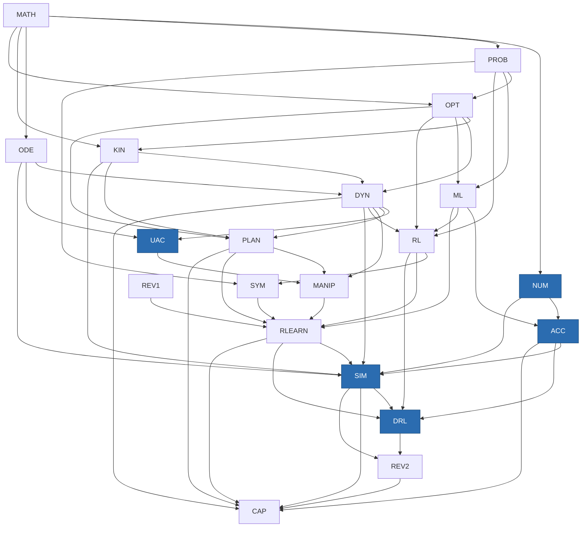

# Robotics & ML Workbook — Phase 5 Augmentation Plan

**Revision 2.2 — 2026-08-14**
**Stable path:** `docs/plans/PHASE5_AUGMENTATION_PLAN.md`
**Baseline commit:** `dd2e8717f82dfcb77aff4b8c89aba258997f87fe` (Phase 4)
**Status:** **Gate A APPROVED by the owner on 2026-08-14 at revision 2.1** (independent review validated the isolated committed baseline, the labelled worktree comparison, the 69-module/308-concept inventory, the reporter's status semantics and non-zero failure exit, and the semantic-queue treatment of readiness/Anki counts). **Gate A is closed — do not reopen or repeat it.** Gates B–G not started.
**Benchmark corpus:** approved 2026-08-14. **Gate-B production corpus: NOT approved** (§9.0-pre).
**Review artifacts referenced (read-only, review-owned):** `docs/review/REVIEW_PROTOCOL.md`, `EXTERNAL_BENCHMARK_PROPOSAL.md`, `CURRICULUM_COVERAGE.md`, `REVIEW_INDEX.md`, `modules/{MATH-02B,KIN-02,RLEARN-02}.md`

| Revision | Date | Change |
|---|---|---|
| 1.0 | 2026-08-14 | Initial plan (69→101 modules) |
| 1.1 | 2026-08-14 | RTX 5090 remote GPU; relaxed account constraint |
| 2.0 | 2026-08-14 | Calibration-review reconciliation (§17); relevance-scoped completeness rule (§9.0b); repair-vs-deepen register; sequencing fixes (ACC-05→SIM-06, UAC-06→MANIP-05, PLAN-EXAM); internal count corrections |
| 2.1 | 2026-08-14 | Gate A correction pass: isolated committed-baseline evidence separated from worktree measurements; concept/depth inventory completed (308 concepts, 69 modules) and renamed; reporter made honest (OK/REPRO/QUEUE/FAIL, non-zero exit, declared writes); COV-G03/G04 demoted to review queues; KIN02-06 re-routed after verifying KIN-01 lacks the material; KIN02-08, RLN02-04b/c dispositions owned; F8 acceptance criteria added; benchmark corpus approval recorded (§9.0-pre); residual revision-1 text removed |
| **2.2** | **2026-08-14** | **Gate A APPROVED at rev 2.1 (see §0). Applied the two remaining P3 editorial corrections in the §1 new-block table: UAC 6→5 modules, SIM 5→6 modules — both already correct in the §5.1 block summary and §17.4, so this aligns the executive table with them. No other change; Gate A not reopened.** |

*(Working title. The project is renamed from "Toussaint Workbook" per §16.4 — the curriculum now spans Toussaint, Tedrake, and a tooling/paper corpus, so the name goes corpus-neutral while attribution is restructured, not reduced. Repo renamed `toussaint-workbook` → `workbook`; site base path `/workbook/`.)*

> **Standing rule for this document (§17.1).** Planned content is **never** evidence of current coverage. A module is `CURRENTLY_PARTIAL` until repaired, regardless of what a future module or lab will add. Where this plan touches a module the review found defective, it must state separately what is **repaired in place** and what is **deepened elsewhere**.

**Status: planning only.** Nothing in the repository was edited, created, deleted, or deployed to produce this. All repository claims below were re-verified by direct inspection on 2026-08-14; external source claims were verified by fetching the official pages, with access dates recorded. Where I could not verify something, I say so explicitly rather than asserting it.

---

## 1. Executive recommendation

**Curriculum shape.** The workbook's defect is not missing theory. It is a near-total absence of the transition from *derived* to *implemented, simulated, measured, and debugged*. 361 exercises exist; **zero** are executable (one is typed `code` and falls through to a textarea + rubric). Therefore the augmentation is primarily a **vertical lab spine threaded through the existing 69 modules**, plus **five new blocks** that introduce genuinely new conceptual layers the Toussaint corpus does not contain, plus **five new modules inside existing blocks** where the subject belongs to a block that already exists (PLAN-05/06, MANIP-03/04, CAP-02), plus **two relocated for sequencing** (MANIP-05, SIM-06 — §17.4).

Five new blocks, in canonical route position:

| New block | Position | Why a *block* and not modules |
|---|---|---|
| **NUM** — Numerical & Computational Practice | after MATH | New toolchain (venv/notebooks/seeds/asserts) that every later lab depends on; 2 modules with a real internal sequence |
| **UAC** — Underactuated & Nonlinear Control | after DYN | Distinct conceptual layer (underactuation, phase space, Lyapunov synthesis, transcription) with a distinct source corpus (Tedrake) and **5 modules** |
| **ACC** — Accelerated & Parallel Computing | after ML | Distinct execution-model layer; directly serves the user's parallel-sampling / polytope work; now spans three real backends (CPU / Apple MPS / remote CUDA) |
| **SIM** — Simulation & Robot Environments | after RLEARN | Distinct toolchain (MuJoCo/Gymnasium; Drake narrowly scoped per §16.2) requiring a **6-module** sequence |
| **DRL** — Deep RL & Learned Policies (Implementation) | after SIM | Empirical methodology is a distinct layer from RL's derivations and RLEARN's survey; 8 modules |

**Five in-block additions** (decision rule 2): **PLAN-05/PLAN-06** (convex decomposition/IRIS; Graphs of Convex Sets), **MANIP-03/04** (contact dynamics & complementarity; force/impedance control), and **CAP-02** (executable research bridge). Plus **MANIP-05** and **SIM-06**, which are new-block modules relocated for sequencing (§17.4), lab/visualization attachments to **15** existing modules (decision rule 1), and a **repair pass** on the three calibration-reviewed modules (§17.2).

Net: **+33 modules, +~122.5 h** (~120 h new material + ~2.5 h calibration repair), giving **102 modules / ~348.5 h**, of which **~329 h is main route and ~19.5 h is optional (Tier 3)**. No existing module ID is renumbered; no existing URL changes.

**A sixth workstream, added at revision 2.0:** the calibration review (`docs/review/`) found verified defects in all three modules it sampled — including two the earlier revision of this plan had marked "unchanged." Those are **repairs to current content**, scheduled at **Gate F0** *before* the corresponding deepening work, and tracked separately from it (§17).

**Runtime architecture.** One Astro site; each artifact declares a **runtime** (`browser` / `cpu-python` / `separate-sim`) and, orthogonally, a **device** (`cpu` / `mps-optional` / `cuda-optional` / `cuda-required`). Heavy work lives in a `labs/` Jupyter tree launched by one command, behind a **generalised local service** that is the existing `sympy_server.py` extended — reusing its already-proven graceful-degradation pattern. The **RTX 5090 box is reached by a single SSH command that tunnels JupyterLab in and the workbench out**, so a remote lab is indistinguishable from a local one at the URL level and *no* deep-link, progress, or site code changes for remote execution (§11.10). Static notes deploy to GitHub Pages at **`julialopezgomez.github.io/workbook/`**, which requires renaming the repo to `workbook` (§16.4). Rejected: a second lab UI (duplicates navigation, breaks course coherence), Pyodide/WASM as the primary Python runtime (cannot run MuJoCo or PyTorch training; splitting labs across two Python runtimes doubles authoring cost), and any hosted service (all require an account).

**Source strategy.** A second audit gate with the same rigor as `AUDIT_REPORT.md`, but with a manifest schema generalised beyond "PDF + page range" to handle URLs, chapter anchors, package versions, git SHAs, and access dates. Tedrake's two texts are the primary new *theory* corpus; MuJoCo/Gymnasium/Drake/PyTorch docs are *API* sources; CleanRL is the *reference-implementation* source; original papers (PPO/SAC/DQN/DAgger/AlphaZero/Diffusion Policy) are *citation* sources; LeRobot is a *case-study/dataset* source. Approval required before authoring.

**Why this preserves workbook integrity.** Every addition lands at a resolved curricular coordinate with declared prerequisites; the linear route is regenerated from a validated topological sort rather than the current `localeCompare` on IDs (which today produces a **real, verified prerequisite violation** — see §2); and the notation registry becomes machine-checked before a single Tedrake symbol enters the corpus.

---

## 2. Verified baseline

Method: direct file inspection, a Python pass over all 69 module frontmatters and all 361 question/solution JSON records, inspection of the committed `dist/` build, and `git status`/`git diff`. No build or check command was run (that would write files).

### 2.1 Complete and working

| Claim | Verified value |
|---|---|
| Modules | **69** across **15** blocks (MATH 8, OPT 6, PROB 6, ODE 3, KIN 3, DYN 7, PLAN 4, MANIP 2, ML 7, RL 7, SYM 4, REV1 1, RLEARN 9, REV2 1, CAP 1) |
| Estimated hours | **226.0** exactly (sum of `estimatedHours`) |
| Exercises | **361** questions, **361** solutions, **361** `<ExerciseCard>` references — **three-way match, zero orphans, zero duplicate IDs, every exercise has exactly 3 hints** |
| Cheat sheets | **14** (13 per-block + `neural-networks-backprop` from the pilot) |
| Milestones | **8** (MATH, OPT, PROB, DYN, ML, RL, RLEARN + `CUMULATIVE-FINAL`) |
| Source citations | every `sourceId` in module frontmatter and exercise `sourceRef` resolves against `manifest.json` — **except one** (see 2.5) |
| Manifest coverage | all 13 manifest sources are actually cited somewhere; none orphaned |
| Prerequisite graph | **no cycles**, **no dangling** `prerequisites` or `nextModules` targets |
| Build output | `dist/` contains **100** `index.html` pages |
| Views | concept, notation, source, curriculum, search (Pagefind), print, Anki all present and routed |
| Progress | IndexedDB store with `recordAttempt` / `getAttempts` / versioned `exportProgress`/`importProgress` |

### 2.2 Present but partial

- **Answer types.** In use: `short-text` 148, `numeric` 107, `derivation` 92, `proof` 9, `symbolic` 4, `code` **1**. Check modes: `rubric` 250, `deterministic` 107, `symbolic` 4. So **69% of exercises are self-graded rubric**, and the entire executable dimension is one exercise that has no runner.
- **`mcq` / `multi-select`** exist in the schema and `options` is a valid field, but `ExerciseCard.astro` never renders `q.options` and has no branch for either type. They are **schema-only**.
- **`code`** has no grading or rendering path; it falls into the `textarea` + rubric default (`ExerciseCard.astro:52-56`).
- **Solution lock is cosmetic.** `ExerciseCard.astro:40` writes the full solution into `data-full-solution`, and line 94 renders it into a `<details>`. Splitting `solutions/` into its own collection achieves nothing at runtime — the text ships in the HTML of every lesson page.
- **Navigation ignores the graph.** `src/pages/course/[block]/[id].astro:9-10` and `print.astro:7-10` sort by `BLOCK_ORDER` index then `a.data.id.localeCompare(b.data.id)`. `prerequisites` is displayed (`ModuleLayout.astro:52-55`) but never drives order; `nextModules` is loaded and used nowhere for routing.
- **Roadmap is a grouped list.** `curriculum.astro` groups by block and sorts by `localeCompare` — not a dependency graph, as `ARCHITECTURE.md:137` itself concedes.
- **Progress has no mastery workflow.** `ModuleProgress.status` supports `'mastered'` but nothing ever sets it; `timeSpentMinutes` is written as `0` and never incremented; there is no prerequisite-aware recommendation anywhere.
- **Notation index is thin.** 208 entries / 202 distinct symbols across 69 modules; **5 modules declare none** (PLAN-04, REV1-01, REV2-01, RLEARN-06, RLEARN-08).
- **`reviewCardIds`** populated on only 39 of 361 exercises.

### 2.3 Specified but absent

- **`labs/`** — specified in `CLAUDE.md:29` and `ARCHITECTURE.md:29`. **Does not exist.**
- **`scripts/validate/`** — specified in `CLAUDE.md:34`. **Does not exist.** There is no automated validation suite of any kind; the README documents ad-hoc `grep` one-liners instead.
- **Structured external-source manifest** — `externalSources` is free text `{citation, note}` with no ID, URL, version, or access date.
- **Component set from `ARCHITECTURE.md:17-20`** — `GradingPanel`, `ReviewWithClaude`, `ProgressBar`, `Roadmap`, `PrevNext`, and the per-type exercise components were never built as separate components; the functionality is inlined into `ExerciseCard`/`ModuleLayout` (this is fine, but the doc still describes the unbuilt shape).

### 2.4 Prototype / uncommitted (user-owned — do not discard)

`git status`: `M PROJECT_STATE.md`, `M data/curriculum/ARCHITECTURE.md`, `M data/curriculum/CURRICULUM.md`, `M package.json`, `M package-lock.json`, `M src/content/course/KIN/KIN-01.mdx`, `?? src/components/interactive/`.

- `three@^0.185.1` + `@types/three@^0.185.4` added to `package.json`.
- `RotationViz.astro` (195 lines) — three.js Rodrigues'/exponential-map visualizer, computing `R(w)` from the module's own formula and cross-checking against three.js every frame. **Wired into `KIN-01.mdx`** after the Rodrigues section.
- `GridWorldRL.astro` (222 lines) — client-side 5×5 Q-learning trainer, α/ε/γ sliders, value heatmap + greedy arrows, `<details>` panel showing the real training code. **Not wired into any lesson.**
- The three modified planning docs already contain Phase-5 framing text.

**Assessment: both are pilot assets, not throwaways.** They independently validated the two design decisions that matter most (compute-the-taught-formula-live rather than a black box; show the code that actually runs). Both are kept, with changes: `RotationViz` needs the lazy-loading treatment (§10/§11) before it can be a pattern, and `GridWorldRL` needs wiring into RL-03 at the spot `PROJECT_STATE.md` already identifies.

**Bundle evidence (from committed `dist/`):** `RotationViz…js` = **548,557 bytes** (536 KiB) uncompressed — the largest asset on the site by 2×. `BaseLayout…js` (KaTeX auto-render) = 261,105 bytes and ships on **every** page. `ExerciseCard…js` = 3,432 bytes. Total `dist/` = 24 MB.

### 2.5 Verified defects (new findings, not in the prompt's list)

1. **Prerequisite violation in the live linear route.** `OPT-06` declares `prerequisites: ["OPT-05", "PROB-01", "PROB-05"]`, but block order puts OPT **before** PROB. Under the implemented ordering, a learner following prev/next reaches OPT-06 two blocks before its prerequisites. This is the **only** such violation in the graph, it was flagged in `CURRICULUM.md:83` as a production-sequencing note, and it was never fixed in the route. **Fix costs nothing:** no PROB module depends on any OPT module (verified), so swapping the block order to `MATH → PROB → OPT → …` removes the violation with zero content edits and zero URL changes.
2. **Notation collisions — 6 symbols carry conflicting meanings:**

   | Symbol | Meaning A | Meaning B |
   |---|---|---|
   | `$\theta$` | KIN-02: rotation angle | SYM-02: a substitution `{x/John}` |
   | `$L$` | ML-03: scalar loss | OPT-05: Lipschitz constant of `∇f` |
   | `$\alpha$` | OPT-01: step size | RL-03: learning rate |
   | `$\phi(x)$` | ML-02: feature map | OPT-02: feature/residual vector |
   | `$k(x,x')$` | ML-05: kernel | OPT-06: GP covariance function |
   | `$c(s,a)$` | RL-05: visit count | **SYM-03: "a symbolic state as a conjunction of ground literals"** |

   The last one is an outright **authoring bug**: `SYM-03.mdx:20` pairs the symbol `$c(s,a)$` with a meaning that describes a symbolic state. It should almost certainly be `$s$`. Nothing catches this today.
3. **Unmanifested source ID.** `julia-report` appears as a `sourceRef.sourceId` on 3 exercises but is not in `manifest.json` — the structured-citation system already has a hole before any external source is added.
4. **Print page misstates its own contents.** `print.astro:26-27` tells the reader "**exercises aren't included**." The committed `dist/print/index.html` contains **367** exercise-card/solution markers. `<Content />` renders the MDX including every `<ExerciseCard>`, and full solutions come with it. The printable "book" therefore ships every answer key inline.

### 2.6 Documentation drift

| Location | Says | Reality |
|---|---|---|
| `CLAUDE.md:3` | repo is **private**; figures embedded contingent on privacy; "do not make public again" | contradicted by `README.md:8` ("this repository is public") and by the user's decision in this prompt |
| `docs/decisions/0003-public-repo.md:21-22` | reversal to private is the current state | superseded by this prompt |
| `CLAUDE.md:22` | "Only `ML/ML-03.mdx` exists so far (pilot)" | 69 modules exist |
| `CLAUDE.md:29,34` | `labs/` and `scripts/validate/` described as project structure | neither directory exists |
| `CURRICULUM.md:7,20` | "13 blocks, ~63 modules" | 15 blocks, 69 modules |
| `CURRICULUM.md:37` | "~69 modules, ~163–197 estimated study hours" | 226.0 h |
| `ARCHITECTURE.md:133` | "13 total" cheat sheets | 14 files |
| `ARCHITECTURE.md:3` | "No code is written yet" | whole site built |
| `CLAUDE.md:9` | "no hosted deployment … ever" | to be reconciled with the GitHub Pages evaluation in §11 |

### 2.7 Astro/Zod deprecation hints — CONFIRMED at Gate A (revision 1.x was wrong)

Revision 1.x of this plan reported that it "could not reproduce" the prompt's claim of Astro/Zod deprecation hints. **That was my error, and Gate A corrects it.** `npx astro check` reports:

```
Result (29 files): 0 errors, 0 warnings, 103 hints
```

**All 103 are `ts(6385): 'z' is deprecated`**, every one of them in `src/content.config.ts`. The prompt was right and I was wrong.

The mistake is worth recording because it is a reusable lesson about evidence: I checked whether the *Zod methods* the file calls (`z.object`, `z.string`, …) were marked `@deprecated` in `node_modules/zod`, found they were not, and concluded the claim was unreproducible. But the deprecation is not on the methods — it is on **the `z` symbol re-exported from `astro:content`**. Astro 7 exposes `astro:schema` as the current home (confirmed at `node_modules/astro/dist/core/create-vite.js:228`), and importing `z` from `astro:content` is the deprecated path. Every downstream `z.*` call inherits the hint, which is why one bad import line produces 103 hints.

**Correct disposition:** a genuine finding with a **one-line fix** (`import { z } from 'astro:schema'`), scheduled at Gate D per §14.2. Reproduced mechanically as check `D-08`.

**Process note:** grepping a dependency's type definitions is weak evidence for "the tool does not warn." Running the tool is strong evidence. Gate A runs the tool.

### 2.8 Host environment — primary machine (measured)

Measured directly on this machine:

- **Apple M4 Pro**, 14 CPU cores, **20-core Apple GPU (Metal 4)**, 24 GB unified memory, macOS **26.5.1** (Tahoe).
- `.venv`: Python **3.14.2**, torch **2.13.0**, numpy 2.5.2, sympy 1.14.0, PyMuPDF, Flask.
- `torch.backends.mps.is_available()` → **True**. `torch.cuda.is_available()` → **False**.
- Warmed matmul benchmark (20 reps, synchronized), CPU vs MPS:

  | n | CPU | MPS | speedup |
  |---|---|---|---|
  | 512 | 0.16 ms | 0.29 ms | **0.55×** |
  | 2048 | 5.46 ms | 2.64 ms | 2.07× |
  | 4096 | 48.16 ms | 20.93 ms | 2.30× |
  | 8192 | 374.93 ms | 177.87 ms | 2.11× |

**Consequences for the primary machine.** (a) The realistic on-device MPS speedup is **~2×**, and the GPU is **slower** below n≈1024 — so vectorization, not device choice, is the first-order lesson. (b) Nothing NVIDIA-only runs here. (c) The 0.55×/2.3× table becomes an actual exercise (ACC-02).

### 2.9 Host environment — secondary machine (RTX 5090, remote; **stated by the user, not measured by me**)

The user has access to a second machine with an **NVIDIA RTX 5090** (Blackwell, compute capability **sm_120**), reachable remotely, ideally over SSH. This removes the single biggest constraint in the previous version of this plan. I have not benchmarked it and make no performance claims about it; the requirements below were verified from official/primary sources on 2026-08-14, and actual capability must be confirmed by measurement at Gate D.

| Requirement | Verified fact | Implication |
|---|---|---|
| PyTorch on sm_120 | **PyTorch ≥ 2.7.0 with CUDA 12.8 wheels** was the first stable release with native sm_120 support | The primary venv already has **torch 2.13.0**, well past the threshold; the remote box needs the `cu128` (or later) wheel index, not the default |
| CUDA toolkit | RTX 50-series requires **CUDA 12.8+** | Driver/toolkit version is a Gate-D checklist item |
| **MuJoCo Warp (MJWarp)** | Joint **NVIDIA + Google DeepMind** project, NVIDIA-hardware-only, documented at `mujoco.readthedocs.io/en/latest/mjwarp/`. Presented in MuJoCo's own docs as the more mature path for contact-heavy parallel simulation, resolving MJX-JAX's mesh/contact bottlenecks | **Now runnable.** Was previously excluded outright |
| MJWarp install | Repo `google-deepmind/mujoco_warp`; the searches did **not** confirm a plain `pip install mujoco-warp` on PyPI — current guidance is source/uv install or via MuJoCo Playground | **Install path is a Gate-B verification item**, not an assumption |
| MJX-JAX on CUDA | Documented support for NVIDIA GPUs; the Apple-Silicon path stays unverified | The JAX module (ACC-06) now has a backend that certainly works |
| **Triton** | `pip install triton`, **CPython 3.10–3.14 wheels**, kernels authored **in Python**, not C++/CUDA C | Makes "advanced GPU concepts without C++" genuinely teachable (new ACC-06). Exact compute-capability support to be confirmed from the repo's compatibility table at Gate B |
| MuJoCo Playground | `google-deepmind/mujoco_playground` — GPU-accelerated robot learning + sim-to-real | New candidate source for **SIM-06** |

**Consequences for the curriculum.** (a) ACC-02 becomes a genuine **three-backend** comparison — CPU (14-core M4 Pro) vs Apple MPS vs CUDA — on identical code. That is a far better teaching artifact than the two-backend version and it is now the block's anchor lab. (b) **Parallel simulation is promoted from optional survey to a main-route module with a real, runnable MJWarp/MJX lab** (now SIM-06, relocated per §17.4). (c) A new Tier-3 module **ACC-06** teaches GPU kernel-level reasoning through Triton, satisfying "optional advanced CUDA concepts without requiring C/C++ in the core route" — you write Python. (d) ACC-04's batched polytope/sampling work gains a large-VRAM regime the M4 Pro cannot reach, which is exactly the scale your planner research operates at. (e) **The main route still never requires CUDA.** Exactly two artifacts are `cuda-required`: ACC-06's Triton lab (Tier 3 module) and SIM-06's MJWarp/MJX *extension* (an optional half of a main-route module whose required half is CPU-only). The course therefore remains completable end to end on the laptop alone, with the 5090 as pure upside.

### 2.10 Cost/account constraint, as relaxed by the user

The user has relaxed "no external account" to: **free resources only; an account (e.g. Google/Colab) is acceptable if genuinely better, but should be avoided when unnecessary.**

**Ruling: Colab is not needed and is not adopted as a lab runtime.** A free Colab tier offers a time-limited, preemptible T4-class GPU with session caps and no persistent filesystem; the RTX 5090 is faster, unmetered, persistent, and already available. Adopting Colab would mean authoring every GPU lab twice (local paths vs Drive mounts) for a strictly worse machine. It stays documented in one place only — an appendix note in ACC-01 offering it as a **tertiary fallback** if the 5090 box is unreachable and the learner is away from both machines.

The relaxation *is* used in one place: the source rubric's "no account" criterion drops from a **hard gate** to a strong preference (§9.2), which matters only for Hugging Face — ungated public LeRobot datasets remain the default, but a free HF account for a gated public dataset is no longer disqualifying. **No paid tier, subscription, or API key is used anywhere.**

---

## 3. Current-depth and overlap matrix

Depth scale: **0** absent · **1** mentioned · **2** explained conceptually · **3** mathematically derived · **4** practised by written exercise · **5** implemented in executable code · **6** used in simulation · **7** applied in an integrated robotics task.

### 3.1 Areas where the gap is 4 → 5/6 (implementation, not theory)

| Area | Existing module(s) | Now | Target | Missing kind | Duplication risk |
|---|---|---|---|---|---|
| Numerical integration (Euler/RK4) | ODE-03 | 4 | 6 | executable lab + browser viz | **Low** — derivation stays, lab measures error/energy drift |
| Linear-system stability, phase behaviour | ODE-02 | 4 | 5 | browser phase-portrait viz | Low |
| Rotations / Rodrigues | KIN-01 | 4 | 5 | **already prototyped** (RotationViz) | None |
| Quaternions, SLERP | KIN-02 | 4 | 5 | browser viz (double cover, slerp vs lerp) | Low |
| FK/IK/Jacobian, singularities | KIN-03 | 4 | 6 | browser viz + sim lab | Low |
| Equations of motion | DYN-01 | 3–4 | 6 | SymPy-derive → MuJoCo cross-check lab | Low |
| PD/PID | DYN-02 | 4 | 5 | browser damping-regime viz (figure already exists) | **Medium** — figure covers static case; viz must add the interactive sweep only |
| LQR / optimal control | DYN-04, DYN-06 | 4 | 6 | CPU lab: solve ARE, roll out, compare to trajopt | Low |
| Trajectory optimization | DYN-04, PLAN-04 | 3–4 | 6 | **transcription is genuinely missing** (see 3.3) | Medium — resolved by scoping DYN-04 to formulation, UAC-04 to transcription |
| MPC | DYN-07 | 3 | 6 | receding-horizon lab with disturbance + constraint studies | Low |
| C-space / feasibility | PLAN-01 | 3 | 5 | browser C-space↔workspace viz | Low |
| PRM / RRT | PLAN-02 | 4 | 5 | browser growth viz + CPU lab | Low |
| Force closure / friction cones | MANIP-01 | 3 | 5 | browser wrench/cone viz | Low |
| Value iteration, Bellman backup | RL-01/02 | 3–4 | 5 | browser backup animator | Low |
| TD / Q-learning | RL-03 | 3–4 | 5 | **already prototyped** (GridWorldRL, unwired) | None |
| MCTS/UCT | RL-06 | 3–4 | 5 | browser tree-growth viz | Low |
| Policy gradient | RL-04 | 3 | 5 | moves to DRL-03 | **High** — DRL must not re-derive the theorem; cross-ref RL-04 |
| Behaviour cloning, DAgger | RLEARN-02 | 2–3 | 6 | moves to DRL-07 | **High** — same rule |
| Offline RL, sim2real | RLEARN-03/04 | 2 | 5–6 | domain-randomization lab in SIM-05 | Medium |
| Dynamics learning | RLEARN-01 | 2–3 | 5 | residual-dynamics lab (SIM-02) | Low |
| TAMP / LGP | RLEARN-07 | 3 | 4 | stays theory; connects to PLAN-06 | Low |
| Convex decomposition, IRIS, GCS | CAP-01 | **1–2 (named only)** | 5–6 | **new modules PLAN-05/06** | Low |
| Diffusion Policy | RLEARN-02 | 1–2 | 5 | DRL-08 | Medium |

### 3.2 Areas that are genuinely absent (0–1)

| Area | Now | Where it goes |
|---|---|---|
| Reproducible numerics: seeds, float pitfalls, assert harness | 0 | NUM-01 |
| Vectorization/batching as a skill | 0 | NUM-02 → ACC-01 |
| Device/execution model, tensors, transfers, sync | 0 | ACC-02 |
| Profiling, bottleneck identification | 0 | ACC-03 |
| Parallel sampling, batched feasibility/polytope tests | 0 | ACC-04 |
| Vectorized envs, parallel rollout collection | 0 | SIM-06, SIM-03 |
| Massively-parallel GPU physics (MJX / MJWarp) | 0 | SIM-06 optional extension (CUDA) |
| JAX (and whether it's worth it) | 0 | ACC-05 (Tier 3) |
| Kernel-level reasoning: occupancy, coalescing, arithmetic intensity | 0 | ACC-06 (Tier 3, Triton in Python) |
| Cross-device numerical non-reproducibility | 0 | ACC-02 + the §11.9 policy |
| Simulator concepts: timestep, solver, actuators, sensors | 0 | SIM-01 |
| Gymnasium API conventions, reward/termination design | 0 | SIM-03 |
| Building/modifying a robot model (MJCF/URDF) | 0 | SIM-02 |
| Evaluation methodology: seeds, variance, learning curves | 0 | DRL-02 |
| Underactuation as a formal concept | 0 | UAC-01 |
| Phase portraits, nullclines, limit cycles | 0–1 | UAC-02, MANIP-05 |
| Lyapunov **synthesis** & region of attraction | 2 (DYN-06 has analysis + 2 examples) | UAC-03 |
| Trajectory-optimization **transcription** (shooting vs collocation) | 0 | UAC-04 |
| Hybrid systems, contact as complementarity | 1 (compass gait, informal) | MANIP-03 |
| Force / impedance control | 0 | MANIP-04 |
| Feedback motion planning / funnels | 0 | UAC-05 (Tier 3) |

### 3.3 Tedrake overlap — explicit resolution

This is the part that most risks a parallel, conflicting curriculum. Decision for **every** chapter of both texts:

**Underactuated Robotics** (Spring 2024 edition, © Russ Tedrake; verified 2026-08-14):

| Ch | Title | Existing coverage | Decision |
|---|---|---|---|
| 1 | Fully- vs underactuated | **absent** | **ADD** → UAC-01 |
| 2 | Simple pendulum | ODE-01/02, DYN-01 | **REUSE as running example**; do not re-derive EOM |
| 3 | Acrobot, cart-pole, quadrotor | absent | **ADD** → UAC-02 |
| 4–5 | Walking / legged | MANIP-02 (compass gait, conceptual) | **OPTIONAL** → MANIP-05 (§17.4); MANIP-02 gains a cross-ref, not a rewrite |
| 6 | Stochasticity | PROB, RL-01 | **SKIP**, cross-ref |
| 7 | Dynamic programming | RL-01/02 (with contraction proof), DYN-04 | **SKIP theory.** Only the *continuous-state value iteration on a grid* lab is new → DRL-01 |
| 8 | LQR | DYN-04, DYN-06 | **SKIP theory**; add lab to DYN-04 |
| 9 | Lyapunov analysis | DYN-06 (definitions + energy & LQR examples) | **EXTEND** → UAC-03 adds ROA, Lyapunov *synthesis*, and the V-as-value-function unification |
| 10 | Trajectory optimization | DYN-04 (discrete-time formulation), PLAN-04 | **EXTEND** → UAC-04 adds transcription (direct shooting vs direct collocation), constraint handling, warm starts. DYN-04 is explicitly re-scoped to "formulation," UAC-04 to "how you actually solve it" |
| 11 | Policy search | RL-04, RLEARN-03 | **SKIP theory** → DRL implements |
| 12 | Sampling-based motion planning | PLAN-02 | **SKIP** |
| 13 | Robust & stochastic control | absent | **Tier 4 reference stub** |
| 14 | Feedback motion planning | absent | **OPTIONAL** → UAC-05 |
| 15 | Output feedback | absent | **Tier 4 reference stub** |
| 16 | Limit cycles | absent | **OPTIONAL** → MANIP-05 (relocated from UAC-06, §17.4) |
| 17 | Planning & control through contact | MANIP-01 (static force closure only) | **ADD, main route** → MANIP-03 |
| 18 | System identification | RLEARN-01 | **SKIP**, cross-ref |
| 19 | State estimation | existing Tier-4 SLAM branch | **stays Tier 4** |
| 20 | Model-free policy search | RL-04 | **SKIP** |
| 21 | Imitation learning | RLEARN-02 | **SKIP theory** → DRL-07 implements |
| App. A–E | Drake, multibody, optimization | OPT block; Drake absent | Drake appendix → **SIM-04** setup material only |

**Robotic Manipulation** (Fall 2025 edition, © Russ Tedrake 2020-2025; verified 2026-08-14):

| Ch | Existing | Decision |
|---|---|---|
| 1–2 Intro / "let's get you a robot" | absent | → SIM-01/SIM-04 setup |
| 3 Basic pick and place | KIN-03 | **REUSE KIN-03 math**; add the pick-and-place *task* to SIM-05 |
| 4 Geometric pose estimation | absent | **Tier 4** (perception, out of research scope) |
| 5 Bin picking | absent | **OPTIONAL** grasp-sampling lab in SIM-05 |
| 6 Motion planning | PLAN-01..04 | **overlap resolved**: Tedrake's IRIS/GCS content is the source for **PLAN-05/06**; classical PRM/RRT stays Toussaint-sourced |
| 7 Mobile manipulation | absent | **SKIP** |
| 8 Manipulator control | DYN-03 (operational space) | **EXTEND** → MANIP-04 (force/impedance/hybrid control) |
| 9–10 Perception / deep perception | absent | **Tier 4 stub** |
| 11 Reinforcement learning | RL, RLEARN, DRL | **SKIP**, cross-ref |
| 12 Soft robots & tactile | absent | **SKIP** |

**Anti-duplication rule to be enforced by validator:** a new module may not declare a `concepts[]` entry already declared by an existing module unless it also declares `deepens: [moduleId]`, which renders as an explicit "this extends X, it does not repeat it" banner.

---

## 4. Proposed additions matrix

Runtime legend: **B** browser · **C** CPU Python · **G** GPU-optional · **S** separate simulator process.
Route: **M** main · **O** optional/advanced.

**`G` means "an optional alternate configuration on either accelerator"** — Apple MPS on the laptop, or CUDA on the remote RTX 5090 — never a requirement. Every `G` lab has a CPU path that is the graded one. §4.3 uses a finer device notation because the ACC block is *about* the distinction; everywhere else `G` suffices.

### 4.1 New block NUM — Numerical & Computational Practice (after MATH)

| ID | Concept/tool | Learning purpose | Action | Prereqs | Route | Artifact | Runtime | Sources | Hrs | Rationale |
|---|---|---|---|---|---|---|---|---|---|---|
| NUM-01 | Lab environment, seeds, float pitfalls, assert-based self-checks | Make every later lab reproducible and self-verifying | add module (new block) | MATH-02 | M | Lab 00 "hello workbook" | C | NumPy docs; newly authored | 2 | Nothing downstream works without it; also the on-ramp for the whole lab spine |
| NUM-02 | Vectorization & batching on CPU | Replace loops with array ops; the skill that later makes GPU work possible | add module | NUM-01, MATH-03 | M | Lab: batched Jacobian & batched collision test | C | NumPy/PyTorch docs | 3 | Directly serves parallel sampling; measurable speedup with no GPU |

### 4.2 New block UAC — Underactuated & Nonlinear Control (after DYN)

| ID | Concept | Purpose | Action | Prereqs | Route | Artifact | Runtime | Sources | Hrs | Rationale |
|---|---|---|---|---|---|---|---|---|---|---|
| UAC-01 | Fully- vs underactuated systems | Formal criterion; why control gets hard | add module (new block) | DYN-01, DYN-03 | M | — | — | Underactuated ch.1–2 | 2.5 | Concept absent from Toussaint corpus; gates everything else here |
| UAC-02 | Phase portraits, nullclines, fixed points, linearization revisited | Reason about nonlinear dynamics geometrically | add module | UAC-01, ODE-02 | M | **PhasePortrait** viz + pendulum/cart-pole lab | B + C | Underactuated ch.2–3; Strogatz (generic) | 3.5 | ODE-02 gives eigenvalue classification but no geometric picture; user's weakest area |
| UAC-03 | Lyapunov synthesis & region of attraction | Certify stability, not just analyse it | modify-adjacent: **new module extending DYN-06** | DYN-06, UAC-02 | M | ROA sublevel-set viz | B | Underactuated ch.9 | 3.5 | DYN-06 has analysis + 2 worked examples; synthesis/ROA absent |
| UAC-04 | Trajectory-optimization transcription: shooting vs collocation | Turn DYN-04's formulation into a solvable NLP | add module | DYN-04, OPT-04, NUM-02 | M | Lab: cart-pole swing-up, both transcriptions | C | Underactuated ch.10 | 4 | The single biggest theory→practice gap for the user's research |
| UAC-05 | Feedback motion planning / funnels | Robustness of a plan, not just its existence | add module | UAC-03, UAC-04 | **O** | ROA-funnel viz | B | Underactuated ch.14 | 3 | Valuable but must not gate the main route |

*Limit cycles / passive walking was **UAC-06** in revision 1.x. It declared `MANIP-02` as a prerequisite while UAC precedes MANIP in the route — a forward prerequisite. **Relocated to MANIP-05** (§4.6), where the compass gait it reuses actually lives. UAC is 5 modules, 16.5 h.*

### 4.3 New block ACC — Accelerated & Parallel Computing (after ML)

Device legend: **cpu** · **mps?** MPS-optional · **cuda?** CUDA-optional (remote 5090) · **cuda!** CUDA-required (Tier 3 only).

| ID | Concept | Purpose | Action | Prereqs | Route | Artifact | Device | Sources | Hrs | Rationale |
|---|---|---|---|---|---|---|---|---|---|---|
| ACC-01 | Execution models: CPU cores, SIMD, GPU threads, memory hierarchy — intuitively | Build a mental model before touching a device | add module (new block) | NUM-02, ML-01 | M | — | cpu | PyTorch docs; CUDA & Metal programming-model overviews | 2.5 | Two very different GPUs, no model of either; concept before API |
| ACC-02 | Tensors, devices, transfers, memory, synchronization — and when GPU is **slower** | Measure rather than assume | add module | ACC-01 | M | **Lab: the three-backend crossover table — CPU vs MPS vs CUDA on identical code** | cpu + mps? + cuda? | PyTorch MPS + CUDA-semantics docs | 3.5 | Anchor lab of the block; §2.8's measured MPS column is the reference, the CUDA column is the learner's to produce |
| ACC-03 | Profiling & bottleneck identification | Find the real cost before optimizing | add module | ACC-02 | M | Lab: profile a slow rollout loop, fix it, re-measure | cpu + mps? + cuda? | `torch.profiler`, cProfile, Nsight Systems docs | 3 | Prevents cargo-cult acceleration; Nsight only on the remote box |
| ACC-04 | Parallel sampling & batched geometric feasibility | **The user's own research workload** | add module | ACC-02, PLAN-05 | M | Lab: batched polytope membership + batched collision + rejection sampling; loop → CPU-vectorized → MPS → **large-batch CUDA** | cpu + mps? + cuda? | newly authored; Drake/NumPy docs | 4 | Highest research relevance in the augmentation; the 5090 adds a batch regime the laptop cannot reach |
| ACC-05 | JAX: what it buys, what it costs | Decide, with evidence, whether to adopt it | add module | ACC-03 | **O** | Lab: same kernel in torch and JAX; MJX rollout on CUDA | cpu + cuda? | JAX docs; MJX docs | 2.5 | Now a decision made against a backend that certainly works, not a hypothetical |
| **ACC-06** | **GPU kernels without C++: Triton, occupancy, memory coalescing, `torch.compile`** | See one level below the framework, in Python | **add module (new)** | ACC-03 | **O** | Lab: write a fused elementwise kernel and a reduction in Triton; compare vs eager and `torch.compile` | **cuda!** | Triton docs; `torch.compile` docs; CUDA programming guide (concept role) | 3 | The 5090 makes "advanced CUDA concepts without C/C++" real — kernels are written in **Python**. Tier 3, and one of only two `cuda-required` artifacts in the curriculum |

*Parallel simulation & vectorized rollouts was **ACC-05** in revision 1.x. It declared `SIM-03` as a prerequisite while ACC precedes SIM in the route — a forward prerequisite, and the one the reviewer flagged. **Relocated to SIM-06** (§4.4), where environments to vectorize actually exist. JAX and Triton renumber to ACC-05/06 (no published IDs are affected — none of these exist yet). ACC is 6 modules, 18.5 h.*

### 4.4 New block SIM — Simulation & Robot Environments (after RLEARN)

| ID | Concept | Purpose | Action | Prereqs | Route | Artifact | Runtime | Sources | Hrs | Rationale |
|---|---|---|---|---|---|---|---|---|---|---|
| SIM-01 | What a simulator actually does: timestep, integrator, solver, contact model | Connect ODE-03/DYN-01 to a real engine | add module (new block) | ODE-03, DYN-01, NUM-01 | M | Lab: integrate a pendulum by hand vs MuJoCo; energy drift vs timestep | C + S | MuJoCo docs (Overview, Computation) | 3.5 | Prevents treating the simulator as a black box |
| SIM-02 | Robot models: MJCF/URDF, bodies, joints, actuators, sensors | Modify a robot, not just import one | add module | SIM-01, KIN-03 | M | Lab: build a 2-link arm MJCF from scratch, verify FK against KIN-03 | C + S | MuJoCo XML reference; MuJoCo Menagerie | 3.5 | Ties directly back to already-derived kinematics |
| SIM-03 | Gymnasium conventions: state/obs/action, reward, termination vs truncation, wrappers, seeding | The interface every later algorithm assumes | add module | SIM-02, RLEARN-03 | M | Lab: wrap the arm as a Gymnasium env; seed/determinism test | C + S | Gymnasium docs v1.3 | 3 | Reward/termination design is where most RL bugs originate |
| SIM-04 | Classical controllers in simulation | Verify DYN's controllers before any learning | add module | SIM-03, DYN-03, DYN-07 | M | Lab: PD → operational-space → MPC on the same sim arm | C + S | MuJoCo docs | 3.5 | Enforces "classical before learned". **MuJoCo-only** — the MuJoCo-vs-Drake question is written up as decision criteria, not installed as a second toolchain (§16.2) |
| SIM-05 | Manipulation tasks, domain randomization, sim-to-real limits | Make RLEARN-04's concepts measurable | add module | SIM-04, MANIP-03 | M | Lab: pick-and-place + randomization sweep, measure transfer proxy | C + S | Robotic Manipulation ch.3, 5; MuJoCo docs | 3.5 | Turns RLEARN-04 from depth 2 to depth 6 |
| **SIM-06** | **Vectorized & parallel simulation** *(relocated from ACC-05)* | Where simulation throughput actually comes from | add module | **SIM-03, ACC-03** | M | Lab: `SyncVectorEnv` vs `AsyncVectorEnv` scaling curve (CPU) **+ MJWarp/MJX massively-parallel rollouts (CUDA)** | C + S, cuda? | Gymnasium vector docs; MuJoCo MJX + MJWarp docs; MuJoCo Playground | 3.5 | **Sequencing fix (§17.4):** vectorizing environments requires environments. Both prerequisites now precede it (ACC at route position 12, SIM at 17). CPU half required, MJWarp half optional |

### 4.5 New block DRL — Deep RL & Learned Policies, Implementation (after SIM)

| ID | Concept | Purpose | Action | Prereqs | Route | Artifact | Runtime | Sources | Hrs | Rationale |
|---|---|---|---|---|---|---|---|---|---|---|
| DRL-01 | Tabular Q-learning, from browser toy to real code | Bridge the taught update rule to a script you can debug | add module (new block) | RL-03, SIM-03, NUM-01 | M | **GridWorldRL (existing prototype)** + CPU lab | B + C | RL-03; Sutton & Barto ch.6 | 2.5 | Reuses a working pilot; lowest-risk first executable |
| DRL-02 | Evaluation methodology: seeds, variance, learning curves, confidence, failure diagnosis | Learn to *read* an RL result before producing one | add module | DRL-01 | M | Lab: 10-seed sweep, CI bands, deliberately broken run to diagnose | C | Agarwal et al. (rliable); CleanRL benchmark docs | 3 | Placed second on purpose — methodology before more algorithms |
| DRL-03 | From tabular to function approximation: DQN | Why neural value functions need replay + targets | add module | DRL-02, ML-04, RL-04 | M | Lab: DQN on CartPole, ablate replay/target net | C + G | Mnih et al. 2015; CleanRL `dqn.py` | 3.5 | Ablation is the lesson, not the score |
| DRL-04 | Policy gradient, implemented (REINFORCE → baselines) | Turn RL-04's theorem into gradients you can inspect | add module | DRL-03, RL-04 | M | Lab: verify the estimator against finite differences | C | RL-04 (no re-derivation); Sutton & Barto ch.13 | 3 | Explicitly forbidden from re-deriving the theorem |
| DRL-05 | Actor-critic and PPO | The inspectable on-policy workhorse | add module | DRL-04 | M | Lab: PPO from scratch, clip-ratio ablation | C + G | Schulman et al. 2017; CleanRL `ppo.py` | 4.5 | PPO chosen over TRPO for inspectability |
| DRL-06 | SAC for continuous control | The realistic robotics algorithm | add module | DRL-05, SIM-04 | M | Lab: SAC on the sim arm; from-scratch vs SB3 comparison | C + G | Haarnoja et al. 2018; SB3 docs | 4.5 | The explicit "from scratch for understanding" vs "library for scale" module |
| DRL-07 | Behaviour cloning, covariate shift, DAgger — implemented | Show compounding error empirically | add module | DRL-02, RLEARN-02, SIM-04 | M | Lab: expert → BC → measure drift → DAgger | C + G | Ross et al. 2011; RLEARN-02; LeRobot docs | 4 | RLEARN-02 states the theorem; here you *see* it |
| DRL-08 | Diffusion Policy & modern imitation stacks | Meet current practice at implementation depth | add module | DRL-07, ML-04, PROB-05 | **O** | Lab: small Diffusion Policy on a LeRobot dataset (no account for public datasets) | C + G | Chi et al. 2023; LeRobot docs | 4 | Optional because it is the heaviest lab; genuinely current |

### 4.6 In-block additions

| ID | Concept | Purpose | Action | Prereqs | Route | Artifact | Runtime | Sources | Hrs | Rationale |
|---|---|---|---|---|---|---|---|---|---|---|
| PLAN-05 | Convex decomposition of C_free: polytopes, H/V-rep, IRIS | Make CAP-01's "named-only" machinery real | **add module in PLAN** | PLAN-01, OPT-04, NUM-02 | M | **PolytopeViz** (2D region growing) + CPU lab | B + C | Robotic Manipulation ch.6; Deits & Tedrake IRIS; user's report §5.1 | 4 | Directly the user's research; currently depth ~1 |
| PLAN-06 | Graphs of Convex Sets: shortest paths, MIQP vs convex relaxation | The other half of the user's own pipeline | **add module in PLAN** | PLAN-05, OPT-04 | M | GCS path viz + Drake lab | B + C | Marcucci et al. GCS; Drake docs; user's report | 3.5 | CAP-01 references GCS with no module behind it |
| MANIP-03 | Contact dynamics: complementarity, hybrid systems, impacts | Move MANIP from static grasps to real contact | **add module in MANIP** | MANIP-01, DYN-01, UAC-01 | M | Contact-mode viz | B | Underactuated ch.17; Robotic Manipulation | 4 | The user's literature is contact-rich manipulation |
| MANIP-04 | Force, impedance & hybrid position/force control | The control layer manipulation actually uses | **add module in MANIP** | MANIP-03, DYN-03 | M | Impedance-response viz | B | Robotic Manipulation ch.8 | 3.5 | DYN-03 stops at operational space |
| **MANIP-05** | **Limit cycles, Poincaré maps & passive walking** *(relocated from UAC-06)* | Periodic behaviour as a stability object | **add module in MANIP** | **MANIP-02, UAC-02** | **O** | Poincaré-map lab | C | Underactuated ch.4, 16 | 2.5 | **Sequencing fix (§17.4):** it reuses MANIP-02's compass gait, so it belongs after MANIP-02, not before it. Both prerequisites now precede it (UAC at 8, MANIP at 10) |
| CAP-02 | Research bridge II: implement the pipeline | Prove transfer by building, not narrating | **add module in CAP** | CAP-01, PLAN-06, ACC-04, SIM-05 | M | Capstone lab: convex decomposition → GCS/MIQP → batched sampling → sim execution | C + G + S | user's report; PLAN-05/06; ACC-04 | 4 | Closes the loop the whole augmentation exists for |

### 4.7 Modify-in-place (decision rule 1 — no new module, no ID churn)

| Module | Addition | Runtime | Δhrs |
|---|---|---|---|
| KIN-01 | RotationViz (already wired) — refactor to lazy load | B | 0 |
| KIN-02 | QuaternionViz: SLERP vs component lerp, double cover, `q` vs `−q` | B | +0.5 |
| KIN-03 | IK/Jacobian playground: 3R arm, manipulability ellipsoid, singularity | B | +0.5 |
| ODE-02 | PhasePortrait viz (shared with UAC-02) | B | +0.5 |
| ODE-03 | IntegratorLab: Euler vs RK4 error/energy vs Δt | B + C | +1 |
| DYN-02 | Damping-regime slider (extends existing static figure) | B | +0.5 |
| DYN-04 | LQR/trajopt CPU lab | C | +1 |
| DYN-07 | MPC receding-horizon lab | C | +1 |
| PLAN-01 | C-space ↔ workspace viz for a 2-link arm | B | +0.5 |
| PLAN-02 | PRM/RRT growth viz + CPU lab | B + C | +1 |
| MANIP-01 | Friction-cone / grasp-wrench viz | B | +0.5 |
| RL-02 | Value-iteration backup animator | B | +0.5 |
| RL-03 | **Wire GridWorldRL** (prototype exists) | B | +0.5 |
| RL-06 | MCTS tree-growth viz | B | +0.5 |
| ML-03 | Make the by-hand↔PyTorch cross-check an executable lab | C | +1 |

Subtotal modify-in-place: **+9.5 h**, zero new IDs.

**Explicitly excluded:** interactives for Block MATH. The user has stated its pen-and-paper exercises are sufficient, and no MATH concept meets the "concrete learning benefit" bar that prose plus the existing figures do not already meet.

---

## 5. Augmented block architecture

### 5.1 Revised block summary

| # | Block | Status | Modules | Hours | Route |
|---|---|---|---|---|---|
| 1 | MATH | **repaired (§17.2)** | 8 | 33.5 | M |
| 2 | **NUM** | **NEW** | 2 | 5 | M |
| 3 | PROB | **moved earlier** (content unchanged) | 6 | 18 | M |
| 4 | OPT | unchanged (now correctly sequenced) | 6 | 28.5 | M |
| 5 | ODE | expanded (in-place) | 3 | 13 | M |
| 6 | KIN | **repaired (§17.2)** + expanded in place | 3 | 9.5 | M |
| 7 | DYN | expanded (in-place) | 7 | 29 | M |
| 8 | **UAC** | **NEW** | 5 | 16.5 | 4 M + 1 O |
| 9 | PLAN | **expanded (+2 modules)** | 6 | 20 | M |
| 10 | MANIP | **expanded (+3 modules)** | 5 | 15.5 | 4 M + 1 O |
| 11 | ML | expanded (in-place) | 7 | 24 | M |
| 12 | **ACC** | **NEW** | 6 | 18.5 | 4 M + 2 O |
| 13 | RL | expanded (in-place) | 7 | 22 | M |
| 14 | SYM | unchanged | 4 | 8.5 | M |
| 15 | REV1 | **rescoped** | 1 | 2 | M |
| 16 | RLEARN | **repaired (§17.2)** | 9 | 26.5 | M |
| 17 | **SIM** | **NEW** | 6 | 20.5 | M |
| 18 | **DRL** | **NEW** | 8 | 29 | 7 M + 1 O |
| 19 | REV2 | **rescoped** | 1 | 2 | M |
| 20 | CAP | **expanded (+1 module)** | 2 | 7 | M |
| | **Total** | | **102** | **~348.5** | **~329 M / ~19.5 O** |

**Arithmetic, checked.** Modules: 8+2+6+6+3+3+7+5+6+5+7+6+7+4+1+9+6+8+1+2 = **102** = 69 existing + 33 new. Hours sum to **348.5**, of which **+2.5 h is calibration repair** (MATH +1, KIN +0.5, RLEARN +1 — §17.2) and ~+120 h is new material. Optional = Tier 3 only: UAC-05 (3) + MANIP-05 (2.5) + ACC-05 (2.5) + ACC-06 (3) + DRL-08 (4) + existing ML-07 (2.5) + RLEARN-08 (2) = **19.5 h**; main route = 348.5 − 19.5 = **329 h**. *(Revision 1.x quoted "~283/~63" in §1 and "~290/~56" here — both were wrong and neither matched the table. Tier 2 is main route, per `CURRICULUM.md`'s own tier definition; only Tier 3 is optional. Tier-4 reference branches are not modules and are not counted.)*

Unchanged blocks: MATH, PROB (content), OPT, SYM. Repaired: **KIN, MATH, RLEARN** (§17.2 — calibration findings, distinct from deepening). Expanded in place: ODE, KIN, DYN, ML, RL. Expanded with new modules: PLAN, MANIP, CAP. New: NUM, UAC, ACC, SIM, DRL. Optional pathways: UAC-05, MANIP-05, ACC-05/06, DRL-08, plus the existing Tier-3/4 branches (SLAM, CSP, LM-reasoning, ML-07, RLEARN-08) unchanged. **Parallel simulation (formerly ACC-05, now SIM-06) is on the main route**; its CPU vector-env portion is the required part, so this does not put CUDA on the main route.

Added: **+33 modules, ~+120 h** (including the +9.5 h of in-place additions and rescoped reviews).

### 5.2 ID and naming scheme

- Block IDs stay 3–6 uppercase letters, unique, never reused. New: `NUM`, `UAC`, `ACC`, `SIM`, `DRL`.
- Module IDs stay `{BLOCK}-{NN}`, zero-padded, **assigned in intended sequence order and never renumbered**. In-block insertions follow the existing precedents: append (`PLAN-05`, `MANIP-03`, `CAP-02`) or use the `00`/`B` suffix pattern (`MATH-00`, `MATH-02B`) when a module must precede or split an existing one.
- Lab IDs: `LAB-{BLOCK}-{NN}` (e.g. `LAB-SIM-03`), one lab directory each, stable and independent of module renaming.
- Interactive component IDs: `VIZ-{Name}`, one Astro component each under `src/components/interactive/`.
- Exercise IDs keep the existing `{module-id}-ex{N}-{slug}` / `new-{topic}-{N}` convention. New executable exercises: `{module-id}-lab{N}-{slug}`.
- **No existing ID or URL changes.** The PROB↔OPT swap changes only route order, not `/course/{block}/{id}` paths.

### 5.3 Assessment implications

- **New milestone exams: 5** — `PLAN-EXAM` (see below), `UAC-EXAM`, `SIM-EXAM` (covers NUM + SIM), `DRL-EXAM`, `ACC-EXAM`. `ACC-EXAM` must be answerable from CPU/MPS evidence alone; any CUDA-derived question is a bonus item, never a scored requirement. PLAN/MANIP additions fold into the existing DYN exam per the existing policy; NUM folds into SIM-EXAM.
- **New cheat sheets: 5** (num, uac, acc, sim, drl) → 19 total.
- **Milestone-placement fix (§17.3).** `CURRICULUM.md:296` states that PLAN/MANIP/SYM material is "folded into the DYN and RLEARN milestones." **Verified at Gate A: it never was** — `DYN-EXAM.coversModules` lists only ODE/KIN/DYN, and `RLEARN-EXAM` lists only RLEARN-*. PLAN, MANIP, and SYM therefore have **no milestone assessment today**. Folding the new PLAN/MANIP modules into `DYN-EXAM` — as revision 1.x proposed — would be worse than the status quo: DYN sits at route position 7 and PLAN/MANIP at 9/10, so it would assess material before it is taught. **Resolution:** a new `PLAN-EXAM` placed after MANIP covering PLAN + MANIP (old and new), and `RLEARN-EXAM.coversModules` extended to include SYM, which does precede it. This closes a pre-existing gap rather than creating a sequencing bug.
- **REV1 rescoped** to also review NUM/UAC/ACC (+0.5 h). **REV2 rescoped** to review SIM/DRL alongside RLEARN (+1 h).
- **Cumulative Final** gains 3 questions spanning the applied blocks (one lab-result interpretation, one debugging-diagnosis, one "which runtime and why").
- **New assessment type: `lab` exercises** — graded by an assert harness in the notebook, with the pass/fail receipt recorded to progress (§11).

---

## 6. Detailed proposed module sequence

Only new or materially changed modules are specified. Existing modules keep their current objectives unless listed in §4.7.

### NUM-01 — Reproducible Numerics & the Lab Kit
Tier 1, main. **Prereqs:** MATH-02. **Objectives:** run a workbook lab end-to-end; explain and apply global seeding across `random`/NumPy/PyTorch; identify float-comparison and accumulation pitfalls; write an assert-based self-check that fails informatively. **Concepts added:** determinism, seeding, tolerance-based comparison, catastrophic cancellation, the lab harness contract. **Reuses:** MATH-02's finite-difference gradient check (Algorithm 1) as the first lab, rather than inventing a new example. **Lab:** LAB-NUM-01 (CPU, <1 min). **Sources:** NumPy/PyTorch docs (API role); newly authored. **Assessment:** 4 exercises, 2 executable. **2 h.**

### NUM-02 — Vectorization & Batching
Tier 1, main. **Prereqs:** NUM-01, MATH-03. **Objectives:** convert an explicit loop to a broadcast array expression; reason about shapes and memory layout; batch a Jacobian evaluation and a point-in-halfspace test; measure the speedup. **Reuses:** MATH-02B's Gauss-Newton IK and MATH-02's Jacobian rather than new math. **Lab:** LAB-NUM-02 (CPU, ~3 min) — loop vs batched, must show ≥10× on the batched feasibility test. **Sources:** NumPy broadcasting docs; PyTorch tensor docs. **3 h.**

### UAC-01 — Fully-Actuated vs Underactuated Systems
Tier 1, main. **Prereqs:** DYN-01, DYN-03. **Objectives:** state the formal actuation criterion in terms of the control-input matrix's rank; classify the pendulum, acrobot, cart-pole, quadrotor and a fixed-base arm; explain why DYN-03's inverse-dynamics/feedback-linearization stack **fails** for underactuated systems. **Reuses:** DYN-01's `M(q)q̈ + F(q,q̇) = u`, DYN-03's control stack — no re-derivation. **Sources:** Underactuated ch.1–2 (primary). **No lab.** **2.5 h.**

### UAC-02 — Phase Portraits & Nonlinear Geometry
Tier 1, main. **Prereqs:** UAC-01, ODE-02. **Objectives:** sketch and interpret a 2D phase portrait; find fixed points and nullclines; connect ODE-02's eigenvalue classification to local portrait structure; explain what linearization does and does not tell you. **Lab/viz:** VIZ-PhasePortrait (browser, also embedded in ODE-02) + LAB-UAC-02 (CPU, ~2 min: damped/undamped/driven pendulum). **Sources:** Underactuated ch.2–3 (primary); Strogatz (generic, as ODE block already does). **3.5 h.**

### UAC-03 — Lyapunov Synthesis & Regions of Attraction
Tier 1, main. **Prereqs:** DYN-06, UAC-02. **Objectives:** distinguish Lyapunov *analysis* (DYN-06) from *synthesis*; construct a candidate V and certify a sublevel-set ROA; explain the value-function/Lyapunov-function correspondence explicitly (Tedrake's unification of DYN-04's V and DYN-06's V). **Reuses:** DYN-06's LQR-value-function example as the bridge. **Viz:** ROA sublevel-set overlay on VIZ-PhasePortrait. **Sources:** Underactuated ch.9 (primary); DYN-06 (cross-reference). **Notation:** the first place where `V` deliberately means two things at once — gets a NotationBridge box. **3.5 h.**

### UAC-04 — Trajectory-Optimization Transcription
Tier 1, main. **Prereqs:** DYN-04, OPT-04, NUM-02. **Objectives:** transcribe a continuous optimal-control problem to an NLP by direct shooting and by direct collocation; state their conditioning/sparsity trade-offs; impose path and terminal constraints; diagnose a failed solve (bad initial guess, infeasible constraints, wrong scaling). **Reuses:** DYN-04's cost formulation and OPT-04's SQP/log-barrier machinery — DYN-04 is re-scoped in prose to "the problem," this module to "the solve." **Lab:** LAB-UAC-04 (CPU, ~8 min) — cart-pole swing-up, both transcriptions, SciPy SLSQP/IPOPT-free path, with a warm-start study. **Sources:** Underactuated ch.10 (primary); OPT-04 (cross-ref). **4 h.**

### UAC-05 — Feedback Motion Planning (optional)
Tier 3. **Prereqs:** UAC-03, UAC-04. **Objectives:** explain why an open-loop trajectory is not a plan; describe funnels/LQR-trees at a conceptual + 1D-verifiable level. **Viz:** funnel composition. **Sources:** Underactuated ch.14. **3 h.**

### MANIP-05 — Limit Cycles & Passive Walking (optional) *(was UAC-06; relocated per §17.4)*
Tier 3, block **MANIP**. **Prereqs:** MANIP-02, UAC-02 — both now precede it. **Objectives:** define a limit cycle and a Poincaré map; numerically find and test the stability of the compass gait's limit cycle. **Reuses:** MANIP-02's compass-gait model directly. **Lab:** LAB-MANIP-05 (CPU, ~5 min). **Sources:** Underactuated ch.4, 16. **2.5 h.**

### ACC-01 — Execution Models: CPU, SIMD, GPU
Tier 2, main. **Device:** cpu. **Prereqs:** NUM-02, ML-01. **Objectives:** describe cores/threads/warps and the memory hierarchy at an intuitive level; predict, *before measuring*, which of five workloads will benefit from a GPU; state Amdahl's law; describe how a unified-memory GPU (Apple) and a discrete-VRAM GPU (NVIDIA) differ in what "moving data" even means. **No lab** (concept first, deliberately). **Appendix note:** the one place Colab is mentioned, as a tertiary fallback, with an explicit statement that it is slower and more constrained than the available 5090 and is not used by any lab. **Sources:** PyTorch docs; Metal + CUDA programming-model overviews (concept role). **2.5 h.**

### ACC-02 — Tensors, Devices & the Cost of Moving Data
Tier 2, main. **Device:** cpu + mps? + cuda?. **Prereqs:** ACC-01. **Objectives:** move tensors between devices and account for the cost; explain asynchronous execution and why honest timing requires synchronization and warm-up; **produce the three-backend crossover table from identical code**; explain *why* the crossover point differs between a unified-memory 20-core Apple GPU and a discrete 5090; state when GPU use is counterproductive. **Lab:** LAB-ACC-02 — CPU column required (~2 min), MPS column optional (~2 min), CUDA column optional-remote (~2 min). §2.8's measured CPU/MPS numbers are the reference answer for the laptop; the CUDA column is the learner's own contribution and is *recorded into the module* as a lasting artifact. Learners with only a CPU still pass. **Sources:** PyTorch MPS + CUDA-semantics docs. **3.5 h.**

### ACC-03 — Profiling & Finding the Real Bottleneck
Tier 2, main. **Device:** cpu + mps? + cuda?. **Prereqs:** ACC-02. **Objectives:** profile a Python/PyTorch workload; distinguish Python overhead, memory traffic, and compute; identify a synchronization stall; apply one fix and re-measure. **Lab:** LAB-ACC-03 (~5 min) — a deliberately slow rollout loop to be diagnosed and fixed with `torch.profiler` and cProfile on any backend; an optional remote extension inspects the same workload under Nsight Systems, which exists only on the NVIDIA box. **Sources:** `torch.profiler`, cProfile, Nsight Systems docs. **3 h.**

### ACC-04 — Parallel Sampling & Batched Feasibility
Tier 2, main. **Device:** cpu + mps? + cuda?. **Prereqs:** ACC-02, PLAN-05. **Objectives:** implement batched point-in-polytope tests (H-representation) as a single `A @ X.T ≤ b` product; implement batched rejection sampling with vectorized acceptance masks; batch a collision/feasibility check across configurations; measure loop → CPU-vectorized → MPS → **large-batch CUDA** and explain each transition; identify where the memory wall appears on each device and compute the batch size at which 32 GB of VRAM is exhausted. **Reuses:** PLAN-05's polytope representation; NUM-02's batching. **Lab:** LAB-ACC-04 — CPU/MPS scale (~10 min) required; a **large-batch remote scale** optional extension pushes to batch sizes the laptop cannot hold, which is the regime the user's planner actually works in. **Sources:** newly authored; Drake/NumPy docs. **Highest research relevance in the augmentation.** **4 h.**

### SIM-06 — Vectorized & Parallel Simulation *(was ACC-05; relocated per §17.4)*
Tier 2, **main route**, block **SIM**. **Device:** cpu + cuda?. **Prereqs:** SIM-03, ACC-03 — both now precede it. **Objectives:** explain how vectorized environments amortize Python overhead; measure the CPU scaling curve and locate its saturation point; explain what massively-parallel GPU physics does differently from N copies of a CPU simulator; state MJX-JAX's documented limitations (joint types, ≲200-vertex convex meshes, <32-vertex convex-convex, ~10× slower than native CPU for a single scene) and why MJWarp exists to address the contact-heavy cases. **Lab:** LAB-SIM-06 — **required part** is the CPU `SyncVectorEnv` vs `AsyncVectorEnv` scaling curve (~8 min); **optional remote extension** runs MJWarp and/or MJX on the 5090 for thousands of parallel environments and compares throughput per wall-second against the CPU curve. **Sources:** Gymnasium vector-env docs; MuJoCo MJX + MJWarp docs; MuJoCo Playground. **3.5 h.**

### ACC-05 — JAX: A Decision Module (optional)
Tier 3. **Device:** cpu + cuda?. **Prereqs:** ACC-03. **Objectives:** explain `jit`/`vmap`/`grad` and functional purity; implement one kernel in both PyTorch and JAX; run an MJX rollout on CUDA; state the concrete conditions under which adopting JAX is worth it for this user's work. **Expected verdict, now evidence-based rather than hypothetical:** adopt JAX only if MJX/Playground becomes the simulation backend or a JAX-native research codebase must be read — otherwise `vmap`-style batching is already available through the PyTorch idioms taught in ACC-04. **Lab:** LAB-ACC-05 (~5 min). **Sources:** JAX docs; MJX docs. **2.5 h.**

### ACC-06 — GPU Kernels Without C++ (optional)
Tier 3. **Device:** **cuda-required**. **Prereqs:** ACC-03. **Objectives:** explain occupancy, memory coalescing, and arithmetic intensity as the three things that determine kernel speed; write a fused elementwise kernel and a reduction **in Python using Triton**; compare against eager PyTorch and `torch.compile`; state when writing a kernel is and is not worth it (expected honest answer for this user: almost never — but knowing what the compiler is doing changes how you write the framework-level code). **Reuses:** ACC-03's profiling workflow to measure the kernels. **Lab:** LAB-ACC-06 (~10 min, remote only). **Sources:** Triton docs (Python-authored kernels, CPython 3.10–3.14 wheels); `torch.compile` docs; CUDA programming guide (concept role only — **no C or C++ is written anywhere in this module or the curriculum**). **Explicitly Tier 3:** nothing on the main route depends on it, and a learner without NVIDIA access skips it with no downstream consequence. **3 h.**

### PLAN-05 — Convex Decomposition of C_free
Tier 1, main. **Prereqs:** PLAN-01, OPT-04, NUM-02. **Objectives:** define a polytope in H- and V-representation and convert conceptually; state the IRIS alternation (separating hyperplanes ↔ maximum-volume inscribed ellipsoid) and why each step is convex; explain what a decomposition buys a planner versus sampling; relate to PLAN-01's `X_fea`. **Reuses:** PLAN-01's `X`/`X_fea` formalism and OPT-04's convexity/SDP-adjacent framing; CAP-01's pipeline description becomes a forward reference rather than the only treatment. **Viz:** VIZ-Polytope (browser, 2D region growth). **Lab:** LAB-PLAN-05 (CPU, ~6 min). **Sources:** Robotic Manipulation ch.6 (primary); Deits & Tedrake IRIS paper (primary); user's Year-1 report §5.1 (cross-ref). **4 h.**

### PLAN-06 — Graphs of Convex Sets
Tier 1, main. **Prereqs:** PLAN-05, OPT-04. **Objectives:** formulate shortest-path-in-GCS; explain the MIQP formulation and its convex relaxation, including the big-M region-membership constraint already introduced in CAP-01; compare against sampling-based planning on completeness/optimality. **Reuses:** CAP-01's big-M derivation (now retro-linked as the applied instance of this module). **Lab:** LAB-PLAN-06 (CPU, ~8 min) — Drake GCS on a 2D maze, with a pure-SciPy fallback if Drake is unavailable. **Sources:** Marcucci et al. GCS (primary); Drake docs (API); Robotic Manipulation ch.6. **3.5 h.**

### MANIP-03 — Contact Dynamics & Hybrid Systems
Tier 1, main. **Prereqs:** MANIP-01, DYN-01, UAC-01. **Objectives:** write contact as a complementarity condition; define a hybrid system with guards and reset maps; derive a rigid-impact reset map; explain why contact makes gradients and optimization hard. **Reuses:** MANIP-01's friction cone (now shown as a convex cone constraint), MANIP-02's impact assumptions (now formalized). **Viz:** contact-mode enumeration for a 2D block. **Sources:** Underactuated ch.17 (primary); Robotic Manipulation (supplementary). **4 h.**

### MANIP-04 — Force & Impedance Control
Tier 1, main. **Prereqs:** MANIP-03, DYN-03. **Objectives:** derive impedance control as a desired mass–spring–damper at the end effector; distinguish impedance from admittance; formulate hybrid position/force control with the constraint-selection matrix; connect gain choice back to DYN-02's damping ratio. **Reuses:** DYN-03's operational-space control (impedance is presented as its natural extension, not a new derivation) and DYN-02's damping analysis. **Viz:** impedance step-response with stiffness/damping sliders. **Sources:** Robotic Manipulation ch.8 (primary). **3.5 h.**

### SIM-01 — What a Simulator Actually Computes
Tier 1, main. **Prereqs:** ODE-03, DYN-01, NUM-01. **Objectives:** map MuJoCo's pipeline onto DYN-01's `M(q)q̈ + F = u`; explain `qpos`/`qvel`/`ctrl` and why `dim(qpos) ≠ dim(qvel)` when quaternions are present; choose a timestep and justify it from ODE-03's stability analysis; measure energy drift. **Lab:** LAB-SIM-01 (CPU + sim, ~5 min). **Sources:** MuJoCo docs — Overview, Computation (primary/API). **Notation:** the `qpos`/`q` mismatch gets a NotationBridge box. **3.5 h.**

### SIM-02 — Building a Robot Model
Tier 1, main. **Prereqs:** SIM-01, KIN-03. **Objectives:** author an MJCF for a 2-link arm from scratch; add actuators and sensors; **verify simulated FK against your own KIN-03 implementation to tolerance**; explain URDF↔MJCF differences. **Lab:** LAB-SIM-02 (CPU + sim, ~6 min) — the FK cross-check is the assert. **Sources:** MuJoCo XML reference (API); MuJoCo Menagerie (reference models). **3.5 h.**

### SIM-03 — Environment Design: Gymnasium Conventions
Tier 1, main. **Prereqs:** SIM-02, RLEARN-03. **Objectives:** implement `reset`/`step`/spaces correctly; distinguish termination from truncation and explain why conflating them biases bootstrapping; design an observation and reward for the arm; verify seeding reproducibility. **Reuses:** RLEARN-03's reward-engineering discussion (concept) — this module supplies the executable form. **Lab:** LAB-SIM-03 (CPU + sim, ~5 min) with a determinism assert. **Sources:** Gymnasium docs v1.3 (API, primary). **3 h.**

### SIM-04 — Classical Control in Simulation
Tier 1, main. **Prereqs:** SIM-03, DYN-03, DYN-07. **Objectives:** implement PD, operational-space, and MPC controllers against the same simulated arm; measure tracking error against the analytical predictions from DYN-02/03/07; state the explicit criteria for choosing a simulator for a given task (contact-rich RL vs optimization-based planning) as a **written decision framework, without installing a second toolchain**. **Reuses:** DYN-02/03/07 derivations verbatim — the module's contribution is that they now run. **Lab:** LAB-SIM-04 (CPU + sim, MuJoCo only, ~10 min). **Sources:** MuJoCo docs (primary); Drake docs (cross-reference only, no install). **3.5 h.**

### SIM-05 — Manipulation Tasks & Domain Randomization
Tier 1, main. **Prereqs:** SIM-04, MANIP-03. **Objectives:** implement a scripted pick-and-place; sample antipodal grasp candidates and score them with MANIP-01's metric; run a randomization sweep over mass/friction and quantify controller brittleness; state honestly what a sim-only transfer proxy does and does not tell you. **Reuses:** MANIP-01's wrench metric, RLEARN-04's sim2real concepts. **Lab:** LAB-SIM-05 (CPU + sim, ~12 min). **Sources:** Robotic Manipulation ch.3, 5; MuJoCo docs. **3.5 h.**

### DRL-01 … DRL-08
Specified in §4.5. Common properties: every module states its **from-scratch vs library** posture explicitly (DRL-01/02/03/04/05/07 from scratch; DRL-06 from scratch **then** compared against Stable-Baselines3; DRL-08 uses LeRobot components), every lab reports a learning curve with ≥3 seeds, every lab has a **CPU-only default configuration** sized for 5–15 min, and none re-derives theory owned by RL-01..07 or RLEARN-02..05.

**Revised for the remote 5090:** each DRL lab now ships **two configurations rather than one** — a `small` CPU/MPS config that is the graded path, and a `full` CUDA config (more seeds, more environments, longer horizons, larger networks) that produces publication-shaped learning curves. This matters most for DRL-02, whose entire lesson is variance across seeds: on CPU that means 3 seeds, on the 5090 it means 10+, which is the difference between illustrating the concept and actually seeing it. **DRL-08 (Diffusion Policy) stays Tier 3**, but the reason changes: it is no longer compute-limited, only authoring-cost-limited, so it becomes the strongest candidate for promotion to main route if the user wants one addition beyond this plan.

### CAP-02 — Research Bridge II: The Pipeline, Executed
Tier 1, main. **Prereqs:** CAP-01, PLAN-06, ACC-04, SIM-05. **Objectives:** implement, at reduced scale, the pipeline CAP-01 describes — decompose a 2D/3D C_free into convex regions, plan through the GCS/MIQP formulation, sample candidate configurations in parallel, and execute the resulting path in simulation; report timings per stage against CAP-01's reported results table and account for the differences. **Lab:** LAB-CAP-02 (CPU + GPU-optional + sim, ~15 min). **Assessment:** rubric-graded write-up plus asserted stage outputs. **4 h.**

**Authored against the report only, never the planner codebase (§16.3).** The user's planner is unfinished and expected to be superseded, so this module teaches the *pipeline shape* — convex decomposition → discrete/continuous split → parallel sampling → execution — and treats every implementation-specific choice as "this version chose X, the trade-off is Y," never as the settled answer. The module closes with a short **"when your planner v2 exists"** note listing exactly what would need revisiting, so a future update is a scoped edit rather than a rewrite (the same pattern DYN-07 used when the report was unavailable).

---

## 7. Prerequisite graph and route policy

### 7.1 Block-level dependency graph



### 7.2 Canonical linear order

```
MATH → NUM → PROB → OPT → ODE → KIN → DYN → UAC → PLAN → MANIP
     → ML → ACC → RL → SYM → REV1 → RLEARN → SIM → DRL → REV2 → CAP
```

**Verified:** under this order, running the same forward-prerequisite check that today reports `OPT-06 → PROB-01` and `OPT-06 → PROB-05` as violations, the existing 69 modules produce **zero violations**. The fix requires no content edits — only that PROB precedes OPT in `BLOCK_ORDER`, and no PROB module depends on any OPT module (verified).

Within a block, module order is a topological sort of the intra-block prerequisite edges, tie-broken by declared `sequence` (a new optional integer field) and then by ID — so `MATH-02 → MATH-02B → MATH-03` remains correct without relying on `localeCompare` accidentally agreeing.

### 7.3 Optional-branch entry/exit

| Branch | Entry after | Exit back to | Never a prerequisite for |
|---|---|---|---|
| UAC-05 | UAC-04 | PLAN | anything on the main route |
| MANIP-05 | MANIP-04 | ML | anything on the main route |
| ACC-05 (JAX), ACC-06 (Triton) | ACC-04 | RL | anything on the main route |
| DRL-08 | DRL-07 | REV2 | REV2, CAP |
| Existing Tier 3/4 (ML-07, RLEARN-08, SLAM, CSP, LM-reasoning) | unchanged | unchanged | unchanged |

Rule: **an optional module may never appear in any main-route module's `prerequisites`.** This becomes a validator check (see §15).

**Second rule, added for the remote GPU: no main-route module or exam may be `cuda-required`.** **SIM-06** is on the main route, but only its CPU vector-env half is required; its MJWarp/MJX half is an optional extension. The only `cuda-required` artifacts in the entire curriculum are ACC-06's Triton lab (Tier 3) and SIM-06's MJWarp extension (the optional half of a main-route module). This keeps the whole course completable on the laptop, with the 5090 as pure upside. Also a validator check.

### 7.4 Reference-mode navigation rules

Entering at any module shows: (a) the **transitive** prerequisite closure, collapsed to the minimal set the learner has not marked complete; (b) a "minimum viable path here" — the topologically sorted subsequence of unmet prerequisites, with its total estimated hours; (c) each unmet prerequisite tagged as *hard* (derivation depends on it) or *soft* (only referenced), a new per-edge field `strength: "hard" | "soft"`, defaulting to `hard`. Today the closure is not computed at all — only the direct list is printed as plain text (`ModuleLayout.astro:52-55`).

### 7.5 Migration plan (navigation generated from the graph)

1. Add `data/curriculum/route.json`: `{ blockOrder: [...], overrides: { moduleId: sequence } }` — the **only** hand-maintained ordering input.
2. Add `src/lib/curriculum/graph.ts`: builds the DAG from content-collection `prerequisites`, runs Kahn's algorithm seeded by `route.json`, exports `canonicalRoute()`, `prereqClosure(id)`, `unmetPath(id, completed)`, `validate()`.
3. Repoint `course/[block]/[id].astro`, `print.astro`, `curriculum.astro`, and the exam remediation links at `canonicalRoute()`. Delete every `localeCompare` ordering call.
4. Make `nextModules` **derived, not authored** — computed as the graph's immediate successors, with the authored field retained only as an optional "suggested next" override, validated for consistency. (Today 8 modules have empty `nextModules` and it is used for nothing.)
5. Replace `curriculum.astro`'s grouped list with a real block-level graph (Mermaid rendered at build time — the site already has zero-JS precedent for this) plus the existing filterable module list beneath it.
6. `blocks.ts` becomes generated from `route.json` + block metadata, ending the `CURRICULUM.md`↔`blocks.ts` duplication.

### 7.6 Graph validation requirements

Fail the build on: missing prerequisite node; cycle; forward prerequisite under the canonical route; unreachable module (not in any route and not declared `tier: 4`); `nextModules` inconsistent with graph successors; an optional-tier module appearing as a main-route prerequisite; a block in `route.json` with no modules or a block with modules not in `route.json`; a `deepens` target that does not exist.

---

## 8. Notation-integration plan

### 8.1 Governance model

A canonical registry at `data/curriculum/notation.json`:

```jsonc
{
  "symbols": [{
    "key": "R-rotation",                  // stable ID, not the glyph
    "latex": "R",
    "canonicalMeaning": "rotation matrix in SO(3)",
    "scope": { "kind": "block", "blocks": ["KIN","DYN","PLAN","MANIP","SIM"] },
    "aliases": [
      { "source": "tedrake-underactuated", "latex": "R", "meaning": "LQR input-cost matrix", "resolution": "scoped-rename" }
    ],
    "conflictsWith": ["R-reward", "R-lqr-input-cost"]
  }]
}
```

Each module's `notation[]` entries gain an optional `key`. A symbol used with a meaning not matching its registry entry, and without a `key` binding it to a different registered symbol, fails validation.

### 8.2 Principal expected conflicts and rulings

| Symbol | Toussaint / existing | Tedrake | Sutton & Barto | MuJoCo / Drake | Ruling |
|---|---|---|---|---|---|
| `x` | optimization variable (OPT); state (DYN) | state `x = [q; q̇]` | — | — | **Adopt Tedrake's `x` = state globally in DYN/UAC/SIM.** OPT keeps `x` = decision variable, scoped to block OPT with a NotationBridge box at UAC-04 where an optimization variable *is* a trajectory |
| `q` | configuration | configuration | — | `qpos` (≠ dim `qvel`) | Canonical `q` = configuration. **SIM-01 gets a mandatory bridge box** on `qpos`/`qvel` dimension mismatch with quaternion joints — the single most common MuJoCo bug |
| `u` | control (DYN) | control input | — | `ctrl` | No conflict; map `u ↔ ctrl` in SIM-01 |
| `a` | action (RL) | — | action | `ctrl` | Keep `a` in RL/DRL, `u` in DYN/UAC/SIM; **DRL-01 gets a bridge box** stating `a ≡ u` for continuous control |
| `R` | rotation matrix (KIN); reward `R(s,a)` (RL) | LQR input-cost matrix | reward | — | **Three-way collision, highest priority.** Ruling: `R` = rotation matrix everywhere in KIN/DYN/PLAN/MANIP/SIM; reward stays `r`/`R(s,a)` in RL/DRL only; LQR input cost is **renamed `R_u`** in DYN-06/UAC/SIM-04 with a bridge box noting Tedrake writes `R` |
| `Q` | Q-function (RL); LQR state cost (DYN) | LQR state cost | action-value | — | **Renamed `Q_x`** for LQR state cost; `Q(s,a)` reserved for the action-value function |
| `V` | value function (RL/DYN-04) | Lyapunov function **and** cost-to-go | value function | — | **Deliberate unification, not a collision** — UAC-03's central teaching point. One bridge box explaining that Tedrake means this identification literally |
| `J` | Jacobian (KIN-03, MATH-02) | cost functional | — | — | `J` = Jacobian (established, 3 blocks). Cost functional is **`L`/`ℓ` running, `J_c` total**, bridge box in UAC-04 |
| `L` | scalar loss (ML-03); Lipschitz constant (OPT-05) | Lagrangian | — | — | **Existing collision (§2.5).** Ruling: `L` = loss (ML/DRL); Lipschitz becomes `L_∇`; Lagrangian stays `\mathcal{L}` (already distinct in OPT-03) |
| `α` | step size (OPT-01); learning rate (RL-03) | — | step size | — | **Existing collision.** Unify as "step size / learning rate," one registry entry, both meanings acceptable; friction coefficient gets `μ` (already used in MANIP-01) |
| `θ` | rotation angle (KIN-02); substitution (SYM-02) | — | policy parameters | — | **Existing collision.** `θ` = rotation angle in KIN/UAC; policy/network parameters in ML/RL/DRL (established); SYM-02's substitution is **renamed `σ`** — a scoped, single-module change with a note |
| `φ` | feature map (ML-02); residual (OPT-02); TAMP constraint (RLEARN-07) | — | features | — | **Existing collision.** `φ` = feature map (ML); OPT-02's residual becomes `r`; RLEARN-07's TAMP constraint stays `φ` scoped to RLEARN with a bridge box |
| `γ` | discount (RL) | discount | discount | — | No conflict |
| `Σ` | covariance (PROB) | — | — | — | No conflict |
| `X`, `X_fea` | configuration space (PLAN-01) | `C`, `C_free` | — | — | Keep `X`/`X_fea` (established, matches user's own report). Bridge box in PLAN-05 for Tedrake's `C_free` |
| `c(s,a)` | **SYM-03 authoring bug** | — | — | — | **Fix**: SYM-03's entry should be `s`; RL-05's visit count keeps `c(s,a)` or becomes `N(s,a)` (matching RL-06's MCTS convention — recommended) |

### 8.3 Policy: retain vs translate

- **Translate to canonical** when the symbol is central and used across ≥2 blocks (`R`, `Q`, `V`, `J`, `x`, `q`, `u`).
- **Retain source notation locally, with a bridge box** when the learner will read the source directly (Tedrake's `R`/`Q` in LQR, MuJoCo's `qpos`/`ctrl`, Sutton's `s,a,r`) — translating these would leave the learner unable to read the source.
- **Never silently change an existing module's established notation.** The three renames above (`R_u`, `Q_x`, `σ`, `L_∇`) touch 4 existing modules and each requires an explicit, logged, user-visible change note, executed as a single reviewable batch at Gate C, not scattered through content production.

### 8.4 Deliverables

`NotationBridge.astro` (a compact "in source X this symbol means Y" callout); the registry; a `/notation` page upgraded to show canonical entry + aliases + conflicts; and the validator described in §15.

---

## 9. Source-selection plan

### 9.0-pre Benchmark corpus: APPROVED 2026-08-14 (production corpus still pending)

The owner approved the **review benchmark corpus** (`docs/review/EXTERNAL_BENCHMARK_PROPOSAL.md`), explicitly including the three module-specific checks: **Ross, Gordon & Bagnell (2011)** for the DAgger/compound-error theorem, **Solà (2017)** for quaternion conventions and SLERP, and **The Matrix Cookbook** for matrix identities and numerical practice.

**What this unblocks — exactly three items, no more:**

| Item | Was blocked on | Now |
|---|---|---|
| RLN02-02 | theorem wording | **Unblocked.** State Ross et al.'s assumptions and the surrogate-loss/task-cost relationship as the paper gives them |
| KIN02-03 | SLERP sign/branch handling | **Unblocked.** Solà supplies convention-explicit treatment; confidence rises from `high` to `verified` |
| M02B-04 | numerical-practice framing | **Unblocked** as an external finding. Note the Cookbook is a *formula reference, not a pedagogy model* (`EXTERNAL_BENCHMARK_PROPOSAL.md:16`), so it justifies the solve-don't-invert point but does not supply its teaching |

**What this does NOT unblock.** Gate B's **production corpus** (`sources.json` v2 — Tedrake as a *theory* source, MuJoCo/Gymnasium/Drake/PyTorch/Triton/LeRobot as *api* sources, CleanRL/SB3 as *implementation* sources, the PPO/SAC/DQN/Diffusion-Policy papers as *citation* sources) **remains unapproved and is a separate decision.** Benchmark approval is a completeness lens; it is not permission to author against a production source. The two corpora overlap only at Tedrake, and even there the roles differ (§9.0).

### 9.0 Two source roles, kept separate (normative)

The review corpus and the production corpus are **different objects with different jobs**, and conflating them would either bloat the curriculum or weaken the audit. Both exist; neither absorbs the other.

| | **Review benchmark corpus** | **Phase 5 production corpus** |
|---|---|---|
| Lives in | `docs/review/EXTERNAL_BENCHMARK_PROPOSAL.md` | `data/source-manifest/sources.json` (§9.3) |
| Owner | Review process | Implementation process |
| Size | **Deliberately small and canonical** | Larger; grows with implementation need |
| Job | Judge whether an important idea is **absent from both the workbook and its declared notes** | Supply theory, API, exercises, and case studies for authoring |
| Roles | Completeness lens only | `theory` / `implementation` / `api` / `exercises` / `case-study` |
| Approval | Owner approval (review Gate 3) | Owner approval (plan Gate B) |
| Constraint | A benchmark may **expose** a gap; it never dictates a module | An API source may be cited; it never becomes a completeness requirement |

**Binding consequence:** *no section of MuJoCo, Gymnasium, Drake, PyTorch, JAX, Triton, LeRobot, CleanRL, or SB3 documentation may generate a curriculum-completeness finding.* API documentation is a reference for authoring, never a syllabus. Only sources carrying a `theory` or `exercises` role — the Toussaint corpus, the Tedrake texts, and the owner-approved benchmark — participate in completeness judgments. The two corpora overlap (Tedrake appears in both); where they do, the role is recorded twice with different meanings, not merged.

### 9.0b Relevance-scoped completeness rule (adopted)

Replaces any implicit "cover every section" standard. **Completeness means no important silent omissions, not line-by-line reproduction.**

> Every source section **must be logged**. A logged section **may be omitted** when *all* of the following hold:
> 1. it is not needed for a declared objective;
> 2. it is not needed by a prerequisite or dependent module;
> 3. it is not needed for current robotics competence;
> 4. it is not needed for Julia's research;
> 5. omitting it creates **no misconception**; and
> 6. the omission is **explicitly recorded** as `routed` (named destination), `intentionally out of scope`, or `optional reference`.

Failing condition 6 is the actual defect the calibration review found three times over: KIN-02 omits integration and conversion while claiming "full note"; MATH-02B omits Identities 2.5 while promising them; RLEARN-02 omits DTW and the generative comparison without routing them. **None of those are wrong to omit — they are wrong to omit *silently*, and two of them are wrong to omit while claiming otherwise.**

Condition 5 is the one that cannot be waived for convenience. KIN-02's double cover fails it: omitting it is not a scope choice, because the lesson's own "rotations live on $S^3$" phrasing then teaches something false, and `PLAN-03:129` depends on it. Contrast KIN-02's random-rotation sampling, which passes all six and is correctly disposed as optional reference.

This rule governs both the Gate-B coverage matrix (§9.4) and every module's source note. Its output is a per-section disposition — `covered` / `routed → {module}` / `optional reference` / `intentionally out of scope` — never a bare percentage.

### 9.1 What I verified (fetched 2026-08-14)

| Candidate | Status verified | Notes |
|---|---|---|
| **Underactuated Robotics** (underactuated.mit.edu) | Live. **Spring 2024** working notes, © Russ Tedrake 2024. 21 chapters + appendices A–E (structure captured in §3.3). Explicit "how to cite" with BibTeX. **No Creative Commons or explicit reuse license on the prose**; the companion repo `RussTedrake/underactuated` is BSD-licensed (code). | Same posture as Toussaint's notes: publicly available, cite-and-attribute. Chapter-anchor citation is possible (`#section`) |
| **Robotic Manipulation** (manipulation.mit.edu) | Live. **Fall 2025** working notes, © Russ Tedrake 2020–2025. 12 chapters + appendices. PDF releases via GitHub, updated less often than HTML | **Actively maintained**, more current than Underactuated |
| **MuJoCo** (mujoco.readthedocs.io) | Live. Open-sourced May 2022, maintained by **Google DeepMind**. First-class Python bindings. GPU backends: **MJX (JAX)** and **MuJoCo Warp (NVIDIA Warp)** | **`mujoco` 3.11.0 is installable on this machine's Python 3.14** (verified via pip index) |
| **MJX** (mujoco.readthedocs.io/en/stable/mjx.html) | Live. Runs on "Nvidia and AMD GPUs, Apple Silicon, and Google Cloud TPUs." Documented limits: joint types FREE/BALL/SLIDE/HINGE only; convex meshes ≲200 vertices; convex-convex <32 vertices; **single-scene sim ~10× slower than native CPU MuJoCo**. MuJoCo Warp is presented as the more mature contact-heavy path | **Now usable via the remote 5090.** MJX-on-Apple-Silicon remains unverified and no lab depends on it |
| **MuJoCo Warp (MJWarp)** | Live. Joint **NVIDIA + Google DeepMind** project; NVIDIA-hardware-only; docs at `mujoco.readthedocs.io/en/latest/mjwarp/`; repo `google-deepmind/mujoco_warp`. Searches did **not** confirm a plain `pip install mujoco-warp` on PyPI — current guidance is source/uv install or via MuJoCo Playground | **Unblocked by the 5090.** Install path is a **Gate-B verification item**, deliberately not assumed |
| **MuJoCo Playground** (`google-deepmind/mujoco_playground`) | Live. DeepMind library for GPU-accelerated robot learning and sim-to-real | New candidate source for **SIM-06**; role and license to confirm at Gate B |
| **Triton** (triton-lang.org) | Live. `pip install triton`; **binary wheels for CPython 3.10–3.14**; kernels authored **in Python**, not C++/CUDA C | Makes ACC-06 possible without violating the no-C/C++ constraint. Exact compute-capability support to be read from the repo compatibility table at Gate B |
| **PyTorch on Blackwell/sm_120** | **PyTorch ≥ 2.7.0 with CUDA 12.8 wheels** was the first stable release with native sm_120 support; RTX 50-series requires CUDA 12.8+ | Local venv already has torch 2.13.0; the remote box must use the `cu128`+ wheel index. Gate-D checklist item |
| **Gymnasium** (gymnasium.farama.org) | Live, Farama Foundation, maintained fork of OpenAI Gym. Documents `Env`, `reset`/`step`, spaces, wrappers, **vector envs**, and 11 MuJoCo environments | **1.3.0 installable on Python 3.14** (verified) |
| **Drake** (drake.mit.edu) | Live. Supports **macOS Tahoe (26) arm64 with Python 3.13–3.14 via pip** — matches this host exactly (macOS 26.5.1, Python 3.14.2). Not tested with Anaconda | **Compatibility confirmed for this machine.** License not stated on the installation page; **must be confirmed at Gate B** |
| **Stable-Baselines3** (DLR-RM) | Live, actively maintained, docs at 2.9.2a0, PyTorch-based, plus RL-Zoo and SB3-Contrib | Suitable as the "trusted library" comparison target in DRL-06 |
| **CleanRL** (vwxyzjn/cleanrl) | Live, JMLR-published, single-file implementations (ppo/dqn/sac/td3/ddpg), benchmarked, migrated to Gymnasium | Suitable as the **reference-implementation reading** source for DRL-03/05/06 |
| **LeRobot** (huggingface.co/docs/lerobot) | Live. Standard `LeRobotDataset`; policies ACT, Diffusion, TDMPC, SmolVLA, π₀; datasets streamable from the Hub; explicitly supports "no hardware yet" workflows (train on Hub datasets, evaluate in sim against LIBERO/Meta-World) | **Public dataset download does not require an account**; re-confirm per dataset at Gate B. Under the relaxed constraint (§2.10) a free HF account for a gated public dataset is now acceptable, but ungated remains the default. The free Colab notebooks LeRobot offers are **not** adopted — the 5090 supersedes them |
| **Sutton & Barto 2nd ed.** | **Not verified** — `incompleteideas.net` failed to fetch (self-signed certificate). Search results consistently point to the official page hosting a full free PDF | **Flagged for verification at Gate B**, not asserted |

**Not researched, deliberately deferred to Gate B:** exact licenses for Drake and Gymnasium; the current PPO/SAC/DQN/DAgger/AlphaZero/Diffusion Policy paper versions and arXiv IDs; MuJoCo Menagerie model licenses (per-model, they differ); rliable; Modern Robotics (Lynch & Park) and Siciliano et al. availability. I have not invented maintenance or licensing facts for any of these.

### 9.2 Selection rubric (scored, threshold-gated)

Each candidate scored 0–3 on ten criteria; **any 0 on a Gate criterion is disqualifying**:

| # | Criterion | Gate? |
|---|---|---|
| 1 | **Availability**: reachable from an official/primary URL, no paywall, no account | **Yes** |
| 2 | **Cost**: free — no subscription, paid tier, or API key, ever | **Yes** |
| 2b | **Account-free**: usable without registering. *Relaxed by the user (§2.10) from a gate to a strong preference* — a free account is acceptable only where it unlocks something materially better, and must be recorded per-source | No |
| 3 | **Citation granularity**: can cite a chapter/section/anchor/version, not just "the book" | **Yes** |
| 4 | **Maintenance**: updated within 18 months, or is a stable published paper | No |
| 5 | **Authority**: original author / official docs / original paper / maintained reference impl | No |
| 6 | **Notation compatibility**: conflicts mappable per §8 without breaking existing modules | No |
| 7 | **Exercise quality**: usable problems or verifiable examples | No |
| 8 | **Reproducibility**: pinned versions; examples actually run on this host | **Yes** for API/implementation roles |
| 9 | **Role fit**: fits exactly one declared role (theory / implementation / API / exercises / case study) | No |
| 10 | **Provenance clarity**: attribution terms stated or inferable; adapted vs quoted distinguishable | **Yes** |

Eleven criteria, 0–3 each, 33 points. Sources scoring ≥23/33 with no gate failure are **approved**; 17–22 are **conditional** (approved for a named role only); <17 are **rejected with a written reason**. Every source that requires an account carries an explicit `requiresAccount: true` field in `sources.json` and a visible note on `/sources`, so the cost of that choice stays legible rather than accumulating silently.

### 9.3 Manifest schema changes

`manifest.json` becomes `sources.json` with a discriminated union on `kind` (the existing 13 PDF entries migrate unchanged into `kind: "pdf"`, keeping their `source_id`s and hashes):

```jsonc
{
  "schemaVersion": 2,
  "sources": [
    { "sourceId": "tedrake-underactuated", "kind": "web-book",
      "title": "Underactuated Robotics: Algorithms for Walking, Running, Swimming, Flying, and Manipulation",
      "authors": ["Russ Tedrake"], "publisher": "MIT (course notes for 6.832)",
      "url": "https://underactuated.mit.edu/", "edition": "Spring 2024",
      "accessedAt": "2026-08-14", "copyright": "© Russ Tedrake, 2024",
      "licenseNote": "No explicit content license stated; citation requested. Companion code repo RussTedrake/underactuated is BSD.",
      "citationUnits": "chapter+section anchor",
      "roles": ["theory", "exercises"],
      "anchors": [{ "id": "ch9", "label": "Ch. 9 Lyapunov Analysis", "url": "https://underactuated.mit.edu/lyapunov.html" }] },

    { "sourceId": "mujoco-docs", "kind": "documentation",
      "url": "https://mujoco.readthedocs.io/en/stable/", "packageVersion": "3.11.0",
      "accessedAt": "2026-08-14", "maintainer": "Google DeepMind",
      "roles": ["api", "implementation"] },

    { "sourceId": "cleanrl", "kind": "reference-implementation",
      "url": "https://github.com/vwxyzjn/cleanrl", "gitRef": "TBD-at-gate-B",
      "accessedAt": "2026-08-14", "roles": ["implementation"],
      "usagePolicy": "read-and-compare; do not vendor code without an explicit per-file provenance tag" },

    { "sourceId": "julia-report", "kind": "personal-document",
      "title": "CDT-D2AIR Year-1 Final Scientific Report", "authors": ["Julia Lopez Gomez"],
      "roles": ["case-study"], "note": "fixes the currently-unmanifested sourceId found in 3 exercises" }
  ]
}
```

Content schema changes: `sources[].pages` becomes `sources[].locator` (a free string interpreted per `kind`: `"p14-16"` for PDFs, `"ch9 §9.3"` for web books, `"XMLreference#actuator"` for docs, `"ppo.py L120-160"` for implementations); add `sources[].accessedAt` for non-PDF kinds; `externalSources` free-text is **deprecated and migrated** into structured entries (this closes the `julia-report` hole).

### 9.4 Required coverage audit

A `SOURCE_COVERAGE.md` matrix produced before authoring, with one row per **source section** and columns: covering module(s) · disposition (included / merged / duplicate-of-existing / reference-only / excluded) · reason · notation conflicts introduced. Same shape as `AUDIT_REPORT.md` §5, which worked. Required for: both Tedrake texts (chapter level, all 33 chapters), MuJoCo docs (page level, ~15 relevant pages), Gymnasium (~8), Drake (~6), the paper set, CleanRL (per-file), LeRobot (~6).

### 9.5 Attribution and provenance checks

- Every new module declares provenance per claim as today (`source-adapted` / `newly-authored` / `external-adapted`), with `external-adapted` split into `external-adapted-theory` and `external-adapted-code`.
- Any code derived from a reference implementation carries a header comment naming source, URL, git ref, and what was changed. **No silent vendoring.**
- The README's "Credit and source material" section gains a per-source table: source, author, URL, role, what was adapted, edition/access date. Toussaint stays first and most prominent.
- A `/sources` page upgrade rendering the same table from `sources.json`, so provenance is visible on the site, not just in the repo.

### 9.6 Approval deliverable (Gate B)

One document: candidate list with scores against §9.2, the coverage matrix skeleton, the proposed `sources.json` v2 with every new entry filled in and verified, the notation-conflict list each new source introduces, and a rejected-sources list with reasons. **No content authoring begins before the user approves it.**

---

## 10. Interactive and computational-tool catalog

### 10.1 Browser interactives (Tier B)

| ID | Module(s) | Learning question | Inputs → outputs | Assessed? | Budget (gz) | Loading | Fallback | Progress |
|---|---|---|---|---|---|---|---|---|
| VIZ-Rotation *(exists)* | KIN-01 | Does Rodrigues' formula do what I think? | axis, angle → live `R`, cross-checked vs three.js | demo | **≤170 KB** (three.js) | **click-to-load** | static figure + matrix table | no |
| VIZ-Quaternion | KIN-02 | Why is SLERP not component-wise lerp, and what is double cover? | `q₀`,`q₁`,`t` → both paths, `q` vs `−q` | demo | ≤170 KB (shares three.js chunk) | click-to-load | static figure | no |
| VIZ-IK | KIN-03 | What does a singularity look like? | target pose, 3R arm → IK iterates, manipulability ellipsoid | **assessed** (1 numeric ex.) | ≤25 KB (canvas 2D) | on-visible | numeric table | **yes** |
| VIZ-PhasePortrait | ODE-02, UAC-02 | What does eigenvalue classification look like geometrically? | system params → vector field, nullclines, trajectories | **assessed** | ≤20 KB | on-visible | 4 static portraits | **yes** |
| VIZ-Integrator | ODE-03 | How wrong is Euler, and how fast does RK4 win? | Δt, method → error vs Δt log-log, energy drift | **assessed** | ≤18 KB | on-visible | precomputed table | **yes** |
| VIZ-Damping | DYN-02 | What do ζ<1, =1, >1 feel like? | `K_p`,`K_d` → step response | demo | ≤12 KB | on-visible | existing figure | no |
| VIZ-CSpace | PLAN-01 | Where does an obstacle go in C-space? | 2-link arm, obstacle → workspace + C-space panels | **assessed** | ≤22 KB | on-visible | static pair | **yes** |
| VIZ-SamplingPlanner | PLAN-02 | How do PRM and RRT actually explore? | seed, samples, step → animated growth, path | demo | ≤25 KB | click-to-load | existing figures | no |
| VIZ-Polytope | PLAN-05 | What does a convex decomposition of C_free look like? | obstacles, seed point → IRIS-style region growth, H-rep | **assessed** | ≤28 KB | on-visible | static sequence | **yes** |
| VIZ-GCS | PLAN-06 | Why is a path through convex sets a convex problem? | region graph, endpoints → path, relaxation vs MIQP | demo | ≤25 KB | click-to-load | static figure | no |
| VIZ-FrictionCone | MANIP-01 | When does a grasp resist a wrench? | contact points, μ → cone, wrench span, closure verdict | **assessed** | ≤18 KB | on-visible | existing figure | **yes** |
| VIZ-Impedance | MANIP-04 | What do stiffness and damping do at the end effector? | `K`,`D`, disturbance → response | demo | ≤12 KB | on-visible | static plot | no |
| VIZ-Backup | RL-02 | How does value propagate backwards? | grid, γ → per-sweep value field | demo | ≤15 KB | on-visible | value table | no |
| VIZ-GridWorldRL *(exists)* | RL-03 | Does the update rule I derived actually learn? | α, ε, γ, episodes → value heatmap, greedy policy, return curve | **assessed** (1 ex.) | ≤20 KB | on-visible | pseudocode + table | **yes** |
| VIZ-MCTS | RL-06 | How does UCT allocate its budget? | c, rollouts → tree growth, visit counts | demo | ≤20 KB | click-to-load | static tree | no |

15 interactives; **9 assessed**. Every one answers a question prose demonstrably fails at. None in MATH, per the user's standing preference.

### 10.2 Computational labs

| Lab | Module | Runtime | CPU target | Assessed | Determinism |
|---|---|---|---|---|---|
| LAB-NUM-01 | NUM-01 | C | <1 min | yes | seeded |
| LAB-NUM-02 | NUM-02 | C | ~3 min | yes | seeded |
| LAB-ODE-03 | ODE-03 | C | ~2 min | yes | deterministic |
| LAB-DYN-04 | DYN-04 | C | ~5 min | yes | deterministic |
| LAB-DYN-07 | DYN-07 | C | ~6 min | yes | seeded |
| LAB-UAC-02 | UAC-02 | C | ~2 min | yes | deterministic |
| LAB-UAC-04 | UAC-04 | C | ~8 min | yes | seeded (warm starts) |
| LAB-MANIP-05 | MANIP-05 (opt) | C | ~5 min | yes | deterministic |
| LAB-PLAN-02 | PLAN-02 | C | ~4 min | yes | seeded |
| LAB-PLAN-05 | PLAN-05 | C | ~6 min | yes | seeded |
| LAB-PLAN-06 | PLAN-06 | C (Drake optional) | ~8 min | yes | deterministic |
| LAB-ML-03 | ML-03 | C | ~2 min | yes | seeded |
| LAB-ACC-02 | ACC-02 | C, mps?, **cuda?** | ~4 min | yes | timing-tolerant asserts |
| LAB-ACC-03 | ACC-03 | C, mps?, cuda? | ~5 min | yes | timing-tolerant |
| LAB-ACC-04 | ACC-04 | C, mps?, **cuda?** (large-batch) | ~10 min | yes | seeded |
| LAB-SIM-06 | SIM-06 | C required, **cuda?** MJWarp/MJX extension | ~8 min | yes | timing-tolerant |
| LAB-ACC-05 | ACC-05 (opt) | C, cuda? | ~5 min | yes | seeded |
| **LAB-ACC-06** | **ACC-06 (opt)** | **cuda-required, remote only** | ~10 min | yes | timing-tolerant; correctness asserted vs eager PyTorch |
| LAB-SIM-01…05 | SIM-01…05 | C + **S** | 5–12 min | yes | seeded; sim asserted to tolerance |
| LAB-DRL-01…08 | DRL-01…08 | C `small` / **cuda? `full`** | 5–15 min (`small`) | yes | ≥3 seeds (`small`), ≥10 (`full`); **outcome-band asserts, not exact-value** |
| LAB-CAP-02 | CAP-02 | C, cuda?, + S | ~15 min | yes | seeded per stage |

**~31 labs.** Every one has a CPU-only default within the 5–15 min ceiling. **GPU is always an alternate configuration that changes wall time and scale, never correctness** — the sole exception is LAB-ACC-06, whose subject matter *is* CUDA, which is precisely why its module is Tier 3.

**Two-configuration contract.** Any lab with a GPU path declares `configs: { small: {...}, full: {...} }` in its metadata. `small` is the graded, CPU-runnable path with the 5–15 min ceiling. `full` is remote/CUDA, has no time ceiling, and produces the richer artifact (more seeds, bigger batches, more parallel envs). A lab may **never** put an assert in `full` that `small` does not also satisfy — otherwise grading would silently depend on hardware.

### 10.3 Cross-cutting rules

- **Demonstrative vs assessed** is declared per artifact. Assessed artifacts write an attempt record; demonstrative ones write nothing (avoids inflating progress with idle slider-dragging).
- **Accessibility**: every interactive exposes its state as a live-region-announced text/table view and is fully keyboard-operable; every visualization has a non-interactive static fallback that carries the same information; no meaning conveyed by colour alone; `prefers-reduced-motion` disables animation.
- **Testability**: each interactive exports a pure `compute()` module unit-tested headlessly (the rendering layer is not tested; the maths is). Each lab is CI-run headless with `--seed` and asserted.

---

## 11. Runtime architecture decision

### 11.1 Options compared

| Option | Learner cost | Capability | Maintenance | Verdict |
|---|---|---|---|---|
| **1. One Astro site + local Python lab service** | one `npm run study` | full: browser viz, CPU Python, MuJoCo, MPS | moderate | **RECOMMENDED** |
| 2. Notes site + separate lab UI | two UIs, two mental models | full | high (duplicate nav, duplicate progress) | Rejected — breaks the single-course property |
| 3. Static GH Pages notes + local heavy labs | one URL + one local command | full locally, notes anywhere | low | **ADOPTED as the deployment shape of Option 1** |
| 4. Browser-only Python (Pyodide/WASM) | zero install | NumPy/SciPy yes; **PyTorch training and MuJoCo no** | high (two Python runtimes to author against) | Rejected as primary; reconsider only if a later gate shows a specific need |
| 5. Free hosted compute | account required | full | external dependency | Rejected — violates the no-account constraint |

### 11.2 Recommended architecture

```
                    ┌──────────── Astro static site ─────────────┐
                    │ /course/{block}/{id} /curriculum /print ... │
                    │  Tier B islands (≤28 KB gz; three.js chunk │
                    │   ≤170 KB, click-to-load)                  │
                    │  LabCard  ──►  http://localhost:8888/...   │
                    │  ExerciseCard ─fetch─► localhost:5055/...  │
                    └──────┬─────────────────────────┬───────────┘
                           │                         │
        ┌──────────────────▼──────────┐   ┌──────────▼──────────────────┐
        │ workbench  localhost:5055   │   │ JupyterLab  localhost:8888  │
        │  Flask; extends the         │   │  ┌───────────────────────┐  │
        │  existing sympy_server:     │   │  │ EITHER: local kernel  │  │
        │   /check-symbolic  (exists) │   │  │  M4 Pro, CPU + MPS    │  │
        │   /labs            (new)    │   │  │  MuJoCo, Drake        │  │
        │   /receipt         (new)    │   │  └───────────────────────┘  │
        │   /receipts        (new)    │   └──────────┬──────────────────┘
        └───────────▲─────────────────┘              │ same URL, either way
                    │                     ┌──────────▼──────────────────┐
                    │  receipts via       │ OR: SSH tunnel to the       │
                    │  reverse tunnel     │     RTX 5090 box            │
                    └─────────────────────┤  -L 8888  Jupyter in        │
                                          │  -R 5055  receipts out      │
                                          │  torch cu128, MJWarp, MJX,  │
                                          │  Triton, Nsight             │
                                          └─────────────────────────────┘
```

**The key property: the tunnel makes remote look like localhost.** Because JupyterLab is forwarded to `localhost:8888` either way, *every* deep link, LabCard, receipt POST, and progress record is byte-identical whether the kernel is the M4 Pro or the 5090. No site code, no lab metadata, and no URL changes for remote execution. The only thing that differs is which `ssh`/`npm` command started the session.

**Why the lab service is the *existing* SymPy server extended, not a new process:** the site already has a proven pattern for a localhost sidecar that degrades gracefully (`ExerciseCard.astro:138-151` catches the fetch failure and tells the learner exactly which command to run). Reusing it means one process, one port, one documented command, and a failure mode learners have already seen.

### 11.3 Startup workflow

**Learner, local (default):** `npm run study` → concurrently starts Astro preview (4321), workbench (5055), local JupyterLab (8888), opens the browser. Notes-only reading needs nothing beyond a browser if GitHub Pages is enabled.
**Learner, remote GPU:** `npm run study:gpu` → same as above but instead of a local Jupyter it runs one SSH command that syncs labs, starts Jupyter on the 5090, and opens both tunnels. The browser experience is identical.
**Developer:** `npm run dev` unchanged; `npm run validate` (new) runs the whole check suite; `npm run labs:test` runs every lab's `small` config headless with fixed seeds; `npm run labs:test:gpu` runs the `full` configs on the remote box.

### 11.4 Dependency & environment strategy

Three declared, additive layers, each with a pinned lockfile and a documented install command:

| Layer | Contents | Install | Required for |
|---|---|---|---|
| `core` (exists) | numpy, sympy, flask, pymupdf, torch | already installed | NUM, ODE, DYN, UAC, ML, ACC, DRL labs |
| `sim` | mujoco 3.11, gymnasium 1.3, imageio | `npm run setup:sim` | SIM, DRL-06/07, MANIP labs, CAP-02 |
| `planning` *(optional, droppable — §16.2)* | drake (pip, macOS arm64 + py3.14 — **verified compatible**) | `npm run setup:planning` | **only** PLAN-05/PLAN-06/CAP-02, and each of those has a NumPy/SciPy fallback |
| **`gpu` (remote box only)** | torch from the **cu128+** index, `core`+`sim` equivalents, jax[cuda], MJWarp, Triton, Nsight | `npm run setup:gpu` (runs over SSH on the 5090) | ACC-02/03/04 GPU columns, SIM-06 Warp extension, ACC-05, ACC-06, DRL `full` configs |

A learner who never opens a SIM lab never installs MuJoCo, and one who never leaves the laptop never installs the `gpu` layer. Every lab declares its layer **and its device requirement** in frontmatter; `LabCard` shows "requires the `sim` layer — not installed" or "requires CUDA — remote session not connected" with the exact command, instead of failing at import.

### 11.5 Deployed notes vs local labs

GitHub Pages serves **only** Tier B. Every lab renders as a `LabCard` showing runtime badge, dependency layer, estimated wall time, GPU-optional flag, the lab's learning question, and — when the workbench is unreachable — a "labs run locally; here is the one command" panel plus a link to the lab's rendered read-only notebook (nbconvert HTML, committed, so the *content* is public even where execution is not). **The notes never lie about being able to run something they cannot.**

**Mixed content is the hard constraint:** an `https://` GitHub Pages page **cannot** `fetch()` `http://localhost:5055`. Browsers do treat `http://localhost` as a potentially-trustworthy origin, and Chrome/Edge/Safari permit it in current versions, but this is not uniformly guaranteed and CORS headers are still required. **Ruling:** deep links are plain `<a href="http://localhost:8888/...">` navigations (never blocked), and only the *optional* enhancements (lab availability probe, receipt posting) use `fetch`, each wrapped in the existing graceful-degradation pattern. Symbolic grading and lab receipts therefore keep working perfectly on the local preview and degrade to "start the local server" messaging on the deployed site. The workbench sets `Access-Control-Allow-Origin` to the two known origins only.

### 11.6 Deep-link strategy

`http://localhost:8888/lab/{LAB-ID}?exercise={exerciseId}` → JupyterLab opens `labs/{LAB-ID}/lab.ipynb`; a `labkit` startup hook scrolls to the cell tagged with that exercise ID. Lab IDs are stable and independent of module IDs, so module reorganisation never breaks a lab link. Validator checks both directions (§15).

### 11.7 Progress/data flow

Labs stay the source of truth for their own results; the workbook stores receipts. On `labkit.submit(exercise_id, result)` the notebook POSTs `{exerciseId, moduleId, labId, config, passed, seed, wallTimeSec, device, host}` to `/receipt`; the workbench appends it to `~/.robotics-workbook/receipts.jsonl`; the site reads receipts via `/receipts` on load and merges them into the existing IndexedDB attempt store using the **existing** `AttemptRecord` shape with `checkResult.mode: 'lab'` added. If the workbench is down, IndexedDB simply has no lab attempts — no error, no blocked page. Export/import gains lab receipts under `schemaVersion: 2` with a v1→v2 migration (the importer already rejects unknown versions, so the migration must be written).

**Remote receipts.** A lab running on the 5090 POSTs to `localhost:5055` *on the remote box*, which the reverse tunnel (`-R 5055:localhost:5055`) forwards back to the laptop's workbench. **Progress is therefore always stored in one place — the laptop — regardless of where the compute happened.** The `device` and `host` fields record where it ran, so the module page can say "you completed this on CUDA at `full` scale" versus "on CPU at `small` scale," and the `config` field lets the mastery workflow distinguish the two without treating a skipped GPU extension as a failure. If the reverse tunnel is unavailable, `labkit` writes receipts to a local JSONL on the remote box and `npm run receipts:pull` rsyncs and merges them later — a lab result is never lost because a tunnel dropped.

### 11.8 Performance budgets (enforced in CI)

| Budget | Limit | Current |
|---|---|---|
| Per-page JS, no interactive | ≤ 40 KB gz | KaTeX auto-render bundle is 261 KB **raw** on every page — **must be measured gzipped at Gate D and, if over, switched to build-time-only KaTeX for JSON-sourced math** |
| Per-page JS with a Tier-B island | ≤ 70 KB gz | — |
| three.js pages, before user gesture | ≤ 70 KB gz | **548 KB raw today** — violates; fix by click-to-load |
| three.js chunk, after gesture | ≤ 170 KB gz, shared across KIN-01/02 | — |
| Largest Contentful Paint, mid-tier laptop | ≤ 1.5 s | — |
| `dist/` total | ≤ 60 MB | 24 MB |

**Loading rule (normative):** an interactive may auto-initialize on visibility **only** if its total JS ≤ 30 KB gz and it has no WebGL context. Everything else renders a static fallback with an explicit "Load interactive" button. `RotationViz` moves to click-to-load; three.js is imported dynamically inside the click handler and shared as one chunk.

### 11.9 Reproducibility & seeding policy

Every lab: a single `SEED` constant at the top, `labkit.seed_everything(SEED)` seeding `random`/NumPy/PyTorch/env; device and library versions printed in the first cell and included in the receipt; asserts are **tolerance- or band-based**, never exact-float or exact-stochastic; any lab whose result legitimately varies across runs states its acceptable band and the number of seeds it was calibrated on.

**Cross-device policy (new, and non-negotiable).** Identical seeds do **not** produce bit-identical results across CPU, MPS, and CUDA — different BLAS kernels, different reduction orders, different fused ops. Rather than pretend otherwise:
- Deterministic labs assert to a **stated numerical tolerance** (default `rtol=1e-5`, `atol=1e-7` for float32 pipelines), never to exact equality, and every tolerance is justified in a comment.
- Stochastic labs assert **outcome bands across seeds**, and their bands are calibrated on CPU — the strictest, most reproducible backend — so a GPU run can never fail an assert a CPU run would pass.
- `labkit.seed_everything` optionally enables `torch.use_deterministic_algorithms(True)`; labs that need it declare `deterministic_ops: true` and accept the slowdown.
- **The fact that the numbers differ across devices is itself taught**, in ACC-02, as a first-class lesson rather than an inconvenience — it is exactly the kind of thing that silently invalidates a research result.

### 11.10 Remote-GPU execution (RTX 5090)

**Recommended: SSH port-forwarding with a remote Jupyter kernel.** One command, no new site code, no new UI, and it degrades to "just use the laptop" cleanly.

```bash
# what `npm run study:gpu` wraps — $GPU_HOST is a host ALIAS from the
# user's own ~/.ssh/config, which already declares ProxyJump to the
# university gateway. No hostname, IP, user, or key path is encoded here.
ssh -o ExitOnForwardFailure=yes \
    -o ServerAliveInterval=30 -o ServerAliveCountMax=6 \
    -L 8888:localhost:8888 \
    -R 5055:localhost:5055 \
    "$GPU_HOST" 'tmux new-session -A -s workbook ~/labs/start-jupyter.sh'
```

`-L` brings JupyterLab to the laptop's `localhost:8888`; `-R` sends receipts back to the laptop's workbench. Configuration lives in one file, `~/.robotics-workbook/remote.json` (`{hostAlias, labsPath, pythonEnv}`), which is **gitignored** — no host names, IPs, users, keys, or paths enter the repository.

**Verified against the user's actual setup (§16.5):** the GPU machine sits on a university network and is reached through the university SSH gateway; the user's `~/.ssh/config` already defines a host alias with `ProxyJump` to that gateway, and off-site access goes through the university VPN first. This is the easy case — **OpenSSH establishes `-L`/`-R` forwards on the final hop and handles the jump transparently**, so the command above needs no jump-specific handling at all. Three details earn their place:

- **`ExitOnForwardFailure=yes`** — without it, a port collision leaves you with a session whose receipt tunnel silently isn't there, i.e. labs that appear to run but record nothing. Fail loudly instead.
- **`ServerAliveInterval`/`CountMax`** — VPN links drop idle connections; this keeps a long training run's session alive.
- **`tmux new-session -A`** — attach-or-create. A dropped VPN, a closed laptop, or a train tunnel no longer kills a running job; re-running `study:gpu` re-attaches to the same session, output intact.

**Gate D tests the VPN path first**, not the on-campus path — off-network is where MTU, keepalive, and forwarding restrictions actually show up, so it is the case worth failing early.

**Alternatives considered and rejected:**

| Option | Why not |
|---|---|
| VS Code Remote-SSH | Excellent, and the user may well use it directly — but it bypasses the workbook's deep links and receipts, so it becomes an unmanaged path. Documented as a supported manual fallback, not the designed one |
| Jupyter exposed on the LAN with a token | Requires binding to a network interface and managing auth; the tunnel gives the same result with no exposed port |
| SSHFS / mounting the remote filesystem | Fragile over anything but a fast local link; notebook I/O over SSHFS is painful |
| Running the whole Astro site on the GPU box | Moves the notes away from the machine the user actually reads on, and puts a web server on a research box |
| Syncing via git commits | Forces a commit for every experimental edit; rsync of `labs/` + `labkit/` is the right granularity |

**Sync strategy:** `npm run labs:sync` rsyncs `labs/` and `labkit/` to the remote (one direction, laptop → box, with `--delete` scoped to those two directories only), and `npm run labs:pull` brings back outputs and receipts. Notebooks are authored on the laptop; the remote box is compute, not a second source of truth. Executed notebook outputs from `full` runs are pulled back and committed as the recorded artifact, so a reader without a GPU still sees the results.

**Fallback ladder, in order:**
1. Laptop CPU — every graded lab, always works, no setup.
2. Laptop MPS — optional speedups for ACC-02/03/04 and DRL `small`.
3. Remote 5090 via tunnel — `full` configs, MJWarp/MJX, Triton, Nsight.
4. **Remote 5090 by hand** — open the repo on the other machine, run the notebook, `npm run receipts:pull` afterwards. Explicitly supported and documented; the user said this is an acceptable ultimate resource, and nothing in the design breaks if the tunnel is never used.
5. Colab — mentioned once in ACC-01, adopted by nothing (§2.10).

**Failure behaviour:** if the tunnel is down, `LabCard` shows the CUDA-optional extension greyed out with "remote session not connected — `npm run study:gpu`", the `small` config still runs locally, and the module page renders the committed `full` outputs so the *content* is never gated on hardware. No page ever fails because a GPU is absent.

---

## 12. GPU-computing pathway

### 12.1 Recommendation

**A separate block, `ACC` (Accelerated & Parallel Computing), placed after ML — not a module inside ML/RLEARN/SIM, and not purely cross-cutting.**

Reasons: it needs six modules with a genuine internal sequence — execution model → devices → profiling → applied parallel sampling → optional JAX → optional kernels (parallel simulation relocated to SIM-06, §17.4); its prerequisites (tensors and autograd from ML-01/ML-04) differ from any single host block's; and folding it into SIM would wrongly imply GPU work is only about simulation, when the user's most relevant workload — parallel sampling and batched polytope tests — is not simulation at all. The *cross-cutting* part is handled separately by the per-artifact `device` flag any lab may carry.

**The RTX 5090 strengthens this recommendation rather than changing it.** With two very different accelerators available, "which device, and why" becomes a genuinely comparative subject with real measurements on both — which is a block-sized topic, not a module-sized one.

### 12.2 Sequence and research connections

```
NUM-02 (CPU vectorization)
   └─► ACC-01 execution models  ─ CPU vs unified-memory GPU vs discrete GPU
         └─► ACC-02 devices, transfers, and where each backend wins/loses
               │        [the three-backend crossover table: CPU / MPS / CUDA]
               ├─► ACC-03 profiling  (torch.profiler everywhere; Nsight on the 5090)
               │     ├─► SIM-06 parallel simulation      [main; CPU required, MJWarp/MJX optional] (in SIM)
               │     ├─► ACC-05 JAX decision module      [optional]
               │     └─► ACC-06 Triton kernels           [optional, CUDA-required]
               └─► ACC-04 parallel sampling & batched feasibility  ◄── PLAN-05 polytopes
                        ├─► CAP-02 (executed research pipeline)
                        └─► DRL-05/06 (batched rollout collection)
```

| Research workload | Module | What is taught | What the 5090 adds |
|---|---|---|---|
| **Parallel sampling** | ACC-04 | Batched rejection sampling with vectorized acceptance masks; why per-sample Python loops dominate cost; loop → CPU-vectorized → MPS progression | A batch regime the laptop cannot hold, plus the VRAM-exhaustion calculation |
| **Polytope generation / membership** | ACC-04 + PLAN-05 | H-rep membership as one `A @ X.T ≤ b` product over a configuration batch; batched containment queries | Millions of configurations at once — the scale the planner actually runs at |
| **Batched collision / feasibility** | ACC-04 | Broadcasting an obstacle set against a configuration batch; locating the memory wall | Two different memory walls to compare: unified vs discrete |
| **Simulation rollouts** | SIM-06, SIM-03 | Vectorized envs; where the CPU scaling curve saturates and why | **MJWarp/MJX massively-parallel physics — previously impossible, now a real lab** |
| **Policy training** | DRL-03/05/06 | GPU as an alternate configuration; CPU default remains the graded path | `full` configs with 10+ seeds, so DRL-02's variance lesson is *seen*, not just described |
| **Kernel-level reasoning** | ACC-06 | Occupancy, coalescing, arithmetic intensity — via **Python-authored Triton kernels** | The only thing that makes this teachable at all; still no C or C++ |

### 12.3 Honest framing across both machines

The block teaches, and measures, that:

- **Vectorization is the first-order win and it is device-independent.** The loop → array-op transition in NUM-02/ACC-04 typically beats any device change, and it helps on the laptop the user actually carries.
- **The device that wins depends on the size and shape of the problem, not on which is "better."** Measured on the M4 Pro: MPS is **0.55× (slower)** at n=512 and ~2.1–2.3× at n≥2048. The 5090 will show a different crossover and a much higher ceiling — and *comparing the two curves* is the lesson, not celebrating the bigger number.
- **Unified memory and discrete VRAM are different machines conceptually**, not just different speeds: on the M4 Pro "moving data to the GPU" is nearly free and capacity is shared with the system; on the 5090 the transfer is over PCIe and 32 GB is a hard wall. Both are taught.
- **Identical seeds do not give identical numbers across backends** (§11.9) — taught explicitly, because it is a real source of silently invalid research results.
- **CUDA-specific kernel work is Tier 3 and written in Python.** No C or C++ appears anywhere in the curriculum, core or optional.
- **Colab is not used** (§2.10): the 5090 is faster, persistent, and unmetered, so adopting a time-limited T4 would mean authoring every GPU lab twice for a worse machine. One mention in ACC-01 as a tertiary fallback.

### 12.4 What stays true if the remote box is unavailable

Every main-route module and every exam completes on the laptop alone. Losing the 5090 costs: ACC-06 (Triton) entirely (Tier 3), SIM-06's parallel-physics extension (the module's CPU half is the required part), ACC-05's MJX rollout (Tier 3), the `full` DRL configs (the `small` ones are graded), and the CUDA column of ACC-02/03/04's tables — which is mitigated because `full`-config outputs are executed once, committed, and rendered in the notes, so the *content* survives even when the hardware is not at hand.

---

## 13. Phased implementation roadmap

**Nothing may be authored, installed, or built until the corresponding gate is approved.**

### Gate A — Verified baseline & depth inventory
**Deliverables:** this document's §2–§3 confirmed against a fresh `npx astro check` and `npm run build` run (the only two commands to run in this phase); the full 69-module concept/depth inventory as a machine-readable `data/curriculum/depth-inventory.json`; the four verified defects (§2.5) written up as issues.
**Dependencies:** none. **Approval:** user confirms the baseline and the defect list.
**Acceptance:** build succeeds; the depth inventory covers all 69 modules; the OPT-06 route violation is reproduced by a script.
**Risks:** low. **Effort:** ~0.5 day. **Must not begin:** any content, any dependency install.

### Gate B — Source shortlist & selection
**Deliverables:** §9.6's approval document — scored candidates, `sources.json` v2 draft, coverage-matrix skeleton for all 33 Tedrake chapters and every doc/paper/implementation source, per-source notation conflicts, rejected list with reasons, plus the specific unverified items from §9.1 (Sutton & Barto PDF, Drake and Gymnasium licenses, Menagerie per-model licenses, paper versions) resolved.
**Dependencies:** Gate A. **Approval:** explicit user sign-off, mirroring the original Phase-1 audit.
**Acceptance:** every proposed source has a verified URL, version/edition, access date, role, and attribution note; zero gate-criterion failures among approved sources.
**Risks:** a source turns out unusable (mitigation: rank two candidates per role). **Effort:** ~1.5 days. **Must not begin:** module authoring, notation renames.

### Gate C — Augmented curriculum, prerequisite graph, notation architecture
**Deliverables:** §4–§8 finalized as `CURRICULUM.md` v2 + `route.json` + `notation.json`; the four existing-notation renames (`R_u`, `Q_x`, `σ`, `L_∇`) specified as an exact diff list against the 4 affected modules; the SYM-03 notation bug and the OPT-06 ordering fix specified; per-module objective/prereq/source/assessment stubs for all **33** new modules.
**Dependencies:** Gate B. **Approval:** required — this is the curriculum decision.
**Acceptance:** graph validator (written in this phase) passes on the *proposed* graph: no cycles, no forward prereqs, no optional-as-main-prereq, no unreachable modules; every new module names its sources from the Gate-B approved list.
**Risks:** scope creep in UAC/DRL (mitigation: the Tier-2/3 split in §5 is fixed at this gate, not renegotiated later). **Effort:** ~2 days. **Must not begin:** lesson prose, labs, dependency installs.

### Gate D — Runtime & lab architecture
**Deliverables:** §10–§11 realized as a spike, not production content: `labkit` package skeleton (including `seed_everything`, the two-config contract, and cross-device tolerance helpers); workbench `/labs` + `/receipt` + `/receipts` endpoints; `LabCard.astro` with device-aware states; `npm run study` **and `npm run study:gpu`**; `labs:sync` / `receipts:pull`; performance-budget CI check; the click-to-load refactor of `RotationViz`; the dependency-layer installers including the remote `gpu` layer; **and the hardware questions answered by measurement rather than assumption**:
 (i) the SSH double-tunnel round-trip — remote Jupyter in, receipt out — actually works end to end;
 (ii) torch on the 5090 reports `sm_120` and runs, on a `cu128`+ wheel;
 (iii) **MJWarp's real install path** (source/uv vs any PyPI package) and whether it runs;
 (iv) is the KaTeX bundle over budget gzipped;
 (v) does MJX run usefully on Apple Silicon (low stakes now — no lab depends on it).
**Dependencies:** Gate C. **Approval:** required.
**Acceptance:** `RotationViz` page ships ≤70 KB gz before the user clicks; one throwaway lab round-trips a receipt into IndexedDB **from both the local and the remote kernel**; the site behaves correctly with the workbench stopped **and with the tunnel down**; MuJoCo + Gymnasium import in the `sim` layer on the laptop; torch+CUDA import in the `gpu` layer on the 5090.
**Risks:** MJWarp install proves awkward (mitigation: **SIM-06**'s required half is CPU-only, so the module ships either way); tunnel unavailable on the user's network topology (mitigation: fallback ladder step 4 — manual execution on the other machine — is a designed path, not a workaround); Python-version mismatch between laptop (3.14) and the GPU box (mitigation: pin the remote env explicitly at this gate; labs must not depend on 3.14-only syntax). **Effort:** ~4 days (up from 3, for the remote spike).

### Gate E — Pilots (five, each testing a different risk)
| Pilot | Risk it tests | Acceptance |
|---|---|---|
| **P1 — RotationViz productionized** (KIN-01) | bundle budget, lazy loading, accessibility fallback | ≤70 KB gz pre-click; keyboard-operable; static fallback present; headless `compute()` test passes |
| **P2 — GridWorldRL wired + assessed** (RL-03) | interactive→assessment→progress integration | one assessed exercise records an attempt; solution stays locked pre-attempt; works offline |
| **P3 — LAB-SIM-01** (SIM-01) | the whole Python/sim lab pipeline | installs from a clean `sim` layer; runs <5 min CPU; asserts pass; deep link works; receipt lands; renders read-only on the deployed build |
| **P4 — LAB-ACC-02** (ACC-02) | device-optional semantics on the laptop | passes on CPU-only with GPU cells skipped by capability detection; passes again with MPS enabled; timing asserts tolerant enough not to flake |
| **P5 — LAB-ACC-02 `full` on the 5090** (ACC-02) | **the whole remote path** | `npm run study:gpu` opens both tunnels; the same notebook runs unmodified on CUDA; the CUDA column is produced; the receipt lands in the laptop's IndexedDB with `device: cuda`; the executed output commits and renders in the notes; killing the tunnel mid-session loses no result |
**Dependencies:** Gate D. **Approval:** required before batch production.
**Note:** P4 and P5 are deliberately the *same lab* on different hardware — that is the cleanest possible test that the two-config contract and cross-device tolerance policy actually hold.
**Acceptance:** all five pass; the total new JS on any module page still meets budget; `npm run validate` is green.
**Risks:** P3 exposes an unworkable dependency story (mitigation: it is deliberately the third pilot, before any batch commits to MuJoCo).

### Gate F — Batch production
Ordered batches, each ending in a validation run and a `PROJECT_STATE.md` entry, exactly as Phase 4 worked:
**`F0` calibration repairs (§17.2: MATH-02B, KIN-02, RLEARN-02 + the milestone fix) — first, before any new authoring** → `F1` NUM (2) → `F2` in-place viz for ODE/KIN/DYN/PLAN/MANIP/ML/RL (**15** modules, no new IDs) → `F3` UAC (5) → `F4` PLAN-05/06 + MANIP-03/04/05 (5) → `F5` ACC (**6**) → `F6` SIM (**6**) → `F7` DRL (8) → `F8` CAP-02, REV1/REV2 rescope, **5** new exams, 5 new cheat sheets, and the calibration retrieval/reference/visual/assessment findings.

**Gate F8 acceptance criteria** (the calibration findings deferred here need testable exit conditions, not "improve retrieval"):

| Finding | Measurable acceptance criterion |
|---|---|
| M02B-06, KIN02-08, RLN02-08 — retrieval | Each of the three repaired modules has **≥3 answered recall items** (a prompt with a checkable answer or rubric, not an unkeyed cue), covering the specific facts each review named. Verified by the exercise-classification counter, not by inspection |
| M02B-06, RLN02-08 — card export | Each repaired module exports **≥3 exercise recall cards**; the site-wide `reviewCardIds` figure moves from 39/361. **No target ratio is set** — per §15 this is a queue, and the owner sets volume |
| M02B-07 — cheat sheet | The MATH cheat sheet contains every identity group MATH-02B claims to teach (2.3, 2.4, **2.5 incl. Woodbury**) plus the Gauss-Newton form. Checked by a validator asserting each module's claimed identities appear on its linked cheat sheet |
| RLN02-09 — assessment | `RLEARN-EXAM` gains **≥1 item assessing generative-policy selection** (not DAgger, which it already covers); `PLAN-EXAM` exists and covers PLAN+MANIP; `DYN-EXAM` gains a KIN remediation entry (MS-04) |
| KIN02-07, RLN02-07 — visual | The three static figures the reviews named exist and are attributed: KIN-02 double-cover/arc; RLEARN-02 two-lane distribution-shift rollout; RLEARN-02 GAN/VAE/diffusion comparison. **Static figures are acceptance; interactives are not** — an interactive may not be used to close a figure finding (§17.1) |
| Exercise balance | Each repaired module reports its recall / application / synthesis split against the review's 60/30/10 target, **counting only answered items** per `REVIEW_PROTOCOL.md:98`. Reported, not enforced — the protocol targets the loop, not the page |

Every F8 criterion is checkable by script or by a one-line count. None is satisfied by "added some cards."
**Acceptance per batch:** every §15 check green; every new exercise three-way matched; every lab runs within its CPU ceiling; no bundle-budget regression.
**Effort:** the dominant phase. **Risk:** the applied blocks are much slower to author than prose modules because every claim must actually run — batches F5–F7 should be sized at roughly half the module count of a Phase-4 batch.

### Gate G — Full validation & deployment review
**Deliverables:** the complete §15 suite green; a `SOURCE_COVERAGE.md` completeness report; the documentation reconciliation of §14; and a **deployment decision review** for GitHub Pages (base path, asset paths, Pagefind under a base path, mixed-content behaviour, and the read-only notebook rendering) — presented for approval, **not executed by this plan**.
**Approval:** required for deployment specifically.

### Explicitly not to begin before their gate
No dependency installs before Gate D. No module prose before Gate C **and** Gate B. No notation renames before Gate C. No MuJoCo/Drake/LeRobot content before Gate B approves those sources. No deployment at any point in this plan.

---

## 14. Platform and documentation stabilization

Sequenced **after** Gate C (curriculum decided) and **before** Gate F (batch production), i.e. inside Gate D — because every item below is a foundation the new content sits on, and fixing them after 32 modules exist costs several times more.

### 14.1 Gate D (blocking — new content depends on these)

| Item | Why it blocks |
|---|---|
| Graph-driven navigation + `route.json` + `graph.ts` (§7.5) | **33** new modules land in a route that is currently generated by an ID sort with a known violation |
| **Fix the OPT-06 ordering** (swap PROB before OPT) | one-line fix; do it before adding blocks around it |
| `scripts/validate/` + `npm run validate` | there is no automated validation at all; batch production without it repeats Phase 4's manual `grep` regime at 1.5× the scale |
| Notation registry + validator + `NotationBridge` | Tedrake notation must not enter the corpus unmapped |
| Source manifest v2 + `julia-report` migration | new sources cannot be cited structurally otherwise |
| `labs/` + `labkit` + workbench endpoints + `LabCard` | prerequisite for every lab |
| Two-config contract, cross-device tolerance helpers, `study:gpu` + tunnel + `labs:sync`/`receipts:pull` | retrofitting a second config and a device axis onto ~31 already-authored labs is far more expensive than designing them in |
| Performance budgets in CI + `RotationViz` click-to-load | the 548 KB regression is already committed-adjacent |
| `mcq` / `multi-select` implementation in `ExerciseCard` | needed for cheap retrieval checks in the applied blocks; schema already supports them |
| **Fix the print page** — either exclude exercises as claimed (recommended: render `<Content />` with a `print` context that suppresses `ExerciseCard`) or correct the wording | it currently ships every solution in the printable book while claiming otherwise |
| Solution loading — fetch `fullSolution` on demand rather than embedding it | the lock is cosmetic today; with 361 (soon ~450) exercises this is also a real page-weight item |

### 14.2 Gate D (non-blocking, same phase)

Progress: mastery workflow (`status: 'mastered'` actually settable, per the mastery-criteria policy already written in `CURRICULUM.md:9`), real time tracking, and a prerequisite-aware "what next" recommendation built on `graph.ts`. Export schema v2 with a v1 migration. `blocks.ts` generated from `route.json`. `content.config.ts` modernization — move `z` to `astro:schema`, **after** recording actual `astro check` output (§2.7).

### 14.3 Gate G (documentation reconciliation)

Per the user's explicit decision in this prompt:

- **New decision record `0005-public-and-attributed.md`**: states that the workbook and site are public including source-adapted Toussaint material and embedded figures; supersedes `0003`'s reversal; restates the continuing requirements (credit, visible provenance, precise citation, source-adapted/external-adapted/newly-authored distinction, no misrepresentation of borrowed work as original).
- **`docs/decisions/0003-public-repo.md`**: prepend a "Superseded by 0005" banner; keep the historical record intact.
- **`CLAUDE.md`**: rewrite line 3 (private/figures-contingent framing) and rule 3 (no hosted deployment) to match `0005` and the Gate-G deployment decision; fix line 22 ("only ML-03 exists"), and lines 29/34 once `labs/` and `scripts/validate/` exist.
- **`README.md`**: keep and expand "Credit and source material" into the per-source attribution table (§9.5); add the runtime-tier explanation and the `npm run study` / `study:gpu` workflow; state the deployment status and URL accurately.

**Rename and rebrand (new, per §16.4)** — a single coordinated batch at Gate G, not scattered edits:

| Target | From | To |
|---|---|---|
| GitHub repo | `julialopezgomez/toussaint-workbook` | `julialopezgomez/workbook` (GitHub keeps web + git redirects) |
| Deployed URL | — | `julialopezgomez.github.io/workbook/` |
| `astro.config.mjs` | no `base` | `base: '/workbook/'` |
| `package.json` `name` | `toussaint-workbook` | `robotics-ml-workbook` |
| Site title, `README.md` H1, `CLAUDE.md` H1, `PROJECT_STATE.md` H1 | "Toussaint Workbook" | **"Robotics & ML Workbook"** *(recommended; the user has final say on wording)* |
| Local `origin` remote | old URL | new URL |
| Progress store namespace | `toussaint-workbook-progress` | **unchanged** — renaming the IndexedDB database would orphan existing attempt history. Left alone deliberately |

**Attribution restructure — the part that matters most.** Renaming away from "Toussaint" must not read as diminishing his credit, so the credit section is *reorganised into tiers rather than flattened into a list*:

1. **Marc Toussaint (TU Berlin, Learning & Intelligent Systems)** — named first, with the existing framing intact, described accurately as the foundational corpus: 69 of the original modules and the entire curricular spine derive from his teaching notes. The link to his teaching page stays prominent.
2. **Russ Tedrake (MIT)** — the advanced-robotics corpus (*Underactuated Robotics*, *Robotic Manipulation*), with his requested citation format and BibTeX reproduced as he asks.
3. **Tooling, papers, and reference implementations** — MuJoCo/DeepMind, Farama/Gymnasium, PyTorch, Drake, CleanRL, Stable-Baselines3, LeRobot, and the cited paper authors, each with role, version/edition, and access date from `sources.json`.

The per-module provenance tags (`source-adapted` / `newly-authored` / `external-adapted`) already make each individual claim's origin visible; the rename changes the project's *name*, not the accounting. A validator check confirms Toussaint appears first in the rendered attribution table (§15).
- **`PROJECT_STATE.md`**: fold the "In progress, uncommitted" section into a Phase-5 ledger once the pilots are committed.
- **`CURRICULUM.md`**: correct 13→15→20 blocks, 63→69→102 modules, 163–197→226→~346 hours; add the Phase-5 sections.
- **`CLAUDE.md` / `README.md`**: document the two-machine setup — laptop as the authoring and graded-execution host, RTX 5090 as optional remote compute — and state plainly that `remote.json` is gitignored and no host details are ever committed.
- **`ARCHITECTURE.md`**: add the runtime-tier architecture, lab contract, budgets, and validation suite; mark the Phase-2 sections as historical.

---

## 15. Validation and acceptance criteria

`npm run validate` — a new `scripts/validate/` suite, each check failing the build. Baselines from §2 are recorded so regressions are detectable.

**Structure & IDs.** Unique module/exercise/lab/interactive IDs; every module ID matches `{BLOCK}-{NN}` and its block directory; no ID present in a previous release is missing (a stable-ID regression check against a committed `ids.lock`); every URL that existed before Phase 5 still resolves.

**Content correspondence.** Question ↔ solution ↔ `<ExerciseCard>` three-way match (baseline **361/361/361**, currently green); exactly 3 hints per exercise (currently green); every `answerType` has a rendering and grading path (**currently fails**: `mcq`, `multi-select`, `code`); `retakeVariantOf` and `remediationMap` targets exist.

**Sources & citations.** Every `sourceId` resolves in `sources.json` (**currently fails**: `julia-report`); every non-PDF source has `accessedAt` and a version/edition; every module has ≥1 source or an explicit `newly-authored` declaration; every locator is well-formed for its source kind; no `externalSources` free-text entries remain after migration; every code file adapted from a reference implementation carries its provenance header.

**Prerequisite graph.** No cycles; no dangling targets (currently green); **no forward prerequisites under the canonical route** (currently **2 failures**, both OPT-06); no optional-tier module used as a main-route prerequisite; no unreachable non-Tier-4 module; `nextModules` consistent with graph successors; `deepens` targets exist; a `concepts[]` collision without `deepens` fails.

**Notation.** No symbol declared with conflicting meanings without registry scoping (currently **6 failures**, §2.5); every registry alias names a source in `sources.json`; every module using a source with a mapped conflict renders a `NotationBridge`; the SYM-03 symbol/meaning pairing check.

**Labs.** Every `LabCard` deep link resolves to an existing `labs/{LAB-ID}/`; every lab notebook executes headless with its declared seed; every lab's asserts pass; **CPU wall time ≤ 15 min for the `small` config** (warn at 10; `full` configs are exempt from the ceiling but must declare an expected runtime); every lab declares its dependency layer **and device requirement**, and that layer's packages are pinned; determinism check — two runs with the same seed produce identical asserted values for deterministic labs on the same device, and within-band values for stochastic ones; **learning-curve sanity** for DRL labs — final performance exceeds a stated floor on ≥2 of 3 seeds, never an exact-return match; numerical-correctness checks against independent references (SymPy for derivations, finite differences for gradients, MuJoCo vs hand-integration for SIM-01, KIN-03 vs simulated FK for SIM-02).

**Device and remote-execution checks (new).**
- **Capability detection across three backends**: every lab runs green on CPU-only with MPS and CUDA cells skipped; runs green again with MPS available; runs green again with CUDA available. Three CI configurations, not one.
- **No main-route CUDA**: no Tier-1/2 module, lab `small` config, or exam declares `device: cuda-required`. Only ACC-06's Triton lab (Tier 3) and SIM-06's optional MJWarp extension may.
- **Milestone ordering** (§17.3): every module in a `coversModules` list precedes its milestone in the canonical route, and appears in that milestone's `remediationMap`.
- **Readiness coverage** (COV-G03) — **queue, not gate.** The check reports modules whose declared prerequisites are not *named* anywhere in their readiness section, and lists them for semantic review. It deliberately does **not** require one widget per prerequisite ID: a single well-chosen check can legitimately cover several prerequisites at once, and mechanically enforcing a 1:1 ratio would manufacture busywork and degrade the checks that exist. Adequacy is a reading judgment; only the *queue* is automated.
- **Recall-export coverage** (COV-G04) — **queue, not gate.** Reports `reviewCardIds` sparsity, which measures **exercise→Anki export** only. Notation cards (208 exported) and in-module retrieval prompts are separate surfaces, so this number alone never establishes weak recall support.
- **Coverage-claim honesty** (§9.0b, COV-G02): no module frontmatter or source note claims "full note"/"complete" unless every source section is `covered` or explicitly `routed`; every omission carries a recorded disposition.
- **Two-config contract**: no assert exists in a `full` config that is absent from its `small` config — grading must never depend on hardware.
- **Cross-device tolerance**: every numeric assert declares an explicit `rtol`/`atol` or an outcome band; exact float equality on any device-varying value fails the check. Bands are verified to have been calibrated on CPU.
- **Committed `full` outputs**: every lab with a `full` config has an executed, committed output artifact so the notes render its results without hardware.
- **Remote path**: `remote.json` is gitignored and absent from the repo; no host name, user, path, or key appears in any tracked file; the site renders correctly with the tunnel down; `receipts:pull` merges an offline receipt file without duplication.

**Front end.** Bundle budgets per §11.8, gzipped, per route; no page auto-loads WebGL; every interactive has a static fallback, a keyboard path, and a live-region text view; axe-core clean on a sample of module, exam, cheat-sheet, curriculum, and print pages; KaTeX — zero `katex-error` occurrences in `dist` (existing check, keep) plus a KaTeX-version-match check between build-time and client-side rendering; print behaviour — the print page's stated contents match its actual contents (**currently fails**), and no solution text appears in print output if exercises are excluded.

**Deployment (approved at Gate G, §16.4).** Every internal link and asset path resolves under the base path **`/workbook/`** (from the renamed repo `julialopezgomez/workbook`); today there are **37 root-absolute `href="/…"`**, **13 root-absolute figure `src="/figures/…"`**, and **252 root-absolute markdown links** in MDX, all of which break under a base path unless migrated to `import.meta.env.BASE_URL`; Pagefind index resolves under the base path; the old `toussaint-workbook` git remote redirect is verified working after the rename; no file still refers to the old repo name; deployed contents contain only attributed material with complete provenance; the restructured attribution table renders with Toussaint first; no lab claims to be runnable on the deployed site.

**Build.** `npx astro check` clean; `npm run build` succeeds; page count ≥ the previous release's count.

---

## 16. Decisions — RESOLVED

All five were answered by the user on 2026-08-14. **Nothing blocks Gate A, B, or C.** Recorded here as the binding decisions for implementation.

**1. Size of the applied augmentation — RESOLVED: proceed at full size.**
User: *"default. I don't mind more hours, just want a comprehensive knowledge base."*
→ +33 modules, ~+120 h (226 → ~346 h), full Tier-3 tail retained. **Standing principle for every later scoping call: optimize for comprehensiveness, not for hour count.** Where a Gate-F batch must choose between covering a topic properly and staying within an estimate, cover it properly and update the estimate — exactly as Phase 4 did (its blocks grew from ~163–197 h to 226 h for precisely this reason). Hour figures are sizing signals, never budgets.

**2. MuJoCo + Drake — RESOLVED: MuJoCo primary, Drake narrowly scoped and droppable.**
User: *"default, but if it gets complicated drop Drake. I'd rather use other things in general, but for parts that are only directed to my research or the polytopes where Drake makes it easier, I'm good with it."*
→ Binding scope:
- **Drake is confined to PLAN-05, PLAN-06, and CAP-02** — the IRIS/GCS/polytope material, i.e. exactly the research-directed part where it is the reference implementation.
- **Drake is removed from SIM-04.** The earlier plan offered it as an alternative controller backend there; that is now cut. SIM-04 is MuJoCo-only, and the MuJoCo-vs-Drake comparison stays a written decision-criteria discussion rather than a second toolchain to install.
- **Every Drake lab keeps a NumPy/SciPy fallback path** that produces the same pedagogical result more slowly and less elegantly, so no Drake lab is load-bearing.
- **Explicit drop criterion, evaluated at Gate D:** if Drake's install, version pinning, or API churn costs more than roughly half a day to make reproducible on this machine, drop Drake entirely and ship the SciPy path as primary. Losing Drake costs the connection to the field's reference implementation of GCS; it does not cost any concept, derivation, or exercise.

**3. CAP-02 and your own work — RESOLVED: report yes, planner code no.**
User: *"Default: report yes for content, but planner no — mostly because it's not finished yet and we'll likely change it for a better version."*
→ CAP-02 is authored **against the report's §5.1 description only**, with `julia-report` properly entered in `sources.json` (fixing the current unmanifested-ID defect). Two consequences follow from the *reason* given, and both are binding:
- **CAP-02 must be written so a later planner revision does not invalidate it.** It teaches the *pipeline shape* — convex decomposition → discrete/continuous split → parallel sampling → execution — not any specific implementation's choices. Anything that depends on a decision likely to change is stated as "this version chose X; the trade-off is Y," never as the correct answer.
- **CAP-02 is explicitly marked revisitable.** A short "when your planner v2 exists" note in the module records what would need updating, so the revisit is a scoped edit rather than a rewrite. This is the same pattern DYN-07 already used when the report was unavailable.

**4. GitHub Pages — RESOLVED: yes, at `julialopezgomez.github.io/workbook/`, with a repo rename and a project rebrand.**
User: *"if it's recommended, yes for GitHub Pages, but at julialopezgomez.github.io/workbook/, not .../toussaint-workbook/. Change the name of the repo if good (probably better now as it will no longer be just Toussaint's). Documentation should be updated accordingly as well with new sources."*
→ Three linked decisions, all confirmed:
- **Repo rename `toussaint-workbook` → `workbook`.** GitHub project pages serve at `<user>.github.io/<repo>/`, so the requested URL requires exactly this name. GitHub preserves redirects from the old name for both web and git remotes, so the rename is low-risk; the local `origin` URL is updated at the same time. This also happens to match the local directory name (`workbook/`) and the base path the original scoping prompt assumed.
- **Base path is `/workbook/`** throughout — §11 and §15 have been updated accordingly, and the earlier `/toussaint-workbook/` figure no longer appears anywhere except as a rename source.
- **Project rebrand and attribution restructure** (see §14.3, revised): the workbook is no longer a Toussaint-only artifact, so the title, site heading, `package.json` name, and every document header change from "Toussaint Workbook" to a corpus-neutral name — **recommended: "Robotics & ML Workbook"** — while the credit section is *restructured rather than diluted*: Toussaint stays first and most prominent as the foundational corpus the whole curriculum is built on, Tedrake second as the advanced-robotics corpus, then tooling/paper/implementation sources. The rebrand must not read as reducing Toussaint's credit; it reflects that other sources have been added alongside his, and the per-source attribution table makes each contribution explicit.
*Sequencing:* the base-path migration (~37 root-absolute `href`s, 13 figure `src`s, 252 markdown links → `import.meta.env.BASE_URL`) happens at **Gate D** regardless; the rename, rebrand, and deployment happen at **Gate G**.

**5. Remote GPU access — RESOLVED: SSH with port forwarding works, via a university jump host.**
User: on the university network, `ssh` to the machine works directly; off-network, connect via the university VPN first. Either way it must go through the university SSH gateway — the machine is reachable through a host alias that already declares `ProxyJump` to that gateway in the user's `~/.ssh/config`.
→ This is the **best possible answer for the §11.10 design**, because `ProxyJump` is already configured: OpenSSH establishes the forwards on the final hop transparently, so the two-tunnel command needs no special handling for the jump. Binding implementation notes:
- `study:gpu` invokes the **host alias only** — it never encodes a hostname, IP, username, or key path. All of that stays in the user's existing `~/.ssh/config` and the gitignored `remote.json`. **No host detail from that config appears in this plan or in any repository file.**
- Add `-o ExitOnForwardFailure=yes` so a silently-unforwarded port fails loudly instead of producing a lab that appears to run but cannot post receipts.
- Add `ServerAliveInterval`/`ServerAliveCountMax` and run the remote Jupyter under **`tmux`**, so a VPN hiccup or a closed laptop does not kill a long training run — the session is re-attached by simply running `study:gpu` again.
- Gate D tests both paths explicitly: on-network direct, and off-network via VPN. The VPN path is the one likely to expose MTU/keepalive problems, so it is the one that gets tested first.

---

## 17. Calibration-review reconciliation (revision 2.0)

Added after the calibration review under `docs/review/` was produced. Those records are **review-owned**: this plan references them and never edits them. Reconciliation follows the protocol's Gate-4/Gate-5 contract (`REVIEW_PROTOCOL.md:136-155`).

### 17.1 The rule this section exists to enforce

**Planned work is not current coverage.** The protocol allows `PLANNED_TO_ADDRESS` "only after a stable plan explicitly owns it" (`REVIEW_PROTOCOL.md:82`). Revision 1.x of this plan violated the spirit of that in three places by listing MATH-02B and RLEARN-02 as **unchanged** and KIN-02 as needing only a **visualization** — treating "a future module will go deeper" as if it discharged a present defect. It does not. A verified error, a false coverage claim, or an untaught-but-depended-upon concept is a **repair**, and repairs are scheduled at **Gate F0, before any new authoring**.

Accordingly every calibration finding gets one of: **repaired** (fixed in the existing module, F0), **deepened** (new module/lab adds depth *after* repair), **routed** (explicitly recorded destination), **out of scope** (recorded, with reason), or **still open** (plan does not own it — stays `UNPLANNED_GAP`).

### 17.2 Repair-vs-deepen register

**MATH-02B — was "unchanged"; is now `CURRENTLY_PARTIAL`, repair at F0 (+1 h).** All four findings independently re-verified at Gate A.

| Finding | Verified evidence | Disposition |
|---|---|---|
| M02B-01: Identities 2.5 / Woodbury promised, absent | `MATH-02B.mdx:11,154,177` promise "Identities 2.3–2.5"; only 2.3 (`:83`) and 2.4 appear. **`ML-05.mdx:47` uses Woodbury and attributes the ridge form to MATH-02B** | **REPAIR.** Teach 2.5 incl. Woodbury here — condition 2 of §9.0b fails (a dependent needs it), so routing is not available |
| M02B-02: PSD/PD cross-ref wrong | `:134` links to `MATH-04`; PSD/PD is taught in `MATH-03B` | **REPAIR.** One-line fix; also add to the §15 link validator |
| M02B-03: invertibility needs λ>0 | `:77` asserts `λI` makes `XᵀX+λI` invertible unconditionally; `:134` does state `λ>0` for the Hessian | **REPAIR.** Add the condition |
| M02B-05: undisclosed source correction | Workbook silently corrects an apparent sign in source eq. 36 | **REPAIR.** Add a source-correction note — the corpus already does this elsewhere (DYN-03/04/05), so this is consistency, not new policy |
| M02B-04: solve-don't-invert | Closed forms display explicit inverses | **DEEPEN → NUM-01/NUM-02.** The reviewer offered NUM as the cleaner owner and that is right: it is a numerical-practice skill, not matrix calculus. MATH-02B gets a **one-sentence pointer** so the omission is not silent |
| M02B-06/07/08: recall, cheat sheet, shape table | Zero exercise recall cards; cheat sheet has 2 of the module's identities | **DEEPEN → F8** (retrieval/cheat-sheet pass), except the shape table which is **REPAIR** at F0 (cheap, and shape errors are the module's stated failure mode) |

**KIN-02 — was "visualization only"; is now `CURRENTLY_PARTIAL`, repair at F0 (+0.5 h).** The visualization is retained but **demoted**: it supports the concepts, it does not teach them.

| Finding | Verified evidence | Disposition |
|---|---|---|
| KIN02-01: double cover untaught | `concepts[]` names "SO(3) and its double cover S^3"; lesson body never explains it; **`PLAN-03.mdx:129` says "exactly the double-cover fact from KIN-02"** | **REPAIR — highest priority in this section.** Fails §9.0b condition 5 *and* 2. Teach `q ~ −q` before SLERP, with keyed recall. The first objective's "rotations live on $S^3$" is corrected to "unit quaternions double-cover SO(3)" |
| KIN02-02: "full note" claim false | Frontmatter reads `pages: "p1-4 (full note, HTML-sourced)"`; **the PDF has 5 pages** — the claim is internally contradictory *and* wrong | **REPAIR.** Correct the range to p1–4, drop "full note", and route p5 explicitly to KIN-01 (which does teach it) |
| KIN02-03: SLERP shortest-path unqualified | `:87` claims shortest path unconditionally; requires dot-product sign selection | **REPAIR.** Teach sign alignment + antipodal edge case |
| KIN02-04: integration on `S^3` absent | Source p3 has it; module derives the differential identity only | **REPAIR (compact).** One integration/renormalization method + one exercise. Fails condition 3: orientation integration is core robotics competence, and SIM-01 will assume it |
| KIN02-05: general (non-unit/non-tangent) Jacobian | Source p4 | **Scope + repair.** State the unit/tangent assumptions explicitly in core (repair); general derivation → **optional reference**, recorded |
| KIN02-06: quaternion↔matrix conversion, vector application | Source p1 | **TEACH IN KIN-02 (corrected).** Revision 2.0 first proposed routing this to KIN-01. **Gate A checked KIN-01 and that route is invalid**: KIN-01 contains no conversion and no vector application — its only quaternion content is a forward pointer to KIN-02 (`KIN-01.mdx:80`) plus the Rodrigues/angular-velocity appendix. Routing to a module that does not contain the material is exactly the silent-omission failure §9.0b forbids. Both are compact (one formula each) and are taught in KIN-02 |
| KIN02-10: random rotation sampling | Source p4 | **OUT OF SCOPE, recorded.** Passes all six conditions of §9.0b; re-enters via SIM-05's randomization if ever needed |
| KIN02-07: figure/visualization | No spatial figure | **DEEPEN → VIZ-Quaternion (§10.1)**, but a **static double-cover/arc figure is REPAIR at F0**. The interactive is an enhancement on top of taught content, never a substitute |
| KIN02-08: sigmoid-analogy retrieval prompt | Retrieval prompt 3 uses an unrelated sigmoid analogy in a quaternion module | **REPAIR at F0 — explicitly owned.** Rewrite prompt 3 as direct keyed recall of the quaternion identity it was gesturing at, and add keyed recall for `q ~ −q`, inverse/product order, exp/log domains, normalization, SLERP sign choice, and frame convention. Card-export volume is a separate F8 question; the prompt rewrite is not |
| KIN02-09: no quaternion assessment | `DYN-EXAM.coversModules` lists KIN-01/02/03 but its `remediationMap` has **no KIN entry** — claimed, never assessed | **REPAIR → §17.3** |

**RLEARN-02 — was "unchanged, DRL implements it"; is now `CURRENTLY_PARTIAL`, repair at F0 (+1 h).**

| Finding | Verified evidence | Disposition |
|---|---|---|
| RLN02-03: readiness checks 1 of 3 prereqs | `prerequisites: ["ML-04","RL-04","RLEARN-01"]`; readiness block checks only ML-04 | **REPAIR.** Add two checks, or drop prerequisites shown unnecessary. Also becomes a **site-wide validator rule** (§15): every declared prerequisite needs a readiness prompt |
| RLN02-02: theorem without assumptions | `:79` labels Ross et al. a theorem, states no conditions; the "no additional per-step mistakes needed" gloss misstates the mechanism | **REPAIR**, gated on the benchmark's original-paper check (review Gate 3). Until then it stays `PENDING_PLAN_RECONCILIATION`, not silently accepted |
| RLN02-05: `p(u_t\|x_t)` overgeneralized | `:98` defines generative IL as state-conditioned one-step while the same page's ACT example is history-conditioned and emits action chunks | **REPAIR.** Present as the simplest case; introduce history/action-chunk notation. This is also the **notation** the §8 registry needs before DRL-07/08 |
| RLN02-01: no GAN/VAE/diffusion comparison | Source motivates the comparison; module gives formulas and network counts only | **REPAIR the objective + a selection exercise** (comparison is a *conceptual* skill and belongs where the families are introduced); **DEEPEN the mechanics → DRL-08** |
| RLN02-06: diffusion workflow, action chunking | Absent | **DEEPEN → DRL-07/08**, with an explicit forward-route recorded in RLEARN-02 so the omission is not silent |
| RLN02-04a: feature/constraint learning (KPAM, descriptors) | Source, compressed to one sentence | **ROUTE → RLEARN-07**, which genuinely develops that branch (Deep Visual Constraints). Route recorded in RLEARN-02 so the compression is not silent |
| RLN02-04b: dynamic time warping | Source trajectory-learning discussion | **OPTIONAL REFERENCE, recorded.** Passes all six §9.0b conditions: no objective, prerequisite, or dependent needs it, and omitting it creates no misconception about behaviour cloning |
| RLN02-04c: VAE motion-planning sampling example | Source example, replaced by a newer manipulation case | **INTENTIONALLY OUT OF SCOPE, recorded** — with one condition. The substitution is pedagogically sound (the manipulation case is closer to the user's research), but it must be *stated* rather than silently swapped, because the source example connects VAEs to **sampling distributions for planning**, which is directly adjacent to PLAN-05/ACC-04. RLEARN-02 records the omission and cross-references PLAN-05; the VAE-as-planning-sampler idea is picked up there, where it has a stronger home |
| RLN02-07/08/09/10: figures, recall, assessment, provenance | | **DEEPEN → F8**, except provenance (original papers as supporting sources), which lands naturally in the **Gate-B `sources.json` v2** work |

**Not generalized without evidence.** The review's COV-G01…G08 are explicitly "hypotheses to test across all 69 modules." Three sampled modules were all `CURRENTLY_PARTIAL`, which is a strong signal but not a census. Gate A therefore mechanically checks the two hypotheses that *can* be checked site-wide (readiness-vs-prerequisite coverage COV-G03; `reviewCardIds` coverage COV-G04) and reports counts. The rest await the review's own Gate 6.

### 17.3 Milestone-placement correction

`CURRICULUM.md:296` claims PLAN/MANIP/SYM material folds into the DYN and RLEARN milestones. **Gate A verified it does not** (checks `MS-02`/`MS-04`): `DYN-EXAM.coversModules` = ODE+KIN+DYN only; `RLEARN-EXAM.coversModules` = RLEARN-* only. **No block milestone covers any of the 10 PLAN/MANIP/SYM modules.**

Stated precisely, because the first draft of this section overstated it: 3 of those 10 — `PLAN-01`, `PLAN-02`, `SYM-03` — *do* appear in `CUMULATIVE-FINAL.coversModules`. That is a whole-course sampler, not block-level assessment, and it reaches less than a third of the affected modules. **`MANIP-01` and `MANIP-02` appear in no milestone at all**, block or cumulative. So the accurate claim is: no block-level assessment for PLAN/MANIP/SYM, incidental cumulative coverage for 3 of 10, and zero coverage for MANIP.

Revision 1.x proposed folding the new PLAN/MANIP modules into `DYN-EXAM`. That would assess material taught two blocks later. **Resolution:** new `PLAN-EXAM` after MANIP (covers PLAN-01…06, MANIP-01…05); extend `RLEARN-EXAM.coversModules` with SYM-01…04 (SYM precedes RLEARN); add a KIN remediation entry to `DYN-EXAM`, which already claims KIN coverage it never delivers (KIN02-09). New validator rule (§15): **every module named in a `coversModules` list must precede that milestone in the canonical route, and should appear in its `remediationMap`.**

### 17.4 Sequencing corrections

Both forward prerequisites the reviewer identified were real. Fixed by relocation rather than by weakening prerequisites, since in both cases the prerequisite is genuinely needed:

| Was | Prereq | Problem | Now |
|---|---|---|---|
| ACC-05 parallel simulation | `SIM-03` | ACC at route position 12, SIM at 17 | **SIM-06**, prereqs `SIM-03` + `ACC-03` (both precede). JAX/Triton renumber to ACC-05/06 |
| UAC-06 limit cycles | `MANIP-02` | UAC at 8, MANIP at 10 | **MANIP-05**, prereqs `MANIP-02` + `UAC-02` (both precede) |

No published ID is affected — none of these modules exist yet. **The zero-violation claim in §7.2 applies to the 69 existing modules under the proposed block order and was mechanically re-verified at Gate A. It never covered proposed modules**, and revision 1.x should not have implied otherwise; the full 102-module graph is validated at Gate C, when the graph validator itself exists.

---

## Appendix A — Deferred candidates (recorded, NOT scheduled)

Raised by the user as *"not in the plan now, but maybe as a future expansion."* Recorded here so the idea is not lost and so a later scoping pass starts from evidence rather than memory. **Nothing in this appendix is part of Gates A–G, none of it has a module ID, and none of it enters the source gate.**

### B.1 Coverage audit — what already exists (verified 2026-08-14)

| Topic | Current state in the 69 modules |
|---|---|
| **World models** | **Depth 1 — mentioned only.** 7 occurrences across 4 modules: CAP-01 (×2), ML-03, ML-06, RLEARN-07 (×3). No definition, no derivation, no exercise |
| Learned dynamics / latent state-space models | **Depth 2–3** — RLEARN-01 (dynamics learning) is the real coverage; PROB-06 touches the state-space ELBO |
| Model-based RL, planning with a learned model | **Depth 2** — RLEARN-00's taxonomy and RLEARN-01; DRL as planned adds implementation but not learned-model planning |
| **VLAs / vision-language-action models** | **Depth 0 — zero occurrences.** No hit for "VLA", "vision-language", or "vision language" anywhere in the corpus |
| JEPA / LeCun's world-model programme | **Depth 0** |
| Foundation models for robotics | **Depth 0** in the course content; LeRobot's docs (a planned source) reference SmolVLA and π₀, so the *adjacent* material arrives with DRL-08 |
| Diffusion Policy | Depth 1–2 today; **DRL-08 takes it to depth 5** in this plan |

So the honest position: world models are named but never taught, and VLAs are entirely absent. Given the user's stated research interest in predictive/world models, the first of those is a more defensible gap than the second.

### B.2 If it is scoped later — the shape it should take

The user's constraint was explicit: *"not interested in it at depth, but mentioning it or covering it briefly to understand benefits could be good."* That maps cleanly onto the workbook's existing **survey-module** pattern — the depth already used by RL-07, ML-07, and RLEARN-08, which are deliberately conceptual and Tier 3.

A likely shape, for a future scoping conversation only:

| Candidate | Probable placement | Probable tier | Sketch |
|---|---|---|---|
| **World models, properly taught** | new module in **RLEARN** (e.g. after RLEARN-01) | 2, main-adjacent | Latent dynamics, recurrent/latent state-space models, planning in latent space, the Dreamer-style loop; connects RLEARN-01's dynamics learning to DYN-07's MPC and to the user's own reachability work. **This is the one with genuine research relevance** |
| **VLAs & robot foundation models** | survey module in **RLEARN** or an appendix to DRL-08 | 3, optional | What a VLA is, why "one policy, many tasks, language-conditioned" changes the data story, where π₀/SmolVLA/OpenVLA sit; benefits and honest limitations. Conceptual, no implementation |
| **JEPA / self-supervised predictive representations** | folded into the world-models module as one section | 3 | The argument for predicting in representation space rather than pixel space, and why that claim is contested. A *position* in a live debate, presented as such |

Two cautions for whoever scopes this:

1. **This is the fastest-moving material in the whole plan.** Everything else here rests on settled mathematics or maintained documentation; this rests on a research programme in flux. A survey written today will be visibly dated within a year, so it should be written as "the shape of the argument" rather than a catalogue of current systems, and it should carry an explicit as-of date.
2. **It must go through the same source gate** (§9) as everything else — official/primary sources, structured citation, notation mapping. The user's original instruction that Tedrake needed "the same audit-first rigor, not a casual addition" applies here with more force, not less, because the primary sources are papers and blog posts rather than course notes.

### B.3 Also deferred, from earlier in this plan

- **DRL-08 (Diffusion Policy) promotion to main route** — no longer compute-limited now the 5090 is available, only authoring-cost-limited. The strongest candidate if the user wants one addition beyond this plan (§4.5).
- **Pyodide/WASM in-browser Python** — rejected for v1 (§11.1), reconsider only if a specific need appears.
- **Tier-4 reference stubs** left unwritten: Tedrake's robust/stochastic control (ch.13), output feedback (ch.15), and the perception chapters (Manipulation ch.4, 9–10).

---

## Appendix B — commands used to verify this baseline (all read-only)

Repository inspection was done with `Read`/`Grep`, a Python pass over `src/content/**` frontmatter and JSON, `git status`/`git diff`/`git log`, inspection of the committed `dist/`, `pip index versions` against the existing `.venv`, and a warmed `torch` matmul benchmark. No file in the repository was created, modified, or deleted; no build, `astro check`, or deployment was run.

**Evidence status, stated plainly.** The M4 Pro figures in §2.8 are **measured by me on this machine**. Everything in §2.9 about the RTX 5090 is **user-stated availability plus requirements verified from official documentation on 2026-08-14** — I have no access to that machine and have measured nothing on it, so no performance claim about it appears anywhere in this plan. Gate D converts those documented requirements into measured facts. Where a source's status could not be confirmed (Sutton & Barto's PDF, MJWarp's PyPI install path, Triton's exact compute-capability table, Drake's and Gymnasium's licenses), it is flagged for Gate B rather than asserted.
